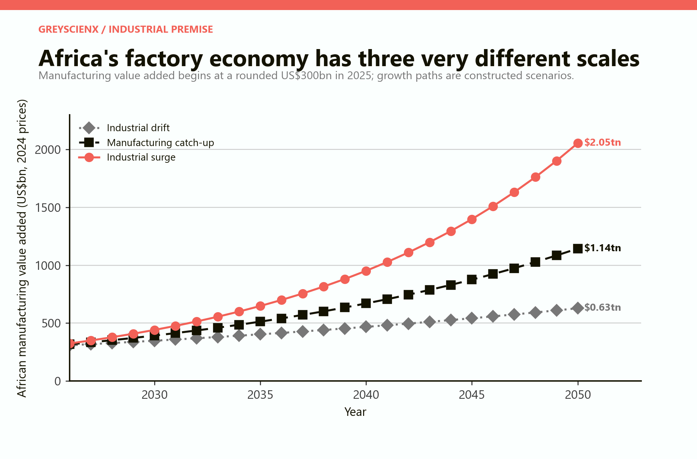
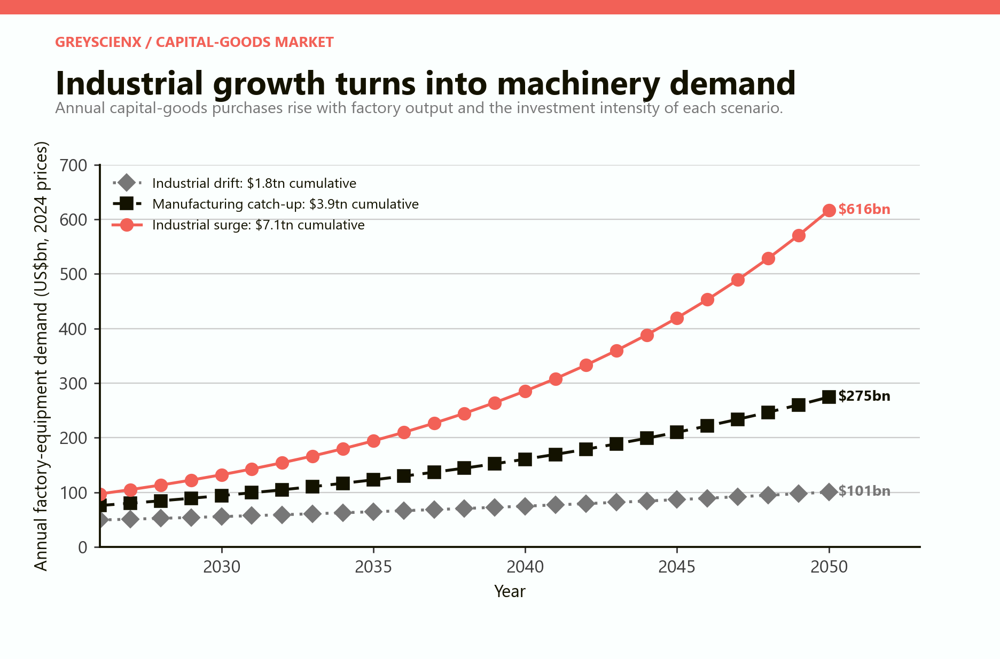
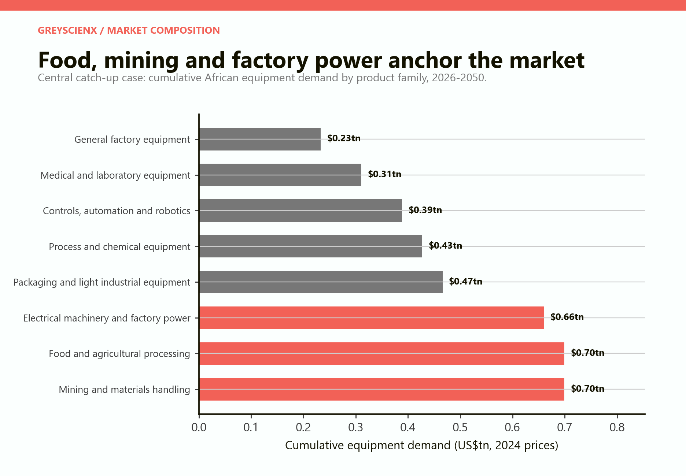
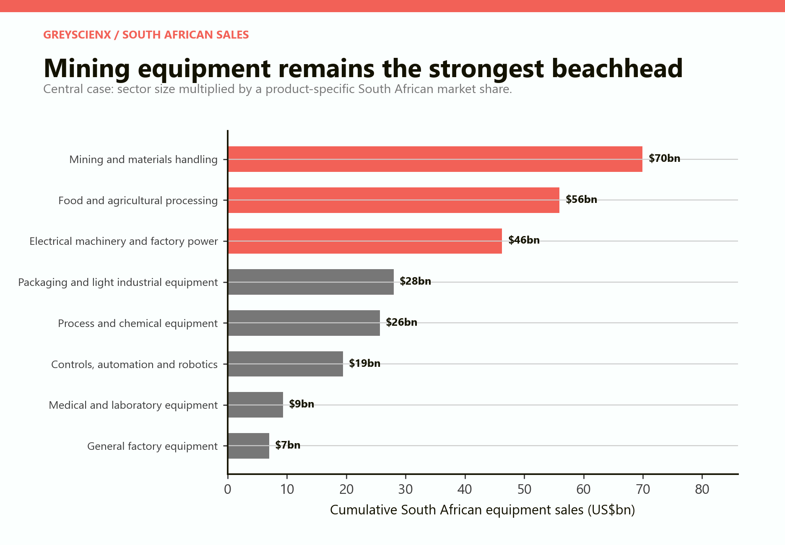
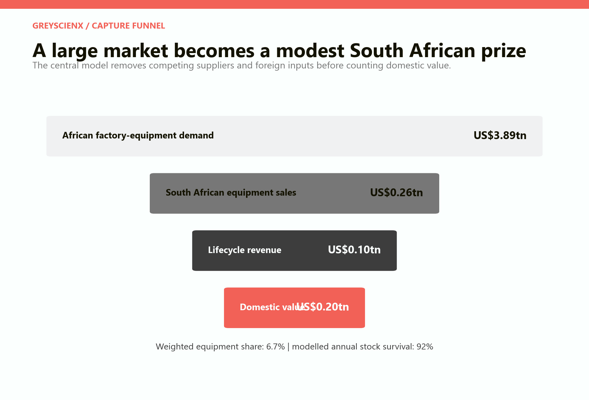
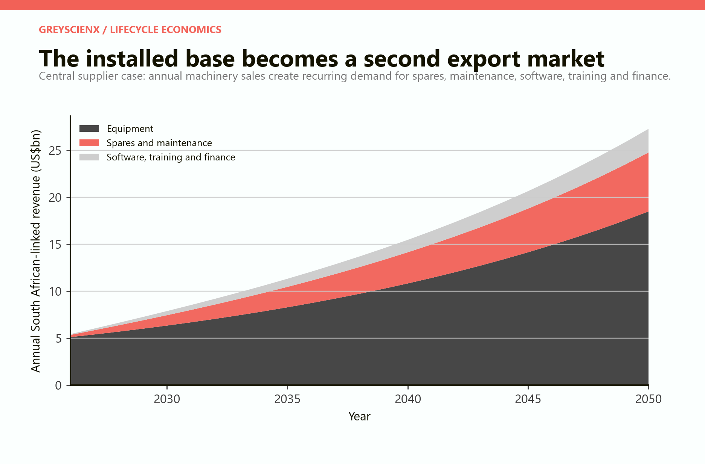
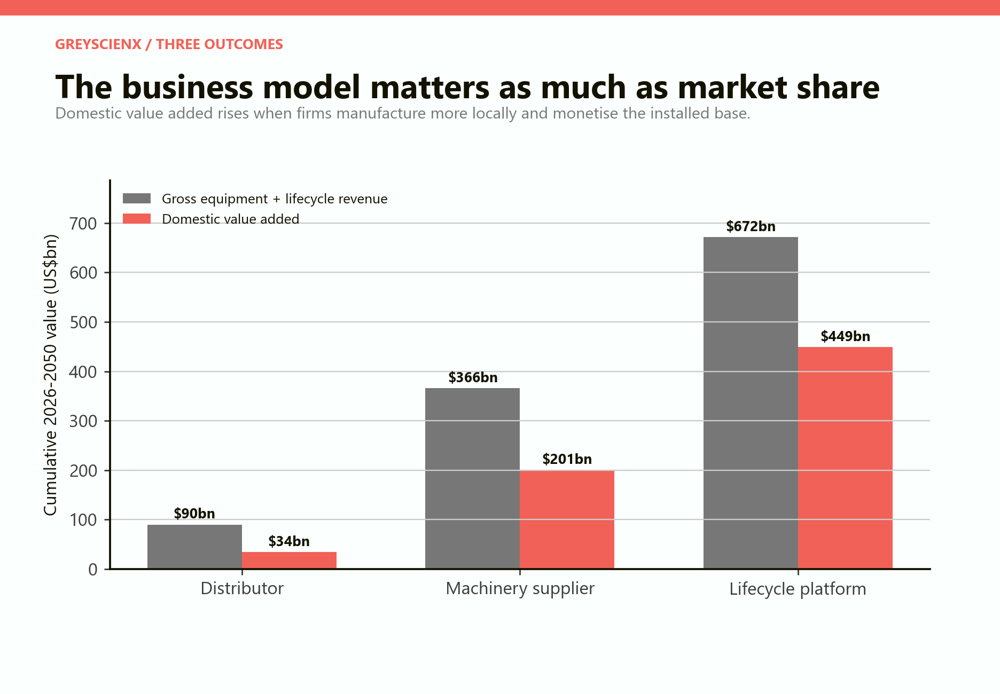
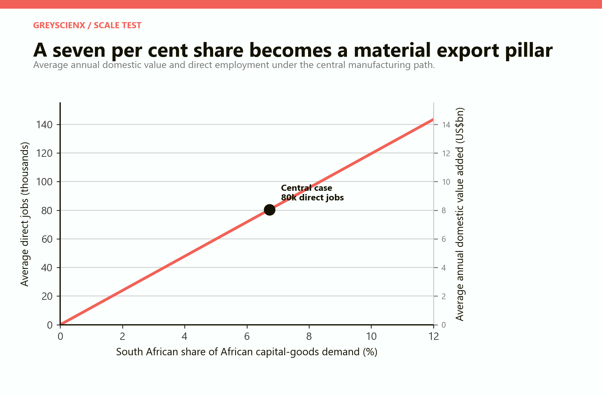
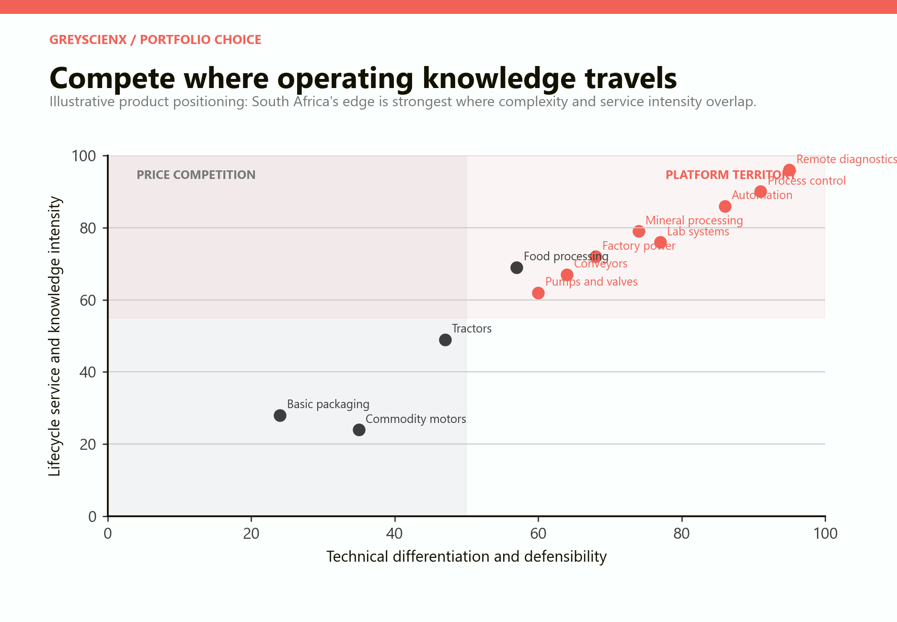
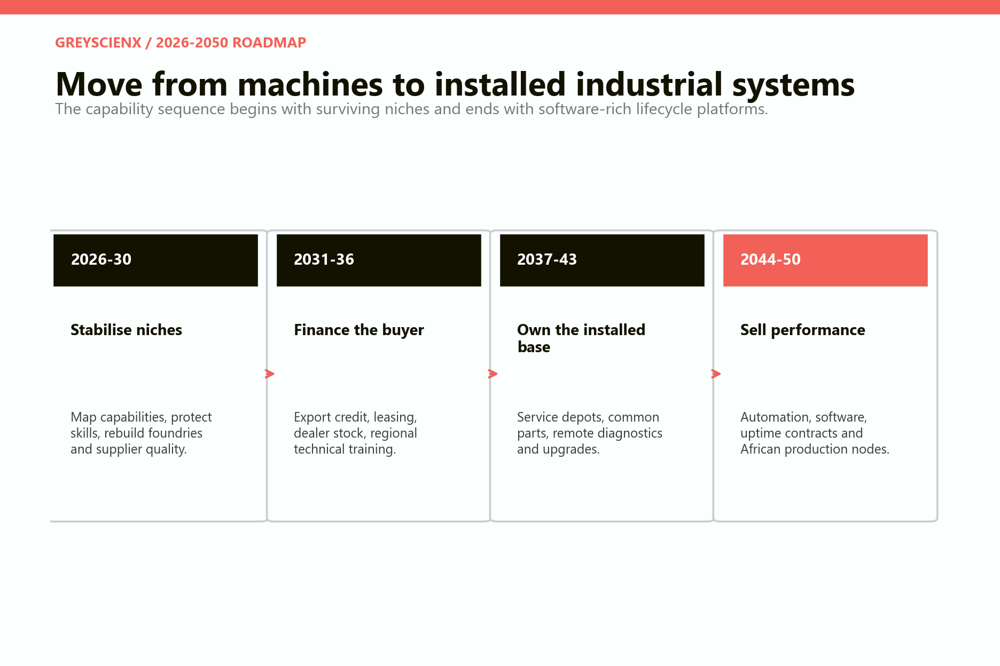

# The Capital-Goods Economy

## Should South Africa specialise in the machinery that African factories will need?

# PART I: The answer

## Equip African industrialisation rather than trying to make everything

South Africa is unlikely to become the lowest-cost producer of every shoe, shirt, plastic container, appliance or assembled consumer product sold across a more industrial Africa. Many countries have lower wages, younger workforces, large domestic markets and strong reasons to build their own basic manufacturing capacity. Trying to defeat all of them at the factory gate would turn continental convergence into a threat.

There is a more durable position. Every food processor, mine, packaging plant, pharmaceutical facility, foundry, cold store, water-treatment works and assembly line requires machinery. It needs electrical systems, pumps, controls, laboratory instruments, maintenance, spare parts, software, technical training and finance. The machine is purchased once; its operating ecosystem can generate revenue for years.

South Africa already occupies parts of this economy. It manufactures mining and materials-handling equipment, pumps, valves, agricultural implements, electrical machinery, process equipment and specialised vehicles. Its engineers, banks, insurers and technical colleges can support equipment after installation. African markets already absorb a large share of South African manufactured exports. The question is not whether a base exists. It is whether that base can survive domestic industrial weakness and scale into a continental platform.

The paper models three African manufacturing paths from 2026 to 2050. In the central **manufacturing catch-up** case, African manufacturing value added grows from a rounded US$300 billion in 2025 to about US$1.14 trillion in 2050. Factory-equipment purchases average 24 per cent of manufacturing value added, producing a cumulative capital-goods market of US$3.89 trillion in constant 2024 dollars.

*Figure 1. The paths are transparent scenarios, not forecasts. The starting value is a rounded interpretation of Africa's current manufacturing scale.*

The central portfolio gives South African firms a weighted 6.7 per cent share of equipment demand. Mining and materials handling remains the strongest beachhead at 10 per cent; food and agricultural processing follows at 8 per cent; electrical machinery and factory power at 7 per cent; and other categories at 3–6 per cent.

This produces about US$262 billion in equipment sales over twenty-five years. The model then follows the installed base. Spares, maintenance and refurbishment equal 4.5 per cent of the surviving installed base each year; software, training and finance add another 1.8 per cent. Together they contribute about US$105 billion in lifecycle revenue. Total South African-linked revenue reaches roughly US$366 billion.

After imported components, production elsewhere in Africa and foreign service inputs are removed, cumulative value retained in South Africa is approximately US$201 billion—about US$8.0 billion a year on average. That average is equivalent to roughly 2 per cent of South Africa's 2024 GDP and supports an illustrative 80,000 direct jobs, or about 137,000 direct and indirect jobs under the model's simple multiplier.

These results are not a prediction and cannot be added mechanically to a GDP forecast. Some capital-goods activity already exists, and actual demand will be cyclical. The model is a scale test: it asks whether a plausible position in a much larger African industrial economy could become nationally material. The answer is yes.

> **Central conclusion.** South Africa should specialise in selected machines and the operating systems around them. The strongest position is not “factory of Africa” in the sense of making every final product. It is the country that helps African factories start, finance, operate, repair, automate and upgrade.

## Nine findings

**First, the opportunity depends on African industrialisation actually occurring.** Under the drift case, cumulative equipment demand is US$1.80 trillion. The central case reaches US$3.89 trillion; the industrial-surge case US$7.11 trillion. Demography alone does not buy machines.

**Second, capital goods reward accumulated capability more than low wages.** Reliability, metallurgy, design, certification, software, field knowledge and service networks matter. Labour cost remains important but is not the sole competitive variable.

**Third, South Africa already has a market.** IDC reports that 42 per cent of South Africa's manufactured exports in 2024—R457.8 billion—went to Africa. Capital goods are an extension of an existing regional trade pattern, not a leap into a blank market.

**Fourth, the domestic base is eroding.** South African machinery and equipment production fell 6.9 per cent in 2024, while manufacturing investment as a share of value added declined to 13.9 per cent. A continental strategy cannot be built on disappearing suppliers and ageing equipment.

**Fifth, mining equipment is a beachhead, not the whole strategy.** The broader prize includes food processing, packaging, factory power, pumps, process systems, laboratories, controls and automation. These markets diversify South Africa away from commodity cycles.

**Sixth, the installed base is the durable asset.** Dealers, spare-parts inventories, service technicians, software connections and training relationships create switching costs. A machine without support is a one-off export; an installed system can become a platform.

**Seventh, buyer finance is industrial policy.** A manufacturer that cannot finance its customer will often lose to a rival with a technically weaker machine and a stronger credit package.

**Eighth, African localisation is compatible with South African income.** Heavy fabrication and assembly can move close to customers while design, specialist components, software, finance and intellectual property remain connected to South Africa.

**Ninth, final-goods manufacturing still matters.** Food, vehicles, chemicals and consumer products create domestic capability and customers for machinery. The capital-goods strategy is a specialisation within industrialisation, not an argument to abandon it.

# PART II: The industrial premise

## Africa has factories, but not yet a continental factory system

UNIDO's 2025 industrial statistics factsheet estimates that Africa produced 3.2 per cent of world GDP in 2024 but only 2.0 per cent of global manufacturing value added and 1.4 per cent of manufactured exports. Medium-high and high-technology industries remain a small share of output. Food products, non-metallic minerals and beverages dominate. [UNIDO, International Yearbook of Industrial Statistics 2025—Africa factsheet](https://stat.unido.org/portal/storage/file/publications/yb/2025/UNIDO_IndustrialStatistics_Factsheet_Africa_2025.pdf).

That gap can be interpreted pessimistically: the continent has repeatedly announced industrialisation without producing an Asian-style manufacturing take-off. The World Bank finds a flat or declining manufacturing-value-added share since the 1990s, although formal manufacturing employment has expanded and participation in global value chains has been associated with job growth. [World Bank, Industrialization in Sub-Saharan Africa](https://www.worldbank.org/en/region/afr/publication/industrialization-in-subsaharan-africa-seizing-opportunities-in-global-value-chains).

It can also be interpreted as latent demand. A continent with 17 per cent of the world's population and only 2 per cent of manufacturing value added has room to expand basic processing, consumer manufacturing and industrial services. Growth will not be uniform. Food and agricultural processing, construction materials, pharmaceuticals, chemicals, mining supply, packaging and assembly are likely to lead in different places.

The capital-goods opportunity arises from the transition, not only its final state. New plants buy machines. Existing plants replace obsolete equipment. Firms facing higher wages automate. Exporters upgrade quality control and packaging. Power shortages encourage captive generation and efficiency systems. Water scarcity creates recycling demand. Environmental rules require cleaner process equipment.

## Three manufacturing paths

The model begins with a rounded 2025 African manufacturing value-added base of US$300 billion. This is consistent with UNIDO's estimate that manufacturing accounts for about one tenth of continental output, but it should not be read as a measured aggregate to the final dollar.

The **industrial drift** path grows manufacturing value added by 3 per cent a year. It reaches US$628 billion in 2050. Equipment purchases equal 16 per cent of manufacturing value added, reflecting weak investment and extensive use of older machinery.

The **manufacturing catch-up** path grows at 5.5 per cent and reaches US$1.14 trillion. Equipment purchases equal 24 per cent of value added as plants expand, replace capital and adopt more reliable power and automation.

The **industrial surge** path grows at 8 per cent and reaches US$2.05 trillion. Equipment purchases equal 30 per cent of value added, representing rapid new capacity, technology upgrading and deeper regional value chains.

*Figure 2. The capital-goods ratios are constructed assumptions. They combine new capacity, replacement, power systems, controls and industrial upgrading.*

Cumulative 2026–2050 equipment demand is US$1.80 trillion, US$3.89 trillion and US$7.11 trillion respectively. The range is intentionally wide. Long-run industrial performance depends on electricity, logistics, human capital, urban demand, exchange rates, finance, trade policy and political stability.

The main discipline is conditional language. The paper does not say Africa “will” buy US$3.89 trillion in machines. It says that if manufacturing grows at the central rate and investment intensity, the implied scale is large enough to justify a South African strategy.

## AfCFTA changes scale, not gravity

AfCFTA can turn many small national markets into a larger production system by lowering tariffs, simplifying rules of origin and gradually improving services, investment and competition rules. World Bank modelling estimates that deep implementation could raise manufacturing exports to African partners by 134 per cent relative to the 2035 baseline. [World Bank, Making the Most of the AfCFTA](https://documents1.worldbank.org/curated/en/099305006222230294/pdf/P1722320bf22cd02c09f2b0b3b320afc4a7.pdf).

The World Bank's 2026 integration agenda argues that regional production networks have opportunities in processed foods, petrochemicals, metals, machinery, transport equipment, energy and services. But it also stresses that tariffs alone are insufficient: customs, standards, payments, logistics, energy and data have to work together. [World Bank, Integrating Africa: From Threads to Hubs](https://www.worldbank.org/en/brief/2026/08/25/integrating-africa-from-threads-to-hubs).

Physical distance remains. A common trade agreement does not make Johannesburg equally close to Abidjan and Gaborone. Capital-goods strategies will cluster around corridors, mining belts, power pools, industrial zones and cities with serviceable customers.

# PART III: The market inside the factory

## What African industrialisation has to buy

The model allocates the central US$3.89 trillion equipment market across eight product families. Mining and materials handling and food and agricultural processing each receive 18 per cent. Electrical machinery and factory power take 17 per cent. Packaging, process equipment, automation, medical and laboratory systems, and general factory equipment make up the balance.

*Figure 3. The allocation is a scenario assumption. It describes a diversified industrial transition rather than a detailed forecast of sectoral investment.*

### Mining and materials handling

South Africa's deepest capital-goods capability grew around mining. The product family includes drilling and crushing equipment, mineral processing, conveyors, bulk handling, underground systems, safety technology, ventilation, pumps, instrumentation, fleet systems and remote operations.

Mining equipment is attractive because African geology is diverse, uptime matters and field conditions are demanding. It is dangerous because commodity investment is cyclical and Chinese, European, American, Australian and increasingly local African suppliers compete aggressively.

The model gives South Africa a 10 per cent share—its highest. That is a strategic target, not a current measured continental share.

### Food and agricultural processing

Food processing connects a large agricultural base to urban demand. Equipment includes milling, refrigeration, dairy systems, fruit and vegetable processing, abattoirs, baking, beverage lines, irrigation pumps, grain handling, cold chains, quality control and packaging.

This market has three advantages. Demand is less concentrated than mining, equipment can be modular, and successful installations create repeat sales among similar firms. The barrier is finance: small and medium processors often cannot fund modern lines even when productivity gains are clear.

### Electrical machinery and factory power

African factories cannot wait for perfect grids. They need transformers, switchgear, motor controls, cables, backup power, embedded generation, batteries, energy-management systems and power-quality equipment. Some of these products overlap with Paper 2's urban-infrastructure market; here they are counted only when installed for industrial production.

South Africa has experience in grid and industrial electrical systems but must defend local manufacturing from erratic domestic procurement and import dependence.

### Packaging and light industrial equipment

Packaging converts a commodity into a retail product, extends shelf life and supports traceability. The machinery is ubiquitous across food, beverages, pharmaceuticals, cosmetics and household goods. Entry barriers range from modest mechanical systems to high-speed automated lines with advanced controls.

South Africa should avoid price wars in generic machines where scale producers dominate. Its opportunity lies in African operating conditions, line integration, flexible packaging, maintenance and finance.

### Process and chemical equipment

Pumps, valves, vessels, heat exchangers, furnaces, kilns, refrigeration, filtration and dosing systems serve water, chemicals, food, minerals and energy. Product families often require engineering rather than mass production alone.

These markets reward standards, materials knowledge and application engineering. They also create replacement and refurbishment demand.

### Controls, automation and robotics

Automation will not remove the need for African manufacturing. It changes its composition. Firms use sensors, programmable controls, machine vision, robotics, digital twins and predictive maintenance to improve quality, safety and uptime.

South Africa is unlikely to manufacture every sensor or robot. It can integrate imported hardware with local engineering, software and sector knowledge. The domestic value lies in system design, commissioning, data, support and adaptation.

### Medical, laboratory and general equipment

Medical and laboratory equipment supports hospitals, food safety, mining laboratories, environmental monitoring, universities and pharmaceutical production. Certification and service are substantial barriers. The model therefore assigns a cautious 3 per cent South African share.

General factory equipment covers compressors, lifting systems, industrial cleaning, workshops, storage and internal logistics. Much is price-sensitive; the opportunity is in distribution, integration and service rather than full domestic manufacture.

# PART IV: The South African position

## A real base facing industrial attrition

The Industrial Development Corporation describes machinery, equipment and electronics as a technologically complex value chain in which South Africa has developed recognised brands and capabilities. Its 2025 strategy emphasises export finance, end-user finance, demand aggregation, critical inputs and continental opportunities. [IDC, Integrated Report 2025](https://www.idc.co.za/integrated-report/wp-content/uploads/2025/08/IDC-Integrated-Report-2025_FINAL.pdf).

An earlier IDC investment study estimated that non-electrical machinery and equipment contributed 6.4 per cent of manufacturing GDP and identified mineral processing machinery, materials handling, pumps, valves, refrigeration, industrial heating, power transmission and construction equipment as opportunities. [IDC, The Case for Investing in South Africa](https://www.idc.co.za/wp-content/uploads/2019/11/The-case-for-investing-in-South-Africa-2019-Full-publication-31-October-2019.pdf).

The capability base includes:

- mining and mineral-processing equipment developed around demanding domestic customers;
- foundries, fabrication, machining and specialised steel capability;
- pumps, valves, refrigeration and industrial-process equipment;
- agricultural implements and food-processing systems;
- electrical machinery, control panels and power systems;
- commercial and specialised vehicles;
- engineering design, project management and industrial software;
- banks, insurers and development-finance institutions; and
- universities, technical colleges and sector training networks.

This base is not secure. IDC reports that South African machinery and equipment production fell 6.9 per cent in 2024. Manufacturing capital expenditure contracted 15.8 per cent to R75.4 billion, and capital expenditure declined from 17.5 per cent of manufacturing value added in 2019 to 13.9 per cent in 2024. [IDC, Sector Trends, April 2025](https://www.idc.co.za/wp-content/uploads/2025/05/IDC-Research-and-Information-publication-Sector-Trends-April-2025.pdf).

Statistics South Africa records a second consecutive annual contraction in manufacturing output in 2025, with iron and steel, metal products and machinery among the main negative contributors. [Statistics South Africa, economic wrap-up for February 2026](https://www.statssa.gov.za/?p=19259).

The contradiction is stark. South Africa is planning to supply an industrialising continent while its own machinery sector loses output and its factories invest less. The first task is not branding. It is preserving and upgrading the productive base.

## Africa is already the natural market

IDC reports that South Africa exported R1.091 trillion of manufactured goods in 2024, of which 42 per cent—R457.8 billion—went to Africa. Machinery and equipment exports declined that year, but electrical-machinery exports increased. Africa, especially SADC, remains the largest destination for South African manufactured goods.

# PART V: The capture arithmetic

## Six to seven per cent is enough to matter

The model assigns South Africa the following shares of total African equipment demand in the central scenario:

| Product family | African market | SA share | SA equipment sales |
|---|---:|---:|---:|
| Mining and materials handling | US$699bn | 10% | US$70bn |
| Food and agricultural processing | US$699bn | 8% | US$56bn |
| Electrical machinery and factory power | US$661bn | 7% | US$46bn |
| Packaging and light industrial equipment | US$466bn | 6% | US$28bn |
| Process and chemical equipment | US$427bn | 6% | US$26bn |
| Controls, automation and robotics | US$389bn | 5% | US$19bn |
| Medical and laboratory equipment | US$311bn | 3% | US$9bn |
| General factory equipment | US$233bn | 3% | US$7bn |

The weighted share is 6.73 per cent, producing about US$261.5 billion in equipment sales.

*Figure 4. The largest captured categories combine an existing capability base with large African demand. All shares are challengeable assumptions.*

These numbers are intentionally below dominance. South Africa wins about one machine dollar in fifteen; competitors and African domestic producers win the rest. The question is whether 6.7 per cent is feasible.

It is plausible only if firms operate continentally. A factory in South Africa cannot directly serve every market. The operating model requires distributors, local assembly, joint ventures, service depots, regional parts inventories and training centres.

## The funnel

The US$3.89 trillion headline market is not South African revenue. Sector-specific market shares reduce it to US$262 billion in equipment sales. The installed base adds US$105 billion in service and platform revenue. Domestic value retained after imported content and offshore activity is about US$201 billion.

*Figure 5. Lifecycle revenue is additional to equipment sales but derives from the modelled installed base. Domestic value added is lower than gross revenue.*

The model treats 48 per cent of equipment sales as South African domestic value added. This reflects imported electronics, engines, components and production in African subsidiaries. Spares and maintenance retain 70 per cent; software, training and finance retain 78 per cent. These higher service shares drive the value of the platform model.

The domestic-value assumptions are not measured sector averages. They are strategic tests. A manufacturer that imports a completed machine and adds a local invoice may retain less than 20 per cent. A firm that owns design, fabrication, software, sales and service can retain more than 60 per cent.

# PART VI: The installed-base economy

## A machine sold is a twenty-year customer relationship—or a missed opportunity

Capital goods differ from consumer goods because failure interrupts production. Buyers care about uptime, parts availability, operator skill, energy use and resale value. The lowest purchase price can be the most expensive choice if a machine waits months for a component.

The model retains 92 per cent of the serviced installed base each year, an approximate twelve-year economic life. Spares, maintenance and refurbishment revenue equals 4.5 per cent of that base. Software, technical training and equipment finance add 1.8 per cent.

*Figure 6. Service revenue rises behind equipment sales because each year's installations join the surviving installed base.*

By 2050, the annual business is no longer only new equipment. Recurring service and platform revenue form a meaningful second market. This has six strategic effects.

**Customer retention.** A dense service network makes replacement by a rival more costly.

**Information.** Technicians and software reveal how equipment performs, which failures recur and what customers need next.

**Productivity.** Common parts, modular designs and remote diagnostics reduce service cost.

**Finance.** Residual-value data makes leasing and equipment-backed lending safer.

**Learning.** Field failures feed back into design. Exporting becomes a source of engineering knowledge.

**Resilience.** Maintenance revenue is often less cyclical than new capital expenditure.

The strategic unit is therefore not the factory gate. It is the installed machine plus the network that keeps it productive.

## Own the parts ecosystem

Many industrial strategies subsidise production but ignore parts. A machine assembled locally can remain dependent on imported proprietary components. Conversely, a supplier may manufacture only selected components but control the service standard, diagnostic system and parts network.

South Africa should prioritise components that cause expensive downtime, appear across multiple product lines or reward local material capability. Examples include wear parts, pumps, valves, seals, control panels, motors, gear systems, filtration, refrigeration components and software modules.

Regional parts depots should be treated as productive infrastructure. They tie up working capital but convert geographic proximity into reliable uptime.

# PART VII: Three South African outcomes

## Distributor, machinery supplier or lifecycle platform

The African market can enrich South Africa in very different ways.

In the **distributor** case, South African firms capture 2 per cent of equipment demand, mostly through imported machines. Service intensity is low. Cumulative gross revenue is about US$90 billion and domestic value added US$34 billion. Average direct employment is about 14,000.

In the **machinery-supplier** case, the weighted share rises to 6.7 per cent. Firms manufacture selected equipment, integrate imported components and provide regional support. Gross equipment and lifecycle revenue reaches US$366 billion, domestic value added US$201 billion and average direct employment 80,000.

In the **lifecycle-platform** case, South African firms capture 11 per cent, retain more manufacturing value and monetise software, finance and uptime. Gross revenue reaches US$672 billion and domestic value added US$449 billion. Average direct employment is about 180,000.

*Figure 7. The platform case combines higher share with higher domestic value retention. It is an ambition case, not the paper's central expectation.*

The comparison exposes why gross exports are not enough. The distributor case can produce impressive invoices without deep industrial capability. The platform case can create high domestic value even when final assembly occurs elsewhere in Africa.

The correct scorecard must measure:

- South African design and engineering hours;
- local component and material value;
- software, data and intellectual property;
- finance, insurance and treasury income;
- service and refurbishment revenue;
- dividends from African production subsidiaries;
- direct technical employment and apprenticeships; and
- African local value created in host countries.

## Jobs and scale

The central case averages US$8.05 billion in annual domestic value added. At an illustrative US$100,000 of value added per direct worker, it supports about 80,000 direct jobs. A multiplier of 1.7 produces approximately 137,000 direct and indirect jobs.

*Figure 8. The relationship includes lifecycle revenue and uses the central manufacturing path. Employment depends heavily on product mix and productivity.*

Capital-goods employment is not necessarily mass employment. Engineers, artisans, machinists, metallurgists, software developers, field technicians, sales specialists and financiers can generate high value per worker. Indirect jobs arise in metal products, electronics, logistics and professional services.

The sector's broader value is capability spillover. A country that can build, finance and maintain industrial equipment can also repair its own infrastructure, support defence and aerospace niches, prototype new products and adapt imported technology.

# PART VIII: Capital goods versus basic manufacturing

## This is a portfolio choice, not a false binary

The premise of the paper can be overstated. South Africa should not abandon consumer manufacturing simply because other countries have lower wages. Wages are only one cost. Productivity, electricity, freight, quality, market access, exchange rates and scale also matter. Food, chemicals, vehicles and sophisticated consumer goods remain important exporters and customers for domestic machinery.

The practical distinction is between three competitive positions.

**Standardised labour-intensive products** face intense wage and scale competition. South Africa should retain them where productivity, proximity, design, brands or regional supply chains create an edge, but broad protection can trap consumers and downstream producers behind high prices.

**Process-based final goods** such as food, chemicals and building materials can remain competitive because they depend on resources, logistics, engineering and standards as well as wages. They also provide demanding home customers for machinery.

**Capital goods and industrial systems** reward accumulated technical knowledge, service and customer integration. They are a natural specialisation for a relatively mature African industrial economy.

The aim is not to choose one category. It is to shift the portfolio toward activities in which South Africa can remain valuable as wages and neighbouring capabilities rise.

## What should not be made locally?

Industrial policy fails when it treats every imported component as a national defeat. No medium-sized economy manufactures the complete contents of modern machinery. South Africa should import components when global scale makes local production permanently uneconomic, while retaining system knowledge and strategically important capabilities.

Candidate filters for localisation are:

1. Does the component appear across several domestic or African product markets?
2. Does import delay create costly downtime or security risk?
3. Can local production reach competitive scale?
4. Does making it deepen engineering, materials or software capability?
5. Is there a realistic export path after initial support?

Localisation without these tests can raise machine prices and make South African exporters less competitive.

# PART IX: Portfolio choice

## Compete where knowledge travels with the machine

The most defensible products combine technical differentiation with lifecycle service. Basic packaging machines and commodity motors are exposed to scale manufacturers. Mineral processing, factory power, controls and remote diagnostics embed more operating knowledge.

*Figure 9. Positions are qualitative. The map is a strategic screen, not a measured competitiveness index.*

The portfolio should favour five characteristics.

**Harsh-environment performance.** Equipment designed for heat, dust, water scarcity, weak grids and variable operator skill has a genuine African use case.

**Modularity.** Customers can begin with smaller systems and expand. Common modules simplify parts and training.

**Repairability.** Field-replaceable components, accessible diagnostics and local fabrication reduce downtime.

**Digital visibility.** Remote monitoring enables predictive maintenance, performance finance and product improvement.

**Cross-sector components.** Pumps, controls, motors, refrigeration and materials handling serve several industries, increasing scale.

# PART X: Finance the buyer

## The machine and the credit package are one product

African manufacturers often face high borrowing costs, short loan maturities and currency mismatch. A food processor may have a profitable investment but cannot fund a US-dollar machine with volatile local-currency revenue. A mine may demand performance guarantees that a small supplier cannot provide.

Equipment finance solves part of the industrialisation problem. The toolkit includes:

**Supplier credit.** Payment is spread over commissioning and operation. This supports sales but strains the manufacturer's balance sheet.

**Leasing.** The financier owns the machine and charges for use. Residual-value knowledge and repossession rights become essential.

**Development-finance lines.** Public and development banks fund private lenders or suppliers for targeted equipment categories.

**Export credit insurance.** Political and commercial risks are pooled, allowing longer maturities.

**Pay-per-output contracts.** Customers pay per tonne processed, litre treated or hour available. Suppliers accept performance and demand risk.

**Local-currency structures.** Currency risk is allocated to institutions better able to absorb or hedge it.

The IDC's 2025 report describes end-user finance for a South African articulated-dump-truck manufacturer and funding for an agricultural-equipment producer. This is the correct logic: finance attaches to the equipment and creates market access.

Poorly governed finance can become hidden subsidy. Loans should be priced for risk, losses disclosed, and support conditional on exports, domestic value and performance. The objective is to correct capital-market failures, not to keep uncompetitive producers alive indefinitely.

# PART XI: Build the ecosystem

## A capital-goods industry is a network of small capabilities

A visible machine maker depends on less visible firms: foundries, pattern makers, heat treatment, precision machining, electronics, hydraulics, coatings, software, testing, certification and logistics. Losing one critical supplier can force an entire product line to import or close.

The state and industry should map capabilities at product and process level. Broad labels such as “machinery sector” are too coarse. The useful questions are specific: which castings can be made, at what size and grade; which motors meet efficiency standards; which laboratories certify pressure vessels; which firms can repair industrial electronics; where are the tooling bottlenecks?

The ecosystem agenda has seven parts.

1. **Reliable industrial infrastructure:** electricity quality, freight, broadband, water and industrial land.
2. **Supplier upgrading:** quality systems, digital production, certification and working capital.
3. **Skills pipelines:** apprenticeships, artisan colleges, engineering placements and field-service careers.
4. **Shared facilities:** testing, metrology, additive manufacturing, prototyping and demonstration plants.
5. **Demand visibility:** long-term procurement pipelines from mines, utilities, food processors and public infrastructure.
6. **Export infrastructure:** finance, insurance, market intelligence, customs support and regional depots.
7. **Technology partnerships:** licence, co-develop and absorb foreign technology rather than insisting on immediate full independence.

## The home market is the training ground

South African mines, farms, factories, hospitals and utilities should be demanding reference customers. Predictable procurement allows firms to refine products before exporting. But localisation rules that reward paperwork rather than performance produce expensive equipment and fragile suppliers.

Domestic customers should publish lifecycle performance: uptime, energy use, parts lead time, failure rates and total cost. Suppliers that perform well at home gain credible export references. Those that do not should not be protected from accountability.

# PART XII: Localise across Africa

## African production is part of the strategy

A continental capital-goods economy cannot operate as a one-way flow from South Africa. Host countries want jobs, skills and tax revenue. Transport costs and tender rules favour local assembly. Customers need nearby technicians and parts.

South African firms can use three production modes.

**Export complete equipment** when value-to-weight is high, production scale matters and service can be delivered regionally.

**Assemble regionally** when machines are modular, transport is costly or local content affects procurement.

**Manufacture components near demand** when inputs, skills and market size justify a plant. South African firms can retain design, software, specialised components, finance and ownership income.

The test is domestic value retained, not the flag on the factory roof. A South African-owned plant elsewhere can create dividends and service demand. A local plant that imports every component and pays all intellectual-property fees abroad may create little South African value.

Local partnerships also protect political legitimacy. The strategy should be presented as equipping African industry, not preventing African countries from developing their own capital-goods firms.

# PART XIII: Competition and failure tests

## South Africa is not the default supplier

Chinese firms combine scale, broad product ranges and finance. European and American firms dominate many advanced niches and carry strong brands. Indian and Turkish manufacturers compete effectively on price and adaptation. African firms will develop their own capabilities.

South Africa's advantage is proximity plus industrial maturity. Its disadvantage is a smaller domestic market, expensive capital, weak logistics and an eroding supplier base. The strategy succeeds only where proximity improves service and operating knowledge differentiates the product.

The main failure modes are:

**African manufacturing disappoints.** The capital-goods market follows the drift path and cannot support the planned scale.

**Domestic deindustrialisation continues.** South Africa becomes a distributor of foreign machines. Revenue survives; domestic value does not.

**Buyer finance is too expensive.** Competitors win by packaging long-term credit and guarantees.

**Products are protected but not competitive.** Domestic customers pay more, exporters lose downstream competitiveness and learning stalls.

**Service networks remain thin.** Customers choose globally supported brands even when South African equipment is technically sound.

**Skills age out.** Retiring artisans and engineers are not replaced, and firms cannot commission or repair their own exports.

**Localisation creates political resistance.** African governments see the strategy as South African extraction rather than joint industrial development.

**Automation is imported as a black box.** Firms install technology without developing integration, data or maintenance capability.

The strategy remains robust because most remedies—reliable infrastructure, skills, export finance, supplier quality and better machinery—raise South African productivity even if continental demand underperforms.

# PART XIV: A 2050 roadmap

## Move from surviving niches to performance contracts

*Figure 10. The phases overlap. Firms and product families will move at different speeds.*

### 2026–2030: stabilise the base

Map capabilities at product level. Prevent avoidable loss of foundries, tooling, repair and certification capacity while allowing persistently uncompetitive firms to exit. Restore reliable power and logistics. Expand apprenticeships and field-service training. Choose a limited number of product platforms with real customers.

### 2031–2036: finance the buyer

Scale export credit, leasing and equipment-backed finance. Establish dealer stock and parts depots in priority corridors. Create regional training centres with African partners. Use domestic reference projects to publish performance data.

### 2037–2043: own the installed base

Standardise modules and parts across product lines. Connect equipment for remote diagnostics. Build refurbishment centres. Use operational data to improve credit, maintenance and product design. Expand local assembly and component production in major African markets.

# PART XV: Verdict

## Become the country that keeps African factories running

Africa's manufacturing future is uncertain. The continent still produces only a small share of global manufacturing value, and decades of industrial policy have delivered uneven results. That uncertainty is not an argument for passivity. It is an argument for a strategy that scales with actual demand and strengthens South Africa even when demand is weaker than hoped.

The central GreyScienx scenario produces US$3.89 trillion of African factory-equipment demand through 2050. A 6.7 per cent South African share yields US$262 billion in equipment sales. Servicing the installed base adds US$105 billion. Domestic value retained reaches approximately US$201 billion.

The opportunity is nationally material but not transformative by itself. It can support about 80,000 direct high-value jobs and create an export pillar equivalent to roughly 2 per cent of today's GDP on average. It cannot rescue an economy with unreliable infrastructure, weak skills and collapsing investment.

The strategy should therefore be judged by four tests.

**Does it deepen capability?** Public support should increase design, production, software, service and technical skill—not merely imports through South African intermediaries.

**Does it make customers more productive?** Capital goods are inputs. Expensive or unreliable local machines harm the very African industrialisation that creates the market.

**Does it build recurring income?** Spares, maintenance, training, data, upgrades and finance should grow behind the installed base.

**Does it create African partners?** Local production and skills are necessary for commercial reach and political legitimacy.

South Africa does not need to manufacture every final product consumed by a richer continent. It needs to occupy bottlenecks where experience, engineering and service remain scarce. If Nigerian food processors, Kenyan pharmaceutical plants, Congolese mines, Tanzanian packaging firms and Ghanaian factories become more productive using systems designed, financed or maintained by South African firms, continental convergence can create South African income without South Africa winning every factory.

That is the capital-goods economy: not the largest collection of assembly lines, but the industrial layer that helps everyone else's assembly lines work.

# MODEL NOTES

## Scope and assumptions

The model covers 2026–2050 inclusive. All monetary values are constant 2024 US dollars. It is deterministic and intended to expose scale and sensitivity, not forecast annual sales.

**Manufacturing base.** African manufacturing value added begins at a rounded US$300 billion in 2025. The value is consistent with Africa's roughly 10 per cent manufacturing share in an economy near US$3 trillion, but country data coverage and exchange rates make it approximate.

**Manufacturing paths.** Annual real growth is 3 per cent in industrial drift, 5.5 per cent in manufacturing catch-up and 8 per cent in industrial surge.

**Equipment intensity.** Factory-equipment purchases equal 16, 24 and 30 per cent of manufacturing value added in the three cases. The ratios combine new capacity, replacement, industrial power, controls and upgrading. They are not measured continental investment rates.

**Sector allocation.** The central market is allocated 18 per cent each to mining and food-processing machinery, 17 per cent to electrical machinery and factory power, 12 per cent to packaging, 11 per cent to process equipment, 10 per cent to automation, 8 per cent to medical and laboratory equipment and 6 per cent to general equipment.

**South African capture.** Shares range from 10 per cent in mining equipment to 3 per cent in medical, laboratory and general equipment. The weighted share is 6.73 per cent.

**Installed base.** The model retains 92 per cent of the serviced equipment stock each year. Spares and maintenance revenue is 4.5 per cent of that stock; software, training and finance revenue is 1.8 per cent.

**Domestic value.** Equipment retains 48 per cent of revenue in South Africa, maintenance 70 per cent, and software, training and finance 78 per cent in the central case.

**Employment.** Direct employment is illustrated at US$100,000 of annual domestic value added per worker. A 1.7 multiplier estimates direct and indirect jobs. No induced-consumption jobs are claimed.

## What the model excludes

The model does not simulate business cycles, commodity prices, exchange rates, tariffs, country risk, financing costs, machine utilisation, project delays, technology obsolescence or detailed input-output relationships. It assumes all captured sales create an installed base eligible for service, although customers may use third-party maintenance or abandon equipment.

Lifecycle revenue is derived from South African-linked equipment sales, not the entire African installed base. Gross revenue includes activity performed outside South Africa; domestic value added removes the assumed foreign share.

The comparison with South Africa's 2024 GDP is a scale indicator, not a forecast. Some modelled activity may already exist in a baseline and should not be added mechanically to future GDP.

## Primary sources

- [UNIDO, International Yearbook of Industrial Statistics 2025—Africa factsheet](https://stat.unido.org/portal/storage/file/publications/yb/2025/UNIDO_IndustrialStatistics_Factsheet_Africa_2025.pdf)
- [UNIDO, Industrial Development Report 2024](https://www.unido.org/idr/idr2024)
- [World Bank, Industrialization in Sub-Saharan Africa](https://www.worldbank.org/en/region/afr/publication/industrialization-in-subsaharan-africa-seizing-opportunities-in-global-value-chains)
- [World Bank, Integrating Africa: From Threads to Hubs](https://www.worldbank.org/en/brief/2026/08/25/integrating-africa-from-threads-to-hubs)
- [World Bank, Making the Most of the AfCFTA](https://documents1.worldbank.org/curated/en/099305006222230294/pdf/P1722320bf22cd02c09f2b0b3b320afc4a7.pdf)
- [UN Trade and Development, Economic Development in Africa Report 2024](https://unctad.org/system/files/official-document/aldcafrica2024_en.pdf)
- [Afreximbank, African Trade Report 2024](https://media.afreximbank.com/afrexim/African-Trade-Report_2024.pdf)
- [IDC, Integrated Report 2025](https://www.idc.co.za/integrated-report/wp-content/uploads/2025/08/IDC-Integrated-Report-2025_FINAL.pdf)
- [IDC, Sector Trends, April 2025](https://www.idc.co.za/wp-content/uploads/2025/05/IDC-Research-and-Information-publication-Sector-Trends-April-2025.pdf)
- [IDC, The Case for Investing in South Africa](https://www.idc.co.za/wp-content/uploads/2019/11/The-case-for-investing-in-South-Africa-2019-Full-publication-31-October-2019.pdf)
- [Statistics South Africa, Manufacturing production and sales, December 2025](https://www.statssa.gov.za/?PPN=P3041.2&SCH=74197&page_id=1856)
- [the dtic, Annual Report 2024/25](https://www.thedtic.gov.za/wp-content/uploads/ANNUAL-REPORT_2025.pdf)

## Reproducibility

The source package contains this manuscript, the Python scenario model, generated figure assets and a machine-readable JSON export of all results. Running `model.py` regenerates the figures and calculations. The shared GreyScienx editorial skill and repository stylesheet reproduce the cover, page system, tables and figures.
