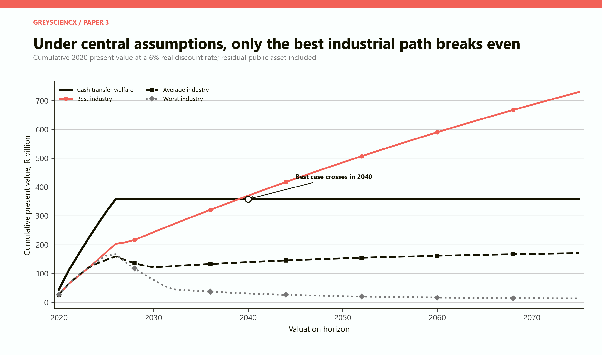
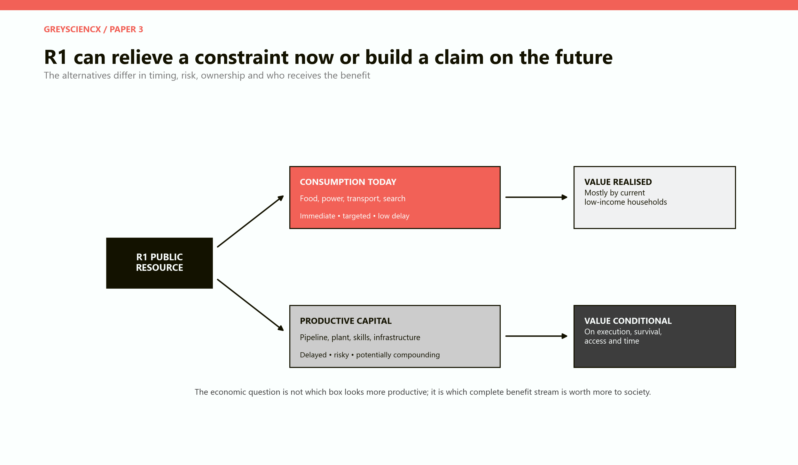
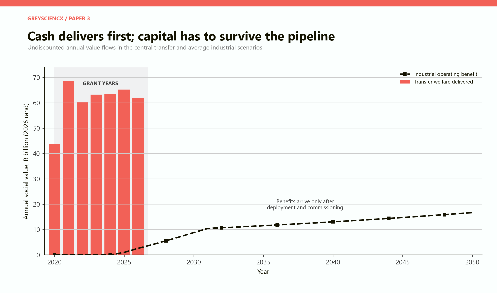
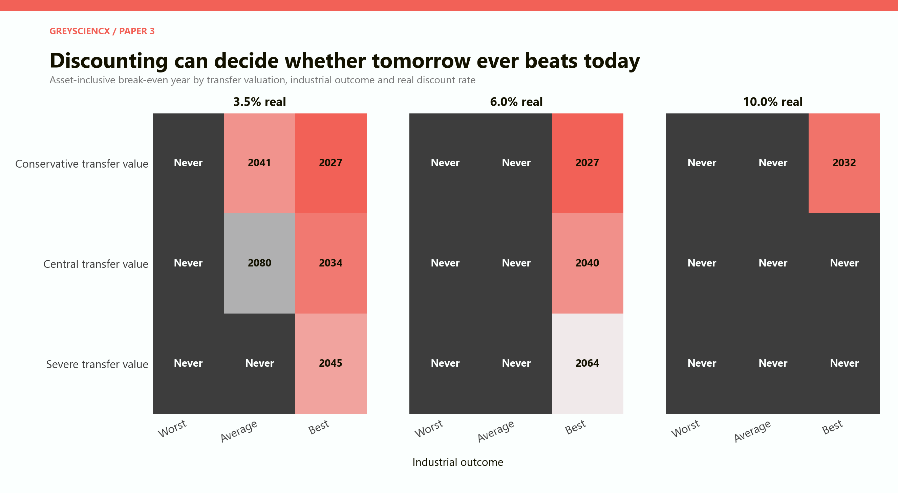
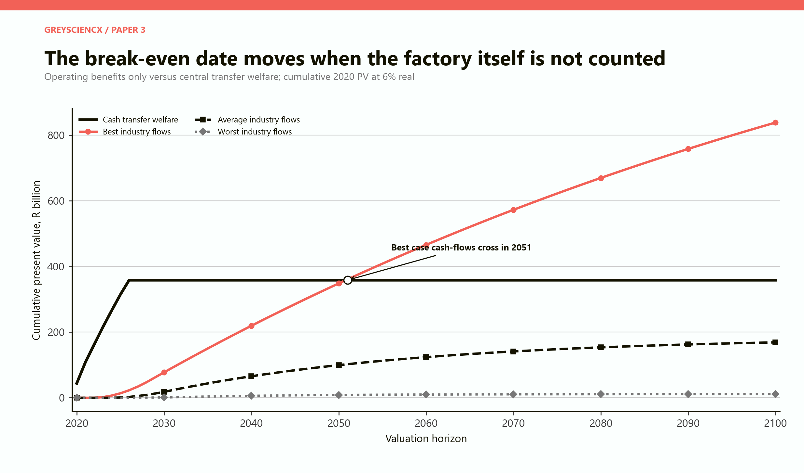
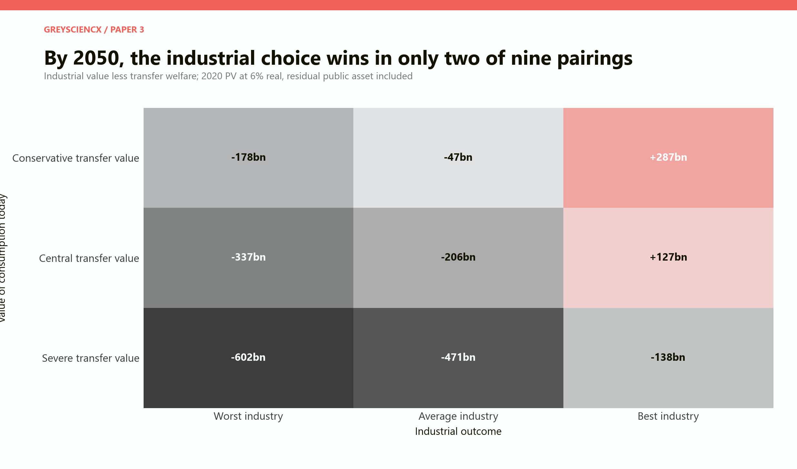
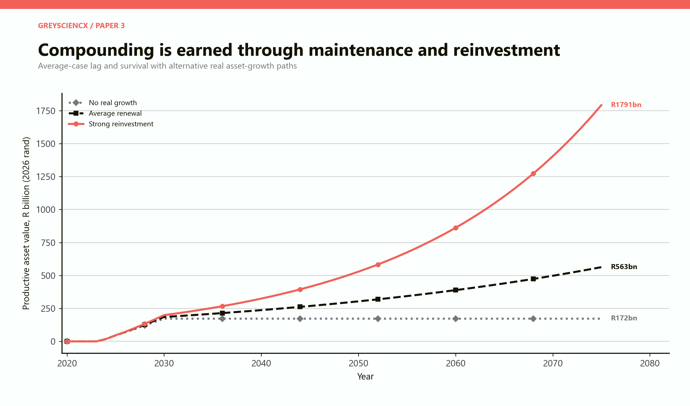
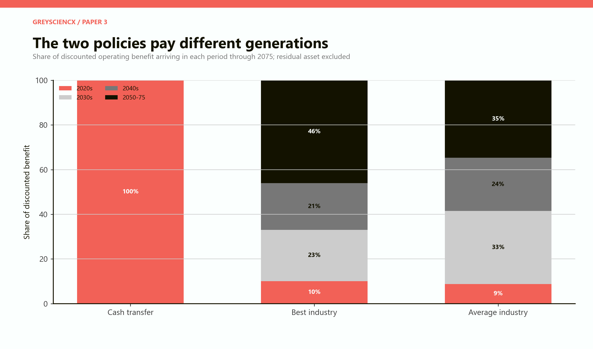
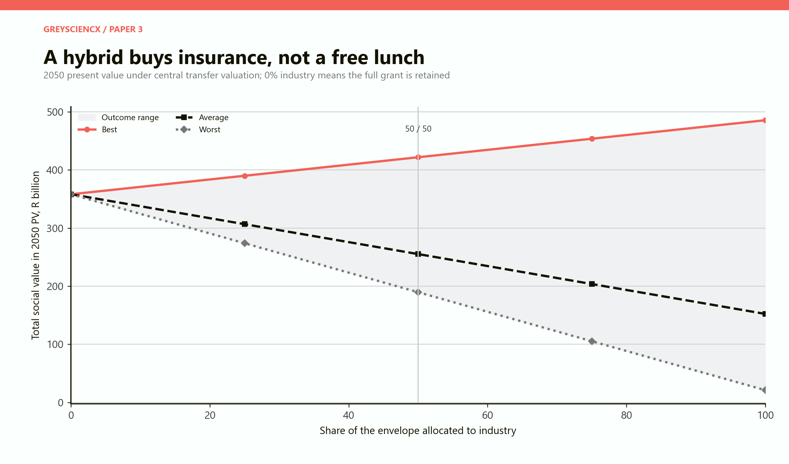

# Consumption Today or Productive Capital Tomorrow

## When does public investment create more lifetime social value than the R350 delivered to a poor household now?

# PART I: The answer

## The break-even year is not one year

There is no universal date when a factory becomes better than a cash transfer. The date changes with four judgements: how valuable the grant is to a poor household today, how much committed capital survives into viable production, how much annual value the asset creates, and how heavily society discounts benefits that arrive decades later.

Under the central comparison in this paper, the answer is stark. At a **6 per cent real discount rate**, the **best industrial case** overtakes the central value of the cash transfer in **2040** if the surviving public asset is counted. If only realised operating benefits are counted and the factory itself is excluded, break-even moves to **2051**. The average and worst industrial cases do not overtake the central transfer value by 2100.

At a low 3.5 per cent discount rate, the best case crosses the central transfer in 2034 and the average case eventually crosses in 2080. At South Africa's 10 per cent public-project appraisal benchmark, none of the industrial cases crosses the central transfer value by 2100. The discount rate does not change the factory's physical output. It changes how much present society is justified in sacrificing for that distant output.

> **The central finding:** productive capital beats consumption only when execution is exceptional, the asset remains publicly valuable, and society is willing to wait. “Investment” is not a sufficient description of the winning case; survival, reinvestment, access and time are the actual conditions.

This makes the moral question unavoidable. The sacrifice is concentrated among low-income households between 2020 and 2027. The upside is dispersed across workers, firms, consumers and taxpayers for decades afterward. Even when aggregate industrial value wins, the original households are not necessarily repaid.

**Five results to hold onto**

| Test | Result | Interpretation |
|---|---:|---|
| Central transfer welfare, undiscounted | R426.9bn | Paper 2's welfare-equivalent cost avoided by paying the grant |
| Central transfer welfare, 2020 PV at 6% | R358.2bn | The same early benefit restated at the model's central decision date |
| Best industrial value in 2050, 6% PV | R485.7bn | Discounted operating benefits plus surviving public asset |
| Average industrial value in 2050, 6% PV | R152.3bn | Falls R205.9bn short of the central transfer |
| Best-case break-even | 2040 asset-inclusive; 2051 flows only | The result depends on whether the factory's residual value is credible |

The model follows the same **R253.5 billion constant-2026-rand envelope** used in Papers 1 and 2. The transfer side inherits Paper 2's conservative, central and severe valuations of R237.3 billion, R426.9 billion and R742.8 billion. The industrial side inherits Paper 1's deployment lags, survival rates, post-depreciation asset growth and public-cash yields, then adds a transparent net social-benefit allowance for wages, supplier gains and consumer value not captured by the public owner.

*Figure 1. The central comparison. The transfer delivers almost all of its value by 2027. The best industrial path overtakes it in 2040 only when the surviving public asset is treated as real social wealth.*

## What “break-even” means here

At every valuation year, the model asks what each policy has delivered in present-value terms since 2020. The transfer account contains the social value created by each year's grant payment. The industrial account contains public cash, net operating spillovers and, in the asset-inclusive test, the value of the productive asset and any money still waiting in the project pipeline.

The initial R253.5 billion is not subtracted twice. It is the common resource committed to either policy. The comparison is between what the same resource becomes. The transfer becomes food, electricity, transport, liquidity, debt avoided, greater stability and some labour-market enablement. The industrial alternative becomes pipeline cash, then a surviving asset, then operating benefits and possibly compound growth.

The asset-inclusive test is economically legitimate only if the asset is viable, maintained, publicly owned and capable of being sold or continuing to produce. A plant valued at construction cost but unable to operate does not settle the account. For this reason the paper also shows a stricter flow-only test.

**The decision is more demanding than “consumption versus investment”**

The labels make one side sound temporary and the other permanent. In practice, both can create present and future effects. A grant buys current consumption, but nutrition, job search, health and household stability can preserve future capability. A factory is capital, but it can depreciate, become obsolete, lose its market or be stripped of maintenance. Consumption can have investment-like consequences; investment can be consumed through failure.

*Figure 2. The complete choice. Cash produces value quickly and close to the intended recipient. Capital offers a longer claim, conditional on the pipeline and on who eventually receives its benefits.*

# PART II: How the comparison is built

## The common resource

The counterfactual begins with the SRD programme envelope from 2020/21 through the 2026/27 allocation. In Paper 1 this amounts to R225.8 billion in nominal programme spending and allocation, or **R253.5 billion after each year is restated in constant 2026 purchasing power**. The latest years are not all completed outturns: 2025/26 is a revised estimate and 2026/27 is a budget allocation.

National Treasury's 2026 documents extend the SRD grant at R370 a month to 31 March 2027. The exercise does not claim that every budgeted rand had already been paid. It treats the full seven-year envelope as the policy resource under comparison. [National Treasury, 2026 Estimates of National Expenditure, Vote 19](https://www.treasury.gov.za/documents/National%20Budget/2026/ene/Vote%2019%20Social%20Development.pdf); [National Treasury, 2026 Budget Review](https://www.treasury.gov.za/documents/National%20Budget/2026/review/FullBR.pdf).

Both alternatives are assumed to use the same amount. Administrative costs, alternative taxes and debt-financing effects are not the headline difference. That isolates the policy question: if the state had control of this real resource, which benefit stream would have been socially more valuable?

**The transfer side**

Paper 2 priced the welfare cost of never introducing SRD. Its central total is R426.9 billion in welfare-equivalent 2026 rand. The amount is larger than the fiscal envelope because consumption at the bottom of the income distribution is given additional social weight and because the model includes costly credit substitution, health and human-capital scarring, and a small labour-income allowance.

The conservative valuation is R237.3 billion, slightly below the real fiscal envelope. It assumes that households replace more consumption, debt and scarring are limited, and low-income consumption receives only a modest additional weight. The severe value is R742.8 billion, reflecting near-total immediate use, expensive borrowing and persistent damage.

These are not cash multipliers or GDP estimates. They are three valuations of the social benefit delivered by the transfer. For Paper 3, each total is allocated across the same annual SRD ledger. Once the final 2026/27 payment is made, the cumulative transfer benefit stays flat. This does not mean the grant has no later consequences; persistent effects are already included in the Paper 2 welfare values.

## The industrial side

The industrial scenarios retain Paper 1's assumptions.

| Assumption | Best | Average | Worst |
|---|---:|---:|---:|
| Deployment lag | 2 years | 4 years | 6 years |
| Capital surviving into viable operation | 92% | 68% | 35% |
| Annual real asset growth after depreciation | 5.0% | 2.5% | -1.0% |
| Annual public-cash yield | 5.0% | 3.0% | 1.0% |
| Net social operating benefit beyond public cash | 4.0% of assets | 2.5% | 0.5% |

The final row is new. It represents net benefits accruing outside the public owner's cash account: worker gains above the value of time and effort, supplier gains above their costs, consumer value and productive spillovers. The allowance is deliberately net. Adding gross wages, gross output and the full asset value would count the same production several times.

The values are scenario assumptions, not empirical estimates for one proposed factory. A real appraisal would model the plant's products, input prices, environmental costs, imported equipment, maintenance, market demand and employment by year. The point of the armchair model is to expose the return needed, not to disguise uncertainty behind a single precise forecast. Sectoral output and employment multipliers in [South Africa's Country Investment Strategy](https://www.gov.za/sites/default/files/gcis_document/202205/46426gon2118.pdf) answer a different question and cannot be pasted directly into a lifetime welfare model.

**Cash arrives while capital waits**

The annual timing profile shows why the transfer leads early. Under the central welfare valuation, the seven payments deliver roughly R44 billion to R69 billion of social value each year. Under the average industrial case, operating benefits remain close to zero while projects wait, then rise gradually from a productive asset that survived commissioning.

*Figure 3. Undiscounted annual social value. The bars are delivered transfer welfare. The line is the average industrial operating benefit after deployment. Pipeline cash retains financial value but does not yet produce output.*

The grant does not need a four-year construction period to become useful. The industrial fund does. This lag is not a technical footnote. It is the period during which poor households surrender current resources while the alternative policy has not yet produced a service, wage, tax or dividend.

The lag also creates political risk. A future government may redirect the fund, an exchange-rate movement may raise imported machinery costs, permits may stall, or the project may be redesigned. The longer the pipeline, the more opportunities exist for the promised asset to differ from the asset eventually delivered.

# PART III: The tyranny of the discount rate

## Discounting is an ethical choice with financial consequences

A future rand is normally given less weight than a current rand. People prefer benefits sooner; capital has alternative uses; future outcomes are uncertain; and, if future generations are richer, an additional rand may be less valuable to them. Discounting converts those considerations into a common present-value account.

But the rate is not morally neutral. A high rate makes a benefit in 2060 almost disappear from a 2020 decision. That protects current households from speculative promises. It can also make long-lived infrastructure, climate resilience or intergenerational projects appear unattractive even when they are valuable to future people.

The paper uses three real rates.

- **3.5 per cent** is a patient social-time-preference case. It matches the headline rate used for the first 30 years in the United Kingdom's Green Book and gives substantial weight to later generations. [HM Treasury, Green Book 2026](https://www.gov.uk/government/publications/the-green-book-appraisal-and-evaluation-in-central-government/the-green-book-2026).

- **6 per cent** is the model's analytical middle. It is not an official South African rate. It balances a long social horizon with a substantial execution and opportunity-cost hurdle.

- **10 per cent** is the benchmark specified in South Africa's guideline for large strategic infrastructure submissions. The guideline describes it as the economic opportunity cost of capital and instructs project sponsors to report present values, distributional impacts and mitigation for vulnerable losers. [National Treasury, Guideline on Budget Submissions for Large Strategic Infrastructure Proposals](https://www.treasury.gov.za/publications/guidelines/GUIDELINE%20ON%20BUDGET%20SUBMISSIONS%20FOR%20LARGE%20STRATEGIC%20INFRASTRUCTURE%20PROPOSALS%20final%2021%2004%2021.pdf).

## Break-even map

At 3.5 per cent, patient valuation gives good capital a long runway. The best industrial outcome beats the conservative, central and severe transfer values in 2027, 2034 and 2045 respectively. The average industry beats the conservative transfer in 2041 and the central transfer only in 2080. The worst case never wins by 2100.

At 6 per cent, only the best industrial outcome crosses: immediately after the grant period against the conservative transfer valuation, in 2040 against the central valuation and in 2064 against the severe valuation. At 10 per cent, even the best industrial outcome fails to beat the central and severe transfer valuations by 2100.

*Figure 4. Asset-inclusive break-even years. “Never” means no crossing by 2100, not proof that crossing is impossible under every longer horizon or alternative assumption.*

The 2027 best-case crossing against conservative transfer value deserves care. It occurs because the conservative transfer valuation is slightly below the real fiscal envelope while the industrial account still contains valuable pipeline cash and a high-survival project portfolio. It is a balance-sheet result, not a claim that completed factories had already repaid households by 2027.

**Why 10 per cent is so severe**

The best industrial asset grows at 5 per cent a year in real terms. At a 10 per cent discount rate, the present value of the residual asset declines as the horizon moves away, unless operating cash and spillovers are large enough to compensate. A project can become physically larger while becoming less valuable in today's appraisal.

This does not mean the Treasury benchmark is wrong. It means the benchmark embodies a high opportunity cost. If public capital can earn or save 10 per cent elsewhere after risk, an industrial proposal yielding less should not receive scarce funds merely because it is long-lived.

It also exposes a political asymmetry. Advocates of cash transfers are often required to defend each immediate rand. Advocates of industrial capital may cite a distant gross output number without discounting, failure risk or alternative use. Applying the same social appraisal discipline to both sides is the central purpose of this paper.

**Discounting and unequal generations**

The usual justification for discounting assumes that future people will, on average, be richer. That assumption is uncertain in a country facing high unemployment, infrastructure failure, climate risk and weak growth. More importantly, the relevant comparison is not between an average South African in 2020 and an average South African in 2050. It is between poor households asked to sacrifice now and the particular groups who receive future industrial gains.

If future benefits mostly accrue to already advantaged owners, skilled workers or regions, a low discount rate does not solve the distribution problem. If the public retains ownership and uses dividends for broad services, the intergenerational claim is stronger. Time and distribution must be analysed together.

# PART IV: Counting the factory or counting what it pays

## The asset-inclusive test

The asset-inclusive test treats a functioning public factory, grid connection, laboratory or industrial park as wealth. At a valuation horizon such as 2050, the model counts discounted public cash and social operating benefits received to date, then adds the discounted value of the surviving asset.

This is analogous to valuing a household that owns a house: the value is not limited to rent already collected. The remaining property matters. For the state, the asset can continue producing, be sold, be concessioned or support later borrowing.

The danger is that public book value may not equal economic value. A specialised plant with no customer, obsolete technology or politically constrained prices may have high recorded cost and low sale value. The model's survival and real-growth assumptions are meant to reduce this problem, but they cannot eliminate it.

**The flow-only test**

The flow-only test refuses to treat the residual factory as payment. It counts only public cash and net operating gains already realised. Under the central transfer valuation and 6 per cent discount rate, the best industrial case crosses in **2051**, eleven years later than the asset-inclusive account. Average and worst cases never cross by 2100.

*Figure 5. The strict cash-and-spillover test. Excluding the residual asset prevents a weak or unsaleable book value from deciding the result.*

Neither method is universally superior. Asset-inclusive valuation is correct for a genuinely productive, saleable public asset. Flow-only valuation is safer when governance, pricing or technology makes residual value doubtful. A responsible policy document should publish both.

## The 2050 decision matrix

At 6 per cent, the present value of the central transfer is R358.2 billion. By 2050, the best industrial case is worth R485.7 billion on an asset-inclusive basis, a surplus of roughly **R127 billion**. The average case is worth R152.3 billion, a shortfall of **R206 billion**. The worst is worth R21.0 billion, a shortfall of **R337 billion**.

Across three transfer valuations and three industrial outcomes, industry wins in only two pairings by 2050: best industry against conservative transfer value and best industry against central transfer value. It loses all six pairings involving average or worst industry, and it loses even in the best case when the severe transfer valuation is used.

*Figure 6. Net social value of choosing industry rather than the grant by 2050. Positive cells favour industry. The comparison uses 2020 present values and includes the residual public asset.*

The matrix is a useful antidote to false certainty. One can favour industrialisation and still conclude that cancelling the grant was a poor funding mechanism. If the industrial programme is merely average, the social cost of financing it from the transfer dominates.

**Multipliers cannot rescue a bad asset automatically**

Cash transfers and public investment both have multipliers, but their timing differs. A targeted transfer to liquidity-constrained households can raise demand quickly because much of it is spent. Industrial investment creates construction demand first and productive capacity later. Efficient infrastructure may crowd in private capital and lower costs across many firms. An inefficient project can absorb labour and imports during construction, then provide little lasting service.

Research using a South African social-accounting matrix and computable general-equilibrium approaches finds positive infrastructure linkages, including effects on manufacturing and business services. Other South African literature finds public investment multipliers can be low or negative when execution is weak. These results are not contradictory: project quality, financing, timing and supply constraints determine which mechanism dominates. [The Impact of Public Infrastructure Investment on South Africa's Economy](https://link.springer.com/article/10.1007/s11135-023-01804-7); [GTAC, Bi-annual Infrastructure Trends Report 2026](https://www.gtac.gov.za/wp-content/uploads/2026/03/Bi-Annual-Infrastructure-Trends-Report-2026_1st-Edition-2026_2.pdf).

# PART V: Depreciation, maintenance and compound returns

## A factory does not compound by itself

Paper arguments often allow industrial profits to compound for decades while treating the grant as consumed instantly. Compounding is possible, but it requires recurring choices: maintain equipment, retain earnings, train workers, upgrade technology, preserve market access and refuse political extraction of the capital base.

The average industrial scenario begins with a four-year deployment lag and 68 per cent project survival. If the resulting asset achieves no real growth after depreciation, it is worth about **R172 billion in 2075**. At 2.5 per cent annual real growth, it reaches **R563 billion**. At 5 per cent, it reaches approximately **R1.79 trillion** in constant 2026 rand.

*Figure 7. Productive asset paths under the average deployment and survival assumptions. The curves differ only in real growth after depreciation, making maintenance and reinvestment the hinge.*

The R1.79 trillion figure is not a forecast. It is what decades of strong real compounding can produce from the surviving asset. It also shows why distant models can become seductive. A small annual difference, repeated for fifty years, creates enormous divergence. If the growth assumption is wrong by a few points, the terminal story changes completely.

**Depreciation is economic, not merely accounting**

Physical wear is only one form of depreciation. A battery-chemicals plant can lose value when chemistry changes. A port terminal can become stranded by trade patterns. A rail line can remain physically present while theft, signalling failure or poor coordination destroys its service value. A laboratory without skilled staff is an expensive building.

The model's real asset-growth rate is therefore after physical depreciation, obsolescence, maintenance and renewal. A 2.5 per cent rate does not mean machinery never wears out. It means enough earnings or new capital are reinvested to replace deterioration and expand productive capacity by 2.5 per cent in real terms.

**Public cash can weaken the asset that produces it**

The state may want industrial dividends to fund services or restore the grant. If it extracts too much, the asset cannot maintain itself. Paper 1 separates the annual public-cash yield from retained asset growth, but both ultimately come from the same operation. Achieving a 5 per cent cash yield and 5 per cent real asset growth for decades is an exceptional outcome, not a free identity.

A credible fund needs a distribution rule. Maintenance, working capital and agreed reinvestment come first; dividends follow only after audited performance. Strategic subsidies should be appropriated openly rather than concealed as missing returns. Otherwise the state can report cash today while consuming the industrial base it claims to preserve for future generations.

**Public investment efficiency is the real multiplier**

The IMF estimates that countries lose about one-third of public infrastructure spending to inefficiency on average. South Africa's 2026 GTAC review reports extensive delays, cost overruns, poor quality and commissioning failures in audited projects, and notes that South African cumulative investment multipliers may be low or negative. [IMF, How Strong Infrastructure Governance Can End Waste in Public Investment](https://www.imf.org/en/Blogs/Articles/2020/09/03/blog090320-how-strong-infrastructure-governance-can-end-waste-in-public-investment); [GTAC, Bi-annual Infrastructure Trends Report 2026](https://www.gtac.gov.za/wp-content/uploads/2026/03/Bi-Annual-Infrastructure-Trends-Report-2026_1st-Edition-2026_2.pdf).

This is why the model varies survival from 35 to 92 per cent rather than applying one optimistic rate to every rand. The investment multiplier begins with the share of money that becomes useful capital. Capital destroyed before operation cannot compound.

# PART VI: Who gets paid, and when?

## The transfer pays the present poor

In the model, 100 per cent of the transfer's measured benefit arrives in the 2020s. That concentration is not a weakness if the policy objective is emergency relief. The transfer was introduced during an extraordinary labour and food-security shock. Its speed is part of its productivity as social protection.

The industrial paths distribute operating value across decades. Through 2075 at a 6 per cent discount rate, only about **10 per cent** of best-case operating benefits arrive in the 2020s. Roughly 23 per cent arrive in the 2030s, 21 per cent in the 2040s and 46 per cent from 2050 through 2075. The average case is somewhat earlier because its lower growth makes distant flows smaller: 9 per cent, 33 per cent, 24 per cent and 35 per cent respectively.

*Figure 8. Timing shares exclude the residual asset and compare only discounted operating benefits. “Different generations” is shorthand for different periods; some people live through several bars.*

The figure should not be read as a clean division between living cohorts. A 25-year-old recipient in 2020 may still be working in 2050. A child supported indirectly by the grant may become an industrial worker. The point is that policy value arrives at different life stages and under different ownership.

**Intergenerational equity has two directions**

One argument says current consumption should be sacrificed to build an asset for future generations. That is persuasive when current citizens can afford the sacrifice and future benefits are widely owned. It is weaker when the sacrifice is imposed on people below a food-poverty margin while future gains may accrue to richer groups.

The reverse argument says current need should always dominate. That too can become unfair if it leaves future workers with failing infrastructure, low productivity and a tax-funded transfer system without a productive base. A society can consume too much public capacity just as it can invest too little in present people.

The relevant principle is not that one generation must win. It is that a transition should not concentrate costs on a vulnerable group without giving that group a credible claim on the asset created.

**Ownership decides whether future value is public**

If the state diverts a grant into a privately controlled project and receives only uncertain tax revenue, the asset-inclusive comparison is misleading: the public did not retain the asset counted in the model. If the state owns a transparent fund with enforceable dividend rights, the claim is stronger. If workers and recipient communities hold equity, the distributional bridge is stronger still.

Public ownership alone is insufficient. Political control can destroy value, and private co-investment can improve capability. The requirement is a measurable public claim: equity, royalties, tax contracts, concession payments, shared infrastructure or a social dividend. A vague promise that growth will eventually “trickle down” cannot be entered as a terminal asset.

**Compensation must survive identity mismatch**

The people who lose the grant and the people who gain from industry differ by skill, place and time. Advanced factories may employ engineers and technicians rather than current unemployed applicants. Projects may be located near mines or ports far from recipient households. Construction jobs end before long-run returns arrive.

Compensation therefore needs explicit instruments: training places reserved before commissioning; transport and relocation support; supplier procurement in high-recipient districts; a portion of fund dividends routed to income support; or direct citizen equity. Without those bridges, a positive national net present value can coexist with uncompensated household loss.

# PART VII: The hybrid strategy

## A hybrid is risk management

The original counterfactual asks whether the entire grant envelope should have been transferred or invested. A government facing uncertainty rarely needs to choose one corner. It can retain part of the grant, invest part, and change the mix as projects become ready.

At the central 6 per cent valuation, keeping the full grant produces R358.2 billion of present value by 2050. Putting the full envelope into industry produces R485.7 billion in the best case, R152.3 billion in the average case and R21.0 billion in the worst.

| Industry share | Grant retained | Best outcome | Average outcome | Worst outcome |
|---:|---:|---:|---:|---:|
| 0% | 100% | R358.2bn | R358.2bn | R358.2bn |
| 25% | 75% | R390.1bn | R306.7bn | R273.9bn |
| 50% | 50% | R422.0bn | R255.3bn | R189.6bn |
| 75% | 25% | R453.8bn | R203.8bn | R105.3bn |
| 100% | 0% | R485.7bn | R152.3bn | R21.0bn |

*Figure 9. A linear allocation between central transfer welfare and each industrial outcome. The shaded area is uncertainty, not a statistical confidence interval.*

The hybrid does not create extra value automatically. Under linear assumptions it simply blends the two outcomes. Its advantage is resilience. A 25 per cent industrial allocation captures some best-case upside while preserving three quarters of the immediate programme. A full industrial diversion maximises upside and also maximises exposure to failure.

**The first grant rand may be the most valuable**

The linear table probably understates the attraction of preserving a minimum floor. The first part of a grant may prevent hunger or disconnection, while the last part funds a less urgent purchase. If so, keeping half the transfer could preserve more than half its welfare.

This is the economic logic of a protected floor. Government can identify the minimum transfer required to avoid extreme deprivation, retain it, and expose only the lower-marginal-value portion to the industrial trade-off. The exact shape requires household microdata and cannot be inferred from the aggregate programme envelope.

**Project readiness should determine the investment share**

A fixed 50/50 political compromise is not necessarily efficient. The better rule is contingent. Money enters the industrial allocation only when a project has passed technical, market, environmental, distributional and governance gates. Until then, it remains available for relief, debt reduction or liquid investment.

National Treasury's capital-planning guidance already distinguishes financial bankability from economic and social welfare, requires cost-benefit analysis for major projects and instructs sponsors to identify vulnerable losers and mitigation. Applying that discipline to the grant counterfactual would have made a wholesale diversion difficult to justify before a credible pipeline existed. [National Treasury, Capital Planning Guidelines](https://www.treasury.gov.za/publications/guidelines/2015-16/Capital%20Planning%20Guidelines%202016.pdf).

**Wage subsidies show a third route**

A South African computable general-equilibrium study compared an SRD expansion with an equal-value wage-subsidy alternative funded through higher taxes on richer households. The grant improved poor households' disposable income and consumption strongly, while the wage subsidy produced more persistent modelled GDP and employment gains. The study is not the same as the factory counterfactual, but it demonstrates that the policy frontier contains options between pure consumption and state-owned capital. [Van Heerden, A Supply-side Alternative for SRD Grants in South Africa](https://onlinelibrary.wiley.com/doi/full/10.1111/saje.12370).

A hybrid development strategy could therefore combine a subsistence floor, job-search support, targeted wage subsidies, public infrastructure and patient industrial equity. Paper 3 does not optimise that full portfolio. It establishes why the all-grant versus all-factory framing is too narrow.

# PART VIII: A decision rule for South Africa

## When productive capital should win

Diverting a rand from a low-income transfer into industrial capital is justified only when all of the following are credible.

**The project survives.** Capital losses, delays and cost overruns are incorporated before benefits are advertised.

**The asset creates net value.** Gross output is not mistaken for welfare. Inputs, labour opportunity cost, maintenance, environmental damage and imported equipment are counted.

**The public retains a claim.** Ownership, taxes, royalties or access rights match the terminal value entered in the appraisal.

**The return clears the social discount rate.** A distant benefit remains large enough after present-value conversion.

**Current harm is mitigated.** The subsistence floor is protected or households receive explicit compensation during the construction gap.

**Distribution is acceptable.** Future benefits do not simply move resources from poorer present households to richer future beneficiaries.

**When the transfer should win**

The transfer is preferable when need is acute, projects are not ready, the state cannot protect capital from failure, the industrial return is mainly private, or the break-even date lies beyond a reasonable accountability horizon. It is also preferable when the same households cannot access future jobs, services or ownership.

This is not because consumption is inherently superior. It is because the marginal current benefit is known and concentrated, while the industrial benefit is conditional. The burden of proof belongs to the delayed, riskier alternative.

## The answer for the R350 counterfactual

The average industrial path does not justify withdrawing the grant under the central assumptions. At a 6 per cent real discount rate, it remains below central transfer welfare through 2100 even when its residual public asset is included. The worst path is a clear loss.

The best industrial path can justify the choice in aggregate. It breaks even in 2040 asset-inclusive and 2051 on realised operating benefits. By 2050 its central net advantage is about R127 billion. But that conclusion rests on 92 per cent capital survival, a two-year deployment lag, 5 per cent annual real asset growth, a 5 per cent public-cash yield and another 4 per cent in net social operating value. Those are exceptional, cumulative requirements.

At the 10 per cent South African appraisal benchmark, even this best case fails to beat the central grant value by 2100. At the patient 3.5 per cent rate it succeeds much earlier. The policy verdict therefore cannot be separated from the discount-rate and distributional choices.

> **Verdict:** Preserve the subsistence floor. Fund industry only from a project-ready pipeline, publish both return tests, and give affected households a legally enforceable share of the upside.

# APPENDIX A: Scenario ledger

## Transfer valuations inherited from Paper 2

| Scenario | Undiscounted welfare-equivalent value | Value per R1 of real grant envelope |
|---|---:|---:|
| Conservative | R237.3bn | R0.94 |
| Central | R426.9bn | R1.68 |
| Severe | R742.8bn | R2.93 |

These totals include distribution-weighted consumption, replacement-credit costs, a health and human-capital scarring allowance and a small labour-income enablement component. The local spending multiplier is not added separately because doing so would double-count part of the same transaction chain.

**Industrial operating-benefit assumptions**

Public cash represents dividends and tax receipts recoverable by the state. The social-spillover yield represents net value outside the public account. Together they equal 9 per cent of productive assets a year in the best case, 5.5 per cent in the average case and 1.5 per cent in the worst.

These yields are applied only after productive assets exist. Pipeline cash produces no operating benefit. Assets grow separately at their post-depreciation real rate, representing retained earnings, maintenance and renewal.

## Break-even results

| Real discount rate | Transfer value | Best industry | Average industry | Worst industry |
|---:|---|---:|---:|---:|
| 3.5% | Conservative | 2027 | 2041 | Never by 2100 |
| 3.5% | Central | 2034 | 2080 | Never |
| 3.5% | Severe | 2045 | Never | Never |
| 6.0% | Conservative | 2027 | Never | Never |
| 6.0% | Central | 2040 | Never | Never |
| 6.0% | Severe | 2064 | Never | Never |
| 10.0% | Conservative | 2032 | Never | Never |
| 10.0% | Central | Never | Never | Never |
| 10.0% | Severe | Never | Never | Never |

These are asset-inclusive dates. Under the central 6 per cent case, excluding the residual asset moves the best-case crossing from 2040 to 2051. At 3.5 per cent, the comparable central dates are 2034 and 2044.

# APPENDIX B: Interpretation and limits

## This is a benefit comparison, not a fiscal forecast

The model does not forecast GDP, tax revenue or grant take-up. It compares stylised social-value streams from a common resource. A welfare-equivalent rand is not a Treasury rand. An industrial asset value is not cash unless the asset is saleable or continues producing.

**Crossings can reverse in other models.** The reported date is the first year industrial value reaches transfer value. A deteriorating asset could cross briefly and later fall behind. The displayed cases were inspected across the full horizon: best cases remain ahead after crossing, while average and worst cases cross late under patient discounting or never cross.

**No general-equilibrium closure**

The model does not solve wages, prices, exchange rates, imports, interest rates, taxes or private investment together. It cannot determine whether public investment crowds private capital in or out. Industrial operating spillovers are transparent yields rather than outputs from a national economic model.

**No household microsimulation**

The transfer valuations do not trace every recipient's income, household composition or consumption. Paper 2 uses observed programme evidence and explicit welfare assumptions. A linked tax-benefit and household model would refine marginal utility, poverty crossings and the protected-floor design.

**Terminal value is uncertain**

The asset-inclusive account assumes a surviving public asset has economic value. Specialised, illiquid or politically constrained assets may be worth less than book value. The flow-only test is provided precisely because terminal value can dominate long-horizon appraisal.

**Social spillovers are assumed**

The 4, 2.5 and 0.5 per cent social-benefit yields are not estimated treatment effects. They are scenario allowances for net worker, supplier, consumer and productivity gains outside the public cash account. Readers should vary them when evaluating a specific industrial plan.

**Discount rates are not probabilities**

The 3.5, 6 and 10 per cent rates express time preference and opportunity cost. Project failure is handled separately through survival, delay and asset-growth assumptions. Raising the discount rate to “include risk” while also applying severe failure assumptions can double-count risk.

**Reproducibility**

The accompanying model contains the annual real SRD ledger, Paper 2 transfer valuations, Paper 1 industrial scenarios, three discount rates and all figure calculations. It reports every break-even year through 2100 and stores 2050 present values for both asset-inclusive and flow-only tests. Results in the paper are rounded; calculations retain full precision.

# APPENDIX C: Evidence map

## Programme and welfare evidence

- [National Treasury, Estimates of National Expenditure 2026, Vote 19](https://www.treasury.gov.za/documents/National%20Budget/2026/ene/Vote%2019%20Social%20Development.pdf)
- [National Treasury, Budget Review 2026](https://www.treasury.gov.za/documents/National%20Budget/2026/review/FullBR.pdf)
- [Parliamentary Budget Office, Pre-budget Brief on the SRD Grant](https://www.parliament.gov.za/storage/app/media/PBO/Budget_Analysis/2025/17-02-2025/PBO_pre_budget_brief_on_SRD_Feb_2025.pdf)
- [Department of Social Development, Rapid Assessment of the SRD Grant](https://www.gov.za/sites/default/files/gcis_documents/Final%20Special%20COVID19%20SRD%20Grant%20Report.pdf)
- [Bassier, Budlender and Goldman, Social Protection During South Africa's National Lockdown](https://sa-tied-archive.wider.unu.edu/sites/default/files/SA-TIED-WP210.pdf)

**Public investment and appraisal**

- [National Treasury, Capital Planning Guidelines](https://www.treasury.gov.za/publications/guidelines/2015-16/Capital%20Planning%20Guidelines%202016.pdf)
- [National Treasury, Guideline on Large Strategic Infrastructure Proposals](https://www.treasury.gov.za/publications/guidelines/GUIDELINE%20ON%20BUDGET%20SUBMISSIONS%20FOR%20LARGE%20STRATEGIC%20INFRASTRUCTURE%20PROPOSALS%20final%2021%2004%2021.pdf)
- [GTAC, Bi-annual Infrastructure Trends Report 2026](https://www.gtac.gov.za/wp-content/uploads/2026/03/Bi-Annual-Infrastructure-Trends-Report-2026_1st-Edition-2026_2.pdf)
- [IMF, How Strong Infrastructure Governance Can End Waste in Public Investment](https://www.imf.org/en/Blogs/Articles/2020/09/03/blog090320-how-strong-infrastructure-governance-can-end-waste-in-public-investment)
- [The Impact of Public Infrastructure Investment on South Africa's Economy](https://link.springer.com/article/10.1007/s11135-023-01804-7)
- [South Africa Country Investment Strategy](https://www.gov.za/sites/default/files/gcis_document/202205/46426gon2118.pdf)

**Distribution, multipliers and alternatives**

- [Van Heerden, A Supply-side Alternative for SRD Grants in South Africa](https://onlinelibrary.wiley.com/doi/full/10.1111/saje.12370)
- [Plagerson and co-authors, Local Economic Development Effects of Income Transfers](https://www.afd.fr/sites/afd/files/2023-05-04-18-29/The-local-economic-development-effects-of-income-transfers-in-South-Africa.pdf)
- [South African Reserve Bank, Cash Transfers and Prices](https://www.resbank.co.za/content/dam/sarb/publications/working-papers/2024/cash-transfers-and-prices-what-is-the-impact-of-social-welfare-on-prices.pdf)
- [HM Treasury, Green Book 2026](https://www.gov.uk/government/publications/the-green-book-appraisal-and-evaluation-in-central-government/the-green-book-2026)

**Reading the evidence**

Official fiscal documents establish the resource envelope and the appraisal framework. Programme evaluations and simulations establish the plausible channels through which SRD affects households, poverty and labour-market participation. Infrastructure evidence establishes both productive potential and execution risk. The model's exact break-even dates remain scenarios because no historical experiment diverted the SRD envelope into a matched sovereign industrial fund.
