# The South African Critical-Minerals Industrial Complex

## Could South Africa turn manganese, platinum-group metals and vanadium into manufactured systems rather than another generation of mineral exports?

# PART I: The answer

## South Africa can build a complex, but not an autarkic one

South Africa has the geology for a critical-minerals industrial complex. It also has mines, concentrators, smelters, refineries, chemical firms, metal fabricators, engineering services, universities, ports and a domestic electricity system that urgently needs storage and renewal. Those assets make the idea more than fantasy.

They do not make every downstream factory competitive.

The strongest strategy is not to march mechanically from mine to finished battery, electrolyser or fuel-cell vehicle. It is to choose the stages where the country already has an advantage, build common industrial infrastructure around them, obtain technology through partnerships where necessary, and import components whose economics are dominated by scale, intellectual property or manufacturing ecosystems located elsewhere.

> **The central conclusion:** South Africa should seek strategic depth, not complete self-sufficiency. The practical prize is an integrated network of advanced materials, catalysts, electrolytes, system assembly, engineering and recycling - not a flag on every component.

The model identifies three near-term anchors:

- **Manganese:** scale purification and battery-grade high-purity manganese sulphate monohydrate, abbreviated HPMSM; add precursor and cathode capability through an operating partner; keep cells as a later option; expand pack assembly, battery-management systems and recycling.

- **Platinum-group metals and hydrogen:** retain world-class refining; move into catalyst powders, inks and membrane-electrode assemblies; integrate complete systems around firm industrial hydrogen demand; expand PGM recycling; do not assume that owning platinum automatically makes commodity electrolyser factories competitive.

- **Vanadium:** link vanadium pentoxide and electrolyte production to locally integrated vanadium redox flow battery systems; localise tanks, pipes, controls, inverters and site engineering; license or co-develop advanced stack components; use electrolyte leasing and recovery to turn mineral inventory into a reusable service asset.

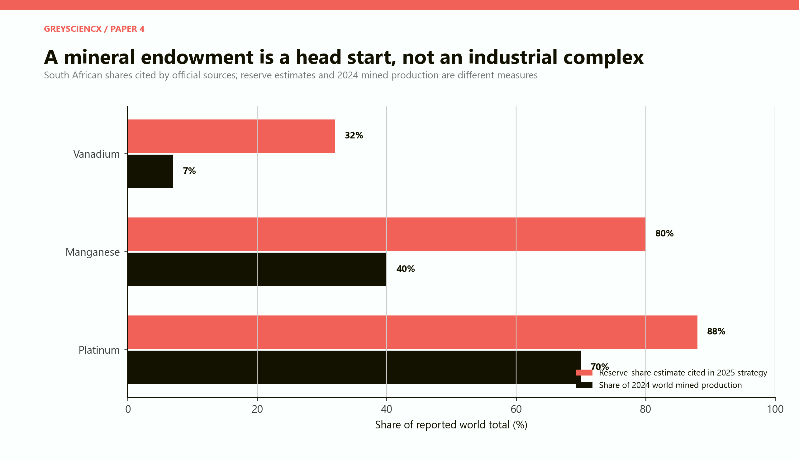

*Figure 1. The 2025 Critical Minerals and Metals Strategy cites reserve-share estimates of 88 per cent for PGMs, 80 per cent for manganese and 32 per cent for vanadium. USGS estimates for 2024 mined production are lower and measure a different thing: about 70, 40 and 7 per cent respectively. The gap is the first warning against confusing geology with industrial power.*

The official strategy is candid about the starting point. South Africa is a leading producer, but much of its participation remains upstream, with deficient downstream processing and manufacturing capacity. It also records the retreat of domestic smelting as power costs rose and capacity migrated to locations offering durable energy agreements. [South Africa Critical Minerals and Metals Strategy, 2025](https://www.gov.za/sites/default/files/gcis_document/202505/critical-minerals-and-metals-strategy-south-africa-2025.pdf).

**The numerical headline.** The model assigns each value-chain stage an illustrative share of total value added and asks what portion could plausibly remain in South Africa. The existing footprint retains about **37.6 per cent** of the modelled pool. A focused integration strategy reaches **66.3 per cent**. A frontier case with successful technology partnerships reaches **81.4 per cent**. These are not forecasts of GDP or company revenue. They are a disciplined way to expose where value is assumed to remain local.

**The political headline.** Forced localisation can produce more nominal local content and less actual local value. If plants are too expensive, fail qualification, lack offtake or operate intermittently, ownership of empty capacity is not industrialisation. In the model, a forced-autarky strategy realises about 52 per cent of the value pool after utilisation and market-access penalties, compared with about 62 per cent for focused integration and 73 per cent for the frontier partnership case.

# PART II: What an industrial complex actually is

## It is a system of capabilities, not a collection of mines

A mine supplies a mineral-bearing product. A manufacturing complex supplies repeatable specifications, delivery dates, warranties, maintenance, engineering changes and certification. The difference is organisational as much as technological.

The manganese mine does not by itself produce a battery chemical. The refinery does not by itself produce cathode material. Cathode material does not become a cell without anode material, electrolyte, separator film, current collectors, quality-control systems and specialised machinery. A cell is still not a grid-storage product until it is packaged with thermal control, power electronics, software, safety systems, enclosure, installation and long-term service.

The same problem appears in hydrogen. A PGM reserve is not a catalyst ink; an ink is not a membrane-electrode assembly; an assembly is not a stack; a stack is not an electrolyser; and an electrolyser is not a bankable hydrogen project without renewable electricity, water treatment, compression, storage, pipelines, an offtaker and certification.

Vanadium is the cleanest example of the system logic. The mineral may be locally mined and refined, yet the battery also needs electrolyte preparation, membranes, electrodes, bipolar plates, pumps, tanks, heat exchangers, power conversion, controls, installation and service. Much of the physical balance of plant could be produced or integrated locally even when a specialised membrane remains imported.

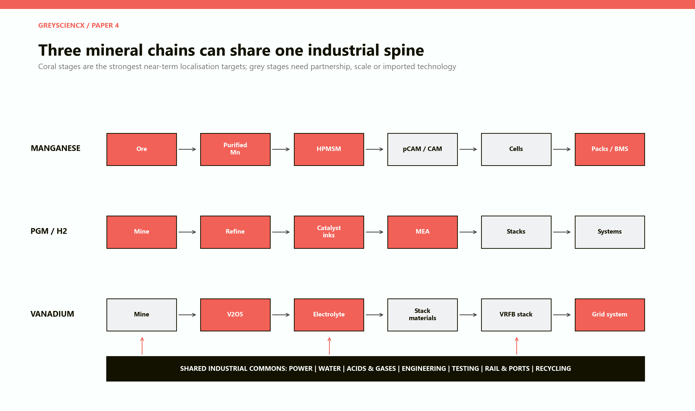

*Figure 2. The three chains are not separate empires. They can share electricity, water, chemical reagents, laboratories, engineering suppliers, industrial parks, logistics, testing and recycling. Coral marks the model's strongest initial localisation targets; grey identifies stages better approached through partnership, gradual learning or imports.*

**The unit of strategy should be the industrial commons.** The country gains more from a reliable industrial node that serves several products than from three isolated prestige plants. Shared laboratories can test battery materials, catalyst coatings and corrosion resistance. Shared chemical infrastructure can supply acids, gases, water treatment and waste handling. A supplier making enclosures, pipes, heat exchangers or power electronics can serve batteries, electrolysers, mines and ordinary industry.

This is why the term *complex* matters. It describes a network in which one investment lowers the cost and risk of several others. It also implies that failure can propagate. Unreliable power, a blocked rail corridor or a weak certification system can strand several factories at once.

## Four tests for every stage

Every localisation proposal should pass four tests before capital is committed.

**First, input advantage.** Is the relevant mineral, chemical, energy source or engineering capability actually available at competitive quality and cost? Geographic proximity to ore matters less when the mineral is a small share of the final product's delivered cost.

**Second, market scale.** Is there enough predictable demand to run the plant at efficient utilisation? Public procurement can anchor a first line, but it cannot permanently conceal an uncompetitive cost structure.

**Third, learning access.** Can the country obtain designs, production know-how, process recipes, quality systems and customer qualification? Buying machinery without acquiring operational knowledge creates dependence disguised as localisation.

**Fourth, failure containment.** Can an unsuccessful plant be reconfigured, sold, partnered or closed without destroying the rest of the cluster? A national plan should be ambitious in aggregate and reversible at project level.

# PART III: The manganese chain

## The opportunity is a chemical, not merely an ore

South Africa is a dominant manganese miner. USGS reports that it led world production in 2024, with about 19.6 million tonnes of ore and roughly 40 per cent of mined manganese by contained content. Yet estimated alloy production fell as high power costs persisted. Ore is abundant; competitive transformation is not. [USGS South Africa minerals profile](https://www.usgs.gov/centers/national-minerals-information-center/south-africa).

More than 90 per cent of manganese is still used in steel globally, so battery narratives can exaggerate the near-term battery market. Battery-grade manganese is nevertheless attractive because production is technically demanding and highly concentrated.

The IEA reported in 2025 that China produced about 95 per cent of high-purity manganese sulphate, while announced projects covered only 55 per cent of expected 2035 demand under stated policies. Manganese-rich lithium-ion and sodium-ion chemistries could widen the market, but chemistry shifts and Chinese cost leadership remain major risks. [IEA, emerging battery supply chains](https://www.iea.org/reports/global-critical-minerals-outlook-2025/beyond-nmc-batteries-supply-chain-issues-for-emerging-battery-technologies).

**Stage 1 - mining and concentration.** This is the strongest capability, but new volume should be tied to rail, water, environmental liabilities and a credible downstream customer.

**Stage 2 - purified manganese and HPMSM.** This is the clearest first move: a specified chemical product close to existing mining, hydrometallurgical and chemical capabilities. It must meet impurity tolerances and customer qualification. An unqualified product is inventory, not industrialisation.

**Stage 3 - precursor and cathode active material.** The prize and dependencies are larger: other mineral inputs, process recipes, licensing, customer approval and repeat orders. A global producer or committed cell customer is more credible than a fully state-designed entrant.

**Stage 4 - battery cells.** Cell production is capital intensive, scale sensitive and manufacturing-system intensive. South Africa's Renewable Energy Masterplan states that the local lithium-ion chain is relatively developed outside cells, that cells are primarily imported from China, and that the economic viability of domestic cell production remains to be established. [South African Renewable Energy Masterplan, 2025](https://www.gov.za/sites/default/files/gcis_document/202506/south-african-renewable-energy-masterplan.pdf).

That does not mean *never*. Cell production must be earned through demand, partners, yield and export access. A pilot can train people without pretending to be a globally efficient gigafactory.

**Stage 5 - packs, controls and integration.** Enclosures, cabling, cooling, fire protection, battery-management systems, engineering and maintenance are more accessible and link to local electrical equipment, software, fabrication and construction.

**Stage 6 - recycling.** Early collection standards, traceability and safe dismantling build capability before waste volumes rise. Imported batteries can supply feedstock, so local recycling need not wait for local cells.

# PART IV: The PGM-to-hydrogen chain

## Platinum abundance does not select the winning electrolyser

South Africa produced around 70 per cent of world mined platinum in 2024, while the national strategy cites an 88 per cent PGM reserve share. Concentrating, smelting and refining capability make this a genuine platform.

One force is favourable. Proton-exchange-membrane electrolysers and fuel cells use PGM catalysts, while South Africa has decades of PGM science and industry experience. The Hydrogen Society Roadmap targets local hydrogen products and fuel-cell components. [South African Hydrogen Society Roadmap](https://www.dsti.gov.za/images/South_African_Hydrogen_Society_RoadmapV1.pdf).

The other force is substitution. Alkaline electrolysers avoid most precious metals; researchers are reducing platinum and iridium loadings; some designs eliminate PGMs. The IEA also records manufacturing capacity growing faster than deployment, producing underused factories and aggressive competition. [IEA electrolyser technology assessment](https://www.iea.org/energy-system/hydrogen/electrolysers).

South Africa should therefore monetise its PGM knowledge without betting the industrial strategy on permanently high metal intensity.

## Localise the catalyst knowledge before the box

**Refining and separation** remain high-readiness activities. The next layer is catalyst precursors, powders, inks, coatings and quality control: little material, demanding know-how, and uses beyond hydrogen.

**Membrane-electrode assemblies** are a strong partnership target. The national strategy names them and PGM catalysts as research priorities. Licensing or joint development can embed production discipline while domestic R&D improves loading, durability and recycling.

**Stacks and complete electrolysers** require caution. Local assembly of imported cores may transfer little value, while local engineering around imported stacks can retain design, controls, balance-of-plant, installation and service. Measure value and learning, not local screws.

**Hydrogen production is a demand problem.** Global hydrogen demand exceeded 100 million tonnes in 2025, but low-emissions supply remained near one million. Only one of 31 announced African projects targeted for 2030 had reached final investment decision; finance and offtake were central barriers. [IEA Global Hydrogen Review 2026](https://www.iea.org/reports/global-hydrogen-review-2026/executive-summary).

South Africa's strategy likewise makes power, operating hours, water, logistics and buyers decisive. Domestic use, export derivatives and equipment manufacture are distinct opportunities. [Green Hydrogen Commercialisation Strategy](https://www.thedtic.gov.za/wp-content/uploads/Full-Report-Green-Hydrogen-Commercialisation-Strategy.pdf).

**The sensible anchor is existing industrial demand.** Refineries, fertiliser, chemicals, steel pilots and mines offer learning close to customers. Export derivatives may follow once contracts and infrastructure exist. A large component factory before project finance reverses the dependency.

**Recycling is strategic insurance.** Recovery protects metal value as catalyst loadings fall and links local firms to global end-of-life material, even as technologies change.

# PART V: The vanadium-to-grid-storage chain

## Vanadium's advantage is duration, reuse and local balance of plant

USGS estimates South Africa's 2025 vanadium output at about 5,000 tonnes of a 110,000-tonne world total, with reserves of 520,000 tonnes. That is meaningful geology, but not enough to win through ownership alone. [USGS Mineral Commodity Summaries 2026](https://pubs.usgs.gov/publication/mcs2026).

Vanadium redox flow batteries separate energy storage from power conversion. More electrolyte and tank volume extend duration without multiplying the whole stack; the electrolyte can potentially be recovered, reused or leased. The design fits stationary, long-duration applications.

The technology competes with lithium-ion, sodium-ion, pumped storage and other long-duration systems. It is not the default grid winner. The IEA treats flow batteries as potentially useful but a modest share of long-duration storage, leaving vanadium demand highly technology-sensitive. [IEA mineral requirements for storage](https://www.iea.org/reports/the-role-of-critical-minerals-in-clean-energy-transitions/mineral-requirements-for-clean-energy-transitions).

## The local chain is unusually tangible

The Renewable Energy Masterplan reports domestic vanadium mining, refining, electrolyte production and VRFB assembly. It identifies stack manufacture as a logical but IP-dependent next step, plus local opportunities in tanks, cabling, inverters, pumps, controls, engineering, testing and end-of-life management.

A large share of stationary storage value lies in site-specific engineering. Local firms can supply civil works, containers, electrical connections, controls, commissioning and maintenance even when specialised membranes or carbon are imported.

**Electrolyte is the first anchor.** It uses local capability and can be tested and supplied as a service. Leasing could retain the vanadium inventory and reduce upfront cost, but requires contracts, insurance and a credible residual-value market.

**System integration is the second anchor.** Eskom's first battery-storage phase lists approximately 199 MW and 833 MWh across eight sites. The programme demonstrates real domestic need, although its technology choices do not guarantee a VRFB market. Procurement should remain performance based while allowing long-duration systems to compete where their duration, cycling and safety characteristics fit. [Eskom Battery Energy Storage System programme](https://www.eskom.co.za/distribution/battery-energy-storage-system/).

**Stacks are a partnership target.** Domestic production should begin with licensed designs, local quality assurance and transparent performance guarantees. Attempts to recreate every membrane, electrode and bipolar plate at once would disperse scarce engineering effort.

**Recovery closes the loop.** An electrolyte service industry can collect, recondition and redeploy vanadium. That makes circularity part of the business model rather than a distant environmental promise.

# PART VI: The localisation map

## The middle of the chain is the strategic frontier

The model scores 18 activities on two dimensions. Local readiness reflects existing mineral, processing, engineering, market and institutional capabilities. Strategic upside reflects potential value retention, learning, supply security and option value. Capital intensity is shown separately because an attractive activity can still be an expensive first move.

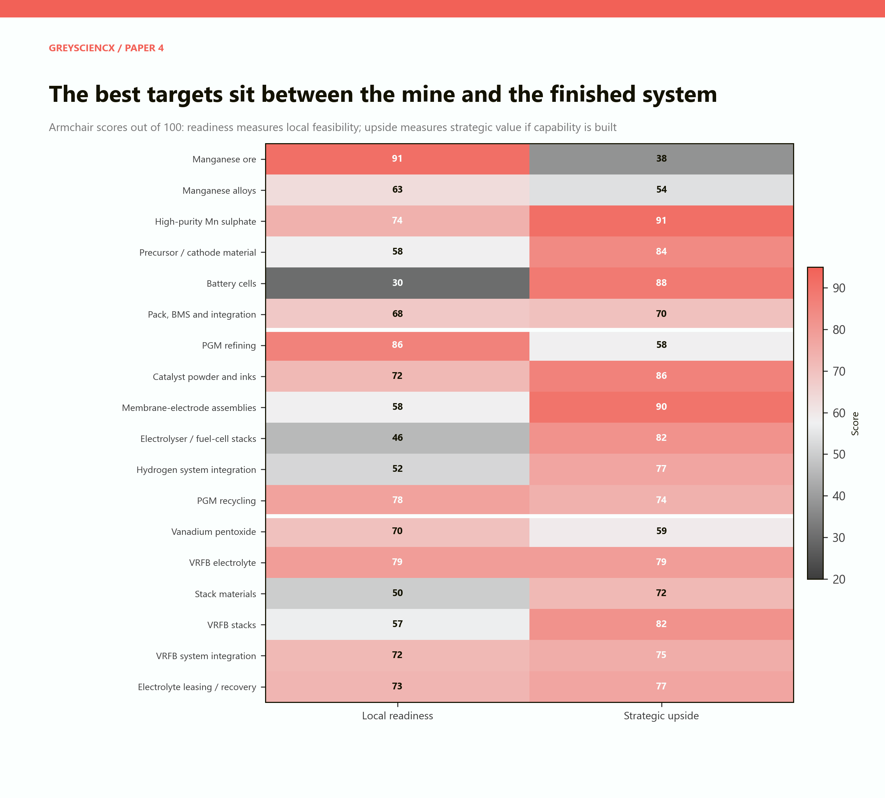

*Figure 3. Armchair scores make judgement visible. They are not empirical rankings. High-purity manganese sulphate, catalyst materials, PGM recycling, vanadium electrolyte and VRFB integration combine relatively strong readiness with high strategic value. Cells and complete stacks have high upside but low immediate readiness.*

The pattern is more important than any single score. Mining is ready but captures a small and mature portion of the opportunity. Finished systems can be valuable but depend on scale, intellectual property and markets. Advanced materials and selected components lie between them: close enough to local mineral and chemical capabilities to be plausible, but deep enough to create new knowledge and customer relationships.

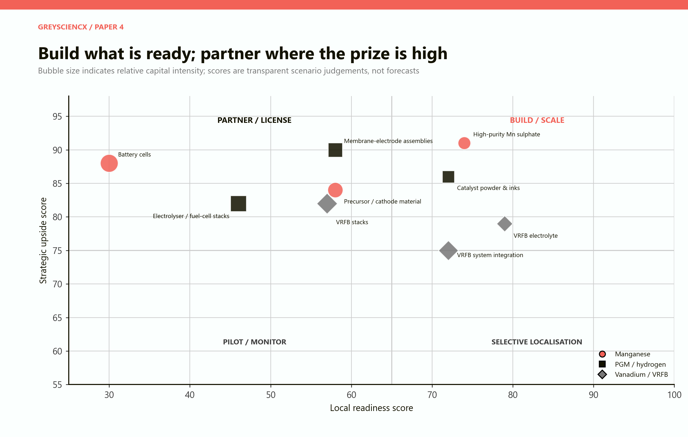

*Figure 4. Activities in the upper-right can be built or scaled. Upper-left activities deserve partnership or licensing because the prize is high but readiness is incomplete. The lower quadrants call for selective localisation or a pilot rather than a national-scale bet.*

The scorecard uses seven underlying questions: current capability, mineral linkage, domestic anchor demand, access to technology, infrastructure fit, supplier spillovers and technological robustness. Readiness weights current capability most heavily. This prevents mineral abundance from swamping evidence that a stage lacks customers, skills or production knowledge.

**Scores should move.** A firm offtake agreement can raise readiness. A successful demonstration can reduce technology risk. A new global oversupply can lower strategic upside. Loss of cheap electricity can make an existing process uncompetitive. The scorecard is therefore a governance instrument, not a once-off national ranking.

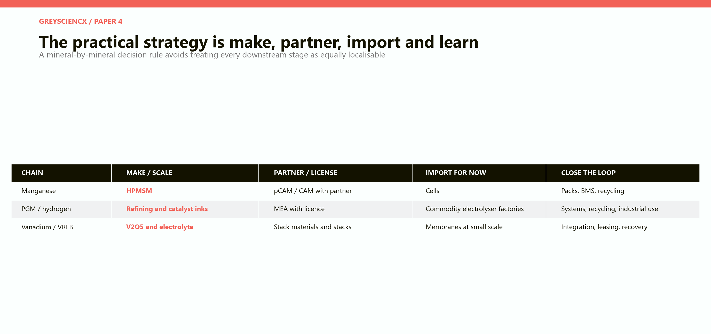

*Figure 5. The recommendation is intentionally mixed. Domestic production, partnerships and imports are tools inside one strategy. Learning and circular services prevent today's import from becoming permanent dependence.*

# PART VII: How much value can remain local?

## Three capability scenarios

The value-retention model divides each chain into six stages: resource extraction, primary refining, advanced materials, core components, system assembly, and services and recycling. The stages receive illustrative shares of the total value-added pool: 12, 16, 20, 22, 22 and 8 per cent. These weights are deliberately identical across chains so that differences come from localisation assumptions rather than hidden price forecasts.

Each stage is assigned a local share under three scenarios.

**Current footprint** reflects strong mining and some refining, thin advanced manufacturing, selective assembly and limited circular services.

**Focused integration** scales the most plausible materials and system activities, uses partnerships for difficult components, and treats reliable demand and shared infrastructure as preconditions.

**Frontier partnership** assumes that South Africa secures technology, reaches high plant utilisation, develops export customers and becomes a regional manufacturing and recycling hub.

| Local share of modelled value | Current footprint | Focused integration | Frontier partnership |
|---|---:|---:|---:|
| Manganese chain | 28.3% | 61.5% | 77.4% |
| PGM / hydrogen chain | 44.0% | 69.7% | 84.5% |
| Vanadium / VRFB chain | 43.5% | 69.2% | 83.5% |
| Weighted three-chain portfolio | 37.6% | 66.3% | 81.4% |

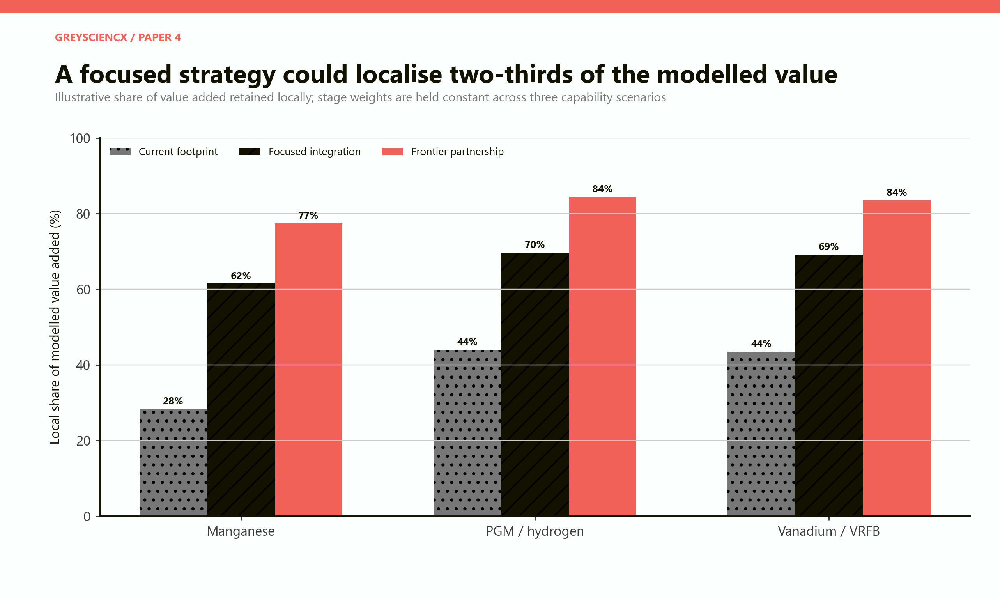

*Figure 6. The focused scenario does not require complete local production. It more than doubles the manganese chain's retained-value share in the model and lifts the portfolio to about two-thirds by targeting advanced materials, integration and services.*

These percentages do not tell us the size of the market. A high local share of a small failed market is still small. Nor do they prove that the modelled stage values match actual margins. The purpose is to expose the structure of the ambition: how much of each stage must be present locally for the slogan "beneficiation" to become a real production system.

## Where leakage remains

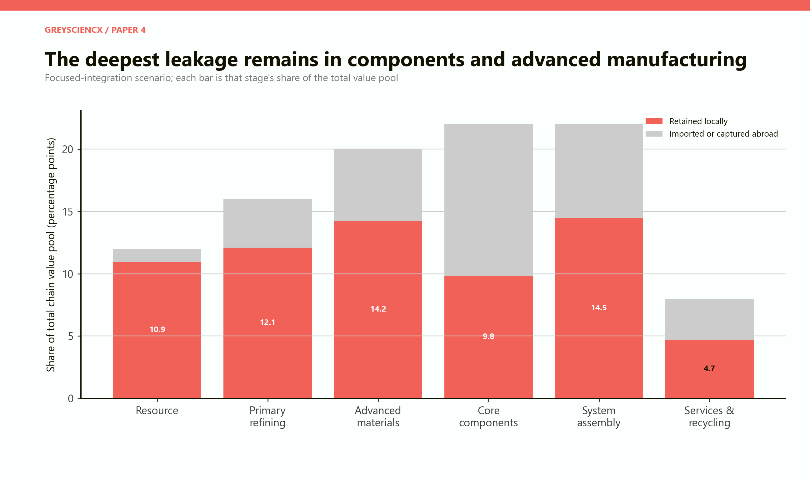

*Figure 7. In the focused case, resource extraction is overwhelmingly local. Core components remain the weakest stage. This is not automatically a failure: importing a specialised component can enable competitive local systems while capability is built.*

The model's remaining leakage is concentrated in components and advanced manufacturing. That is where patents, tacit knowledge, customer qualification and scale matter most. A policy that responds with blanket import substitution risks raising costs for every downstream user.

A better response is conditional partnership. Public finance, procurement or mineral access can be exchanged for training, local engineering, supplier development, test facilities, second-source production and a route to export customers. The objective is not a ceremonial joint venture. It is a measurable transfer of production capability.

# PART VIII: What the inherited industrial fund could do

## A portfolio, not a shopping spree

Papers 1 to 3 established a common counterfactual resource: approximately R253.5 billion in constant 2026 rand, corresponding to the seven-year SRD envelope used in this research series. Paper 4 does not claim that this money was available as cash on one date or that it should have been withheld from poor households. It asks what a disciplined mineral-complex portfolio would require if a resource of that scale were available.

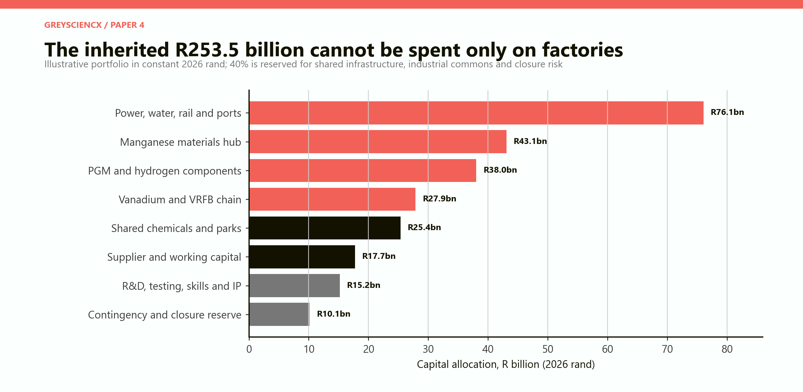

*Figure 8. Illustrative allocation of R253.5 billion. The largest line is shared power, water, rail and port infrastructure. R&D, testing, supplier finance and a closure reserve are part of the productive system rather than overhead to be minimised.*

The portfolio deliberately puts 40 per cent into shared infrastructure, industrial commons and closure risk rather than named product lines.

These are not plant cost estimates. Paper 8 will ask what physical assets R200-R250 billion could buy. Here the narrower point is that a complex needs connective assets, qualification, inventories, suppliers and the capacity to stop failed projects. Public and private tranches should be milestone-gated, with co-investors risking real capital and bringing technology or customers.

National Treasury's 2026 estimates describe Transnet's recovery plan as focused on stabilising rail volumes, port performance and maintenance, supported by large medium-term rail infrastructure expenditure. That reform is complementary to, not replaceable by, an industrial fund. [National Treasury, 2026 Estimates of National Expenditure](https://www.treasury.gov.za/documents/national%20budget/2026/ene/FullENE.pdf).

# PART IX: The constraints that decide the outcome

## Geology is not the binding constraint

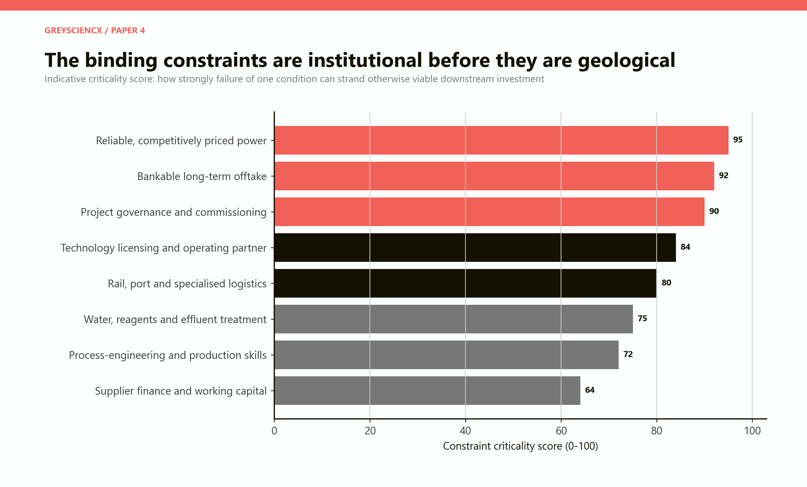

*Figure 9. Indicative criticality scores. Reliable competitively priced power, bankable offtake and project governance rank above mineral availability because failure in any one can strand an otherwise sound plant.*

**Power.** Mineral refining and chemical conversion can be electricity intensive. Reliability is necessary but not sufficient; the long-run tariff and carbon content also affect export competitiveness. The national strategy itself links lost smelting capacity to locations offering long-term energy deals.

**Offtake.** A plant needs a customer before it needs a ribbon-cutting date. Long-term offtake reduces financing cost, disciplines specifications and reveals whether buyers will qualify a new supplier. It is especially important in hydrogen, cathode materials and battery systems where announced demand can exceed contracted demand by a wide margin.

**Governance.** Capital allocation, procurement, construction control, commissioning and shutdown rules determine whether the strategy compounds or destroys wealth. Paper 3 showed how strongly industrial returns depend on survival and delay. Paper 4 adds that one failed shared utility can damage several chains.

**Technology access.** Machinery can be purchased; operating capability is harder. Agreements should specify training, process documentation, local engineering authority, intellectual-property access, quality responsibility and export rights.

**Logistics.** Ore corridors and advanced-product logistics are not identical. Bulk manganese needs rail and port throughput. Battery chemicals and catalysts need dependable containers, hazardous-material procedures, traceability and predictable delivery times.

**Water and effluent.** Chemical processing creates water-quality and waste obligations. Industrial nodes should fund treatment and closed-loop systems rather than externalising costs to municipalities and communities.

**Skills and suppliers.** Engineers, technicians, artisans, laboratory staff and plant managers must be available before commissioning. Supplier firms need working capital to meet long payment cycles, not only promises of future procurement.

## Demand is a strategic asset

South Africa has a rare advantage: it is both a mineral producer and a potential user of the resulting systems. Grid storage, mines, refineries, chemical plants, heavy transport and renewable generation can form anchor markets. SAREM sets its localisation ambition against a minimum renewable rollout of 3 GW a year, rising to 5 GW by 2030, and targets 25,000 jobs in renewable-energy and storage manufacturing and services by 2030. [SAREM national targets](https://www.gov.za/sites/default/files/gcis_document/202506/south-african-renewable-energy-masterplan.pdf).

Procurement must still be predictable. Stop-start auctions produce stop-start factories. Local-content requirements announced after bidding or changed between rounds raise risk. A rolling multi-year demand schedule is more valuable than a high local-content percentage attached to an uncertain project.

Global demand is not a substitute for customer development. The IEA reported that global battery demand grew by more than 35 per cent in 2025 and exceeded 1.5 TWh, while refined mineral supply became more concentrated. This creates an opening for diversification, but established producers retain scale, machinery, supplier and cost advantages. [IEA Global Critical Minerals Outlook 2026](https://www.iea.org/reports/global-critical-minerals-outlook-2026/market-overview).

# PART X: Partnership, sequencing and industrial discipline

## Why autarky loses

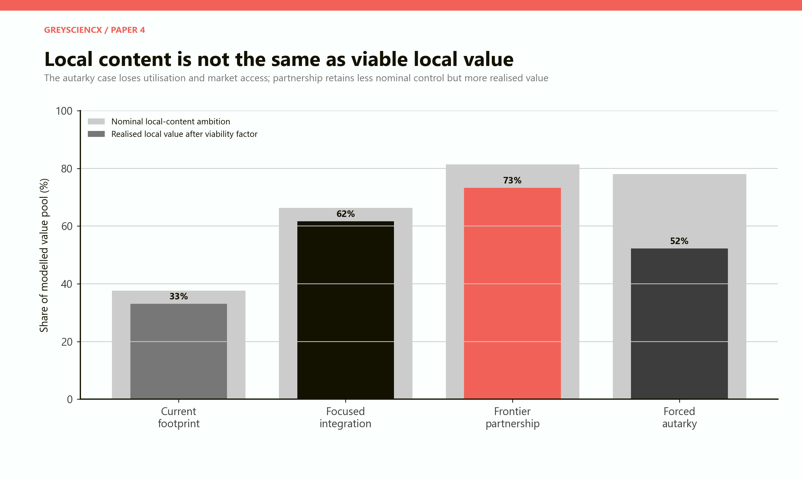

*Figure 10. Nominal local content is reduced by an assumed viability factor reflecting plant utilisation, cost competitiveness and market access. Forced autarky retains less realised value than disciplined partnership even though its stated local-content ambition is high.*

Autarky tries to localise every stage. It may create visible factories and weak networks. Specialised inputs become expensive, firms serve only a small protected market, customers face inferior technology, and the state is pressured to keep plants open after commercial failure.

Partnership accepts partial dependence but converts it into a learning path. The partner supplies technology, quality systems and customers; South Africa supplies minerals, process capability, engineering, infrastructure and market access. The public side protects itself through milestone finance, step-in rights, local training, intellectual-property provisions, transparent transfer pricing and competitive procurement.

Imports can also be developmental. Importing high-performance cells or membranes can support local pack or system firms. The condition is that policy tracks what is learned locally and periodically retests whether domestic production has become viable.

## The order of operations

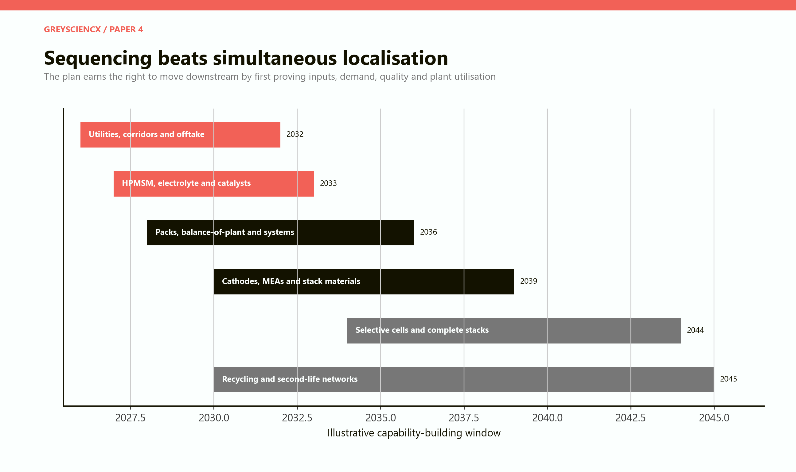

*Figure 11. Illustrative sequence, not a forecast. Shared utilities and offtake begin first. Advanced materials and catalysts scale next. Cathodes, membrane-electrode assemblies and stack materials deepen through partnership. Selective cells and complete stacks follow only after markets and capabilities are demonstrated.*

The sequence avoids two errors. The first is waiting for every enabling reform before doing anything. Pilot plants, testing centres, customer qualification and supplier training can proceed while wider infrastructure improves. The second is building every flagship at once, which exhausts management capacity and makes it difficult to distinguish a technical failure from a systemic one.

**Phase 1: prove the industrial commons.** Secure dedicated power arrangements, water and effluent systems, corridor agreements, laboratories, standards, permits and anchor contracts. Expand existing refining, HPMSM, catalyst, electrolyte, pack and system capabilities.

**Phase 2: deepen through customers.** Add precursor materials, cathodes, membrane-electrode assemblies, stack materials and digital controls with partners. Require export qualification or credible domestic orders before duplicate production lines are funded.

**Phase 3: exercise the cell and stack options.** Build selective cell or complete-stack capacity only where chemistry, scale, yields, customers and technology access are proven. The objective is not to reach the furthest downstream point. It is to occupy defensible positions that can survive without permanent fiscal protection.

# PART XI: Where the complex should live

## A network of specialised nodes

The mineral geography does not point to one megacity-sized complex.

**Northern Cape manganese node.** Mining and early processing belong close to the Kalahari resource and its logistics corridor where transport of bulk material dominates. Water and power constraints make environmental and utility design central. Higher-purity chemical production may locate where reagents, clean power, water treatment and export logistics are strongest rather than directly beside every mine.

**Bushveld PGM and vanadium node.** North West and Limpopo hold mining and processing expertise. The node can link mines, refineries, catalyst development and vanadium processing to Gauteng's engineering, chemical, finance and research base.

**Gauteng engineering and research node.** Gauteng offers universities, science councils, industrial customers, metal fabrication, electrical engineering and corporate services. It is a natural location for testing, catalyst and electrochemical R&D, controls, systems integration, training and headquarters functions.

**Mpumalanga transition node.** Grid access, industrial land, power-sector skills and the need to replace coal-linked activity make selected storage assembly, balance-of-plant and recycling plausible. SAREM specifically identifies vanadium-battery opportunities in the coalfields, subject to grid availability and industrial-park execution.

**Port-linked export nodes.** Hydrogen derivatives and some advanced materials need reliable access to Saldanha, Ngqura, Durban or other appropriate ports. The port is not merely an exit. It may be part of the production process through storage, handling, certification and imported inputs.

This distributed pattern should still operate as one system. Common standards, digital traceability, procurement pipelines and research programmes can connect nodes. The alternative is provincial duplication in which every region seeks the same battery factory, hydrogen hub and research centre.

# PART XII: The verdict

## What South Africa should localise

The complete mine-to-manufactured-product map leads to a selective answer.

| Chain | Build or scale now | Build with a partner | Import while learning | Circular advantage |
|---|---|---|---|---|
| Manganese | Purification, HPMSM, packs and integration | Precursors and cathode materials | Cells and specialised production equipment | Battery collection and materials recovery |
| PGM / hydrogen | Refining, catalyst powders and inks | Membrane-electrode assemblies and selected systems | Commodity stacks without firm offtake | Catalyst and PGM recovery |
| Vanadium / VRFB | V2O5, electrolyte, tanks, controls and system integration | Stack materials and stacks | Specialised membranes at small scale | Electrolyte leasing, reuse and recovery |

The country should not treat raw exports and total localisation as the only choices. It can export mineral products while retaining strategic volumes for qualified domestic customers. It can import a membrane while manufacturing the electrolyte, tanks, controls and installed system. It can partner on cathode chemistry while building local purification and recycling. It can assemble an electrolyser around imported stacks and still develop valuable engineering - provided the local contribution is measured honestly.

The 2025 national strategy, SAREM and the Hydrogen Society Roadmap now point broadly in the same direction: value addition, battery and hydrogen hubs, research, skills, infrastructure, regional integration and public-private finance. The remaining question is not whether government can publish a coherent ambition. It is whether projects will be selected, sequenced, governed and closed with industrial discipline.

> **Verdict:** Build the middle of the value chain first. Scale manganese chemicals, PGM catalysts, vanadium electrolyte, system integration and recycling; partner for cathodes, membrane assemblies and stacks; defer prestige cell factories until demand, technology and utilisation are proven.

# APPENDIX A: Model ledger

## What the scores mean

The model is intentionally transparent and non-optimising. It does not forecast commodity prices, factory profits, exports, employment or GDP. It converts qualitative judgements into comparable scores so that the argument can be challenged stage by stage.

Readiness scores run from zero to 100 and weight current capability, mineral linkage, domestic demand, technology access, infrastructure fit, supplier spillovers and technological robustness. Capital intensity is a separate relative score. Strategic upside reflects the possibility of retained value, learning, supply resilience and market growth.

The portfolio model assigns manganese 40 per cent of the illustrative opportunity, PGM-hydrogen 35 per cent and vanadium-VRFB 25 per cent. The six value-chain stages receive 12, 16, 20, 22, 22 and 8 per cent. These are judgement calls, not market forecasts.

## Local-share assumptions

| Stage | Manganese: current / focused / frontier | PGM-H2: current / focused / frontier | Vanadium-VRFB: current / focused / frontier |
|---|---:|---:|---:|
| Resource | 95 / 95 / 95 | 92 / 95 / 98 | 70 / 80 / 90 |
| Primary refining | 45 / 65 / 80 | 80 / 88 / 92 | 60 / 75 / 85 |
| Advanced materials | 8 / 65 / 82 | 45 / 72 / 85 | 55 / 80 / 90 |
| Core components | 4 / 35 / 60 | 18 / 52 / 75 | 20 / 50 / 72 |
| System assembly | 30 / 70 / 82 | 20 / 58 / 80 | 35 / 70 / 85 |
| Services and recycling | 8 / 45 / 70 | 35 / 70 / 86 | 30 / 65 / 82 |

The viability factors in Figure 10 are 88 per cent for the current footprint, 93 per cent for focused integration, 90 per cent for the frontier partnership scenario and 67 per cent for forced autarky. They represent utilisation, competitiveness and market access. They are illustrative penalties, not estimated probabilities.

## How to read the result

A 66.3 per cent focused local share is not a share of selling price, national income or profit. It is the model's synthetic value pool retained in South African production. Project appraisal still requires product-specific volumes, prices, costs, taxes, learning curves, environmental effects and contracts.

The model is a counterfactual tool: if cell readiness rises, should cells be local? If low-cost power disappears, which plants fail first? If a partner captures most margin abroad, what learning remains? The logic is reproducible in the accompanying code and JSON ledger.

# APPENDIX B: Risks and omissions

## What this paper does not establish

**No commercial feasibility studies.** The paper does not estimate engineering cost, product yield, financing terms, commodity prices or plant-level returns. Each proposed facility would require its own technical, financial, environmental and market appraisal.

**No claim that all critical-mineral processing is green.** Refining, chemicals, hydrogen and batteries can consume substantial energy and water and produce hazardous waste. Environmental control is a productive input, not a compliance afterthought.

**No automatic employment claim.** Advanced materials and automated plants may create fewer direct jobs per rand than labour-intensive activities. Their case may rest on productivity, exports, supplier depth or strategic capability. Paper 12 will address employment conversion directly.

**No fixed technology winner.** Battery chemistries, PGM loadings, electrolyser designs and long-duration storage costs can change. Modular capacity, partnerships and staged investment protect the public portfolio against technological lock-in.

**No assumption that domestic ownership equals domestic welfare.** Foreign-owned plants can create local wages, taxes, learning and exports. Public or domestic ownership can still destroy value through poor governance. The relevant question is who bears risk, who controls key capabilities and where net benefits accrue.

**No assumption that mineral reservation is free.** Export restrictions may lower mine revenue, discourage investment or violate trade commitments. Any domestic-supply instrument must be targeted, predictable and paired with credible downstream buyers.

## Evidence map

**South African policy and capability**

- [Critical Minerals and Metals Strategy of South Africa, 2025](https://www.gov.za/sites/default/files/gcis_document/202505/critical-minerals-and-metals-strategy-south-africa-2025.pdf)
- [South African Renewable Energy Masterplan, 2025](https://www.gov.za/sites/default/files/gcis_document/202506/south-african-renewable-energy-masterplan.pdf)
- [Hydrogen Society Roadmap for South Africa](https://www.dsti.gov.za/images/South_African_Hydrogen_Society_RoadmapV1.pdf)
- [Green Hydrogen Commercialisation Strategy](https://www.thedtic.gov.za/wp-content/uploads/Full-Report-Green-Hydrogen-Commercialisation-Strategy.pdf)
- [CSIR electrochemical energy technologies](https://www.csir.co.za/what-we-do/natural-environment/energy/electrochemical-energy-technologies)
- [Eskom Battery Energy Storage System programme](https://www.eskom.co.za/distribution/battery-energy-storage-system/)

**Mineral position and industrial conditions**

- [USGS South Africa minerals profile](https://www.usgs.gov/centers/national-minerals-information-center/south-africa)
- [USGS Mineral Commodity Summaries 2026](https://pubs.usgs.gov/publication/mcs2026)
- [Statistics South Africa, manufacturing employment, March 2026](https://www.statssa.gov.za/publications/P0277/P0277March2026.pdf)
- [National Treasury, Estimates of National Expenditure 2026](https://www.treasury.gov.za/documents/national%20budget/2026/ene/FullENE.pdf)

**Technology and global markets**

- [IEA Global Critical Minerals Outlook 2026](https://www.iea.org/reports/global-critical-minerals-outlook-2026)
- [IEA, emerging battery supply chains](https://www.iea.org/reports/global-critical-minerals-outlook-2025/beyond-nmc-batteries-supply-chain-issues-for-emerging-battery-technologies)
- [IEA Global Hydrogen Review 2026](https://www.iea.org/reports/global-hydrogen-review-2026)
- [IEA electrolyser technology assessment](https://www.iea.org/energy-system/hydrogen/electrolysers)
- [US Department of Energy, PGM catalyst supply-chain assessment](https://www.energy.gov/sites/default/files/2024-12/PGM%2520catalyst%2520supply%2520chain%2520report%2520-%2520final%2520draft%25202.25.22%5B1%5D.pdf)
- [US Department of Energy, advanced-battery supply-chain review](https://www.energy.gov/sites/default/files/2024-12/20212024-Four%20Year%20Review%20of%20Supply%20Chains%20for%20the%20Advanced%20Batteries%20Sector.pdf)

Evidence cut-off: 15 September 2026. Official sources establish the resource position, declared policy, current capabilities and broad market context. The model's scores, stage weights, capital allocation and sequencing remain explicit GreyScienx scenarios rather than official projections.
