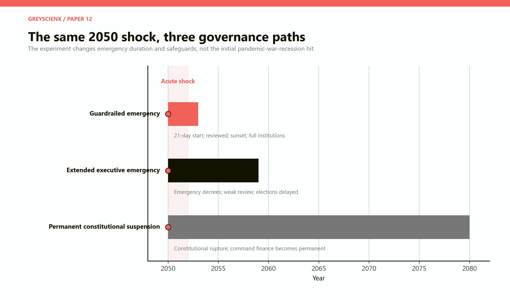
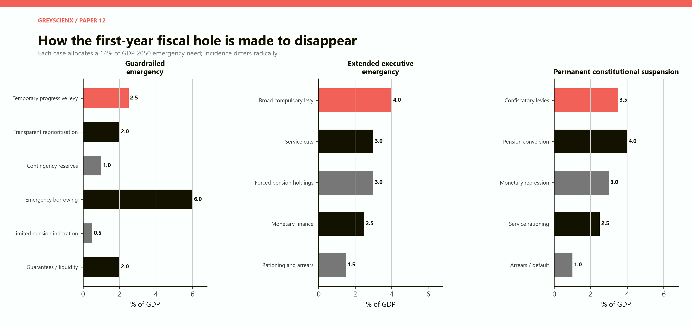
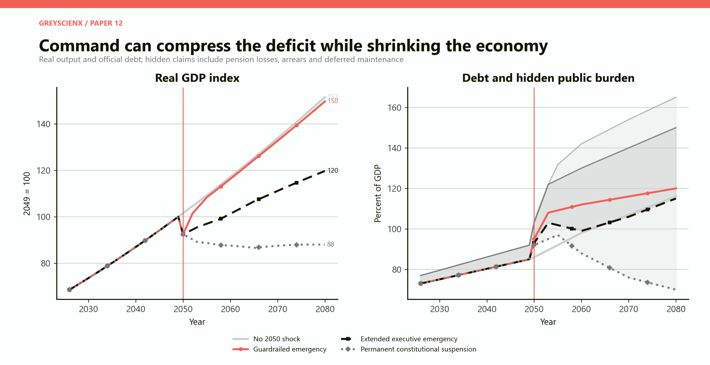
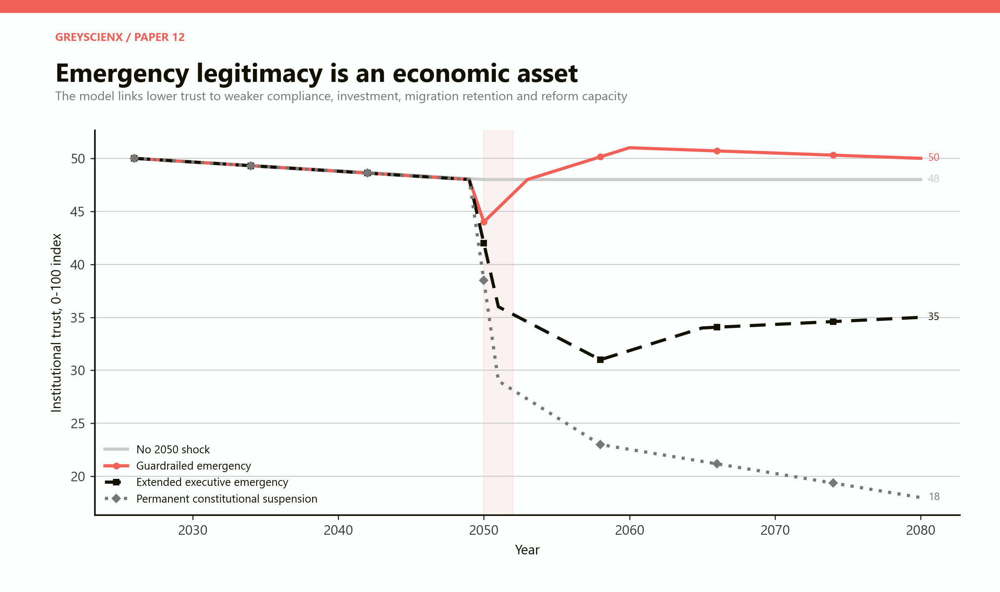
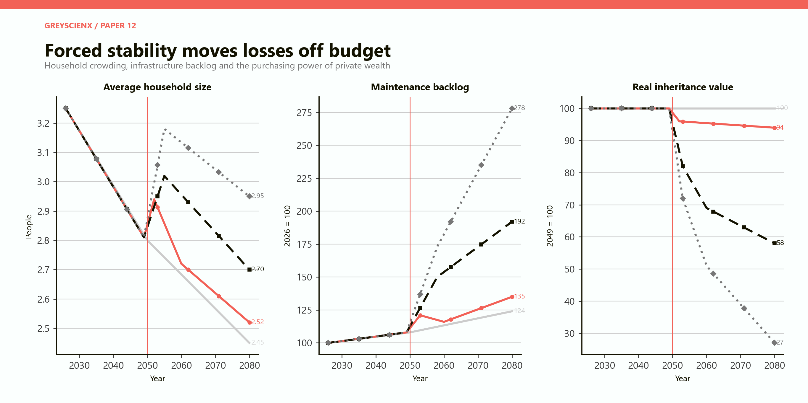
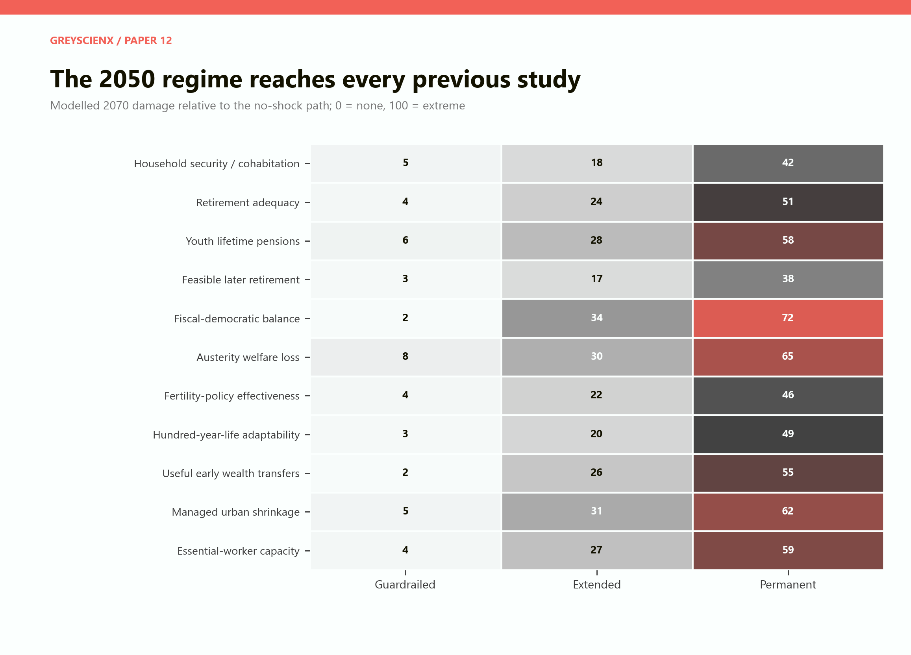
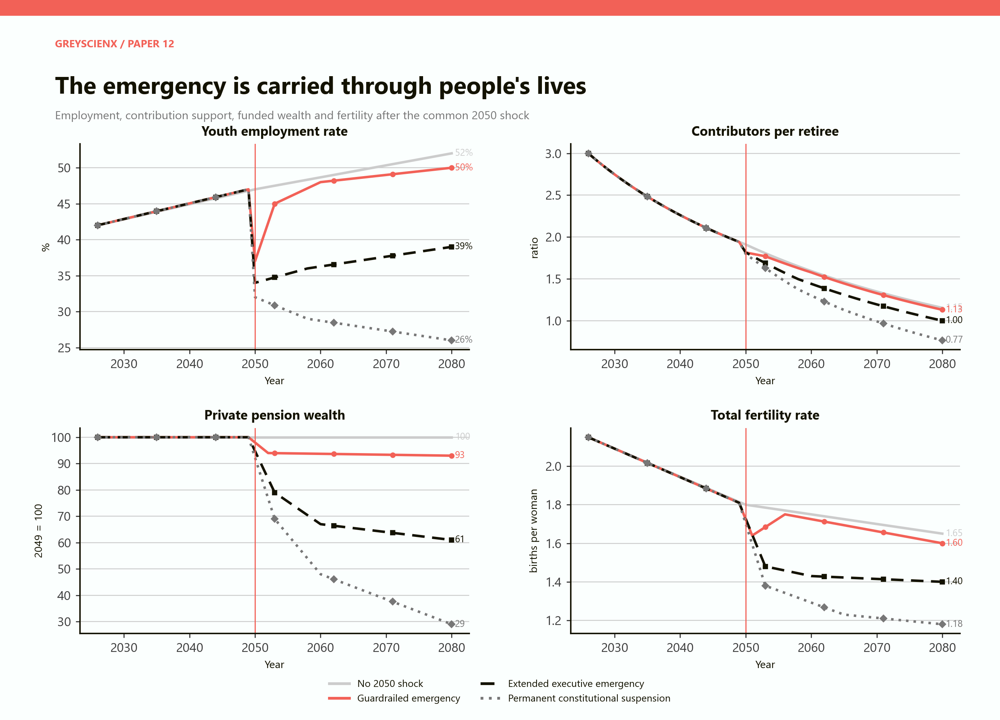
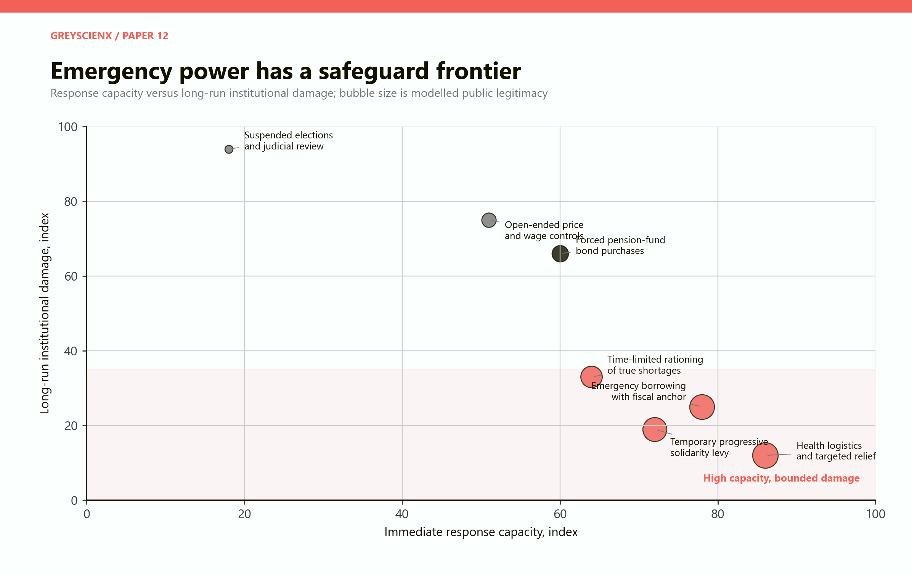

# Extreme Fiscal Pressure
## A 2050 pandemic-war-recession shock, emergency rule and the future of the population system

# Part I: The finding

Emergency power can make a fiscal gap disappear on paper. It cannot make the underlying resources appear.

This paper introduces a common shock in 2050: a severe pandemic reduces labour supply and raises healthcare costs; war and security mobilisation raise defence, energy and import costs; and a recession cuts output, employment and tax revenue. The hypothetical South-African-scale economy enters the shock with an ageing population, high public debt, weak youth employment and a narrowing contributor base.

The immediate financing need is 14% of shocked-year GDP, about R1.23 trillion in constant 2026 rand. Every scenario closes that first-year accounting gap. What changes is who carries the loss, whether the loss remains visible, and how long emergency authority lasts.

The best case is a guardrailed constitutional emergency that ends in 2052. It uses targeted relief, a temporary progressive levy, transparent reprioritisation, reserves, borrowing and limited pension indexation. Real output is 1.2% below the no-shock path in 2080. The present value of lost output from 2050 to 2080 is R3.7 trillion. Institutional trust recovers.

The average case is an extended executive emergency lasting to 2058. It uses compulsory levies, broad service cuts, forced pension-fund holdings, monetary finance, price controls and arrears. The official debt ratio looks no worse than the no-shock path by 2080, but hidden claims rise to 35% of GDP. Real output ends 21% lower, private pension wealth is 39% lower and youth employment is 39% rather than 52%.

The worst case is a permanent constitutional suspension that has not ended by 2080. It converts retirement assets into captive public finance, suppresses prices and wages, restricts capital, weakens courts and elections, and normalises military-backed administration. Official debt falls to 70% of GDP. That apparent success is purchased by a 95% of GDP stock of hidden pension losses, arrears and deferred maintenance. The augmented public burden reaches 165% of GDP. Real output ends 42% below the no-shock path. The present value of output lost after 2050 is R65.8 trillion.

The model's central result is not that every emergency measure is economically harmful. Targeted health restrictions, rapid logistics, temporary taxes, rationing of genuine physical shortages and emergency borrowing can preserve life and productive capacity. The dangerous move is to confuse speed with unchecked authority.

> Suspending oversight does not create doctors, food, energy, tax capacity or pension wealth. It makes it easier to compel, postpone, reclassify and conceal who loses them.

The 2050 regime changes every previous study. Forced household consolidation raises the measured cohabitation dividend while reducing autonomy. Pension promises are met nominally but lose purchasing power. Youth work histories are interrupted. Later retirement becomes coercive rather than supported. Older voters may be protected or politically neutralised. Fertility falls. Multi-stage lives become command-assigned lives. Inheritance is trapped in controlled assets. Municipal decline is hidden through maintenance arrears. Skilled workers leave, making automation and immigration less effective.

This is a counterfactual model, not a forecast and not legal advice. A literal suspension of South Africa's Constitution is not an ordinary instrument available under its state-of-emergency clause. In this paper, that phrase denotes a constitutional rupture and a worst-case governance path.

# Part II: The legal boundary

The phrase "martial law" is often used loosely to describe curfews, military deployment or emergency administration. It should not be treated as a blank legal category.

Under [section 37 of the Constitution of the Republic of South Africa](https://justice.gov.za/legislation/constitution/chp02.html), a state of emergency may be declared only under an Act of Parliament, only when the life of the nation is threatened by war, invasion, general insurrection, disorder, natural disaster or another public emergency, and only when necessary to restore peace and order.

The declaration is prospective and initially limited to 21 days. Extensions may last no more than three months at a time. The first requires a majority of the National Assembly; later extensions require at least 60% and a public debate. Competent courts may review the declaration, an extension and action taken under it. Derogations must be strictly required by the emergency, consistent with international law and published. Certain rights are non-derogable, and detention without trial remains subject to notice, legal and medical access, and court review.

[Section 36](https://justice.gov.za/legislation/constitution/chp02.html) also requires ordinary limitations of rights to be reasonable and justifiable in an open and democratic society, with attention to purpose, scope and less restrictive means.

Military deployment is not the same as constitutional suspension. [Sections 198 to 203](https://www.justice.gov.za/legislation/constitution/chp11.html) place national security under law, Parliament and the national executive. Security services must act in accordance with the Constitution and may not obey manifestly illegal orders. The President may authorise defence-force employment for defined purposes and must inform Parliament promptly. A state of national defence also requires parliamentary involvement.

South Africa also has the [Disaster Management Act 57 of 2002](https://www.gov.za/documents/disaster-management-act), which provides for prevention, preparedness, coordinated response and recovery. A state of disaster is not a suspension of the Constitution. The [State of Emergency Act 64 of 1997](https://www.gov.za/documents/acts/state-emergency-act-64-1997-21-nov-1997) supplies the statutory framework for a constitutional state of emergency.

The distinction matters to the model.

| Model label | Institutional meaning | Constitutional status in this paper |
|---|---|---|
| Guardrailed emergency | Time-limited emergency action with Parliament, courts, publication, proportionality and review operating | Modelled as the lawful benchmark |
| Extended executive emergency | Repeated decree, delayed elections, narrowed review and weak legislative control | Modelled as constitutional abuse or breakdown, not normal section 37 use |
| Permanent constitutional suspension | Military-backed executive rule with no credible sunset and subordinated courts and legislature | Modelled as constitutional rupture |

International standards point in the same direction. The [UN Human Rights Committee's General Comment 29](https://docstore.ohchr.org/SelfServices/FilesHandler.ashx?enc=ccqD91akOLDnEtIXFjdTRJYo6UQD8dbbvX7mzlxO3U2hLFzKw%2BxjoBQ7XvOT6SvQmIi0HZZy%2Fgg5zr9N0Ww16%2Fw5pNaQQDefyZAgY5%2FmdtA%3D) describes derogating measures as exceptional and temporary, limited in duration, geography and scope to what the emergency strictly requires, with restoration of normality as the predominant objective. The [Venice Commission's emergency-rule report](https://www.venice.coe.int/webforms/documents/?pdf=CDL-AD%282020%29014-e) likewise stresses legality, necessity, proportionality, temporariness, parliamentary control and judicial review.

# Part III: The 2050 experiment

The model follows a hypothetical economy from 2026 to 2080. It is scaled to South Africa for readability, not calibrated as a national forecast.

Before the shock, real GDP rises from R6.5 trillion in 2026 to R9.49 trillion in 2049. The population grows from 64 million to about 68 million, then begins a slow decline. Full-year-equivalent contributors fall from 18 million to 17.2 million by 2050 while retirees rise from six million to nine million. Official debt reaches 85% of GDP in 2049.

The no-shock path is already difficult. By 2080 it has 15 million contributors, 13 million retirees, official debt of 116% of GDP and hidden obligations equal to 12% of GDP. Youth employment improves slowly to 52%. Fertility falls to 1.65 births per woman.

The shock combines three events in 2050.

**Pandemic**

Available labour falls sharply through illness, isolation, care duties and health-system overload. Emergency health, income and business support rise. School and training disruption damages younger cohorts if it lasts.

**War and security mobilisation**

Defence and logistics absorb fiscal space, people, imported equipment and energy. Trade insurance, fuel and food become more expensive. Some civilian production is redirected. Skilled migration becomes less attractive.

**Recession and financial stress**

Real output falls 9% relative to the no-shock path in 2050. Employment and tax receipts fall. The risk premium rises. Guarantees and weak firms create contingent claims that do not all appear in the first budget.

The model begins with the same real shock in all three emergency paths. Governance changes persistence, incidence and recovery.

*Figure 1. The guardrailed path restores ordinary government after 2052. The extended path concentrates executive power through 2058. The permanent path has no restoration by 2080. The last two are constitutional breakdown scenarios.*

## Best, average and worst assumptions

| Assumption | Best: guardrailed | Average: extended | Worst: permanent |
|---|---:|---:|---:|
| Emergency duration | 2050-2052 | 2050-2058 | 2050-2080 and continuing |
| 2050 GDP gap | -9% | -9% | -9% |
| Main finance | Temporary levy, reserves, debt | Compulsory levy, cuts, captive pensions | Pension conversion, repression, rationing |
| Oversight | Courts and Parliament fully operative | Narrowed and delayed | Subordinated |
| Elections | On schedule | Delayed | Non-competitive or suspended |
| Price controls | Narrow and temporary | Broad through emergency | Normal instrument |
| Capital controls | Targeted only if needed | Broad and persistent | Structural |
| Youth mobilisation | Paid, protected service | Compulsory service at scale | Long compulsory allocation |
| Restoration plan | Announced at declaration | Conditional and repeatedly extended | None credible |

The youth-employment, fertility, trust, migration and productivity paths incorporate these institutional assumptions. They are not empirical estimates of a particular law. They are transparent stress-test inputs.

# Part IV: Closing a R1.23 trillion hole

After the common 9% output loss, the modelled 2050 fiscal need equals 14% of GDP, roughly R1.23 trillion in constant 2026 rand. It includes lower revenue, health response, income protection, defence mobilisation, import support, credit losses and higher financing cost.

All three regimes allocate the same need.

*Figure 2. Each package closes the first-year cash or financing requirement. A forced pension holding or arrear can close the government's cash gap while transferring the shortfall to households, suppliers or the future.*

The guardrailed package borrows most because the shock is temporary: 6% of GDP, alongside a 2.5% progressive levy, 2% transparent reprioritisation, 1% of reserves, 0.5% limited pension indexation and 2% of guarantees or liquidity support. The extended package substitutes compulsory levies, service cuts, forced pension holdings, monetary finance and arrears. The permanent package relies still more on pension conversion, repression and rationing.

The arithmetic appears equivalent because every column sums to 14. The welfare result is not equivalent.

Borrowing preserves current consumption but creates an explicit future claim. A tax creates a visible current transfer. A pension mandate creates a claim that may be honoured only in depreciated money. A price ceiling transfers the cost into queues, quality and shortage. An unpaid municipal supplier becomes an off-budget creditor. Deferred maintenance becomes a future capital bill. Conscription transfers the cost into lost education, earnings and choice.

Emergency accounting should therefore report five ledgers together: the cash budget; explicit debt and guarantees; real losses imposed on pensions, deposits and regulated prices; arrears and deferred maintenance; and lost output, employment, health and trust.

# Part V: The debt illusion

The no-shock path reaches official debt of 116% of GDP in 2080. The guardrailed emergency reaches 120%. The extended emergency reaches 115%. The permanent suspension reaches only 70%.

Read alone, official debt declares the permanent regime the winner.

*Figure 3. Left: real GDP relative to 2049. Right: official debt ratios and, for the coercive regimes, lighter lines adding hidden claims. The apparent debt improvement in the permanent case comes with a much smaller denominator and much larger off-budget losses.*

The permanent regime lowers reported debt by converting pension funds into captive buyers, holding nominal yields below inflation, accumulating supplier arrears, postponing maintenance and reducing promised real services. These are economically similar to claims on the state even when accounting rules do not call them debt.

By 2080, hidden pension losses, arrears and deferred maintenance reach 95% of GDP in the permanent case. Adding them to official debt produces an augmented burden of 165%. The extended case reaches 150%. The guardrailed case reaches 126%, slightly below the no-shock augmented burden because temporary action is followed by repair of contingent claims and maintenance.

The output denominator matters equally. The permanent path's GDP is 42% below the no-shock path. A lower official debt ratio on a much smaller economy does not mean society has more capacity to support retirees, hospitals or cities.

The [IMF's Fiscal Monitor on policy from pandemic to war](https://www.imf.org/en/publications/fm/issues/2022/04/12/fiscal-monitor-april-2022) warns that inflationary debt relief and financial repression can undermine financial stability and medium-term growth, while broad price subsidies are costly, poorly targeted and can create shortages. Its core recommendation is targeted support that protects vulnerable households while preserving price signals and fiscal credibility.

# Part VI: The guardrailed emergency

The best case does not assume a weak response. It assumes a powerful response whose authority is narrow, reviewable and temporary.

Health authorities can procure, coordinate and restrict high-risk activity. The military can support logistics, field hospitals, borders and infrastructure under civilian law. The treasury can borrow, guarantee credit and levy temporary progressive taxes. Government can ration physically scarce imports or medical resources when ordinary prices cannot allocate them safely. Workers can be reassigned voluntarily or through lawful, compensated and tightly defined service obligations.

The guardrails change behaviour.

- Publication makes the fiscal cost visible.
- Parliamentary extension forces the executive to demonstrate continuing necessity.
- Court review protects the boundary between urgent action and opportunistic seizure.
- A sunset makes investors and households more willing to defer rather than abandon activity.
- Compensation and appeal reduce the perceived risk that emergency procurement becomes arbitrary confiscation.
- Scheduled elections give every group a peaceful route to contest distribution.

Real output is 9% below the reference in 2050, 3% below by 2052 and less than 1% below by 2055. It ends 1.2% below in 2080. The present value of output lost across 2050-2080 is R3.7 trillion. This is not a costless success. It is a contained scar.

Trust falls from 48 to 44 in the first year, then rises to 51 around 2060 and ends at 50. That recovery is an assumption grounded in a visible link between sacrifice and restoration. The [OECD's work on democratic resilience during crises](https://www.oecd.org/en/publications/government-at-a-glance-2023_3d5c5d31-en/full-report/component-4.html) treats openness, integrity, fairness, preparedness and external scrutiny as drivers of durable trust. It also notes that emergency law-making with weak scrutiny can damage perceptions of public institutions even after the measure is reversed.

The guardrailed path still changes the ten studies. Youth employment falls sharply before recovering. Pension wealth loses 7% relative to the reference. Fertility falls to 1.64 before partly recovering. Household size rises temporarily as people consolidate. Debt is higher. The point is not that safeguards prevent loss. They stop the loss from becoming a permanent governing system.

# Part VII: The extended executive emergency

The average case begins with a plausible argument: the emergency has not fully ended, financing remains fragile and ordinary procedures are too slow. Temporary powers are renewed. Then their purpose expands.

Controls introduced for medical goods spread to food, energy, rent, wages and foreign exchange. Pension funds must hold more public debt. A temporary levy becomes a broad contribution. Procurement remains exempt from ordinary competition. Elections are delayed. Judicial review continues formally but becomes slow or narrow. Security services take on civilian administrative roles.

The regime initially looks more decisive than the guardrailed case. It collects more immediately and borrows less at market rates. It can direct fuel, labour and credit toward priority sectors. It can force private savings to absorb public liabilities.

The long-run loss comes through behaviour.

Firms delay investment because rules and ownership claims are uncertain. Skilled people leave or decline to return. Informal exchange grows around controlled prices. Pension contributors reduce voluntary saving. Municipal suppliers demand cash or stop bidding. Officials devote effort to allocation permissions rather than service outcomes. Corruption becomes more valuable because access is administrative.

By 2080, real GDP is 21% below the no-shock path. The discounted output loss from 2050 is R34.7 trillion. Youth employment ends at 39%. The contributor-to-retiree ratio reaches 1.00. Private pension wealth is 61 on an index where the reference remains 100. Institutional trust ends at 35.

The official debt ratio of 115% conceals hidden claims of 35% of GDP. The state has not eliminated its ageing burden. It has redistributed it into pensions, household wealth, service quality and future maintenance.

# Part VIII: Permanent constitutional suspension

The worst case turns the exception into the operating constitution.

Military-backed administration becomes normal. Elections are non-competitive or suspended. Courts cannot credibly bind the executive. Budget disclosure narrows. Capital controls, price controls and pension mandates persist. The government allocates foreign exchange, credit, jobs and essential goods. Emergency crimes and security categories expand.

This regime can mobilise real resources in the narrow sense. It can direct labour to ports, hospitals, energy and defence. It can prevent an immediate run on banks or pension funds. It can suppress measured inflation and hold down reported interest costs. It can cut benefits without announcing a nominal cut.

The model nevertheless produces the worst path because permanent compulsion destroys substitution and feedback.

When a price is wrong, queues rather than prices report scarcity. When investment is unsafe, capital does not remain merely because transfer is illegal; it becomes hidden, consumed, under-maintained or moved through informal channels. When dissent is punished, government loses information about failing programmes. When elections do not allocate blame, policy failure persists longer. When pension assets are captive, the state consumes the pool meant to finance its future retirees.

Real output ends at R8.34 trillion in 2080, below the R9.49 trillion economy that existed before the shock and 42% below the no-shock path. The present value of output lost from 2050 is R65.8 trillion. Youth employment falls to 26%. Fertility reaches 1.18. The contributor-to-retiree ratio falls to 0.77. Private pension wealth is 29% of the reference and the real value of inheritance is 27%.

Official debt falls because claims are cancelled, inflated, compelled or left unpaid. Hidden claims reach 95% of GDP. A state can default economically without issuing a legal default notice.

The constitutional cost is inseparable from the fiscal cost. The [UN Human Rights Committee](https://docstore.ohchr.org/SelfServices/FilesHandler.ashx?enc=ccqD91akOLDnEtIXFjdTRJYo6UQD8dbbvX7mzlxO3U2hLFzKw%2BxjoBQ7XvOT6SvQmIi0HZZy%2Fgg5zr9N0Ww16%2Fw5pNaQQDefyZAgY5%2FmdtA%3D) states that emergency derogation must remain exceptional and temporary, and that restoration of normality is the predominant objective. A permanent suspension is not a more intense version of that model. It is its failure.

# Part IX: How emergency rule changes the first ten studies

## Cohabitation under emergency rule

The earlier household research identified a cohabitation dividend. Two adults can share rent, utilities, appliances, transport and emergency reserves. In normal conditions, the decision can increase disposable income and wealth accumulation.

The 2050 shock increases the gross financial value of consolidation. Job loss, rent pressure, rationed energy and scarce housing make a second household expensive. Adult children return to parents. Older relatives move in with working families. Friends share dwellings. Average household size in the guardrailed case rises from 2.81 in 2049 to 2.94 in 2052 before resuming its decline.

In the extended case, household size reaches about 3.02 in the mid-2050s and ends at 2.70 rather than 2.45. In the permanent case it reaches 3.18 and remains 2.95 in 2080.

This looks like a larger cohabitation dividend. It is partly a distress dividend.

Voluntary consolidation releases money while preserving exit. Forced consolidation may reflect housing allocation, movement restrictions, lost income or a ban on eviction that freezes people in unsuitable arrangements. Shared costs rise, but privacy, bargaining power and safety can fall. A household with more earners may also face compulsory levies or ration entitlements that do not scale with size.

Emergency policy changes distribution inside the household. If benefits, permits or food allocations are paid to one registered head, formal control becomes concentrated. A partner who cannot leave or access independent income is not made better off merely because the household balance sheet improves.

The macroeconomic result is mixed.

- Fewer separate households reduce near-term demand for dwellings and duplicate durable goods.
- Overcrowding increases health transmission, care burden and infrastructure wear.
- Household saving can rise, but captive finance may redirect it to government.
- Relationship stress can cause later fragmentation and another wave of housing demand after controls end.

The guardrailed path treats cohabitation as voluntary resilience and supports safe exit. The permanent path counts coerced sharing as housing success.

## Retirement becomes a fiscal reservoir

The first numbered study showed how difficult retirement at 60 already was under ordinary longevity and return assumptions. The emergency regime adds four pressures.

First, contributions fall when employment and wages fall. Second, asset returns fall when pension funds are directed into low-yield public debt. Third, inflation or controlled indexation reduces real benefits. Fourth, governments draw on retirement assets because they are large, domestic and administratively visible.

In the guardrailed case, private pension wealth ends 7% below the no-shock reference in 2080. The loss comes from the recession, temporary weaker indexation and lower contributions. It is limited because market allocation and property rules return.

The extended case ends 39% below the reference. Funds hold more government paper at repressed real returns, unemployment interrupts contributions and formal wages weaken. The permanent case ends 71% below.

The nominal pension can still be paid. The loss appears in purchasing power, availability and service quality. A retiree receives the promised number of currency units but encounters controlled food, unavailable medicine, a longer clinic queue and a pension asset that cannot be transferred freely.

Means testing also changes character. Under constitutional government, it can target scarce support toward poor pensioners while preserving appeal and transparent criteria. Under permanent emergency, means testing can become discretionary exclusion, loyalty screening or an administrative ration.

The model therefore separates funded retirement from nominal compliance. A pension promise is economically fulfilled only when the benefit commands real goods and services.

## Today's emergency unemployment becomes the 2090 pension crisis

The youth-unemployment paper followed people from age 20 to 100. Its core finding was that early exclusion creates a much larger retirement loss than the missing contributions alone suggest.

The cohort aged 20 in 2050 reaches 60 in 2090, beyond this model's main horizon. The emergency nevertheless establishes its trajectory.

In the guardrailed case, youth employment falls from 47% to 37% in 2050, returns to 45% by 2053 and reaches 50% by 2080. The cohort loses contributions and experience, but the interruption is bounded. Job-retention schemes, paid training, preserved apprenticeships and recognised emergency service can reduce scarring.

In the extended case, youth employment falls to 34% and ends at 39%. Compulsory service, education interruption, weak private investment and permit-based allocation make the first job less stable. A larger share of work becomes informal or non-contributory.

In the permanent case, youth employment reaches 32% in 2050 and slides to 26% by 2080. Some young adults are mobilised into state service, but the model counts only paid, pension-covered work as a contribution history. Command assignment without portable contributions can fill an immediate labour gap while creating future old-age dependence.

The emergency also changes emigration selection. Young, skilled and mobile people leave first when they expect controls to persist. The permanent case loses a cumulative 4.8 million skilled or high-potential migrants relative to the reference by 2080. The remaining cohort faces a higher future tax burden and fewer mentors.

The 2050 budget can therefore balance by borrowing from the 2090 pension system. The borrowing does not appear as debt. It appears as missing careers.

## Raising the retirement age under mobilisation

The retirement-age paper found age 65 to be a relatively robust reform in its average case, while 70 required strong job matching and disability protection and 75 produced diminishing fiscal gains.

Emergency mobilisation makes later retirement appear even more attractive. Keeping older professionals at work reduces pension payments and fills shortages immediately. Doctors, engineers, managers, teachers and technicians carry knowledge that cannot be trained quickly.

The distinction is whether later work is supported or compelled.

The guardrailed case allows temporary return, flexible hours, partial pension, job protection and occupational exemption. Emergency work earns contributions. Health and safety standards remain reviewable. The policy increases capacity without converting retirement into indefinite obligation.

The extended case freezes retirement in selected occupations, suspends some pension commencement and uses compulsory service. Fiscal savings rise in the short term. Disability claims and absenteeism rise later. Younger entrants lose training posts if older workers remain in unchanged roles.

The permanent case raises the formal retirement age while degrading health services and job quality. More people are legally expected to work and fewer are physically able to do so. Hidden disability, family care and informal exit replace measured retirement.

The correct metric is not the statutory age. It is healthy, paid, contribution-covered work-equivalent years. A decree can change the first in a day. It cannot create the second.

## The politics of an ageing emergency

The ageing-electorate paper modelled older voters becoming decisive. Emergency rule changes both the age structure and the meaning of electoral power.

In the guardrailed case, older voters remain influential. Pensioners may resist real benefit cuts and younger workers may resist emergency taxes. Scheduled elections force government to build a cross-age package. The most stable bargain protects basic pensions and health, taxes higher pension incomes or wealth progressively, and preserves youth employment and education.

In the extended case, elections are delayed in the name of continuity. Older organised groups retain administrative access because pensions and health are already institutionalised. Youth interests lose one of their few general channels of representation. Spending can become even more elderly-oriented without a literal retired median voter.

In the permanent case, voting shares cease to determine policy directly. This does not end demographic politics. It moves it into bureaucratic access, security priorities, patronage, family networks and protest capacity. Older people can be protected as a loyal constituency or exposed because their assets are captive and their exit options are weak.

Fiscal gerontocracy and authoritarianism are therefore not simple substitutes. A government with weak elections may still favour older insiders. It may also cut elderly benefits more aggressively than an elected government because pensioners cannot remove it.

The most dangerous feedback is generational withdrawal. Young adults who experience recession, compulsory service, poor work and suspended elections may stop treating public pensions as a shared promise. They migrate, evade contributions or build private and informal protection. The contributor base narrows, which encourages stronger extraction, which accelerates withdrawal.

Trust is the connecting variable.

*Figure 4. Trust recovers when the emergency ends through visible constitutional procedures. It remains low when temporary powers are repeatedly extended and collapses when restoration is no longer credible.*

The [OECD's framework on trust in public institutions](https://www.oecd.org/en/publications/an-updated-oecd-framework-on-drivers-of-trust-in-public-institutions-to-meet-current-and-future-challenges_b6c5478c-en.html) links trust to reliability, responsiveness, openness, integrity and fairness. These qualities are also fiscal assets. They affect compliance, voluntary saving, migration retention and the political feasibility of later reform.

## Emergency ageing austerity becomes permanent allocation

The fifth paper compared politically plausible packages for closing a R150 billion annual ageing gap. The lowest-welfare-loss package mixed several levers and protected health and non-age spending. The politically easiest package borrowed and delayed more, producing the worst social bargain.

The 2050 emergency magnifies that result.

A transparent austerity package states the size of the gap, the incidence of each measure and the restoration path. A command package can hide incidence by changing access rather than entitlement.

- A nominal pension freeze is visible. Inflation with a nominal increase is less visible.
- A healthcare budget cut is visible. A medicine allocation, vacancy freeze or longer queue is less visible.
- A municipal capital cut is visible. An unpaid contractor and deferred repair are less visible.
- A wealth tax is visible. A forced low-yield pension asset is less visible.
- Borrowing is visible. A guarantee that later fails may not be.

The extended and permanent regimes score well on short-run political feasibility because contest is restricted. That is not the same as low welfare loss. The inability to protest or vote does not remove pain from the social objective; it removes a measurement channel.

This is why the model's official-debt line and augmented-burden line diverge. Extreme fiscal pressure encourages governments to choose instruments that satisfy the cash constraint while exporting the cost to balance sheets that receive less scrutiny.

The guardrailed case still requires austerity. It differs by making the package temporary, progressive, reviewable and compatible with recovery.

## The price of another child rises

The fertility paper found that childcare, flexible work and a broad family bundle caused more additional births per rand than simple cash or tax exemptions. Even the stronger packages paid back fiscally only when the future child entered a strong employment path.

The emergency weakens both sides of that calculation.

On the behavioural side, uncertainty reduces the response to incentives. A household cannot easily convert a birth grant into confidence that housing, healthcare, schooling, partnership and work will remain stable. Restrictions and conscription can separate partners. Overcrowding can make another child physically difficult. Controlled rents can help existing tenants but freeze younger adults out of independent homes.

On the fiscal side, the future worker's employment probability falls. An additional birth has less fiscal value if the person later faces weak education, informal work or migration.

In the guardrailed path, fertility falls to 1.64 during the emergency and recovers to 1.75 by the mid-2050s before ending at 1.60. The temporary decline includes postponed births, some of which are recovered.

The extended path reaches about 1.43 and ends at 1.40. The permanent path reaches 1.18. At those levels, a large payment can produce little response because the binding constraint is institutional security rather than cash.

The state may react by making fertility coercive: restricting contraception or abortion, penalising childlessness, conditioning housing, or assigning family benefits administratively. This paper does not model such conduct as a legitimate policy option. Apart from rights violations, coercion can increase unsafe behaviour, exit and distrust while doing little to create stable, well-supported families.

The fiscal lesson is stark. A government can compel a payment or restrict a choice. It cannot command a twenty-year sequence of health, education, attachment and productive employment into existence.

## The hundred-year life is shortened institutionally

The hundred-year-life paper imagined recurring education, several careers, work breaks and gradual retirement. That life requires durable expectations.

A person takes a mortgage over fifty years only if property and inflation rules are credible. A worker retrains at 60 only if qualifications, employers and pensions remain portable. A couple plans a long marriage and several household stages only if law protects both partners. A seventy-year career requires health, autonomy and the ability to change occupation.

The guardrailed emergency interrupts the multi-stage life but does not abolish it. Emergency service can become credited education or experience. Mortgage relief is time-limited. Universities preserve records and return. Partial pensions remain portable.

The extended emergency narrows options. Training is directed toward state priorities. Career changes require permissions or scarce foreign exchange. Mortgages are repressed in nominal terms but housing supply falls. Older work becomes an obligation.

The permanent regime replaces multi-stage choice with serial allocation. A person may still have several roles, but transitions are driven by mobilisation and rationing rather than preference and investment. A longer biological life can coexist with a shorter economic horizon because no one trusts promises beyond the next policy directive.

Longevity therefore increases, rather than reduces, the value of constitutional continuity. The longer the contract, career or pension horizon, the more damaging permanent emergency uncertainty becomes.

## Inheritance is captured, delayed or devalued

The inheritance paper showed that timing changes what capital can do. The emergency adds a second dimension: convertibility.

An asset is useful only if the owner can sell, transfer, borrow against or consume it. A house with a controlled transfer price, a pension with withdrawal restrictions and a bank deposit with negative real returns may remain legally owned while losing economic option value.

The guardrailed case ends with real inheritance value at 94 relative to 100 on the no-shock path. Temporary losses reflect recession, tax and weaker asset returns.

The extended case ends at 58. Forced pension holdings, capital controls, depressed property transactions and skilled family emigration reduce both value and usefulness. Living transfers become harder because parents fear future shortages and cannot rebuild assets.

The permanent case ends at 27. Large nominal estates can survive in official records while their real and transferable value collapses. Families with foreign or politically protected assets preserve wealth; households holding domestic wages, pensions and housing absorb the repression. Inequality can rise even under aggressive wealth seizure because access determines which assets remain convertible.

Late inheritance then becomes even less useful. The recipient may be retired, the house may be in a declining location, and the asset may not be freely saleable. The government has converted intergenerational capital into a fiscal reservoir.

## Shrinking places can be hidden but not maintained

The shrinking-country paper showed that fewer people do not automatically mean fewer households and that peripheral networks become financially unsustainable before an entire region does.

Emergency rule can delay visible adjustment.

Rent controls, movement restrictions and housing allocation hold people in place. Municipal mergers or directives preserve services nominally. Capital budgets are redirected to defence and health. Maintenance is postponed. School and clinic staffing is filled through compulsory assignment.

The physical network continues to depreciate.

*Figure 5. Household size rises through distress consolidation. The maintenance backlog accelerates in the coercive regimes. The real, usable value of inherited assets falls.*

The maintenance-backlog index reaches 135 in the guardrailed case, 192 in the extended case and 278 in the permanent case by 2080, versus 124 on the no-shock path. The permanent system reports fewer closures because it does not price the backlog honestly.

Managed shrinkage requires unpopular, local decisions: which school merges, which road is retired, who receives relocation support and how property loss is compensated. Those decisions need public evidence, appeal and trust. A coercive state can move people faster, but it is more likely to allocate loss according to political value and less likely to learn from error.

The long-run result can be a capital city or strategic corridor maintained at high standard while peripheral towns hollow out behind nominal service guarantees. Infrastructure abandonment occurs without being acknowledged.

## The scarce-worker economy loses the people it cannot automate

The scarce-worker paper found that productivity, later work and immigration could maintain aggregate GDP while leaving acute shortages in care, maintenance and public services.

The emergency initially improves the state's power to allocate workers. It can deploy soldiers to logistics, assign graduates to public service, freeze resignations in critical occupations and accelerate technology procurement. This can matter during the acute phase.

The same tools become destructive when prolonged.

Skilled workers have high exit value. Doctors, engineers, software workers and managers can migrate, reduce effort or move into protected informal networks. Training capacity falls as senior staff leave. Foreign recruits demand a larger risk premium or choose another country. Countries already competing for young immigrants avoid a destination where exit, property or family rights are uncertain.

Automation also becomes harder. Foreign exchange is controlled. Public procurement selects politically connected vendors. Firms lack capital and cannot trust the return on investment. AI can centralise surveillance and allocation, but it does not necessarily raise productive capacity.

The model's contributor ratio falls from the no-shock 1.15 in 2080 to 1.13 in the guardrailed case, 1.00 in the extended case and 0.77 in the permanent case. The permanent case loses 4.8 million skilled or high-potential migrants relative to the reference. The smaller contributor base must support more age-related need with less private wealth.

Care is the hard boundary. The state can compel a shift, but poor working conditions, illness and emigration reduce the number of capable carers. Families absorb the gap as unpaid labour, which withdraws more people from taxable work.

# Part X: The cross-study result

The model converts the changes described above into a 2070 damage index. It measures deterioration relative to the no-shock path, not probability or moral weight.

*Figure 6. The index summarises modelled damage to the outcome of the cohabitation prequel and ten numbered studies. It is a comparative stress test, not an empirical causal estimate.*

The guardrailed path causes damage between two and eight points across the domains. The acute shock is real, but institutions return before emergency allocation becomes a new equilibrium.

The extended path causes the greatest relative damage to fiscal-democratic balance, managed shrinkage, austerity welfare and youth pensions. These domains depend on transparency, long horizons and consent.

The permanent path causes the largest damage everywhere. The most affected domain is fiscal-democratic balance at 72, followed by austerity welfare at 65 and managed shrinkage at 62. Youth pensions and essential-worker capacity approach 60. Household security is damaged even though average household size rises.

The ranking matters. Emergency rule is sometimes defended as a way to escape political constraints on necessary reform. The model shows that the constraints removed are often the feedback systems needed to distinguish reform from extraction.

# Part XI: How the mechanisms compound

The scenario does not deteriorate through one large policy mistake. It deteriorates through linked feedback loops.

**The pension-repression loop**

Fiscal pressure leads to forced pension holdings. Lower real returns reduce retirement adequacy. The state must later support more poor retirees. The larger obligation creates more fiscal pressure.

**The youth-exit loop**

Emergency unemployment and service interrupt early careers. Young workers save less and trust the public system less. Skilled people migrate or work informally. The contributor base narrows. Taxes and controls rise on those who remain.

**The fertility-insecurity loop**

Job, housing and political uncertainty reduce births. The smaller future cohort raises expected future taxes. Younger households become even less confident about supporting children.

**The maintenance-control loop**

Price and procurement controls hold reported costs down. Suppliers exit and maintenance is deferred. Failures become more frequent. The state responds with more emergency procurement and central allocation.

**The care-household loop**

Health and care staffing falls. Families supply unpaid care. Mainly working-age relatives reduce paid work. Taxes and contributions fall. Public care becomes still harder to finance.

**The trust-compliance loop**

Weak oversight increases perceived unfairness. Compliance and voluntary saving fall. Government answers with stronger enforcement. The cost of enforcement rises while the taxable base shrinks.

These loops explain why the extended emergency produces much more than eight years of damage. The regime ends in 2058, but the capital stock, careers, births, migration and trust it changed do not reset.

# Part XII: The people pathways

The aggregate model becomes clearer when its four main human paths are shown together.

*Figure 7. Youth employment determines early contribution history. The contributor ratio sets fiscal pressure. Pension wealth records funded capacity. Fertility influences the contributor base only after a long delay.*

The panels move on different clocks.

Youth employment falls immediately. Pension wealth responds through market loss, contribution gaps and policy. The support ratio moves more slowly because population cohorts age predictably. Fertility changes immediately but affects workers only after 2070.

This timing limits emergency substitution. The state can cut a pension now, but it cannot create the missing contributions from a jobless 2050 cohort. It can announce a birth incentive now, but the resulting worker does not appear in the acute fiscal window. It can raise the retirement age now, but it cannot instantly restore health or redesign occupations.

The guardrailed path accepts this constraint and finances part of the gap transparently. The coercive paths pretend the clocks can be synchronised through command. They meet the current cash need by consuming future assets.

# Part XIII: The safeguard frontier

The strongest emergency measures are not necessarily the least constitutional. Several high-capacity tools can operate within ordinary or time-limited emergency law.

*Figure 8. The indices organise the model's assumptions. Bubble size indicates legitimacy. The efficient frontier combines high immediate capacity with bounded institutional damage.*

Rapid health logistics, targeted relief, a temporary progressive levy and emergency borrowing with a credible fiscal anchor sit near the useful frontier. Narrow rationing of a true physical shortage can also be justified when it is time-limited, published and reviewable. Forced pension purchases and open-ended controls carry much greater long-run cost. Suspending elections and judicial review supplies little direct fiscal or logistical capacity; its principal effect is to reduce contest over distribution.

This distinction should shape emergency design. Ask of every power:

1. What constraint does it relax, and why can ordinary law not do the job?
2. What is the narrowest scope, duration and incidence that works?
3. Who reviews the evidence, compensation and results?
4. What data reveal failure, and what automatically ends the measure?

# Part XIV: A least-damage emergency package

The model does not recommend passivity. A severe 2050 shock requires exceptional speed and resources. The least-damage package has six components.

**1. Preserve life and productive relationships**

Fund health logistics, income replacement, food access and viable employers. Use job-retention and short-time-work systems so a temporary closure does not become a permanent career break. Protect apprenticeships and education records.

**2. Finance visibly**

Use reserves first, temporary progressive levies second and explicit borrowing for the remaining temporary cost. Publish guarantees, arrears and pension effects with the cash budget. Protect a basic pension floor and essential healthcare.

**3. Use scarcity tools only for scarcity**

Ration goods that are physically unavailable, not every good whose price is politically difficult. Allow price signals where supply can respond, and transfer income to vulnerable households. Review controls frequently.

**4. Keep retirement assets separate**

Pension funds may choose public debt at market terms. Emergency rules should not transform a funded retirement promise into involuntary fiscal finance. Any temporary liquidity use requires independent valuation, diversification limits and an enforceable restoration plan.

**5. Mobilise with labour protection**

Pay emergency workers, credit contributions, recognise training, protect health and provide occupational exemption. Do not treat compulsory assignment as free labour. Preserve the first rung for young workers and suitable later-life roles for older workers.

**6. Hard-code restoration**

Use short legal duration, legislative renewal, public debate, judicial access, published procurement, independent statistics and scheduled elections. Require a post-emergency balance sheet and a recovery budget.

The package is politically harder in the first year because it displays losses. It is economically cheaper because it preserves the institutions and private plans needed for recovery.

# Part XV: Early-warning dashboard

The emergency becomes dangerous before official debt reveals it. A monitoring system should track conversion of explicit cost into hidden cost.

| Signal | Warning threshold in this model | What it may reveal |
|---|---|---|
| Emergency duration | Renewal beyond the declared physical shock | Power is solving political rather than emergency constraints |
| Pension concentration | Rapid rise in compulsory sovereign holdings | Retirement wealth is becoming captive finance |
| Real pension return | Persistently below inflation and wage growth | Nominal benefits conceal a purchasing-power cut |
| Supplier arrears | Rising while cash deficit improves | Spending is moving off budget |
| Maintenance backlog | Growth faster than the capital budget falls | Infrastructure failure is being deferred |
| Youth covered work | Failure to recover within three years | Temporary unemployment is becoming a lifetime pension shock |
| Skilled net migration | Accelerating outflow after controls | Human capital is pricing regime risk |
| Price gaps and queues | Controlled and informal prices diverge | Reported inflation no longer measures scarcity |
| Court and legislative review | Extensions without adversarial evidence | Necessity is no longer being tested |
| Election calendar | Delay unrelated to direct operational impossibility | Emergency administration is becoming a regime |
| Trust and tax compliance | Both fall while enforcement rises | The state is replacing voluntary capacity with coercion |

The most important indicator is restoration credibility. A government can survive a very large temporary deficit if households believe rules, repayment and normal politics will return. It can struggle with a smaller deficit if every asset holder expects the next emergency measure to be permanent.

# Part XVI: Model results

| 2080 result | No shock | Guardrailed | Extended | Permanent |
|---|---:|---:|---:|---:|
| Real GDP, R trillion | 14.37 | 14.20 | 11.36 | 8.34 |
| GDP gap versus no shock | 0% | -1.2% | -21.0% | -42.0% |
| PV output loss from 2050, R trillion | 0.0 | 3.7 | 34.8 | 65.8 |
| Official debt, % GDP | 116 | 120 | 115 | 70 |
| Hidden claims, % GDP | 12 | 6 | 35 | 95 |
| Augmented public burden, % GDP | 128 | 126 | 150 | 165 |
| Contributors per retiree | 1.15 | 1.13 | 1.00 | 0.77 |
| Youth employment | 52% | 50% | 39% | 26% |
| Fertility rate | 1.65 | 1.60 | 1.40 | 1.18 |
| Private pension wealth, index | 100 | 93 | 61 | 29 |
| Real inheritance value, index | 100 | 94 | 58 | 27 |
| Institutional trust, index | 48 | 50 | 35 | 18 |

The table makes the accounting paradox visible. The permanent regime reports the lowest debt and carries the highest augmented burden. It has converted explicit debt into implicit claims while damaging the income that must support both.

The present-value output losses are large because annual gaps persist and are summed across thirty-one years at a 3% real discount rate. They are opportunity-cost estimates within the scenario, not predictions of measurable national loss.

# Part XVII: What could make the result better or worse?

The best case could be worse if the pandemic is longer, war destroys domestic capital, debt markets close or the pre-2050 fiscal position is weaker. Constitutional safeguards do not manufacture fiscal space.

The extended case could be better if controls are narrow, compensation is credible, institutions remain professionally independent and restoration occurs earlier than assumed. Duration matters more than the label.

The permanent case could produce higher measured output for a time if mobilisation coordinates idle resources, external allies provide finance or the state already has high administrative capacity. The model does not assume command always fails immediately. It assumes the absence of feedback, property security and restoration progressively lowers investment, skill retention and adaptability.

Technology could alter every path. Effective vaccines, distributed energy, remote work and care automation would lower the physical shock. Surveillance and centralised AI could also increase coercive administrative capacity. The welfare result would then depend even more on legal purpose, data governance and appeal.

Demography could soften the fiscal pressure if the shock temporarily reduces the retired population through mortality. This paper does not count death as fiscal relief. Such a calculation would be morally perverse and economically incomplete because bereavement, health damage and lost human capital are costs.

External finance could bridge the emergency. It can also impose conditions or create geopolitical dependence. The model keeps foreign support outside the core comparison so governance remains the changed variable.

# Part XVIII: Limits and reading guide

This is an armchair scenario model. It is designed to expose mechanisms and trade-offs, not to forecast South Africa in 2050.

The starting economy, age structure, contribution base, debt path and shock are hypothetical. The model does not estimate the probability of a pandemic, war, recession, emergency declaration or constitutional breakdown. It does not model battlefield outcomes, disease transmission, mortality or detailed monetary dynamics.

The three governance paths are coherent packages. They should not be read as evidence that a specific provision causes a precise percentage of GDP. The long-run output gaps are imposed through scenario paths that represent investment, migration, productivity, compliance and allocation effects. The cross-study damage scores and safeguard frontier are structured judgement indices, not econometric estimates.

Official debt and hidden claims are separated to show incidence. Hidden claims include pension wealth losses, arrears, deferred maintenance and suppressed real obligations. They are not all legally enforceable debt and should not be added to official debt for statutory accounting. The augmented burden is an economic stress measure.

Household size is not household welfare. Pension and inheritance indices measure real, usable value relative to the no-shock path, not nominal account balances. Youth employment counts paid, contribution-covered work; compulsory or informal activity may be socially useful while still failing to build a pension record.

The legal section summarises constitutional structure for the scenario. It is not a substitute for legal advice. The permanent-suspension case is deliberately outside lawful constitutional emergency government.

All money is constant 2026 rand. Present-value output loss uses a 3% real discount rate. Equations are kept out of the report; the economic relationships remain encoded in the scenario model.

**Principal sources**

- [Constitution of the Republic of South Africa, Chapter 2, sections 36 and 37](https://justice.gov.za/legislation/constitution/chp02.html).
- [Constitution of the Republic of South Africa, Chapter 11, sections 198 to 203](https://www.justice.gov.za/legislation/constitution/chp11.html).
- [State of Emergency Act 64 of 1997](https://www.gov.za/documents/acts/state-emergency-act-64-1997-21-nov-1997).
- [Disaster Management Act 57 of 2002](https://www.gov.za/documents/disaster-management-act).
- [UN Human Rights Committee, General Comment 29 on states of emergency](https://docstore.ohchr.org/SelfServices/FilesHandler.ashx?enc=ccqD91akOLDnEtIXFjdTRJYo6UQD8dbbvX7mzlxO3U2hLFzKw%2BxjoBQ7XvOT6SvQmIi0HZZy%2Fgg5zr9N0Ww16%2Fw5pNaQQDefyZAgY5%2FmdtA%3D).
- [Venice Commission, Respect for democracy, human rights and the rule of law during states of emergency](https://www.venice.coe.int/webforms/documents/?pdf=CDL-AD%282020%29014-e).
- [International Monetary Fund, Fiscal Monitor: Fiscal Policy from Pandemic to War](https://www.imf.org/en/publications/fm/issues/2022/04/12/fiscal-monitor-april-2022).
- [International Monetary Fund, Fiscal Policies to Contain the Damage from COVID-19](https://www.imf.org/en/Blogs/Articles/2020/04/15/blog-fm-fiscal-policies-to-contain-the-damage-from-covid-19).
- [OECD, Democratic resilience in an era of multiple crises](https://www.oecd.org/en/publications/government-at-a-glance-2023_3d5c5d31-en/full-report/component-4.html).
- [OECD, Updated framework on drivers of trust in public institutions](https://www.oecd.org/en/publications/an-updated-oecd-framework-on-drivers-of-trust-in-public-institutions-to-meet-current-and-future-challenges_b6c5478c-en.html).

# Part XIX: Conclusion

Extreme fiscal pressure changes politics because it forces a distribution before society has time to deliberate. Emergency power changes the distribution again by determining who can refuse, appeal, exit or even see the loss.

The 2050 shock is expensive in every scenario. The guardrailed case survives by making the loss explicit and temporary. The extended case lowers visible financing pressure by using pensions, controls and service quality. The permanent case produces the cleanest official debt statistic and the weakest economy.

Across the earlier research, the pattern is consistent.

- Household consolidation becomes coercive crowding.
- Retirement assets become public finance.
- Youth unemployment becomes a forty-year-delayed old-age liability.
- Later retirement becomes compulsory despite declining health capacity.
- Age politics moves from elections to patronage and administrative access.
- Austerity moves from budgets into queues, arrears and inflation.
- Fertility support loses effect because institutional security is missing.
- A hundred-year life loses the stable horizon needed for long contracts and retraining.
- Inheritance remains nominally owned but loses convertibility and timing value.
- Shrinking places remain nominally serviced while infrastructure decays.
- The scarce-worker economy loses precisely the people and investment it cannot easily replace.

The strongest conclusion is constitutional and economic at the same time.

> A state of emergency can borrow authority for a limited purpose. If it cannot repay that authority by restoring ordinary law, it eventually borrows against pensions, careers, births, cities, trust and the future tax base as well.

The least-damage emergency state is not the weakest state. It is the state with the greatest capacity to act quickly, account completely, protect the vulnerable and stop itself on time.

