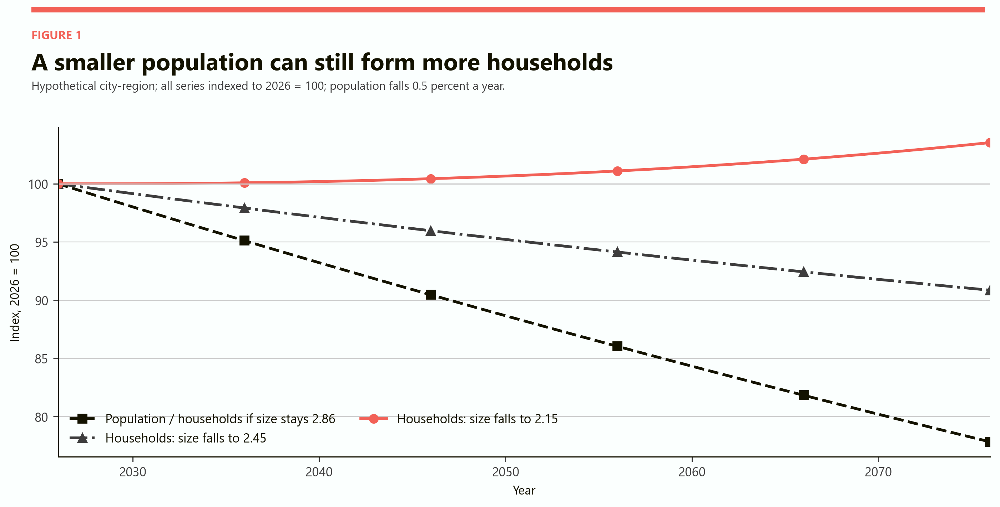
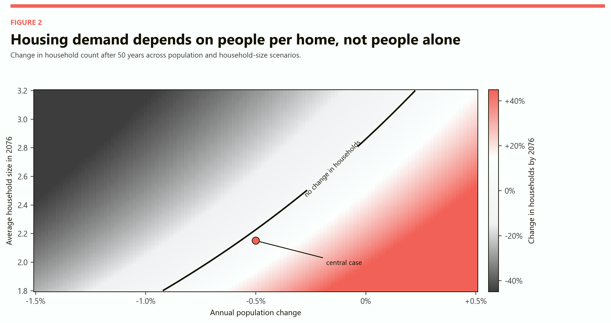
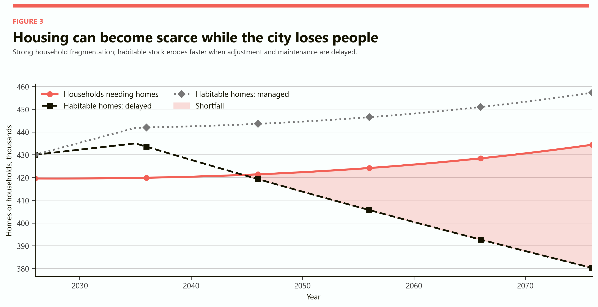
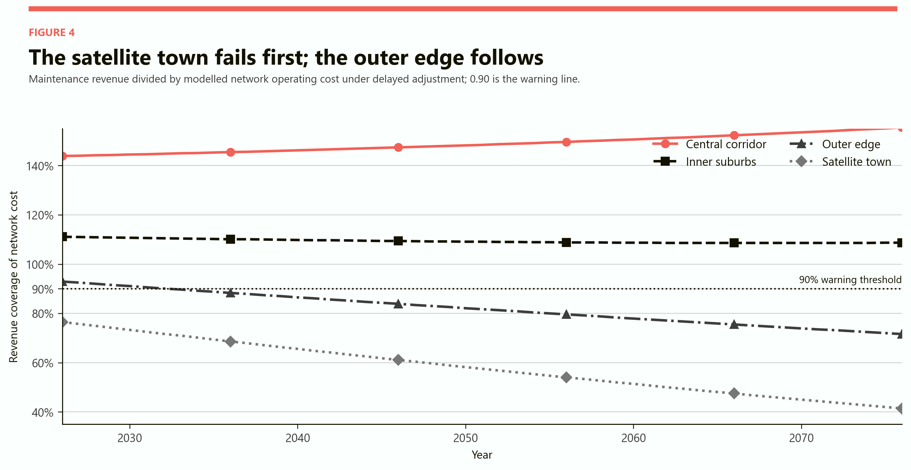
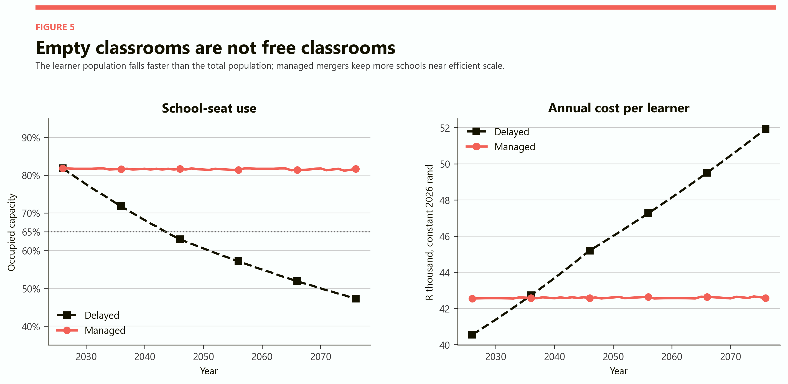
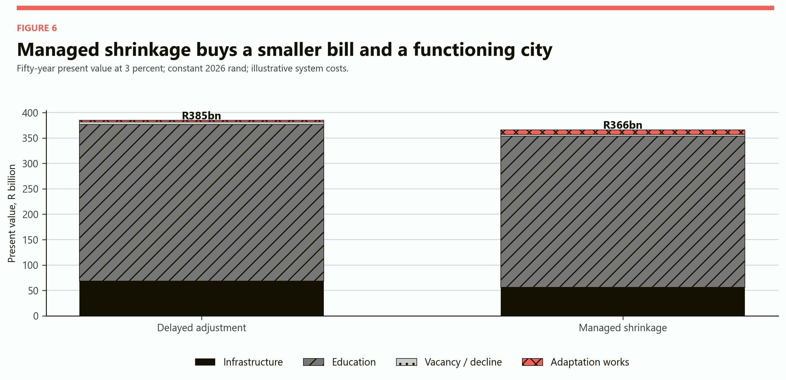

# How to Shrink a Country Without Breaking It
## Housing, schools and infrastructure after the age of population growth

# Part I: The finding

A country does not shrink evenly. It hollows out in particular places, age groups and institutions.

The central mistake is to treat population as if it were the same thing as demand. Housing is demanded by households, not by a headcount. Schools are demanded by children, not by households. Water networks must be maintained across kilometres, not merely in proportion to litres sold. Universities depend on the size and choices of a narrow age cohort. A city can therefore have too many houses in one place, too few habitable homes in another, empty classrooms, rising municipal tariffs and an ageing road network at the same time.

The model follows a hypothetical Gauteng city-region from 2026 to 2076. It begins with 1.2 million people, about 420,000 households and 430,000 habitable homes. In the central scenario, population falls by 0.5 percent a year while average household size falls from 2.86 to 2.15. By 2076 there are only 934,000 people, but 434,000 households. The population is 22.2 percent smaller; the number of households is 3.5 percent larger.

That one result changes the entire urban story. A government that sees only the population line expects housing demand to fall by nearly a quarter. A housing department that watches households sees demand edging upward. If the habitable stock deteriorates while construction and repairs are misallocated, the model produces a shortage of roughly 54,000 homes in 2076 even though the city has lost 266,000 people.

The regional result is harsher. A dense central corridor remains relatively financeable because many accounts sit on a short network. A satellite town begins below the model's 90 percent maintenance-coverage warning line. The outer edge follows in 2033. Under delayed adjustment their coverage ratios fall to 41 and 72 percent by 2076, while the centre remains above cost. Uniform municipal policy therefore transfers money from viable places to networks that no longer have enough users, until service quality and payment discipline deteriorate in both.

Managed shrinkage does not mean accepting decay. It means concentrating new housing and public services in connected places; merging institutions before quality collapses; buying, repurposing or retiring stranded assets; and guaranteeing people a dignified route out of areas that can no longer be served affordably. In the model, this approach keeps school-seat use near 82 percent rather than 47 percent, restores infrastructure coverage in the edge and satellite areas, and reduces the fifty-year present value of the modelled system bill from R384.8 billion to R366.2 billion.

The saving is not the whole argument. Managed shrinkage also leaves a city that still works.

> Population decline is not a housing policy, an infrastructure plan or a school-merger programme. A smaller country still has to decide where people will live together and which places it will continue to maintain.

# Part II: Shrinkage is a spatial problem

A national population can fall while its largest city still grows. A province can grow while a mining town contracts. A municipality can lose people overall while its central corridor gains households. Births, deaths, migration, household formation and the location of work operate on different maps.

This matters because most public assets are immovable. A water pipe in a declining suburb cannot be lifted and attached to a growing apartment district. A half-empty school cannot serve children fifty kilometres away without transport. A house that loses value in a satellite town cannot automatically finance an equivalent house near a job-rich centre. Shrinkage converts a quantity problem into a location problem.

The hypothetical region has four zones.

| Zone | People in 2026 | Households in 2026 | Urban form | Initial network-cost coverage |
|---|---:|---:|---|---:|
| Central corridor | 240,000 | 100,000 | Dense, connected, mixed use | 144% |
| Inner suburbs | 360,000 | 131,000 | Established services and moderate density | 111% |
| Outer edge | 420,000 | 140,000 | Long networks and car dependence | 93% |
| Satellite town | 180,000 | 50,000 | Small tax base and isolated fixed assets | 78% |

The table is deliberately stylised. It does not label real Gauteng neighbourhoods. The purpose is to identify the sequence of stress. Low density, weak collection, old assets and population loss reinforce each other. The first institution to fail is not necessarily in the place losing the most people. It is in the place where the remaining revenue cannot carry the fixed system.

The [OECD's 2025 work on shrinking regions](https://www.oecd.org/en/publications/shrinking-smartly-and-sustainably_f91693e3-en/full-report/a-policy-framework-and-policy-recommendations-to-address-demographic-change_9bb55cde.html) makes the same structural point: variable costs fall with population, but fixed operating costs per person rise, especially in low-density places. Its recommended direction is not universal abandonment. It is denser, connected settlement; service access; realistic projections; and infrastructure scaled to the population that is likely to remain.

# Part III: The household is the hidden denominator

Falling population reduces housing demand only if household size is stable. That assumption is increasingly unsafe.

A household can split without the people disappearing. A couple separates and requires two dwellings. An adult child leaves a multigenerational home. An older person remains alone after a spouse dies. Two young adults who would once have shared a flat rent separately. A relationship that never becomes cohabitation creates two kitchens, two electricity connections and two sets of furniture where one might otherwise have sufficed.

South African data already show why headcount and household count must be separated. [Census 2022 Provinces at a Glance](https://census.statssa.gov.za/assets/documents/2022/Provinces_at_a_Glance.pdf) reports that Gauteng households rose from about 3.91 million in 2011 to 5.32 million in 2022 while average household size fell from 3.1 to 2.8. That was a period of population growth, not contraction, but the arithmetic is instructive: the household count can move much faster than the population.

The [General Household Survey 2025](https://www.statssa.gov.za/publications/P0318/P03182025.pdf) reports that 26.6 percent of South African households contained one person. The comparable share reported for 2021 was 23.3 percent. These observations do not prove that average household size will keep falling, but they make household fragmentation a scenario that planners cannot ignore.

Registered marriage data point in the same direction without measuring the same thing. [Statistics South Africa recorded 102,373 marriages and unions in 2024](https://www.statssa.gov.za/?p=19344), 28.5 percent fewer than in 2015. Registration is not cohabitation, and a decline in marriage certificates is not a direct measure of relationship stability. It is evidence that older assumptions about the timing and prevalence of formal couple formation deserve scrutiny.

The economic link to the earlier cohabitation research is direct. Cohabitation produces a housing and infrastructure dividend because one dwelling supports two adults. Relationship fragmentation reverses that dividend. It can keep dwelling demand high while population, fertility and average incomes weaken.

# Part IV: The population-household crossover

The model's central population path declines steadily. It reaches 934,000 people in 2076. The housing implication depends entirely on how many people share each dwelling.

*Figure 1. The black line serves two roles: population and households move together when average household size remains fixed. The coral path shows the central fragmentation scenario. Indices make the paths comparable even though people and households have different units.*

If average household size remains at 2.86, households fall with population to about 327,000. If it falls moderately to 2.45, there are about 381,000 households. If it falls to 2.15, there are 434,000. The difference between the stable and fragmented cases is more than 107,000 dwellings by 2076.

Nothing in that difference requires a larger population. It can be produced by later partnering, more separation, longer widowhood, more independent living among older people and fewer multigenerational homes. Some of these changes improve autonomy and welfare. The model does not treat larger households as automatically better. It shows that private living arrangements have public capital consequences.

This also explains why a shrinking country can keep building. Developers respond to the number, location and purchasing power of households, not the demographic headline. Small central apartments may remain scarce while large peripheral homes become stranded. The relevant question is not "Do we need fewer houses?" It is "Which households need which homes, in which places, at what price?"

# Part V: The contraction map

There is no single population-decline rate at which housing demand begins to fall. The boundary moves with household size.

*Figure 2. Coral combinations create more households by 2076; grey combinations create fewer. The black curve is the crossover. The central case combines 0.5 percent annual population decline with average household size of 2.15.*

The map shows why population totals are a poor housing forecast on their own. A city losing 0.5 percent of its people each year can still add households if average household size falls far enough. Even a city with stable population can require substantially more dwellings when solo living and separation increase. Conversely, reconsolidation through multigenerational living can reduce dwelling demand faster than population decline.

Three policy errors follow from ignoring the map.

1. A government may stop approving housing because it expects depopulation to create surplus stock.
2. It may build in the wrong places because aggregate vacancy conceals scarcity near work and transport.
3. It may treat relationship and care arrangements as socially interesting but fiscally irrelevant.

The map is not a forecast of family behaviour. It is a planning screen. A municipality should rerun it with observed household formation, migration and vacancy data every year. The practical signal is not a national birth rate. It is the difference between local people, local households and usable local dwellings.

# Part VI: Housing shortages after the peak

Housing stock is durable, but usable housing is not permanent. Roofs fail, buildings burn, title disputes freeze transactions, neighbourhood services deteriorate and owners stop investing when expected resale values collapse. A vacant house in a weak market is not necessarily available to a household that needs a safe home near employment.

The model begins with 430,000 habitable homes. Under delayed adjustment, construction continues at 2,500 homes a year for the first decade because plans and finance still reflect the growth era. It then falls to 500 a year. At the same time, 0.45 percent of the habitable stock is lost each year through deterioration, conversion or withdrawal. By 2076 only 380,000 units remain usable.

*Figure 3. The shortfall is a modelled mismatch between household demand and habitable stock, not a prediction of literal homelessness. Informal building, overcrowding, conversion and migration would absorb part of the pressure.*

The central fragmented-household path requires 434,000 dwellings in 2076, leaving a modelled shortfall of about 54,000. Managed adjustment preserves the stock more effectively and directs a modest flow of replacement homes toward viable areas. It ends with roughly 457,000 habitable units, equivalent to about 5 percent vacancy.

The paradox is only apparent. Population fell, but household formation did not. Supply also deteriorated. The city can therefore have abundant structures and scarce habitable, well-located homes at the same time.

This is where vacancy statistics become dangerous. A 15 percent vacancy rate in a remote satellite town does not solve a shortage in the central corridor. Counting all roofs as interchangeable housing ignores commuting costs, crime, school access, municipal reliability and the difficulty of selling a weak asset to buy an expensive one elsewhere.

# Part VII: House prices split before they fall

The national phrase "house prices fall when population falls" hides regional divergence.

In the delayed model, the central corridor's 2076 price index is 161 and the inner suburbs reach 143, relative to 100 in 2026. The outer edge is roughly flat at 97. The satellite town falls to 35. These are not appraisal forecasts. They are a directional result generated by occupancy, service reliability and location.

| Zone | Delayed price index, 2076 | Managed price index, 2076 | Interpretation |
|---|---:|---:|---|
| Central corridor | 161 | 132 | Scarce connected housing remains valuable |
| Inner suburbs | 143 | 119 | Consolidated demand supports the market |
| Outer edge | 97 | 100 | Managed retirement prevents deeper decline |
| Satellite town | 35 | 81 | Delayed service failure destroys collateral value |

The centre can become more expensive because it attracts a larger share of a smaller population. The satellite town can become cheaper without becoming affordable in a useful sense. A R400,000 house is not an opportunity if the owner cannot find work, cannot sell later and must finance unreliable transport and services.

Falling peripheral prices also lock households in place. The sale proceeds may not fund a deposit in the centre. Banks become cautious when collateral is illiquid. Owners defer maintenance because renovation costs exceed the expected increase in value. The neighbourhood then enters a feedback loop: low demand lowers price, low price weakens maintenance, deterioration lowers demand again.

The [World Bank's review of shrinking cities](https://documents1.worldbank.org/curated/en/319131510892209158/pdf/AUS12288-REVISED-PUBLIC-ECABRIEFALLWEB.pdf) notes that durable housing can translate population loss into sharp price declines and that revenue effects depend on the local fiscal system. The important word is local. National averages arrive too late to identify which property markets have stopped functioning.

# Part VIII: The fixed-cost trap

Infrastructure does not shrink when a resident leaves. The pipe, road, substation and storm-water channel remain. Many costs are tied to the extent and age of the network rather than the number of users.

The model allocates each zone a fixed annual network cost and a smaller variable cost per resident. It then assigns maintenance revenue to households, adjusted for collection. Dense areas begin with more accounts per kilometre and stronger collection. The satellite town begins with fewer users, a small tax base and a long fixed network.

Once revenue falls below cost, a municipality has four immediate choices: raise tariffs, reduce maintenance, cross-subsidise from stronger zones or obtain an external transfer. None changes the physical ratio between users and infrastructure. Higher tariffs can increase arrears. Lower maintenance produces failures. Cross-subsidy weakens the centre. Transfers postpone rather than remove the mismatch unless they finance restructuring.

South African municipalities already face a maintenance problem before demographic contraction. [National Treasury's assessment of local government finances](https://mfma.treasury.gov.za/Publications%20and%20Media%20Releases/The%20state%20of%20local%20government%20finances/The%20state%20of%20local%20government%20finances%20and%20financial%20management%20as%20at%2030%20June%202023.pdf) reported average repairs and maintenance spending of about 3.5 percent of property, plant and equipment over three years, below an 8 percent norm. It warned that delayed maintenance raises future renewal costs and threatens revenue when unreliable service reduces willingness to pay.

Demographic shrinkage turns that existing backlog into a denominator crisis. Even a well-managed municipality cannot maintain every metre forever when the customer base disappears. A poorly managed one reaches the same decision through breakdown rather than planning.

# Part IX: The regional failure sequence

The model uses 90 percent revenue coverage as a warning line. It is not an accounting standard. It marks the point at which routine network costs can no longer be supported without persistent cross-subsidy, deferred work or transfers.

*Figure 4. Revenue coverage is maintenance revenue divided by the modelled operating cost of each zone's network. The figure shows delayed adjustment. It excludes the wider municipal budget, capital grants and debt.*

The satellite town is already below the line in 2026. The outer edge crosses in 2033. The inner suburbs and central corridor remain above it throughout the horizon, partly because smaller households produce more billing accounts per resident and partly because their networks are compact.

| Zone | First year below 90% | Delayed coverage in 2076 | Managed coverage in 2076 |
|---|---:|---:|---:|
| Central corridor | Not reached | 156% | 201% |
| Inner suburbs | Not reached | 109% | 155% |
| Outer edge | 2033 | 72% | 113% |
| Satellite town | 2026 | 41% | 107% |

Coverage above 100 percent should not be read as permission for unlimited tariffs. It means the stylised maintenance account has capacity. A real municipality might lower charges, cross-subsidise a service floor, pay down a backlog or invest in renewal. The result shows where capacity survives.

# Part X: When a suburb becomes uneconomic

A suburb is not economically unsustainable merely because its population falls. It becomes unsustainable when the cost of preserving safe access and basic services persistently exceeds what its residents and the broader city are willing and able to pay.

Five indicators should be watched together.

- The number of occupied and billed properties per kilometre of network.
- Collection after discounts, indigent support and arrears.
- The share of assets beyond their useful life.
- Travel time to schools, clinics, shops and employment.
- The cost of relocating or consolidating compared with the present value of continued service.

No single threshold decides abandonment. A small settlement can remain viable because it contains a mine, hospital, university, water source or cultural asset. A wealthy low-density suburb can pay its own high service cost. A poor neighbourhood may deserve subsidy because historic planning placed households far from opportunity. Fiscal arithmetic identifies the burden; justice determines who should bear it.

The least defensible strategy is accidental abandonment: keep collecting charges, stop maintaining assets, wait for private disinvestment and allow people with money to leave first. The remaining population becomes older and poorer, the revenue base deteriorates, and the eventual relocation cost rises.

The better test is explicit. If a credible package of tariffs, subsidy, densification and service redesign cannot keep coverage above a chosen floor, the municipality should offer voluntary relocation and property acquisition before the market collapses. The decision should apply to a service area, not to households selected by income or political influence.

# Part XI: Half-empty schools

Children decline faster than total population in an ageing society. That means education feels contraction early.

The model begins with 216,000 learners in 240 schools, each with capacity for 1,100. Initial seat use is about 82 percent. The learner population then falls by roughly 1.3 percent a year. If adjustment is delayed, only 24 schools close over fifty years. By 2076, 112,000 learners occupy 47 percent of the remaining capacity.

*Figure 5. Managed adjustment keeps roughly 900 learners per 1,100-seat school. Its cost includes a higher variable allowance for transport and transition. The model does not claim that 80 percent utilisation is optimal for every school.*

Fixed building, leadership, security and specialist costs are then spread across fewer children. Delayed cost per learner rises from about R40,600 to R51,900 in constant rand. Managed mergers reduce the school count to 125 by 2076 and keep seat use near 82 percent. Cost per learner remains near R42,600 even after including a larger transport and transition allowance.

This is not an argument for closing the smallest school first. Small rural and specialised schools can have high social value. Nor should children absorb very long journeys so that an accounting ratio improves. The model identifies the trade-off: preserving every building consumes money that could finance teachers, transport, meals, digital access and special-needs support for the remaining children.

South Africa's scale makes the issue material. [School Realities 2025](https://www.education.gov.za/Portals/0/Documents/Publications/2026/School%20Realities%20February%202025.pdf?ver=2026-03-09-150733-240) reports 13.60 million learners across 24,766 ordinary schools nationally. Gauteng had 2.68 million learners and 2,994 schools. Those figures describe a growing education system today, not the modelled future. They show the asset and staffing base that would need to adjust if cohort decline became sustained.

# Part XII: Universities after the youth peak

Universities are less geographically dense than schools, but their fixed costs are larger and their response can be more imaginative.

The model gives the city-region two campuses, 45,000 students and substantial fixed operating costs. Student numbers fall to about 30,000 by 2076. Keeping both campuses unchanged raises cost per student even if lecture halls, residences and laboratories are half used.

A university is not only a youth institution. A hundred-year life, multiple careers and technological change increase demand for education at 40, 60 and 80. A shrinking traditional cohort can therefore be offset partly by a broader adult market. The question is whether the institution changes its product before its finances force it to.

Useful conversions include:

- turning one wing into short-cycle vocational and professional retraining;
- sharing laboratories, libraries and procurement across institutions;
- converting surplus residences into older-student, health-worker or mixed housing;
- using underfilled campuses for public-service hubs, clinics and incubators;
- closing duplicate programmes while protecting rare national capabilities.

Delayed universities tend to preserve the map and cut quality inside it. Managed universities preserve capabilities and change the map. A campus can become smaller without the university becoming less important.

# Part XIII: Spending per remaining child

Population decline can raise educational spending per child even when the education budget falls. That can be either a dividend or a waste.

It is a dividend when fewer children receive smaller classes, better teaching, special-needs support and stronger early education. It is a waste when the extra spending merely heats empty buildings, duplicates administration and maintains unused transport depots.

The political danger is to call every increase in cost per learner an improvement. Under delayed adjustment, the model spends more per child while school-seat use collapses. The child does not automatically receive a better teacher or textbook. Fixed costs absorb the difference.

The correct target is not the smallest education budget. It is the greatest educational value subject to an access floor. That requires three measurements that are often separated: building utilisation, travel burden and learning outcomes. A merger that saves money but doubles absenteeism is false economy. A merger paired with reliable transport, a stronger school and more specialist staff can raise welfare.

The remaining child should receive a demographic dividend. Realising it requires converting empty capacity into educational quality rather than allowing buildings to consume it.

# Part XIV: Managed shrinkage versus delayed adjustment

Delayed adjustment looks cheaper in the first years because it avoids visible decisions. It does not buy properties, compensate movers, merge schools or decommission networks. Instead it pays through small annual inefficiencies, emergency repairs, falling collection and deteriorating collateral.

Managed shrinkage pays earlier. The model includes R13 billion of nominal real adaptation outlays at staged dates for acquisition, relocation, network retirement and institutional conversion. Because those outlays occur before 2050, their present-value cost is R9.2 billion. They reduce later infrastructure, education and vacancy costs.

*Figure 6. Education dominates both totals because the model counts the full cost of schools and universities, not only the excess cost caused by shrinkage. Small segments remain important even when they are visually thin.*

Across fifty years, delayed adjustment costs R384.8 billion in present value. Managed shrinkage costs R366.2 billion, a saving of R18.6 billion. The managed case spends more on early adaptation but about R12.4 billion less on infrastructure, R10.7 billion less on education and R1.4 billion less on vacancy and decline.

These numbers are sensitive to every engineering and service assumption. The robust conclusion is not the exact saving. It is the timing asymmetry. Delaying a closure is cheap today and expensive repeatedly. Closing or converting early is expensive today and saves repeatedly. A political system with annual budgets will systematically prefer the first unless long-term liabilities are made visible.

# Part XV: Deliberate abandonment without abandoning people

The phrase "infrastructure abandonment" sounds brutal because it often describes what happens to residents, not only to assets. A legitimate programme must reverse the order: protect people first, then retire infrastructure.

A managed exit from a service area needs at least six protections.

1. A public, evidence-based designation process with appeal rights.
2. Independent property valuation and compensation before prices collapse.
3. A genuine choice among relocation, serviced infill, rental support and protected continued occupation where feasible.
4. Moving costs, school continuity and support for elderly or disabled residents.
5. A clear date after which the municipality will no longer renew specific assets.
6. Land treatment after exit: demolition, environmental restoration, agriculture, storm-water storage, solar generation or another safe use.

Compulsory acquisition should be a last resort, subject to law and due process. Historical dispossession makes place-based withdrawal especially sensitive in South Africa. A fiscally efficient plan that reproduces forced removal is not socially sustainable.

There is also a moral hazard on the other side. If a municipality promises to maintain every new peripheral development forever, private developers can create future fixed costs and hand them to taxpayers. New projects in a potentially shrinking region should carry lifecycle infrastructure charges and a credible plan for who pays when occupancy falls.

# Part XVI: The optimal shrinking-city strategy

The optimal strategy is compact, networked and reversible.

First, stop expanding the liability. New housing should be concentrated near existing capacity, employment and public transport. Development charges should reflect the full network cost of peripheral projects. A shrinking city cannot afford to add kilometres while retiring kilometres elsewhere.

Second, publish a regional service map. Classify service areas as durable, transitional or exit candidates. Durable areas receive renewal. Transitional areas receive infill, conversion and time-limited support. Exit candidates receive voluntary acquisition and relocation offers before failures become the policy.

Third, treat housing stock as differentiated. Count habitable units, vacancy, title status, job access and service reliability. Do not offset a central shortage with remote vacancy on a spreadsheet.

Fourth, convert institutions before closing them. A half-empty school can become a combined school, clinic, library and community-service node. A university campus can serve adult learners, research, health training or housing. Conversion preserves social capital that demolition destroys.

Fifth, create a funded decommissioning reserve. Growth-era finance borrows to build; a shrinkage-era system also needs money to remove. National transfers should reward the permanent reduction of future operating liabilities, not only new construction.

Sixth, protect the household choices that drive demand. Government should not pressure people into marriages, cohabitation or multigenerational living to save infrastructure. It can make voluntary sharing easier through safe rental contracts, accessory units, adaptable housing and care support. The planning objective is to understand household formation, not to dictate it.

The [OECD's spatial-planning guidance](https://www.oecd.org/en/publications/shrinking-smartly-and-sustainably_f91693e3-en/full-report/adapting-spatial-planning-housing-and-infrastructure-to-demographic-change_a1100e75.html) describes the broad approach as compact and networked: maintain access by concentrating high-quality housing and services in connected settlements. Shrinkage succeeds when the geography of the public system changes before its quality collapses.

# Part XVII: Best, average and worst cases

The future depends on fertility, migration, partnering, productivity, municipal competence and the speed of adjustment. Three scenarios bound the central result.

| Scenario | Population path | Household path | Institutional response | Likely result |
|---|---|---|---|---|
| Best case | Falls 0.2% a year; 9.5% smaller by 2076 | Size falls to 2.45; households rise about 5.7% | Early infill, network retirement, adult education and strong migration into viable nodes | Housing demand stays firm, schools consolidate gradually and peripheral losses are contained |
| Average case | Falls 0.5% a year; 22.2% smaller | Size falls to 2.15; households rise 3.5% | Managed case in the model, with staged adaptation from 2031 | Roughly 5% housing reserve, school use near 82% and R18.6bn lower system cost |
| Worst case | Falls 1.1% a year; about 42.5% smaller | Size falls to 1.95; households fall about 15.7% | Government denies decline for twenty-five years; employment and collection also weaken | Vacant property, tariff spirals, abrupt closures and involuntary migration reinforce one another |

The best case is not the one with the largest population. It is the one in which the city adapts before balance sheets and trust are destroyed. A slightly smaller, connected city can deliver higher welfare than a larger, dispersed one.

The worst case also shows that household fragmentation has limits. Severe population decline eventually overwhelms falling household size. At that point the housing problem switches from aggregate demand to location and quality: a large overall surplus can coexist with acute shortages in the few viable districts.

Productivity matters as much as demography. If income and tax capacity per worker rise, a smaller workforce can support more infrastructure. If productivity stagnates while the population ages, every coverage threshold arrives sooner. The model holds real revenue per household broadly fixed so that the spatial effect remains visible.

# Part XVIII: The policy answer

A country should begin planning for shrinkage before the national population peaks. The lead time for a water network, school estate or mortgage market is measured in decades.

The policy programme is therefore an early-warning system followed by a sequence.

## 1. Measure households, not only people

Publish local household projections alongside population projections. Include single-person households, relationship formation, separation, ageing, migration and informal occupancy. Update them annually where administrative data allow.

## 2. Price the full network

Report operating and renewal cost per occupied property and per kilometre for each service area. Record where tariffs, transfers or deferred maintenance cover the gap.

## 3. Protect viable nodes

Direct new housing, schools, clinics and transport toward places that can carry a long-term service base. Prevent peripheral construction from creating new stranded liabilities.

## 4. Fund transition

Create national and provincial grants for acquisition, relocation, demolition, land restoration and institutional conversion. Conventional capital budgets reward building; shrinkage requires money to stop operating the wrong assets.

## 5. Guarantee access

Set maximum travel times and minimum service standards. Consolidation should change the location of provision without abandoning people who cannot move.

## 6. Share the demographic dividend

Use savings from empty capacity to improve the quality of education, care and public space for the population that remains. Otherwise shrinkage will be experienced only as loss.

## 7. Make decisions reversible where possible

Lease, mothball, subdivide or convert before demolishing high-quality assets whose future use is uncertain. Reserve permanent retirement for networks and buildings whose lifetime cost clearly exceeds plausible value.

# Part XIX: Model assumptions and reading guide

This armchair model isolates mechanisms; it does not forecast Gauteng, value property or identify a real closure candidate. Gauteng is not presented as a shrinking province. [Statistics South Africa's 2025 population release](https://www.statssa.gov.za/?PPN=P0302&SCH=74263&page_id=1854) provides the official projection context.

The hypothetical region starts in 2026 with 1.2 million people, average household size of 2.86, about 419,580 households and 430,000 habitable homes. The horizon is 2076. The central population path falls 0.5 percent a year while household size falls to 2.15; alternative sizes end at 2.45, 2.86 and 3.00.

Delayed housing policy builds 2,500 units annually through 2035 and 500 thereafter while losing 0.45 percent of habitable stock each year. Managed policy targets demand and limits stock loss to 0.25 percent. Informal supply, conversions, affordability and endogenous migration are omitted.

Four stylised zones lose population at different rates. Managed shrinkage moves a larger share of remaining residents toward connected areas. Infrastructure cost combines a fixed zone amount with R700 per resident; R6,200 per household is available before collection adjustments. The 90 percent line is a declared warning threshold, not an official norm.

The price index responds to occupancy, service coverage and location. It excludes income, interest rates, credit, construction cost and macroeconomic cycles. It is a comparative pressure index, not an appraisal.

Education starts with 216,000 learners, 240 schools and 1,100 seats per school. Learners fall 1.3 percent annually. Managed adjustment targets about 900 learners per school and includes extra transport and transition cost. The university case starts with two campuses and 45,000 students.

Strategy costs are discounted at 3 percent and include full infrastructure and education costs, vacancy, emergency work and adaptation. Managed adaptation includes R13 billion of staged real outlays before discounting. Taxes, financing, land receipts, emissions, moving costs and location welfare are excluded. All money is constant 2026 rand; scenarios are bounds, not probabilities.

## Sources used

- [Statistics South Africa, Census 2022 Provinces at a Glance](https://census.statssa.gov.za/assets/documents/2022/Provinces_at_a_Glance.pdf)
- [Statistics South Africa, General Household Survey 2025](https://www.statssa.gov.za/publications/P0318/P03182025.pdf)
- [Statistics South Africa, Marriages and Divorces 2024](https://www.statssa.gov.za/publications/P0307/P03072024.pdf)
- [Statistics South Africa, Mid-year Population Estimates 2025](https://www.statssa.gov.za/?PPN=P0302&SCH=74263&page_id=1854)
- [Department of Basic Education, School Realities 2025](https://www.education.gov.za/Portals/0/Documents/Publications/2026/School%20Realities%20February%202025.pdf?ver=2026-03-09-150733-240)
- [National Treasury, State of Local Government Finances and Financial Management](https://mfma.treasury.gov.za/Publications%20and%20Media%20Releases/The%20state%20of%20local%20government%20finances/The%20state%20of%20local%20government%20finances%20and%20financial%20management%20as%20at%2030%20June%202023.pdf)
- [OECD, Shrinking Smartly and Sustainably](https://www.oecd.org/en/publications/shrinking-smartly-and-sustainably_f91693e3-en.html)
- [World Bank, Cities in Europe and Central Asia](https://documents1.worldbank.org/curated/en/319131510892209158/pdf/AUS12288-REVISED-PUBLIC-ECABRIEFALLWEB.pdf)
