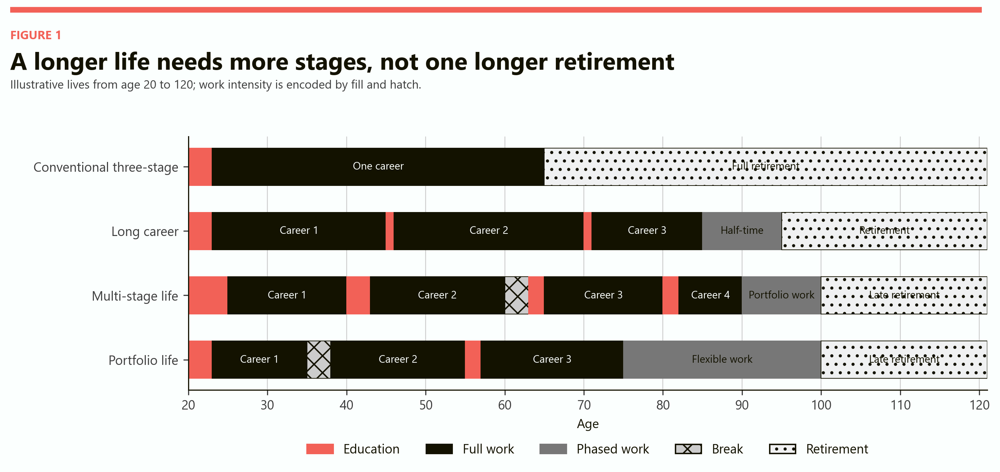
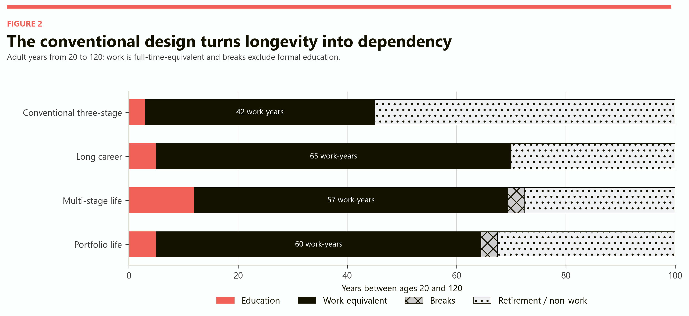
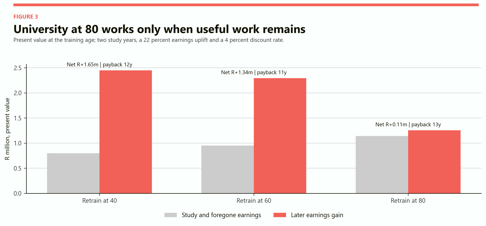
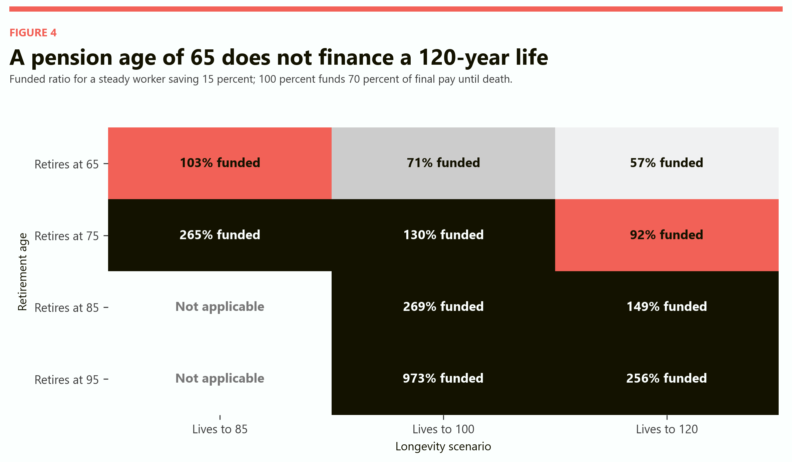
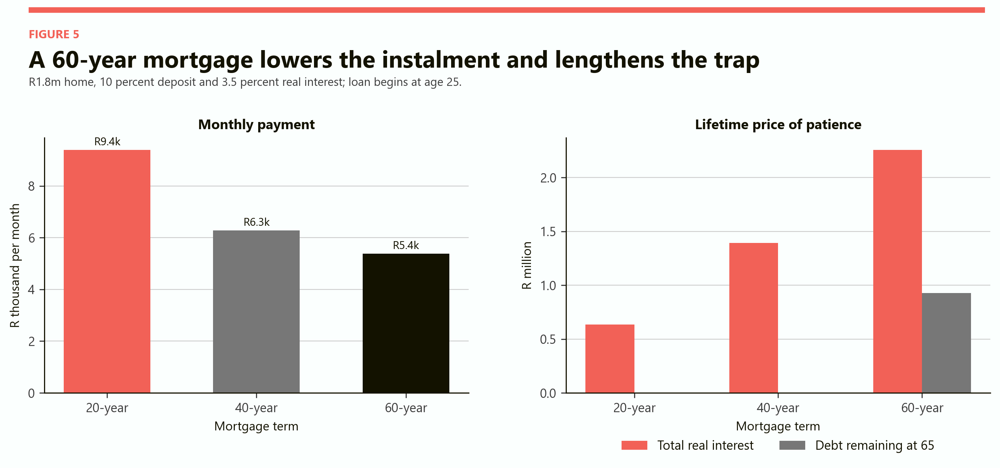
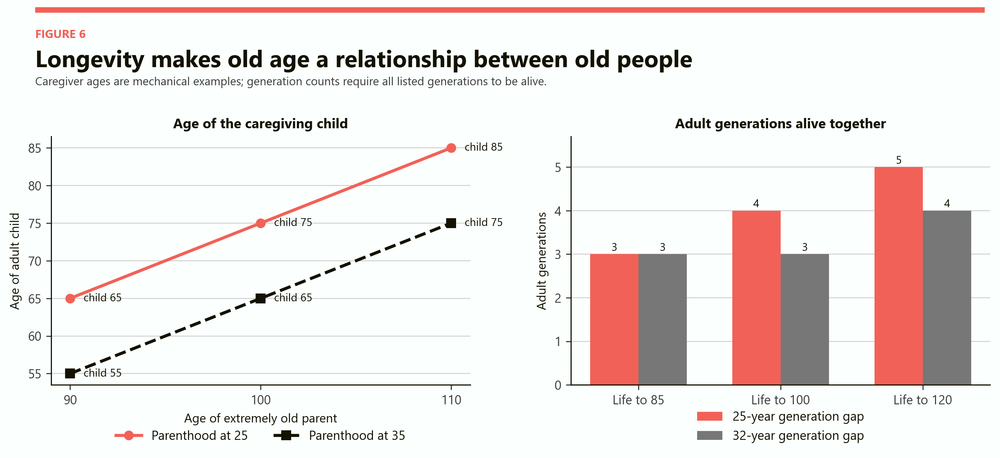

# The Hundred-Year Life
## How institutions change when adulthood lasts a century

# Part I: The finding

If people routinely live to 100 or 120, the central problem is not simply that retirement becomes longer. The deeper problem is that nearly every major institution still expects a short, linear adult life.

Education is concentrated at the beginning. Mortgages are designed to end around retirement. Careers reward uninterrupted tenure and punish long breaks. Marriage law assumes that a single partnership can carry decades of asymmetric care. Pensions convert roughly forty years of saving into an income for twenty or thirty years. Families expect middle-aged children to care for old parents. A 120-year life stretches every one of those arrangements until it either bends or breaks.

The model in this report compares four possible lives from age 20 to 120. All begin with the same R30,000 monthly salary when work starts. Earnings grow by 1.2 percent a year above inflation. Pension contributions equal 15 percent of pay and earn 4 percent a year above inflation. Public and private values are measured in constant 2026 rand.

The conventional life is the least robust. It has three years of university, 42 years of full work and retirement at 65. If the person lives to 120, retirement lasts 55 years - thirteen years longer than the entire career. Even with uninterrupted employment, the modelled pension fund can finance only 57 percent of the target income.

Three alternative designs perform better, but for different reasons.

| Life design | Work-equivalent years | Education years | Break years | Full retirement years | Lifetime earnings, present value | Net fiscal contribution |
|---|---:|---:|---:|---:|---:|---:|
| Conventional three-stage | 42.0 | 3 | 0 | 55 | R8.99m | R0.80m |
| Long career | 65.0 | 5 | 0 | 25 | R12.71m | R1.99m |
| Multi-stage life | 57.4 | 12 | 3 | 20 | R11.18m | R1.36m |
| Portfolio life | 59.5 | 5 | 3 | 20 | R10.84m | R1.52m |

The long-career design produces the strongest narrow financial result because it maximises paid work. It is not automatically the best life. It assumes that health, demand for older workers and working conditions permit a seventy-year career. The multi-stage design gives up some earnings for university at 40, 60 and 80, plus a care break. The portfolio design uses fewer formal education years and more part-time work after 75. It trades some measured output for flexibility.

The practical answer is therefore not to add thirty years to the end of retirement. It is to distribute education, work, care, leisure and saving across a much longer adulthood.

> A hundred-year life needs more than a higher pension balance. It needs a new sequence: recurring education, several careers, portable housing and benefits, protected breaks, occupation-sensitive retirement and a legal framework for families that may contain five adult generations.

# Part II: A thought experiment, not a forecast

South Africans do not currently live to 100 or 120 on average. [Statistics South Africa's 2026 population estimate](https://www.statssa.gov.za/?PPN=P0302&SCH=74592&page_id=1856) places life expectancy at birth at 65.5 years for men, 71.0 for women and 68.3 overall. The population aged 60 or older is estimated at 6.79 million, or 10.7 percent of the country. The same release estimates a total population of 63.52 million.

The hundred-year life is therefore a scenario: what would have to change if radical longevity arrived? It is not a projection that the average South African will soon live to 120. The [United Nations' World Population Prospects 2024](https://population.un.org/wpp/) expects populations to age substantially, but its central demographic work does not make routine 120-year lives a baseline assumption.

That distinction matters. Longevity can rise in at least three different ways.

First, fewer people can die young while old-age health changes little. That raises average life expectancy without producing a huge population of healthy 90-year-old workers. Second, medical progress can postpone both death and disability. This extends healthspan as well as lifespan and makes longer careers more feasible. Third, medicine can postpone death more than illness. This creates a long period of dependency and care rather than a long productive adulthood.

The model mainly explores the second case: a substantial extension of healthy adult life. It then stress-tests the institutions around it. Where healthspan does not rise with lifespan, the financial results deteriorate and the care burden rises.

South Africa enters even this hypothetical future with unequal starting positions. A white-collar worker with stable employment, occupational retirement benefits, safe housing and flexible work can convert longer life into more choice. A manual worker with chronic illness, insecure employment and no pension cannot simply be told to work to 85. Longer life magnifies both compounding and deprivation.

This is why a universal retirement age is too blunt for the scenario. The relevant question is not only how old a person is. It is whether the person can continue in the occupation, can retrain into a less demanding one, can find an employer willing to hire them, and can combine work with caring for very old relatives.

# Part III: Four designs for one long adulthood

The conventional model treats adult life as three blocks: learn, earn, rest. Its strength is administrative simplicity. Schools know when education happens, employers know when full-time availability begins, lenders know when earnings should peak, and pension funds know when work should end. Its weakness is that every block becomes implausibly long when life stretches to 120.

The long-career design preserves a recognisable career structure but adds retraining at 45 and 70. Full-time work continues to 84, half-time work to 94 and retirement begins at 95. It asks the fewest institutional questions and the most biological ones. Can a large share of people actually perform valued work for that long?

The multi-stage design treats education and work as recurring states. University at 40 is not remedial; it launches a second career. Education in the early 60s follows a three-year care or reset break. Another two-year programme at 80 prepares the person for a shorter fourth career. Work then tapers into a portfolio rather than stopping at a single age.

The portfolio design is lighter. It includes one early university period, a three-year family or travel break, retraining in the mid-50s and flexible work from 75 to 99. It is the most plausible design for people whose skills can be sold in smaller units: advice, teaching, governance, craft, care, design, mediation or specialised technical work.

*Figure 1. Four complete adult lives on the same age scale. The conventional design concentrates education at the beginning and leisure at the end. The alternatives redistribute education, breaks and reduced work across adulthood.*

The comparison reveals the real policy choice. Society can finance an extremely long retirement, compel very old people to remain in full-time work, or create credible intermediate states. The third option requires more institutional change but produces more freedom.

It also changes how success is measured. A pause at 60 is not necessarily early retirement. It may be a care period followed by another career. University at 80 is not automatically consumption. If it produces another decade of useful work, it is partly investment. Part-time work at 90 is not necessarily failure to retire. It may be a preferred mix of income, identity and leisure.

# Part IV: The lifetime time budget

A longer life does not create free time in equal quality. Years can be healthy or disabled, secure or precarious, independent or devoted to care. Still, a simple allocation reveals the scale of the redesign.

In the model, the conventional person works for 42 full-time-equivalent years and then spends 55 years in retirement. The long-career person supplies 65 full-time-equivalent years and retires for 25. The multi-stage person supplies 57.4 years, spends twelve years in education, takes a three-year break and retires for twenty. The portfolio person supplies 59.5 years, with twenty-five years of half-time work folded into that total.

*Figure 2. Adult years from age 20 to 120. Work-equivalent years count half-time work as half a year. Residual time includes full retirement and any unallocated non-work periods.*

The alternative designs do not abolish leisure. They move some of it earlier, when it may be more valuable. A 35-year-old can travel, care for a small child or recover from burnout with capacities that may not exist at 105. The person then repays part of that time by working later, provided health and labour demand permit it.

This creates a new bargain between the individual and the state. Government would stop treating every break as a departure from the labour force and every old-age job as an anomaly. In return, people with long healthy lives would not expect the public or their earlier savings to finance five uninterrupted decades of retirement.

The bargain must remain conditional. A worker cannot promise health seventy years in advance. Long-life systems need disability insurance, occupation-specific exits and a minimum pension floor. Flexibility without protection can become a euphemism for making exhausted people work until death.

# Part V: University at 40, 60 or 80

In a seventy-year career, a qualification earned at 20 cannot be expected to remain sufficient until 90. The technology may change, the occupation may disappear, the body may no longer tolerate the work, or the individual may simply need a new field to sustain motivation.

[The International Labour Organization's 2026 report on lifelong learning](https://www.ilo.org/publications/flagship-reports/lifelong-learning-and-skills-future) argues that adult participation remains low and unequal, especially among informal and lower-qualified workers. That is a warning for a long-life society: the people most exposed to occupational disruption are often least able to finance a break for education.

The model gives each retraining episode direct tuition and foregone earnings. It then gives the graduate an illustrative 22 percent earnings uplift, discounts the later gain at 4 percent and extends work to 95. Under those assumptions, retraining at 40 has a present cost of R0.80 million and creates R2.45 million in benefits, for a net value of R1.65 million. Training at 60 still creates R1.34 million in net value. Training at 80 barely clears the test: R1.14 million of cost against R1.25 million of benefit.

*Figure 3. Present values in constant 2026 rand. All three cases assume work continues to 95 and that the qualification raises earnings. The positive result at 80 is small enough to disappear under modestly worse health, employment or wage outcomes.*

The figure should not be read as a promise that any degree at 80 pays. It says that education late in life can be an investment if three conditions hold: it is short enough, closely linked to real work, and followed by enough healthy employment to recover the cost.

That favours a different university model.

- Credentials would be modular and stackable rather than concentrated in one long degree.
- Prior learning and work experience would shorten programmes.
- Funding would follow people through life, perhaps through individual learning accounts, instead of being consumed almost entirely in the early 20s.
- Part-time and hybrid study would allow continued earnings and care.
- Employers would publish age-neutral routes into the work that the training is supposed to unlock.
- Public subsidies would be larger for training that enables a physically worn worker to move into sustainable work.

The hardest case is not the professional returning for an intellectually interesting course. It is the 58-year-old whose occupation has damaged their body and whose household cannot survive two years without income. A credible long-life education system has to insure that transition.

# Part VI: A seventy-year career cannot be one job

A career lasting from the early 20s to the early 90s will outlive products, firms, technologies and often occupations. The word career would have to change from a climb within one hierarchy to a sequence of productive identities.

The model's long-career person has three full careers and a final half-time phase. That design is deliberately neat. Real lives would include redundancy, unemployment, care, entrepreneurship, illness and periods of underemployment. The institutional requirement is not continuous employment by one firm. It is continuous employability across many transitions.

Older and younger workers would also meet in the labour market for much longer. This does not imply that every 85-year-old displaces a 25-year-old. Labour demand is not a fixed number of chairs. Older workers earn, spend, supervise, start firms and provide services that create other work. But substitution can be real inside a particular occupation, public payroll or promotion ladder. A long-life society must make entry routes for young people while retaining useful older workers.

The most promising structure is differentiated work rather than ageless full-time sameness.

- Physically demanding jobs receive earlier exits, shorter weeks or transitions into instruction and quality control.
- Knowledge-intensive jobs use phased hours, project contracts and mentoring without turning every senior worker into a manager.
- Pension and tax rules permit partial drawing alongside partial work.
- Benefits attach to the worker, not a single employer.
- Recruitment and training are tested for age discrimination at 50, 70 and 90.
- Employment services build a genuine later-life market instead of treating old-age work as an exceptional accommodation.

An [ILO brief on extending productive working life](https://researchrepository.ilo.org/esploro/outputs/encyclopediaEntry/Extending-the-productive-working-life-of/995659889102676) emphasises lifelong learning, safe and healthy workplaces, social protection and fair labour-market participation. In the hundred-year scenario these stop being supplementary policies. They become the infrastructure of the working life.

# Part VII: Retirement does not disappear - the cliff does

The conventional pension problem can be stated without equations. Saving 15 percent of pay from age 23 to 64 creates a large fund. It is enough in the model to replace 70 percent of final earnings for a retirement from 65 to 85. It is not enough when the same fund must last to 100 or 120.

At life to 100, retirement at 65 is 71 percent funded. At life to 120 it is only 57 percent funded. Moving retirement to 75 raises the latter result to 92 percent. Moving it to 85 produces a large surplus in the deterministic model. Retirement at 95 produces an extreme surplus because decades of additional contributions finance only a short remaining draw.

*Figure 4. Funded ratio for a 70 percent replacement target. One hundred percent marks full funding under the assumptions. Very high values at retirement 95 are a mechanical result of long saving and a short retirement, not a policy target.*

This does not mean that 85 is the correct retirement age. A deterministic death age hides the most important pension risk: nobody knows whether an individual will live to 85 or 120. The model also assumes uninterrupted contributions, one investment return and no fees. Actual people face unemployment, divorce, disability, poor returns and care withdrawals.

The useful conclusion is structural. A single statutory age is asked to do too much. It defines access to a grant, occupational exit, tax treatment, pension preservation and a social identity. Those functions can be separated.

A long-life retirement system would have four layers.

1. A poverty floor begins at a socially chosen age and protects people with inadequate lifetime income.
2. Disability and strenuous-occupation benefits permit earlier exit based on capacity rather than birthday alone.
3. Flexible pension accounts allow partial income while hours decline over one or two decades.
4. Longevity insurance protects against living far beyond the age for which ordinary savings were planned.

South Africa already uses age 60 for the older person's grant. [National Treasury's 2026 Estimates of National Expenditure](https://www.treasury.gov.za/documents/national%20budget/2026/ene/FullENE.pdf) projects about 4.4 million older beneficiaries and R121.8 billion of old-age grant spending in 2026/27. The [2026 Budget Speech](https://www.treasury.gov.za/documents/national%20budget/2026/speech/speech.pdf) sets the grant at R2,400 a month. A routine 120-year life would force government to reconsider whether a benefit beginning at 60 can remain an age-only entitlement for six decades.

The humane answer is not to abandon 60-year-olds. It is to distinguish poverty, disability and occupational exhaustion from healthy longevity. People unable to work require protection. People able and willing to continue should be able to combine work and retirement income without punitive rules.

# Part VIII: Fifty- and sixty-year mortgages

Longer life creates an apparent argument for longer debt. If a buyer can work to 90, why insist that a home loan end after twenty years?

The monthly arithmetic is seductive. On a R1.8 million home with a 10 percent deposit and a constant 3.5 percent real interest rate, a twenty-year term costs R9,395 a month. Forty years lowers the payment to R6,276. Sixty years lowers it again to R5,387. Compared with twenty years, the sixty-year payment is 43 percent lower.

The total cost moves in the opposite direction. Real interest rises from R0.63 million over twenty years to R1.39 million over forty and R2.26 million over sixty. The borrower who starts at 25 still owes R0.93 million at 65 on the sixty-year loan.

*Figure 5. Extending the term improves monthly affordability but greatly increases total real interest. The sixty-year borrower reaches today's retirement age with a substantial balance.*

Current mainstream South African products illustrate how far this scenario sits from ordinary practice. [FNB's home-loan calculator](https://www.fnb.co.za/Controller?nav=calculators.homeloan.MonthlyRepayment) presents terms up to 240 months. [Absa discusses extensions up to 360 months](https://www.absa.co.za/personal/loans/for-a-home/trouble-with-repayments/) for qualifying customers in repayment difficulty. [Standard Bank's pension-backed housing loan](https://www.standardbank.co.za/southafrica/personal/learn/what-are-pension-backed-housing-loans) has a maximum term of thirty years.

The correct long-life innovation is not necessarily a sixty-year version of today's fixed household. Over six decades the borrower may marry, divorce, migrate, retrain, stop work, support parents, form another family and change careers several times. A loan that assumes one property, one couple and one income path becomes fragile.

More suitable instruments would include portable mortgage balances, easier subdivision and co-ownership, shared-equity structures, automatic refinancing at life transitions, and the ability to change payment intensity during planned education or care breaks. Consumer protection would have to show total lifetime interest as prominently as the first monthly payment.

Long debt also interacts with public pensions. A smaller instalment can help a household enter ownership earlier, but carrying debt into partial retirement raises the income needed at older ages. Lenders may transfer longevity risk to the state if an old borrower exhausts both income and housing equity.

The present South African balance sheet is already sensitive to debt. The [South African Reserve Bank's June 2026 Quarterly Bulletin](https://resbank.co.za/en/home/publications/publication-detail-pages/quarterly-bulletins/quarterly-bulletin-publications/2026/june) reports household debt at 62.2 percent of disposable income in the first quarter of 2026 and a debt-service cost ratio of 8.4 percent. Longer amortisation is therefore a distribution mechanism for risk, not a free affordability programme.

# Part IX: Middle age becomes a moving target

Today, middle age is partly biological and partly narrative. It marks a stage after early adult formation but before old-age dependency. If adult life routinely lasts a century, calling 45 the midpoint becomes descriptively odd.

A simple chronological midpoint between 20 and 120 is 70. That does not mean every 70-year-old becomes the new 45-year-old. Health does not move automatically with the calendar, and social disadvantage accumulates. A more useful idea is plural middle ages.

The first middle age may occur around 40, when the person has enough experience to reconsider an initial career. The second may occur around 65, when family care and work are reorganised. A third may arrive around 85, when the person chooses between another project-based career and a much slower working life.

Institutions would need to stop treating chronological age as a reliable summary of capacity. Health screening, functional ability, occupation and care obligations become more informative. The same age may describe a surgeon still practising, a miner with severe physical damage, a grandparent raising children and a student beginning a fourth field.

This creates cultural opportunities as well as administrative problems. People need not rush every irreversible choice into the decade between 25 and 35. They can form households later, return to study, enter public life after several careers or begin a business at 75. But delay is not costless. Fertility has biological timing, compound interest rewards early saving, and social networks cannot always be postponed. A long horizon creates options; it does not erase sequence.

# Part X: Marriage for eighty years

A person who marries at 35 and lives to 115 could remain married for eighty years. This is almost twice the entire adult horizon assumed by many current pension, housing and family decisions.

South Africans already marry relatively late in registered civil marriages. [Stats SA's 2024 marriages and divorces release](https://www.statssa.gov.za/?PPN=P0307&SCH=73981&page_id=1856) gives median marriage ages of 39 for bridegrooms and 35 for brides. Among people who had never married before, the medians were 36 and 33. In the same year, 24,202 divorces were recorded; the median divorce ages were 46 for men and 42 for women, and 41.7 percent of divorces involved marriages shorter than ten years.

Those records do not cover every cohabiting relationship and cannot tell us how present relationships would behave over eighty years. They do make one point clear: household structures already change substantially within much shorter lives.

The model applies a purely illustrative separation hazard: 2 percent a year for the first decade and 1.2 percent thereafter. Under that mechanical pattern, about 72 percent of marriages survive twenty years, 57 percent survive forty, 45 percent survive sixty and 35 percent survive eighty. These are not forecasts. They show how even a modest annual hazard compounds across an extraordinary duration.

The hundred-year marriage therefore needs periodic renewal of its practical contract even if the emotional relationship continues.

- Pension saving should recognise care periods and protect the lower earner.
- Couples should revisit property, debt and inheritance arrangements after major career and care transitions.
- Housing should be divisible or transferable if an eighty-year relationship ends.
- Separation law should account for benefits accumulated over several distinct careers, not only one final salary.
- Individual access to banking, credit, learning and retirement assets should remain intact throughout the relationship.
- Relationship counselling and mediation may need to be understood as ordinary maintenance, not evidence of failure.

The alternative is dangerous. If people must remain together to preserve housing, healthcare or retirement security, longevity can turn economic dependence into a life sentence.

# Part XI: Divorce at 60 is not late life

In a conventional life, divorce at 60 is often treated as a late-life financial emergency. Retirement assets are near crystallisation, mortgage decisions are settled and rebuilding earnings is difficult. In a life to 100, the person still has forty years. In a life to 120, another sixty years remain - longer than a current full career.

This changes both the loss and the recovery path.

The loss can be larger because more joint assets, care obligations and family layers have accumulated. One partner may have supported the other's first three careers while losing their own compound growth. Adult children may still depend on the household, while 90-year-old parents require care.

The recovery can also be more meaningful. A 60-year-old may retrain, work for another thirty years, form another household, buy a different home and accumulate a new pension. Law, credit scoring and recruitment would have to stop treating that person as economically finished.

Retirement splitting rules designed for an immediate exit from work would need to accommodate several later careers. Maintenance rules would confront a longer horizon and more uncertainty. The fair settlement may include a share of accumulated assets, care credits and time-limited transition support rather than an assumption that one former partner will permanently finance the other for six decades.

The possibility of long recovery strengthens the case for individual social rights. Healthcare access, disability coverage, training entitlements and a basic pension should not disappear when a relationship does.

# Part XII: Five adult generations

If generations are separated by 25 years and people live to 120, five adult generations can be alive at the same time. At a 32-year gap, four can coexist. This transforms the family from a three-level ladder into a long column.

*Figure 6. Number of adult generations that can overlap under fixed generation gaps. A 120-year life permits five at a 25-year gap and four at a 32-year gap.*

The care relationship becomes especially strange. A person aged 85 may have a 110-year-old parent. The child is elderly under today's categories but may still be the principal carer. At the other end of the family, that same 85-year-old may have adult grandchildren or great-grandchildren facing education and housing costs.

Inheritance also arrives later. If assets pass only at death, a child may inherit in their 70s or 80s, long after the expensive stages of household formation. Families may respond with earlier gifts, shared ownership or generation-skipping transfers. Tax systems would have to decide whether that improves opportunity or entrenches dynastic wealth.

Care cannot remain an invisible private transfer, mostly performed by women, across such a long chain. A durable system would combine professional long-term care, home support, respite, care leave, pension credits and assistive technology. Otherwise a person can spend their 50s caring for children, their 70s caring for parents and their 90s caring for a spouse.

The model does not price the full care economy. That omission makes the alternative lives look easier than they would be. It also understates the value of the multi-stage design's formal care break. Time spent caring is productive in a human sense even when it is not counted as salary or tax.

# Part XIII: What must change first

The hundred-year life does not require every institution to be rebuilt at once. It does require an order of operations.

## 1. Make benefits portable

Pensions, health cover, disability protection, training balances and leave should follow people across employers, self-employment and care periods. Portability is the foundation because multiple careers are impossible when every transition destroys protection.

## 2. Finance recurring education

Public support should buy several smaller learning episodes rather than one early entitlement. The subsidy should be linked to employability and access, not age alone. Late-life training needs income replacement because tuition is only part of the cost.

## 3. Replace the retirement cliff

Create partial pensions, occupation-sensitive exits and longevity insurance. Preserve a poverty floor. Do not solve the fiscal problem by forcing people with short healthspans to imitate the healthiest professionals.

## 4. Redesign work around capacity

Employers need routes from strenuous to sustainable work, predictable phased hours and age-neutral recruitment. Productivity should determine whether work continues; age should determine neither automatic exclusion nor automatic entitlement to a job.

## 5. Make housing adaptable

Long mortgages require transparent lifetime costs and flexible repayment, but housing itself must change too. Smaller units, subdivisions, shared-equity arrangements and accessible design allow one asset to serve several household forms.

## 6. Protect individuals inside long relationships

Care credits, pension sharing, separate financial access and periodic disclosure reduce the danger created by economic dependence. Family law must be able to unwind several careers and decades of unpaid care.

## 7. Build long-term care before the family column lengthens

Four or five adult generations cannot be supported by one unpaid daughter in the middle. Professional care capacity and caregiver insurance must grow with longevity.

# Part XIV: The best, average and worst versions

The same 120-year lifespan can produce very different economies. Longevity itself is not the outcome; health, employment and institutions determine what the extra years mean.

| Scenario | Healthspan | Labour market | Education | Family and care | Likely result |
|---|---|---|---|---|---|
| Best case | Disability is postponed almost with death | Older workers can change occupation and reduce hours | Modular retraining works at 40, 60 and sometimes 80 | Formal care and individual protections absorb family change | Longer life creates more careers, more choice and a manageable retirement |
| Average case | Healthy life rises, but less than lifespan | Employment is uneven; knowledge workers continue longer than manual workers | Mid-life training works, very late training is selective | Families supply substantial care with some public support | Retirement shifts later and becomes phased; inequality becomes the central policy problem |
| Worst case | Death is delayed more than disability | Employers avoid older workers and youth entry remains weak | Training is expensive and does not unlock jobs | Several dependent generations rely on unpaid household care | Long life becomes long dependency, pension deficits and intergenerational conflict |

The model's numeric results sit closer to the best or upper-average case. It assumes continuous demand for labour, 1.2 percent real wage growth and 4 percent real pension returns. It gives retraining a wage payoff and allows work to 95. It does not simulate dementia, repeated unemployment, catastrophic illness, fees, housing maintenance or long-term care costs.

The worst case can therefore be much worse than the pension map suggests. If healthy work ends at 65 but life extends to 120, the person has not gained 55 years of retirement in any meaningful sense. They have gained a long period that somebody must finance and, in many cases, somebody must care for.

The best case is also richer than the earnings table. Extra healthy decades create unpaid care, art, civic work, entrepreneurship, friendship and knowledge that the fiscal account does not count. A system designed only to maximise work-equivalent years would miss much of the reason longevity is valuable.

# Part XV: The policy answer

The conventional three-stage life should not be stretched. It should be replaced by a multi-stage default with individual variation.

The preferred default is close to the portfolio life: early education, two or three substantial careers, at least one protected break, recurring short education, reduced work from the mid-70s and a later full retirement. The multi-stage version should be available for people making large occupational changes. The long-career version should remain voluntary and should not become a fiscal excuse to withdraw protection from workers whose bodies cannot sustain it.

This design has five economic advantages.

First, it raises the ratio of contribution years to retirement years without demanding uninterrupted full-time work. Second, it places education near the technologies and occupations in which it will be used. Third, it lets people consume some leisure and care time before extreme old age. Fourth, it reduces the shock of a single retirement date. Fifth, it makes recovery after divorce, redundancy or a failed career more credible.

Its greatest risk is inequality. Wealthy professionals can already assemble something like a portfolio life. They can take sabbaticals, study again, refinance housing and work selectively at older ages. Poorer workers experience involuntary breaks, late-life joblessness, physical damage and no pension. A long-life policy that merely legalises later retirement would widen that difference.

The public objective should therefore be capability, not age. Give people the health, training, income insurance and labour-market access needed to use the extra years. Then ask those who remain capable and prosperous to finance less of their long old age through general transfers.

The hundred-year life can be a dividend, but only if the extra decades are placed inside life rather than bolted onto its end.

# Part XVI: Model assumptions and reading guide

This is an armchair model, designed to expose trade-offs rather than predict individual lives.

The representative worker starts full-time employment at R30,000 a month in the year their design specifies. Pay rises 1.2 percent a year above inflation. The model applies a 25 percent effective tax share, discounts future values at 3 percent a year and expresses all money in constant 2026 rand.

Private pension contributions equal 15 percent of salary and earn 4 percent a year above inflation. The target pension equals 70 percent of final salary. The pension map assumes uninterrupted contributions, deterministic death ages and no fees. It is intentionally favourable to the saver.

Each education year costs R120,000 directly, of which R72,000 is treated as public cost. The separate two-year retraining cases add 65 percent of the salary that could have been earned during study, assume a 22 percent wage uplift and discount the later gain at 4 percent. The cases all end work at 95, which is why education at 80 can still show a small positive return.

The mortgage comparison uses a R1.8 million home, a 10 percent deposit and a constant 3.5 percent real interest rate. It therefore finances R1.62 million. It excludes fees, property tax, insurance, maintenance, default and house-price changes. Terms of forty and sixty years are hypothetical comparison cases.

The marriage survival illustration uses a fixed annual separation hazard of 2 percent for the first ten years and 1.2 percent thereafter. It is not estimated from South African longitudinal marriage data and is not a prediction of any couple.

The adult-generation count assumes a constant 25- or 32-year gap. Real fertility timing varies within and across families. A generation can also include stepchildren, adoption and other care relationships that are not captured by biological spacing.

The fiscal account includes stylised taxes and public costs for education, age-related benefits and services. It excludes general-equilibrium effects, unpaid work, firm profits, environmental costs and the value of life itself. A higher net fiscal contribution is not equivalent to a better or happier life.

## Sources used

- [Statistics South Africa, Mid-year population estimates 2026](https://www.statssa.gov.za/publications/P0302/P03022026.pdf)
- [Statistics South Africa, Marriages and Divorces 2024](https://www.statssa.gov.za/publications/P0307/P03072024.pdf)
- [National Treasury, Estimates of National Expenditure 2026](https://www.treasury.gov.za/documents/national%20budget/2026/ene/FullENE.pdf)
- [National Treasury, Budget Speech 2026](https://www.treasury.gov.za/documents/national%20budget/2026/speech/speech.pdf)
- [South African Reserve Bank, Quarterly Bulletin, June 2026](https://resbank.co.za/en/home/publications/publication-detail-pages/quarterly-bulletins/quarterly-bulletin-publications/2026/june)
- [International Labour Organization, Lifelong learning and skills for the future of work, 2026](https://www.ilo.org/publications/flagship-reports/lifelong-learning-and-skills-future)
- [International Labour Organization, Extending the productive working life of older workers](https://researchrepository.ilo.org/esploro/outputs/encyclopediaEntry/Extending-the-productive-working-life-of/995659889102676)
- [United Nations, World Population Prospects 2024](https://population.un.org/wpp/)
