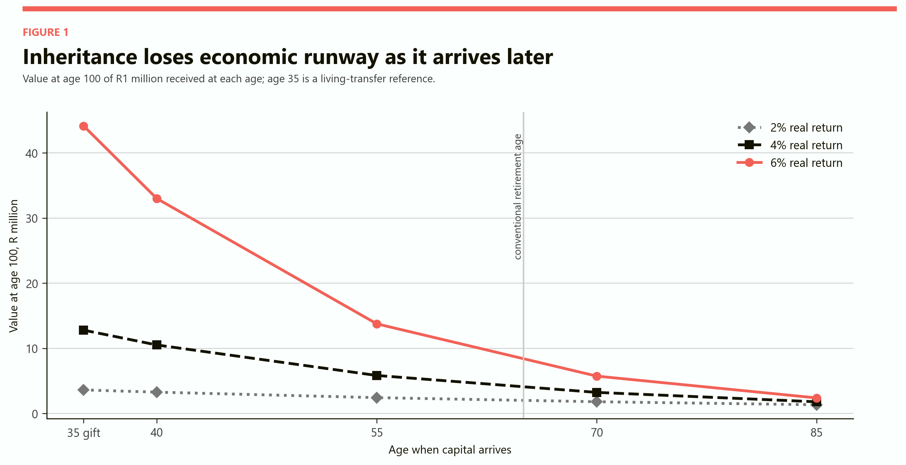
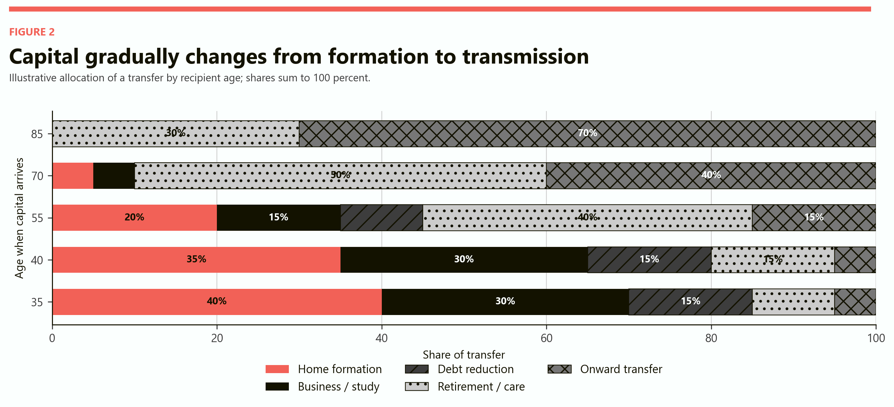
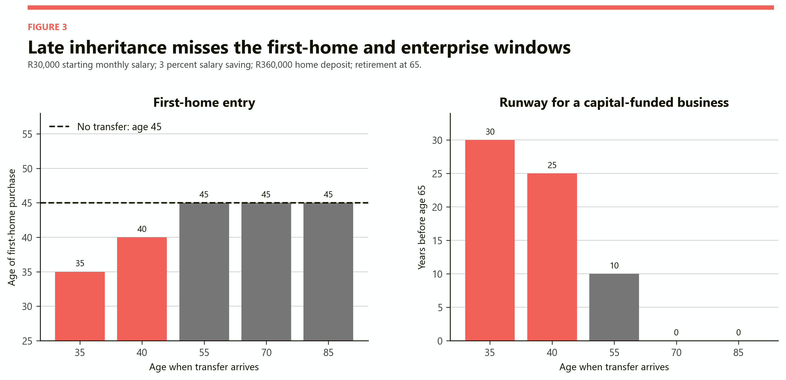
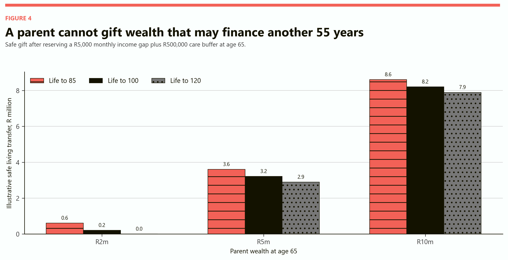
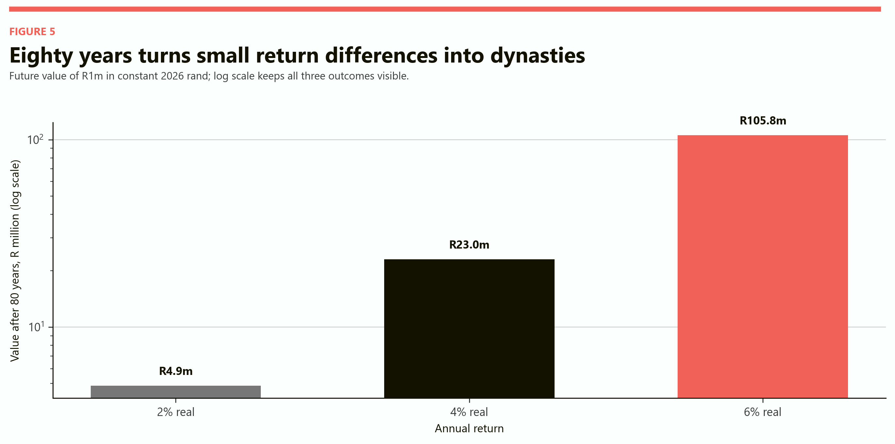
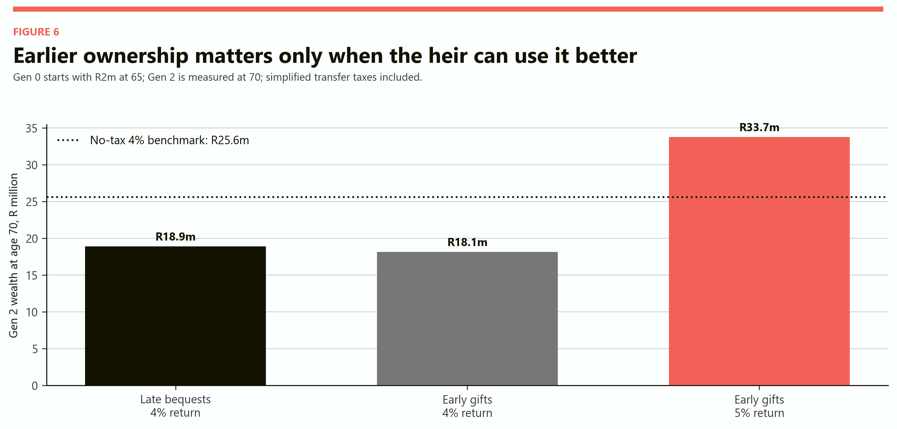

# Inheritance After Retirement
## When family capital arrives after the decisions it was supposed to finance

# Part I: The finding

Inheritance does not become worthless when it arrives at 70 or 85. It becomes a different economic instrument.

At 35 or 40, family capital can change the structure of a life. It can supply a home deposit, reduce expensive debt, finance education, absorb the risk of starting a business or allow a parent to preserve employment through a care crisis. At 70, most of those formation decisions have already been made. The same money is more likely to support retirement, healthcare, consumption or another transfer to the next generation.

That shift is the core of this study.

The model compares a R1 million transfer received at 40, 55, 70 and 85. A living transfer at 35 is included as a reference. The recipient starts work at 25 on R30,000 a month, real pay grows by 1.2 percent a year, and capital earns 4 percent above inflation in the average case. All values are in constant 2026 rand.

If the money remains invested until age 100, the age at which it arrives is decisive. The living transfer at 35 becomes R12.80 million. An inheritance at 40 becomes R10.52 million, at 55 R5.84 million, at 70 R3.24 million and at 85 only R1.80 million.

| Capital arrives | Years remaining to age 100 | Value at age 100 at 4% real | Main economic function in the model |
|---|---:|---:|---|
| Age 35, living transfer | 65 | R12.80m | Home, enterprise, education and long compounding |
| Age 40, inheritance | 60 | R10.52m | Late formation and long compounding |
| Age 55, inheritance | 45 | R5.84m | Mortgage reduction and retirement preparation |
| Age 70, inheritance | 30 | R3.24m | Retirement, care and onward transfer |
| Age 85, inheritance | 15 | R1.80m | Care, consumption and onward transfer |

The purely financial result contains an important qualification. If parents and children earn the same return, face no tax, never consume the asset and can borrow freely, it does not matter which generation legally holds the capital. One rand compounds into the same family wealth wherever it sits.

Timing matters because the real world violates every part of that clean case. Young adults face deposit constraints, expensive credit and uninsurable career risks. Older parents need a longevity and care reserve. Tax rules treat gifts and estates differently. Returns vary by owner. Control changes behaviour. Some heirs invest; others consume; some use a modest transfer to escape a high-cost constraint.

> Inheritance after retirement is not economically obsolete. It is obsolete as a reliable source of early-life capital. Its function moves from launching the heir to protecting retirement and reproducing the dynasty.

# Part II: Longer life delays the capital cascade

The old inheritance story is a staircase. Grandparents die, parents inherit while building a household, and children later inherit while forming theirs. Radical longevity turns the staircase into a waiting room.

With a thirty-year generation gap and death at 100, a child inherits at 70. Their own child is already 40. If each generation waits for death before transferring wealth, the family capital reaches every recipient after the conventional retirement age. The asset can remain powerful, but it no longer arrives at the same stage of life as housing, education and early enterprise decisions.

This direction is visible even without 100-year lives. The [OECD's study of household wealth and inheritances](https://www.oecd.org/en/publications/inheritance-taxation-in-oecd-countries_e2879a7d-en/full-report/component-4.html) reports that people are generally older when they inherit. It notes that a slight majority of heirs in one Swedish administrative study were between 50 and 70 and expects longer lives to raise the age of inheritance further. The OECD also finds that wealthy households are more likely to receive transfers and receive larger ones.

Those findings do not give South Africa an inheritance-age distribution. The model therefore does not pretend that 70 is the current national average. It asks what happens when 70 becomes ordinary.

The first effect is a mismatch between ownership and need. A 90-year-old parent can hold a fully paid home and a large investment balance while a 60-year-old child is still repaying a mortgage and supporting adult children. The parent is rational to keep a reserve because their remaining lifespan and care needs are uncertain. The family can therefore be wealthy in aggregate and constrained in every younger household.

The second effect is a slower social circulation of assets. Homes change ownership less often. Business stakes remain in older hands. Financial portfolios compound under one generation's control for longer. If the assets are well managed, family wealth grows. If they are illiquid or conservatively held, productive opportunities elsewhere in the family go unfunded.

The third effect is political. A society may appear to have extensive private wealth while young adults still demand housing, education and enterprise support from the state. The private wealth exists, but it is concentrated in families that have it and in generations not yet willing or able to release it.

# Part III: The timing map

Figure 1 follows exactly the same R1 million to age 100. The three lines change only the real return and the age at which the recipient gains control.

*Figure 1. Age 35 is a living-transfer reference. Ages 40, 55, 70 and 85 are inheritance cases. Values exclude tax, fees and consumption so that timing and compounding remain visible.*

At 2 percent above inflation, R1 million received at 40 becomes R3.28 million by 100. At 4 percent it becomes R10.52 million. At 6 percent it becomes R32.99 million. If the same inheritance arrives at 85, the three results narrow to R1.35 million, R1.80 million and R2.40 million.

An inheritance at 85 can still change comfort, care and what the heir leaves behind. It has far less time to change production or the recipient's own asset formation.

The chart also shows why late inheritance can feel simultaneously large and disappointing. The cheque may be larger because the parent compounded capital for decades. But the heir receives less economic runway. A larger late amount is not automatically equivalent to a smaller early one if the early transfer can remove a borrowing constraint or change a career.

This is a distinction between financial value and option value. Financial value asks how much money exists. Option value asks which decisions are still open when control arrives.

# Part IV: Capital changes purpose with age

The model assigns each transfer to five broad uses. The allocation is illustrative, not a survey estimate. Its purpose is to make the changing function explicit.

At 35, 40 percent is associated with household formation, 30 percent with business or education, 15 percent with debt reduction, 10 percent with retirement preparation and 5 percent with onward transfer. At 85, home formation, business and ordinary debt have disappeared from the allocation. Thirty percent supports retirement or care and 70 percent is preserved for another generation.

*Figure 2. The same transfer moves from formation capital toward retirement and onward transmission as the recipient ages. The shares are declared scenario assumptions.*

This does not mean that an 85-year-old cannot start a business, study or buy a home. Study VII showed how a 100-year life can contain late careers and university at 80. The allocation describes the expected centre of gravity under conventional institutions, not a biological prohibition.

It also does not mean that consumption is waste. Paying for care, adapting a home, helping a spouse or buying time can create enormous welfare. The narrower point is that those uses do not perform the old social role of inheritance: giving a younger household an initial stock of capital.

Late inheritances can even skip the nominal heir in substance. A 70-year-old receives the estate and immediately helps a 40-year-old child. The legal transfer went down one generation; the economically active use went down two. Families with advisers and liquid assets can organise this. Families whose wealth is a single home cannot do so as easily.

# Part V: The first-home window

The housing effect is not that everybody without inheritance can never buy. It is that early capital can move purchase forward and change the years that follow.

The modelled worker earns R30,000 a month at 25, saves 3 percent of salary and earns 4 percent above inflation on the deposit fund. Real pay grows by 1.2 percent. A 20 percent deposit on a R1.8 million home is R360,000. Under this deliberately simple path, the worker reaches the deposit at 45.

A R1 million living transfer at 35 allows purchase at 35. An inheritance at 40 allows purchase at 40. Inheritances at 55, 70 and 85 arrive after the worker has already reached the modelled deposit at 45, so they cannot change first entry. They can repay a mortgage, improve the property or finance a different home, but the first-home event has passed.

*Figure 3. The home result is a savings-path example, not a Gauteng house-price forecast. The business panel counts years remaining to conventional retirement at 65; a long-life career would extend that runway.*

South African housing is heterogeneous, and formal title is not captured perfectly by a single tenure statistic. The [2025 General Household Survey](https://www.statssa.gov.za/publications/P0318/P03182025.pdf) reports that 52.9 percent of households nationally lived in dwellings that were fully paid off or still being paid off. Gauteng had the largest renter share: 39.4 percent rented, 33.1 percent were fully paid off and 10.8 percent were still being paid off.

Those figures do not show who will inherit, the value of the equity or whether the property can be sold. They do show why housing is central to intergenerational capital. A house can be both the parent's retirement security and the child's missing deposit. It cannot fully perform both roles at the same time without a financial or legal bridge.

# Part VI: The business-formation window

The model uses R250,000 as a stylised block of education or enterprise capital. If it arrives at 40, the recipient has twenty-five years before conventional retirement at 65. At 55, only ten years remain. At 70 or 85, the conventional pre-retirement runway is zero.

That framing is intentionally conservative in a hundred-year life. A person may work to 80 or 90 and start a later business. But the risk-bearing capacity of a 70-year-old is not identical to that of a 40-year-old. The older person has less time to recover from failure and may depend on the same wealth for retirement and care.

Early capital has a leverage effect when banks will not finance the project on acceptable terms. The transfer may fund the part of the venture that is hardest to borrow: the first prototype, unpaid training, a guarantee, six months without salary or the equity required before another investor participates.

The model does not assign a probability of business success. Any number would look more empirical than it is. Instead, the dynasty comparison asks a cleaner question: how much better must the child use capital for an early transfer to outperform patient parental holding?

The answer is not much. Under the tax assumptions used here, early and late strategies are close when both generations earn 4 percent. A one percentage point higher return under the child's control creates a much larger difference over two generations.

# Part VII: Giving early is not automatically better

The strongest argument for living transfers is timing. The strongest argument against them is uncertainty.

A parent who gives away too much cannot ask the future to refund the gift if they live to 110, require intensive care, lose investment income or face a family emergency. The child may be unable or unwilling to return the money. An early transfer can improve the child's balance sheet while making the parent's retirement fragile.

The model therefore calculates a simple safety reserve. At age 65, the parent sets aside enough capital to cover a R5,000 monthly income gap until death, valued at a 3 percent real rate, plus a R500,000 care buffer. Only wealth above that reserve is labelled available for a living transfer.

*Figure 4. The safety rule is illustrative and excludes the parent's home, taxes and uncertain market returns. A value of zero means the modelled reserve absorbs the entire portfolio.*

With R2 million at 65, the safe transfer is R607,000 if the parent lives to 85, R211,000 if they live to 100 and zero if they live to 120. With R5 million, the corresponding amounts are R3.61 million, R3.21 million and R2.89 million.

Longer life therefore creates a paradox. It makes early capital more valuable to children by delaying inheritance, while making parents less able to give because they must self-insure a longer old age.

The paradox is sharpest when the parent's wealth is the home. Selling or mortgaging it may release capital, but the parent still needs secure housing. A life right, partial sale, shared-equity arrangement, downsizing option or carefully protected equity-release product can separate occupancy from full ownership. Each introduces fees, complexity and potential abuse.

The correct policy cannot be "parents should give sooner". It must be "surplus capital should be easier to transfer without exposing the parent".

# Part VIII: Living transfers versus bequests

A bequest has three advantages. The donor retains control, preserves insurance against longevity and can change the will as family circumstances change. The asset continues to earn a return. Under South Africa's estate-duty abatement, a modest estate may also pass without estate duty, although other taxes and costs can still arise.

A living transfer has three different advantages. It arrives when the recipient has more open decisions, can reveal how the recipient uses capital and can be divided across several years. It may also move future asset growth out of the donor's estate.

The cost is loss of control. A gift can be exposed to the recipient's creditors, relationship breakdown, poor decisions or premature consumption. It can also create conflict among siblings if gifts are unequal or poorly documented.

There is no universally optimal date. A useful family rule has three gates.

1. The parent's retirement, housing and care reserve must be credible under a long life.
2. The recipient must have a specific high-value use or a sound investment plan.
3. The transfer, tax, ownership and inheritance consequences must be documented before money moves.

If the first gate fails, wait. If the second fails, retain or place the capital under an appropriate structure. If the third fails, professional tax and legal advice is part of the transaction rather than an optional afterthought.

# Part IX: Eighty years of compounding

The phrase "dynastic wealth" can sound political and abstract. Compounding makes it mechanical.

One million rand earning 2 percent above inflation for eighty years becomes R4.88 million. At 4 percent it becomes R23.05 million. At 6 percent it becomes R105.80 million.

*Figure 5. The vertical axis is logarithmic. The calculation assumes no tax, fees, withdrawals, losses or division among heirs. It is a sensitivity test, not an achievable promise.*

The result is not simply that wealthy families are patient. They may also earn different returns. Larger portfolios obtain professional advice, diversification, private-market access and lower proportional fees. A home-owning family can borrow against equity rather than sell an asset after a shock. A low-wealth family may be forced to hold cash, use expensive debt or liquidate investments at the wrong time.

South African wealth is already exceptionally concentrated. A [World Inequality Database study](https://wid.world/news-article/how-unequal-is-the-wealth-distribution-in-south-africa/) combining tax microdata, surveys and national balance sheets estimated that the top 10 percent owned 86 percent of aggregate wealth, while the top 0.1 percent held nearly a third. The estimates refer to an earlier period and have measurement limitations, especially around trusts, but the concentration is too large to treat inheritance as a marginal issue.

At the aggregate level, the [South African Reserve Bank's June 2025 Quarterly Bulletin](https://www.resbank.co.za/content/dam/sarb/publications/quarterly-bulletins/quarterly-bulletin-publications/2025/june/01Full%20Quarterly%20Bulletin.pdf) put household net wealth at 413 percent of annual disposable income in the first quarter of 2025. Rising share prices and housing values increased the asset side of the balance sheet. Aggregate wealth says nothing about which household owns it, but it shows the scale of the stock capable of moving across generations.

# Part X: The three-generation result

The dynasty model begins with Generation 0 aged 65, Generation 1 aged 35 and Generation 2 aged 5. Generation gaps are thirty years and everyone dies at 100.

In the late-bequest path, Generation 0 holds R2 million until death. Generation 1 inherits at 70, holds the remainder to death, and Generation 2 inherits at 70. Both portfolios earn 4 percent above inflation. Simplified estate duty is paid at each death.

In the early-gift path, Generation 0 transfers as much of the R2 million budget as possible to Generation 1 at 35 after simplified donations tax. Thirty years later, Generation 1 does the same for Generation 2 at 35. Generation 2 is measured at 70.

*Figure 6. The model includes only simplified donations tax or estate duty. It excludes capital gains tax, fees, spouse deductions, trusts, consumption, care and division among heirs.*

At the same 4 percent return, the late-bequest family ends with R18.90 million for Generation 2, compared with R18.14 million under early gifts. Current simplified tax treatment gives the bequest path a small advantage. The R25.60 million dotted benchmark shows what the initial R2 million becomes over the same total time at 4 percent with no transfer tax.

When the early recipients earn 5 percent instead of 4, Generation 2 reaches R33.75 million. The extra return has decades and two ownership transitions in which to compound.

This does not show that children generally outperform parents. Early transfer wins when the heir earns more or avoids a costly constraint. Even a slightly smaller final amount can create more welfare if it advances housing, education or useful work.

# Part XI: Why inequality widens before the bequest

Inheritance inequality is usually measured when the estate is distributed. Much of the divergence occurs earlier.

Family A receives R1 million at 35. Family B expects a similar amount at 70. Family C will receive nothing. At 35, A can buy, train or start a firm. B cannot pledge a parent's future estate to an ordinary lender, because the date, amount and beneficiary are uncertain. C has no future family asset at all.

The labour incomes of A and B may be identical, yet A's balance sheet changes the cost of almost every decision. The deposit reduces borrowing. The emergency fund permits a job change. Home equity later supports another loan. If A then transfers capital to a child at 35, the timing advantage repeats.

Family B eventually appears wealthy when the inheritance arrives at 70. Standard lifetime statistics may show the gap narrowing. But B cannot retroactively buy the foregone home, business years or career option. Timing inequality has already become outcome inequality.

Family C faces both problems: no early capital and no late insurance. In a highly unequal society, policies that subsidise early gifts only through the tax system can deepen the gap because only asset-owning families can use them.

This is why inheritance policy and opportunity policy cannot be separated. A tax concession for a home-deposit gift may improve timing inside wealthy families. A matching public capital account or housing instrument is needed if the policy is also intended to improve mobility across families.

# Part XII: South Africa's current tax wedge

South Africa taxes the donor or estate, not inheritance as a general recipient income item.

[SARS states](https://www.sars.gov.za/types-of-tax/estate-duty/) that estate duty applies after allowable deductions and a R3.5 million abatement. The rate is 20 percent on the first R30 million of dutiable value and 25 percent above that.

For the 2026/27 year, [SARS increased the annual donations-tax exemption for a natural person to R150,000](https://www.sars.gov.za/about/sars-tax-and-customs-system/budget/budget-2026-frequently-asked-questions/). Tax applies at 20 percent on cumulative taxable donations up to R30 million and 25 percent above. Donations between spouses and certain other transfers are exempt.

The model compares equal total donor budgets. In the living-transfer case, the gift and donations tax must fit inside that budget. In the bequest case, simplified estate duty is subtracted from the estate.

| Total donor resources | Living gift received | Simplified donations tax | Bequest received | Simplified estate duty |
|---:|---:|---:|---:|---:|
| R1.0m | R0.858m | R0.142m | R1.000m | R0.000m |
| R10.0m | R8.358m | R1.642m | R8.700m | R1.300m |
| R40.0m | R33.230m | R6.770m | R32.375m | R7.625m |

These are teaching examples, not tax calculations for a real estate. They apply only the annual donations exemption or the basic estate abatement and headline rates. They ignore liabilities, spouse deductions, previous donations, executors' costs, trusts, several beneficiaries and other exemptions.

They also omit capital gains tax. [SARS identifies donation and death as disposal events](https://www.sars.gov.za/tax-rates/income-tax/capital-gains-tax-cgt/), subject to exclusions and rollovers. The 2026/27 maximum effective CGT rate for individuals and special trusts is 18 percent; updated exclusions include R3 million for a qualifying primary-residence gain and R440,000 in the year of death. A transfer of immovable property can introduce additional legal and tax consequences.

The tax system therefore does not offer a simple choice between a 20 percent gift and a 20 percent bequest. Asset type, base cost, marital status, estate size, prior gifts and the way the parent retains housing rights all matter.

# Part XIII: What should inheritance tax try to do?

An inheritance tax can pursue revenue, equality, opportunity or administrative simplicity. These goals overlap, but they are not identical.

A low threshold and flat rate may collect from many ordinary homes while leaving sophisticated dynasties able to plan. A very high threshold protects ordinary estates but raises little revenue. A tax on the estate treats one R12 million estate similarly whether it goes to one child or twelve. A recipient-based tax can distinguish a person receiving R12 million from a person receiving R1 million.

The [OECD's review of inheritance-tax arguments](https://www.oecd.org/en/publications/inheritance-taxation-in-oecd-countries_e2879a7d-en/full-report/component-5.html) concludes that small inheritances can be large relative to the recipient's existing wealth, while large transfers are concentrated among wealthier households. It identifies a progressive schedule with an exemption for small inheritances as one way to reduce both absolute and relative wealth inequality. The OECD also warns that gifts and bequests respond to tax incentives and planning opportunities.

A long-life tax design should be neutral about timing unless society deliberately wants to favour a use. Otherwise the law encourages families to delay or accelerate transfers for tax reasons rather than welfare.

One possible design is a cumulative lifetime recipient account. Every substantial gift and bequest received by an individual is added to the same lifetime total. A generous allowance protects ordinary help. Progressive rates apply to very large lifetime receipts. The date of transfer matters less, and splitting wealth into repeated gifts does not erase the tax base.

A second layer can support socially valuable early uses. A limited amount for accredited education, a first-home equity contribution or verified business capital could receive deferral or relief. The relief should belong to the recipient and should be matched by access for people without wealthy parents, or it will subsidise advantage without broadening opportunity.

A third layer protects the donor. Tax policy should not induce older people to give away their housing or care reserve. Products that retain a legally secure life right, cap fees and require independent advice are more important than a broad slogan about early giving.

# Part XIV: Is inheritance economically obsolete?

The answer depends on the job inheritance is expected to perform.

As first-home capital, an inheritance at 70 is obsolete. It arrives decades after the deposit decision. As start-up finance for a conventional pre-retirement career, it is mostly obsolete. As insurance against old-age poverty, it may be extremely useful. As care funding, it can be essential. As a source of capital for grandchildren, it can remain potent. As a mechanism of dynastic accumulation, long compounding can make it more powerful than ever.

The phrase "the heir receives R1 million" therefore hides four questions.

- At what age does control arrive?
- Which decisions are still open?
- What must the donor retain for a long and uncertain old age?
- Does the transfer broaden opportunity or only move advantage within one family?

Inheritance is economically obsolete only if it is imagined as a substitute for wages, affordable housing, education finance or access to business capital during early adulthood. Government should not wait for private bequests to solve those problems. Too many people receive nothing, and many who inherit receive it too late.

# Part XV: Best, average and worst cases

The model is not a forecast because transfer behaviour, returns, longevity and care costs are uncertain. Three scenarios show how the same family wealth can produce opposite conclusions.

| Scenario | Parent | Recipient | Tax and institutions | Result |
|---|---|---|---|---|
| Best case | Has a large, liquid surplus after a secure longevity reserve | Uses early capital for a home, education or a productive business and earns 5-6% real | Gifts and bequests are coordinated; ownership and care rights are protected | Early transfer raises welfare and dynasty wealth while leaving the parent secure |
| Average case | Can release only part of wealth without weakening retirement | Earns roughly the same 4% return as the parent | Current simplified tax gives late bequest a small financial edge | Early transfer may lower final wealth slightly but improves option value and timing |
| Worst case | Gives from the retirement or housing reserve | Consumes the transfer or loses it without removing a durable constraint | Tax, fees, conflict or creditor exposure destroy value | Parent becomes dependent and the family ends with less security than under a bequest |

There is also a fourth case: no transferable family wealth. It is not shown as a variation around the R1 million model because it is a different starting point. For that household, debates about the ideal inheritance age are irrelevant. Public education, housing access, credit and social insurance carry the entire burden.

The average model should therefore not be read as advice to transfer early. Its message is narrower. An early transfer is economically superior when the parent's reserve is secure and the recipient's life-stage return is high enough. Otherwise waiting can be rational.

# Part XVI: The policy answer

The policy objective should not be to make every parent distribute an estate before death. It should be to prevent access to capital from depending on whether one's parents die at the economically convenient age.

Six reforms follow.

## 1. Count lifetime receipts

Coordinate substantial gifts and bequests in one recipient-based record with a large ordinary-family allowance and progressive treatment of very large receipts. This reduces arbitrary differences between a gift at 35 and a bequest at 70.

## 2. Create a public counterpart to the private gift

If early family capital receives relief for a first home, accredited training or enterprise equity, people without family wealth need a parallel matched savings account, guarantee or social-capital grant. Otherwise timing reform increases inherited inequality.

## 3. Make housing wealth divisible without removing the parent

Develop transparent life-right, downsizing, shared-equity and partial-release options with fee caps, independent advice and strong protection against coercion. The aim is to separate secure occupation from the need to keep every rand locked in one property.

## 4. Protect the longevity reserve

Treat a credible retirement and care reserve as a prior claim. Financial advisers and legal documents should stress-test life to 100 or 120 before recommending a gift.

## 5. Improve transfer data

Record age, relationship, amount and asset type for substantial gifts and bequests while protecting privacy. South Africa cannot design timing-neutral policy if it sees estates at death but not the earlier flow of family capital.

## 6. Tax large dynasties without taxing ordinary rescue

Protect modest transfers that materially improve a low-wealth recipient's balance sheet. Apply more progressive treatment where repeated large receipts compound privilege. Use part of the revenue to widen early capital access.

The central principle is simple: capital should meet adulthood when it can change adulthood. A society in which inheritance routinely arrives after retirement cannot rely on death to circulate opportunity.

# Part XVII: Model assumptions and reading guide

This is an armchair model. It isolates timing and ownership rather than predicting a household.

The representative transfer is R1 million in constant 2026 rand. It is received at 40, 55, 70 or 85 and invested to age 100. A living transfer at 35 provides a comparison. Real return scenarios are 2, 4 and 6 percent. They exclude tax, fees and withdrawals in the timing figure.

The salary example begins at R30,000 a month at age 25. Real pay rises 1.2 percent a year. Three percent of gross salary is saved into a deposit fund earning 4 percent above inflation. The target is a R360,000 deposit on a R1.8 million home. The model does not include rent, tax, lending criteria, transaction costs, house-price changes or household income pooling.

The business runway uses a conventional retirement age of 65 and R250,000 of capital. It does not estimate business success or returns. A long-life working model would permit later enterprise formation.

The purpose shares are declared illustrations. They are not estimated from a South African inheritance survey.

The dynasty begins with R2 million held by a 65-year-old, thirty-year generation gaps and death at 100. Portfolios earn 4 percent unless stated. The early high-return case earns 5 percent. Simplified transfer taxes are paid at each handover. The model excludes consumption, care, capital gains tax, fees, trusts, spouse deductions, creditor loss and division among heirs.

The parental safety reserve covers a R5,000 monthly real income gap to the assumed death age, valued at 3 percent, plus a R500,000 care buffer. It is not a retirement plan or financial recommendation.

Tax examples use headline South African rules for 2026/27 but are deliberately incomplete. A real transfer requires current professional tax, estate and property advice.

## Sources used

- [South African Revenue Service, Estate Duty](https://www.sars.gov.za/types-of-tax/estate-duty/)
- [South African Revenue Service, Budget 2026 Frequently Asked Questions](https://www.sars.gov.za/about/sars-tax-and-customs-system/budget/budget-2026-frequently-asked-questions/)
- [South African Revenue Service, Capital Gains Tax rates and exclusions](https://www.sars.gov.za/tax-rates/income-tax/capital-gains-tax-cgt/)
- [Statistics South Africa, General Household Survey 2025](https://www.statssa.gov.za/publications/P0318/P03182025.pdf)
- [South African Reserve Bank, Quarterly Bulletin, June 2025](https://www.resbank.co.za/content/dam/sarb/publications/quarterly-bulletins/quarterly-bulletin-publications/2025/june/01Full%20Quarterly%20Bulletin.pdf)
- [OECD, Inheritance Taxation in OECD Countries](https://www.oecd.org/en/publications/inheritance-taxation-in-oecd-countries_e2879a7d-en/)
- [World Inequality Database, Wealth Distribution in South Africa](https://wid.world/news-article/how-unequal-is-the-wealth-distribution-in-south-africa/)
