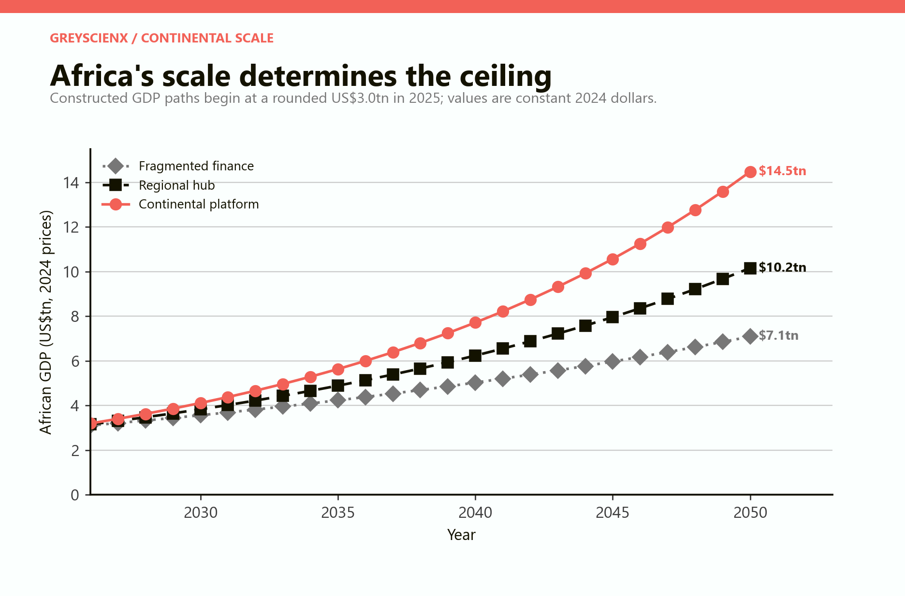
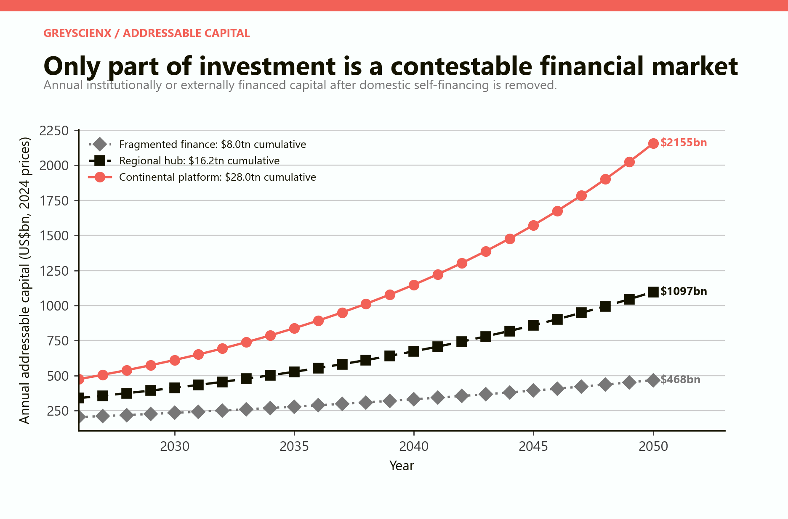
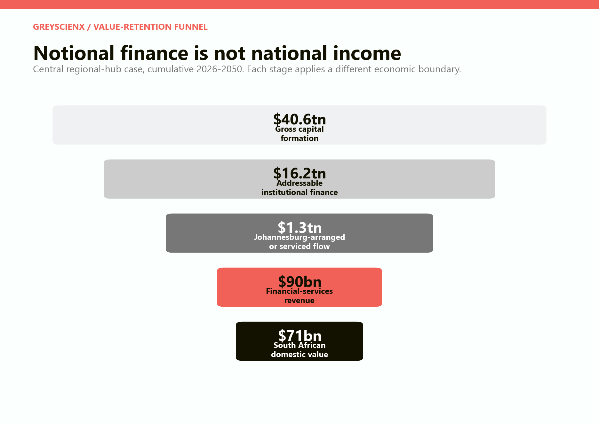
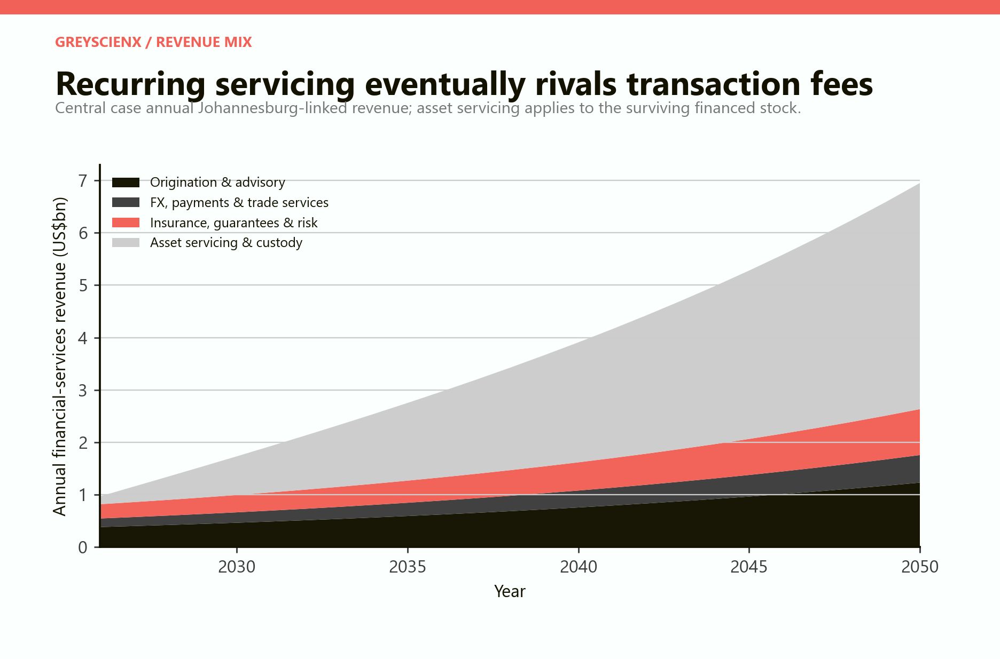
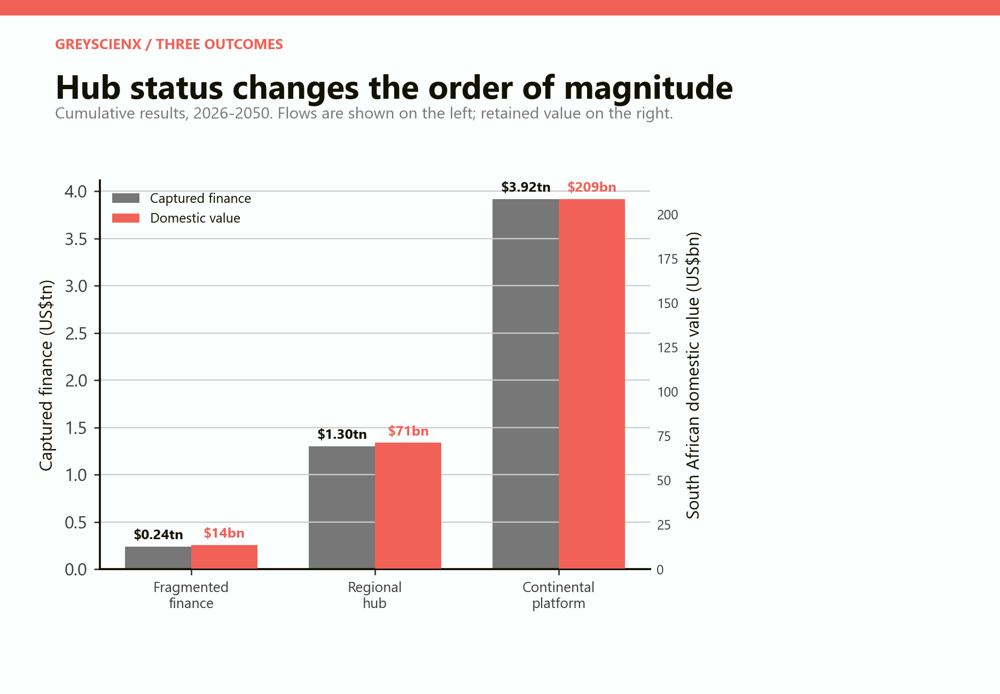
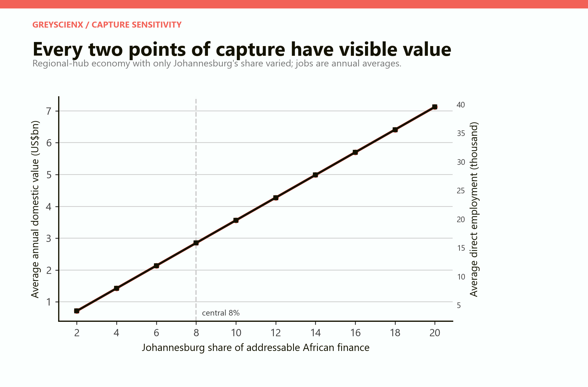
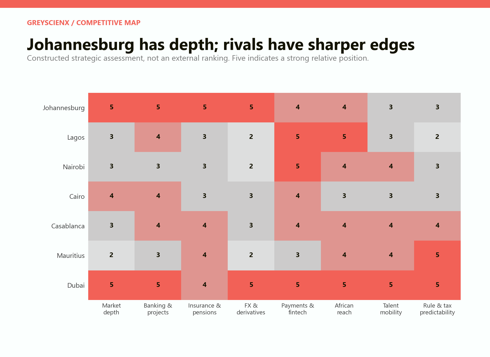
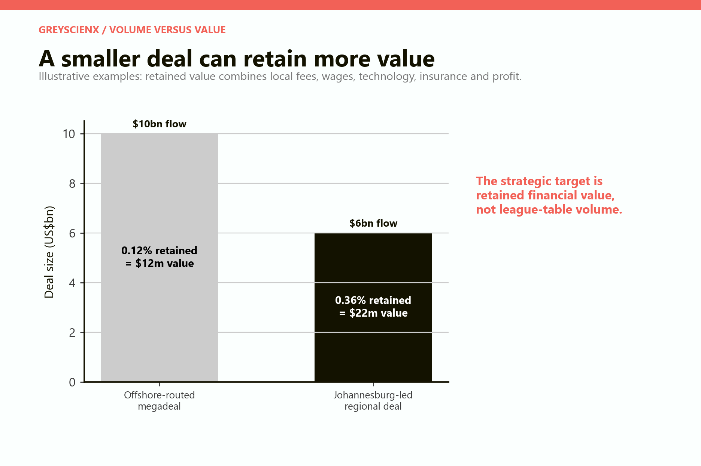
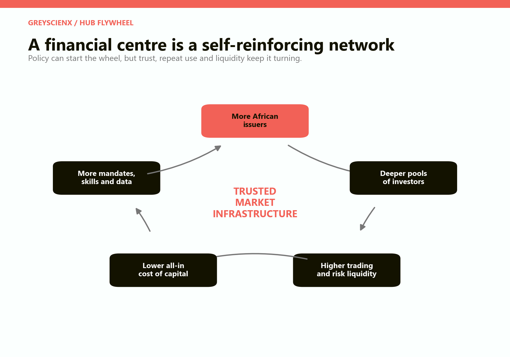
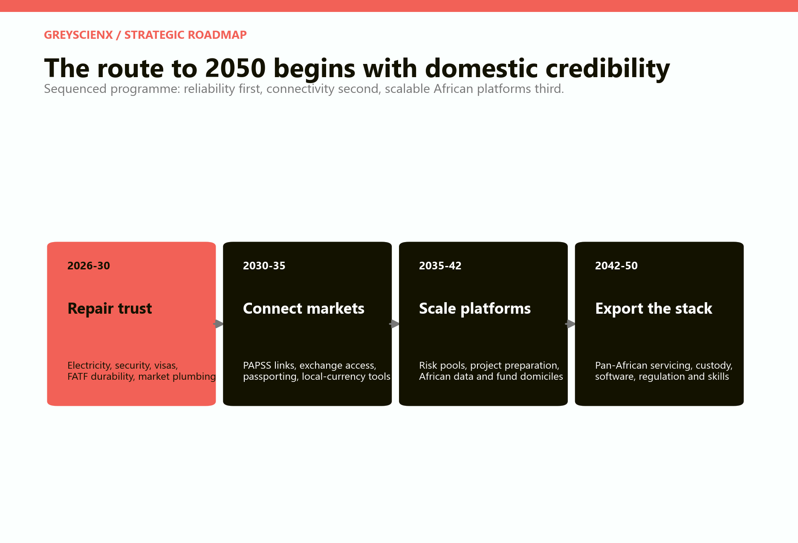

# Johannesburg as Africa's Financial Capital

## Can South Africa remain the financial operating centre of a continent whose largest consumer markets may lie elsewhere?

# PART I: The answer

## Johannesburg can remain indispensable without remaining the largest market

Africa's economic centre of gravity is moving north and east. Nigeria, Egypt, Ethiopia, Kenya, Tanzania and the large Francophone economies will add consumers, firms, pension savers and infrastructure at a scale South Africa cannot match through population growth alone. That does not mean Johannesburg must become financially peripheral.

A financial centre is not simply the city beside the largest population. It is the place where contracts are trusted, risks are priced, currencies are traded, capital is pooled, securities settle, projects become bankable and investors can enter or leave without inventing the machinery from scratch. London remained financially important after Britain ceased to be the largest industrial economy. Singapore built a regional role far larger than its domestic market. Mauritius has used legal, tax and fund-administration functions to intermediate investment into countries many times its size. Dubai competes for African mandates from outside Africa.

Johannesburg begins with unusual advantages. The JSE reported R24.18 trillion in listed market capitalisation at the end of 2025 and describes itself as one of the world's twenty largest exchanges by market capitalisation. South African banks held R8.45 trillion in assets in June 2025. The country has deep pension, insurance, asset-management, foreign-exchange, derivatives, legal, accounting and actuarial capability. Gauteng accounted for 43.8 per cent of South Africa's broad finance, real-estate and business-services industry in 2022. These are not decorative assets. They are market infrastructure accumulated over generations. [JSE, Integrated Annual Report 2025](https://group.jse.co.za/sites/ir.jse.co.za/files/media/documents/1-jse-ltd-integrated-annual-report-2025-30032026-published/1%20-%20JSE%20Ltd%20%E2%80%93%20Integrated%20Annual%20Report%202025%20%E2%80%93%2030032026%20-%20As%20published.pdf); [SARB Prudential Authority, Selected Banking Sector Trends, June 2025](https://www.resbank.co.za/content/dam/sarb/publications/prudential-authority/pa-statistics-selected-trends---monthly/2025/June%202025.pdf); [Statistics South Africa, Provincial GDP 2022](https://www.statssa.gov.za/publications/D04411/D044112022.pdf).

The threat is that financial depth can migrate faster than a mine or factory. Capital is mobile. A regional company can list in Lagos, Nairobi or London, establish a holding company in Mauritius, raise private capital in Dubai, buy insurance from a global syndicate, settle payments through a continental platform and use Johannesburg only for a narrow currency hedge. Every layer removed from South Africa reduces skilled work, corporate income, data, relationships and future deal flow.

The strategic objective should therefore be precise: **maximise the financial value retained in South Africa from African investment, even when the underlying project, issuer, investor or consumer is elsewhere.** The prize is not the face value of African capital flows. It is the income generated by origination, underwriting, structuring, trading, payments, foreign exchange, insurance, guarantees, asset servicing, custody, technology, research and portfolio management—and the share of that income that becomes South African wages and profits.

This paper models the scale of that prize. Under a central **regional hub** scenario, Africa generates about US$40.6 trillion in gross capital formation from 2026 to 2050. Forty per cent is treated as institutionally or externally financeable, producing a US$16.2 trillion addressable pool. If Johannesburg arranges, distributes, services or manages 8 per cent, the captured flow is approximately US$1.30 trillion.

That trillion is not South African GDP. Applying explicit fees and spreads produces about US$90.4 billion in cumulative financial-services revenue. After foreign inputs and offshore delivery are removed, approximately US$71.2 billion is retained as domestic value: US$2.85 billion a year on average, equal to about 0.7 per cent of South Africa's 2024 GDP. The model associates that average with roughly 15,800 direct high-productivity jobs and 25,300 direct and indirect jobs.

*Figure 1. These are constructed growth paths, not forecasts. The model uses a rounded US$3 trillion 2025 African economy as its common starting point.*

The result is nationally material but not miraculous. Financial intermediation cannot replace weak electricity, logistics, education, manufacturing or public institutions. It can, however, export sophisticated services, improve the financing of South African firms, deepen domestic markets and connect the country to faster-growing African economies.

> **Central conclusion.** Johannesburg can remain Africa's most useful financial operating platform even if it is no longer beside Africa's largest consumer market. It will do so only by becoming the easiest place from which to finance many African markets—not by assuming that its inherited depth will protect it.

## Ten findings

**First, Africa's capital requirement is large enough that a modest share matters.** The African Development Bank estimated in 2026 that structural transformation requires more than US$400 billion a year and that Africa holds more than US$4 trillion in domestic savings and assets. The binding problem is not simply a global shortage of money. It is the conversion of savings and mandates into bankable projects, trade credit, local-currency securities and investable companies. [African Development Bank, opening address to the 2026 Annual Meetings](https://www.afdb.org/en/news-and-events/speeches/president-ould-tahs-opening-address-2026-african-development-bank-group-annual-meetings-93859).

**Second, financial depth is a network asset.** Issuers attract investors; investors improve liquidity; liquidity lowers funding costs; lower costs attract more issuers; repeated transactions create data, specialist skills and confidence. The loop can reinforce Johannesburg or unwind against it.

**Third, capital flow is not value added.** A US$10 billion transaction routed through Johannesburg may leave little domestic income if structuring, insurance, fund domicile, technology and investors sit abroad. A US$6 billion deal led, risk-managed and serviced locally can retain more.

**Fourth, recurring services are the durable prize.** In the central model, origination, payments and risk fees produce about US$39 billion over twenty-five years. Asset servicing and custody on the surviving financed stock produce another US$51 billion. The relationship after a deal can be worth more than the closing ceremony.

**Fifth, the JSE is necessary but insufficient.** Continental finance includes corporate bonds, private credit, infrastructure funds, trade finance, project finance, reinsurance, payments, foreign exchange, custody and data. Johannesburg can lose the financial centre while retaining a large domestic exchange if these adjacent functions migrate.

**Sixth, African market development is not a zero-sum game.** Lagos, Nairobi, Cairo and Casablanca need deeper local markets. Johannesburg should help connect them, provide wholesale risk and back-office services, distribute securities and co-underwrite projects—not demand that every African company abandon its home market.

**Seventh, Johannesburg's competitors sell certainty.** Mauritius sells fund and treaty infrastructure. Casablanca sells a Francophone and European bridge. Nairobi sells East African connectivity and fintech. Lagos sells access to the continent's largest population and entrepreneurial market. Dubai sells global capital, aviation, tax and legal predictability at extraordinary scale.

**Eighth, South Africa's domestic failures are financial-centre failures.** Electricity instability, freight breakdown, crime, weak urban management, visa friction, policy uncertainty, sovereign risk and compliance failures raise the cost of every mandate, even when the project is in another country.

**Ninth, a financial hub requires African presence.** Johannesburg-based institutions need people, licences, partnerships, research, credit judgment and operating systems in African markets. A continent cannot be intermediated from Sandton conference rooms alone.

**Tenth, policy should measure retained value.** The useful dashboard is not only listings, deal announcements or assets under management. It is African-origin revenue, domestic value added, cross-border recurring income, mandates won, risks housed, data processed and specialist jobs created.

# PART II: The capital requirement

## Convergence is a financing event

If African incomes converge toward upper-middle-income levels, households will demand electricity, housing, transport, data, healthcare, food processing, retail, insurance and credit. Firms will need factories, warehouses, fleets, working capital and acquisitions. Governments and utilities will need power, water, rail, ports and urban infrastructure. Pension systems and insurers will accumulate assets. New firms will seek equity; established firms will issue bonds; exporters will need trade credit and currency protection.

This is why the financing opportunity is broader than infrastructure. The AfDB's familiar estimate places annual infrastructure needs at US$130-170 billion, with a gap of US$68-108 billion. Its 2026 structural-transformation estimate exceeds US$400 billion a year once industrial, human-capital and other investment is included. [African Development Bank, infrastructure and transformation financing](https://www.afdb.org/en/news-and-events/speeches/president-ould-tahs-opening-address-2026-african-development-bank-group-annual-meetings-93859).

The capital can come from African banks, pension funds, insurers, governments, households, diaspora savings, development-finance institutions, sovereign wealth funds and global investors. Each source has a different currency, risk appetite, duration and regulatory constraint. A financial centre earns income by making those pieces fit.

### The conversion problem

Savings do not automatically become productive investment. A pension fund may require investment-grade instruments, audited cash flows and tradable securities. An infrastructure project may produce local-currency revenue over thirty years but face construction risk today. A bank may understand the borrower but cannot hold a long-dated loan without exhausting its balance sheet. A government may need a guarantee but have limited fiscal space. A global investor may accept commercial risk but not an unhedged currency.

Financial intermediation converts:

- projects into standardised claims;
- future cash flows into bonds, loans or equity;
- local risk into diversified portfolios;
- uncertain construction into insured milestones;
- illiquid assets into securities or fund interests;
- many small payments into trusted settlement; and
- information into a price.

The city that performs these conversions repeatedly becomes valuable even when it supplies none of the underlying concrete, steel or labour.

## Three continental paths

The model begins with a rounded African GDP of US$3.0 trillion in 2025. It follows twenty-five years to 2050 in constant 2024 dollars.

The **fragmented finance** scenario grows at 3.5 per cent a year. Gross capital formation equals 22 per cent of GDP; only 30 per cent is institutionally or externally addressable; Johannesburg captures 3 per cent. Markets remain national, currencies volatile, project preparation weak and cross-border finance expensive.

The **regional hub** scenario grows at 5 per cent. Investment equals 27 per cent of GDP; 40 per cent is addressable; Johannesburg captures 8 per cent. AfCFTA implementation improves trade and services, pension assets grow, payment links spread and South African institutions remain credible.

The **continental platform** scenario grows at 6.5 per cent. Investment reaches 31 per cent of GDP; 48 per cent is addressable; Johannesburg captures 14 per cent. The continent industrialises rapidly, capital markets deepen and Johannesburg supplies a large share of wholesale infrastructure while local exchanges and banks also expand.

*Figure 2. Addressable capital is smaller than total investment. It excludes household self-finance, retained earnings and public investment that never enters a contestable institutional market.*

| Scenario | Cumulative African investment | Addressable capital | Johannesburg-captured flow | SA domestic value |
|---|---:|---:|---:|---:|
| Fragmented finance | US$26.6tn | US$8.0tn | US$0.24tn | US$13.5bn |
| Regional hub | US$40.6tn | US$16.2tn | US$1.30tn | US$71.2bn |
| Continental platform | US$58.3tn | US$28.0tn | US$3.92tn | US$208.7bn |

The range is intentionally wide. It shows that Johannesburg's outcome depends on both African growth and its share of financial work. A large continent does not guarantee a large South African prize. A stagnant financial centre can become a domestic utility in a booming region.

## AfCFTA creates work for finance

World Bank modelling finds that deep AfCFTA implementation—covering services, investment and competition as well as tariffs—could raise intra-African manufacturing exports substantially relative to the baseline. More integrated value chains require working capital across borders, common payment rails, trade insurance, currency conversion, inventory finance and credible dispute resolution. [World Bank, Making the Most of the AfCFTA](https://documents1.worldbank.org/curated/en/099305006222230294/pdf/P1722320bf22cd02c09f2b0b3b320afc4a7.pdf).

The World Bank's regional-integration programme explicitly links trade integration with stronger regional digital systems, financial inclusion and long-term markets for infrastructure, housing and small firms. [World Bank, Trade and Market Integration](https://www.worldbank.org/en/programs/africa-regional-integration/strategy/trade-market-integration).

The implication is subtle. AfCFTA does not eliminate national regulation or local financial centres. It increases the value of institutions that can translate between them.

# PART III: The model

## From capital requirement to South African income

The model uses five successive boundaries.

**Gross capital formation** is the total scenario investment implied by African GDP and the investment share.

**Addressable capital** is the part likely to require banks, securities markets, funds, institutional investors, guarantees or cross-border services. It excludes much household construction, informal investment, public spending executed directly and corporate investment financed entirely from retained earnings.

**Johannesburg-captured flow** is the share arranged, underwritten, traded, insured, administered or serviced by institutions operating materially from South Africa. It is not necessarily funded by South African savings.

**Financial-services revenue** applies explicit revenue layers: 1.4 per cent for origination and advisory, 0.6 per cent for foreign exchange, payments and trade services, 1.0 per cent for insurance, guarantees and risk, and 0.55 per cent a year for asset servicing and custody on the surviving financed stock.

**Domestic value added** removes imported technology, foreign professionals, offshore capital and income paid outside South Africa. Domestic retention ranges from 72 to 82 per cent by activity.

*Figure 3. The funnel is the paper's main accounting discipline. The US$1.30 trillion central flow becomes US$90.4 billion in revenue and US$71.2 billion in South African value.*

This structure avoids two opposite errors. The first is triumphalism: announcing the entire value of an African project as a South African benefit. The second is defeatism: assuming that a service economy earns nothing from investment constructed elsewhere.

## Revenue layers

### Origination, underwriting and advisory

This layer includes project preparation, credit assessment, syndication, bond and equity issuance, mergers, legal structuring, due diligence and financial advice. A 1.4 per cent average is not a quoted industry tariff. It blends small private transactions with large low-fee mandates and allocates only part of the total professional-services bill to financial institutions.

### Foreign exchange, payments and trade services

Cross-border commerce generates currency conversion, liquidity, cash management, letters of credit, guarantees and settlement income. The model applies 0.6 per cent to captured flow. Actual margins should fall as markets deepen; volume, data and recurring customer relationships can compensate.

### Insurance, guarantees and risk

Infrastructure and trade require construction insurance, political-risk cover, credit guarantees, performance bonds, marine cover and reinsurance. The model allocates 1 per cent. This represents risk-service revenue, not the gross insured value or full premium pool.

### Asset servicing and custody

Financed assets persist after issuance. Securities require custody, administration, valuation, compliance, reporting, refinancing and sometimes restructuring. The model retains 94 per cent of the serviced stock each year and applies a 0.55 per cent recurring rate. This layer grows slowly but compounds.

*Figure 4. Cumulative central-case revenue is US$18.2bn from origination and advisory, US$7.8bn from FX, payments and trade services, US$13.0bn from risk, and US$51.4bn from recurring servicing and custody.*

The exact fee assumptions are contestable. The conclusion is less fragile: recurring post-transaction services create a durable claim on African growth. A city that originates deals but loses custody, fund administration, data and refinancing leaves much of the lifetime value elsewhere.

## Employment is smaller than the flow and richer than the average job

The model uses US$180,000 of annual domestic value added per direct worker, reflecting highly productive professional, technical and platform roles rather than ordinary wages. It then applies a 1.6 direct-and-indirect multiplier.

In the central case, average annual domestic value of US$2.85 billion corresponds to about 15,800 direct jobs and 25,300 supported jobs. The continental-platform case reaches roughly 46,400 direct jobs and 74,200 supported jobs.

These are not employment forecasts. Some income becomes profit, tax or technology spending. Some jobs may already exist. The estimates answer a narrower question: what labour scale is consistent with the modelled domestic value?

*Figure 5. A deep continental platform creates roughly fifteen times the domestic value of a fragmented outcome. The difference is institutional, not demographic.*

## Sensitivity to capture

Keeping the central African economy unchanged and varying only Johannesburg's share shows the leverage of competitive position. At 2 per cent capture, average annual domestic value is roughly US$0.7 billion. At 8 per cent it is US$2.85 billion. At 20 per cent it exceeds US$7 billion.

*Figure 6. Capture refers to functions performed, not the source of money. A foreign pension fund financing a Kenyan project can still generate South African income if Johannesburg institutions originate, hedge, insure or service it.*

The sensitivity is deliberately linear in market share, while recurring stock income introduces a time dimension. Real systems are less smooth. Network effects can produce thresholds: below a certain liquidity, issuers stay away; once enough investors and securities arrive, the centre becomes self-reinforcing.

# PART IV: Johannesburg's starting position

## The JSE is a continental-scale asset

The JSE's R24.18 trillion market capitalisation at the end of 2025 gives South Africa a listed-market scale no other sub-Saharan exchange currently matches. The exchange has equities, bonds, derivatives, commodities, exchange-traded products, clearing, market data and issuer services. Its 2025 report highlights simplified rules, faster approvals and additional secondary-listing pathways. [JSE, Integrated Annual Report 2025](https://group.jse.co.za/sites/ir.jse.co.za/files/media/documents/1-jse-ltd-integrated-annual-report-2025-30032026-published/1%20-%20JSE%20Ltd%20%E2%80%93%20Integrated%20Annual%20Report%202025%20%E2%80%93%2030032026%20-%20As%20published.pdf).

Depth matters because large investors need liquidity, price discovery and the ability to rebalance. Derivatives and currency markets allow risk to be separated from the underlying investment. Disclosure standards create comparable information. Settlement and custody reduce operational risk.

But size can mislead. A large market capitalisation does not guarantee new listings, active trading or access for African mid-sized firms. Mature South African companies can dominate the index while entrepreneurial African companies raise elsewhere. The strategic test is not whether the JSE remains large. It is whether it becomes more useful to African issuers and investors.

## Banking capacity

South African banks had R8.45 trillion in assets and R5.96 trillion in gross loans and advances in June 2025. The Reserve Bank described capital adequacy as robust and sector profitability as above its ten-year average in its second 2025 Financial Stability Review. [SARB, Selected Banking Sector Trends, June 2025](https://www.resbank.co.za/content/dam/sarb/publications/prudential-authority/pa-statistics-selected-trends---monthly/2025/June%202025.pdf); [SARB, Financial Stability Review, November 2025](https://www.resbank.co.za/en/home/publications/publication-detail-pages/reviews/finstab-review/2025/second-edition).

South African banking groups have operating histories across the continent. That supplies client relationships, sector knowledge, payments, trade finance and local deposits. It also creates risk: subsidiaries face different currencies, sovereigns, regulators and economic cycles. A continental strategy should not mean loading South African bank balance sheets with every African risk. The higher-value role is to originate, structure, syndicate, distribute and service assets to a wider investor base.

## Insurance and reinsurance

African investment is constrained by risks that ordinary bank lending cannot absorb alone: construction failure, political intervention, currency convertibility, extreme weather, counterparty default and long project duration. South Africa has insurers, reinsurers, actuaries and brokers capable of designing and pricing cover.

The regional opportunity is not merely selling retail policies. It is building pools large enough to diversify African commercial and infrastructure risk. Johannesburg can combine local knowledge with global reinsurance capital. If the risk is priced and ceded abroad without meaningful local analysis or administration, most of the value leaves.

## Pensions and asset management

Pension funds and insurers provide patient capital because their liabilities extend decades. South Africa's institutional-investment ecosystem includes retirement funds, collective investment schemes, asset managers, administrators, consultants, trustees and custodians. Regulation 28 has historically shaped portfolio allocation; the two-pot retirement reform changes savings behaviour; exchange-control rules influence offshore and African exposure.

The strategic opportunity is to create investable African instruments that fit institutional mandates rather than asking pension trustees to fund vague development goals. That means credit enhancement, transparent fees, independent valuation, reliable cash flows, diversification and liquidity where possible.

Johannesburg should be able to administer African assets even when South African pensions do not own them. Custody, reporting, index construction, benchmark data, fund accounting and risk analytics are exportable services.

## Foreign exchange and derivatives

The rand is volatile, but volatility has helped create sophisticated currency and derivatives capability. African projects frequently combine dollar equipment costs, local-currency revenues and cross-border debt. Hedging markets are shallow in many currencies, especially at long maturities.

Johannesburg cannot manufacture liquid markets by decree. It can develop regional currency expertise, non-deliverable instruments where appropriate, commodity-linked structures, pooled hedges and transparent pricing. The objective should be lower all-in risk, not financial complexity for its own sake.

## Finance is already central to South Africa

Statistics South Africa reports that finance, real estate and business services accounted for 23 per cent of national value added in 2024, making the broad category the largest industry. Activities auxiliary to financial intermediation generated R238.2 billion in income in 2024, and average salaries in that segment were R583,040. [Statistics South Africa, unpacking finance, real estate and business services](https://www.statssa.gov.za/?p=19732); [Statistics South Africa, industry survey key findings](https://www.statssa.gov.za/?PPN=Report-80-04-02&SCH=74590&page_id=1856).

The category is broader than finance and includes real estate and business services, so it should not be quoted as a pure financial-sector share. It nonetheless shows why the strategy matters. South Africa already depends on high-productivity services. Exporting them is a more plausible route to growth than treating finance as a domestic overhead.

# PART V: What a financial capital actually does

## Listings and corporate bonds

African companies need equity for growth, acquisitions and succession. Governments and firms need bonds with maturities longer than bank loans. Local exchanges supply legitimacy, domestic savings and national visibility; a regional platform supplies a wider investor pool, research coverage and liquidity.

Johannesburg should support three routes:

- primary JSE listings for firms that genuinely benefit from its investor base;
- dual or secondary listings that preserve a home-market identity; and
- linked trading and depository access that lets investors reach securities across exchanges.

The African Exchanges Linkage Project launched an electronic link among seven exchanges representing about 2,000 companies and US$1.5 trillion in market capitalisation in 2022. The principle is more important than the initial scale: continental integration can occur through interoperable markets rather than a single victorious exchange. [African Development Bank, AELP Trading Link launch](https://www.afdb.org/en/news-and-events/press-releases/african-development-bank-african-securities-exchange-association-launch-aelp-e-platform-linking-seven-african-capital-markets-15-trillion-market-capitalization-57245).

Corporate bond markets require more than a listing venue. They need repeat issuers, ratings, trustees, market makers, standard documentation, benchmark government curves, default procedures and investors willing to trade. South Africa can export that plumbing.

## Project and infrastructure finance

Infrastructure finance combines engineering, regulation, fiscal policy and capital. A project must be technically credible, environmentally and socially acceptable, contractually enforceable, affordable to users and bankable across construction and operation.

Johannesburg's role can include:

- project preparation and feasibility finance;
- arranging bank syndicates;
- issuing project bonds;
- blending development-finance and private capital;
- political-risk and credit guarantees;
- currency and interest-rate hedging;
- monitoring construction milestones; and
- refinancing operating assets into pension portfolios.

The highest-value move is to build a repeatable project pipeline. Investors do not maintain specialist African teams for one transaction every few years. Standard documents, procurement discipline, common data rooms and credible dispute mechanisms reduce the fixed cost of every subsequent project.

## Trade and commodity finance

Africa's growth will increase trade in food, minerals, manufactured goods, energy and services. Trade finance is short-duration but information-intensive. Banks must verify counterparties, documents, goods, logistics and payment risk.

South Africa has commodity-market knowledge, mining relationships, ports-linked financial experience and banks operating across the continent. It can finance inventory, receivables, warehouse receipts, export contracts and regional supply chains. Commodity finance must avoid the old pattern in which the financial system merely advances money against raw exports. The stronger role is to finance processing, storage, logistics and intra-African trade.

## Private equity, venture capital and private credit

Public exchanges serve only a small portion of African firms. Private capital is better suited to young companies, family businesses, infrastructure platforms and acquisitions. Johannesburg can provide fund management, due diligence, legal structuring, exit markets, operating partners and institutional investors.

Venture capital is especially mobile. Founders follow funding, networks and talent. Nairobi and Lagos have strong fintech ecosystems; Cairo connects to North Africa and the Middle East; Cape Town has its own technology cluster. Johannesburg should not try to centralise every startup. It should specialise in later-stage capital, regulated fintech, business-to-business platforms, infrastructure technology and the financial rails that let African firms scale.

Private credit can fill gaps left by constrained banks and thin bond markets, but opacity creates risk. A credible hub needs valuation standards, leverage disclosure, workout expertise and protection against regulatory arbitrage.

## Development finance

Development-finance institutions can accept risks or durations that commercial lenders cannot. South Africa has the Development Bank of Southern Africa, Industrial Development Corporation and other public financial institutions. The African Development Bank, Afreximbank, Africa50 and international DFIs provide regional capacity.

Johannesburg should be a co-financing location rather than claiming institutional ownership. The city can host syndication, project preparation, data, investor meetings and professional services. Public capital should crowd in private finance by absorbing specific risks—not subsidise returns without accountability.

# PART VI: Payments, currency and fintech

## Payment systems are financial geography

Historically, many African cross-border payments have travelled through correspondent banks and hard currencies outside the continent. That adds cost, time, liquidity needs and data dependence. The Pan-African Payment and Settlement System enables local-currency initiation and settlement through participating central banks, commercial banks, switches and fintechs.

By June 2026, PAPSS reported more than 180 signed-up direct and indirect participants and reach across more than 270 financial institutions in fifteen countries through its extended network. In July 2026 it said the addition of the Bank of Central African States brought connected coverage to 28 countries, more than 190 commercial banks and fintechs, and 16 switches, although operational reach and live use can differ from signed membership. [PAPSS, June 2026 network coverage](https://papss.com/wp-content/uploads/2026/06/PAPSS-PAYMENTS-NETWORK-COVERAGE_JUNE2026-3.pdf); [PAPSS, BEAC joins the network](https://papss.com/media/beac-joins-papss-connecting-payments-between-cemac-and-the-rest-of-africa/).

PAPSS is headquartered in Cairo, which makes a larger point: continental infrastructure will not automatically be located in Johannesburg. South Africa must connect effectively and build services on top of common rails. The value may lie in compliance, liquidity provision, treasury, fraud analytics, merchant services, data and customer interfaces rather than owning the rail.

## Regional payments can commoditise old income

Cheaper settlement compresses correspondent-banking and foreign-exchange margins. That is good for African trade but threatening to incumbents. Johannesburg institutions should not protect costly friction. They should migrate to higher-volume, lower-margin services and earn from reliability, credit, data and integrated treasury.

The winning bank may make less on each payment but more from the client's working capital, inventory, payroll, foreign exchange, insurance and financing.

## Fintech is a distribution layer

Fintech can lower onboarding and servicing costs, reach small firms, automate compliance and create transaction data for credit. It can also fragment liquidity, increase cyber risk and move valuable customer relationships away from banks and exchanges.

Johannesburg's advantage is not the largest unbanked population. It is the ability to connect fintech with regulated balance sheets, institutional investors, insurance, corporate clients and market infrastructure. Regulatory sandboxes are insufficient if licensing is slow, data rules unclear or cross-border passporting absent.

# PART VII: Competition and partnership

## No single city will own African finance

The likely outcome is a network of specialised centres.

**Lagos** has population, corporate growth, entrepreneurship and a fast-growing domestic capital market. NGX reported end-2025 equity market capitalisation of N99.38 trillion, about US$68.7 billion at its cited conversion, and N6.49 trillion in capital raised during the year. Currency instability and policy uncertainty remain constraints, but scale makes Lagos unavoidable. [Nigerian Exchange Group, 2025 market review](https://ngxgroup.com/ngx-group-steering-market-to-world-beating-51-19-rally-in-2025/).

**Nairobi** combines East African connectivity, mobile money, technology and development-finance presence. It can lead in payments, climate finance, regional banking and venture capital.

**Cairo** sits in Africa's largest northern economy, connects to the Middle East and hosts PAPSS. It can intermediate North African, Arab and continental capital.

**Casablanca** offers Francophone reach, proximity to Europe, Moroccan banks with African networks and a deliberate finance-city strategy.

**Mauritius** offers fund domiciliation, tax and legal infrastructure, investment administration and perceived predictability. Its 2025-2030 financial-services strategy explicitly prioritises ease of business, product modernisation, target-market diversification and skills. [Mauritius International Financial Centre, Strategy 2025-2030](https://mauritiusifc.mu/news/strategy-report-2025-2030-rethinking-future-of-financial-services-industry).

**Dubai** is the most formidable external competitor. DIFC reported 8,844 active companies, 1,052 regulated financial firms, more than 500 wealth and asset managers and a 50,200-person workforce in 2025. It combines global travel, capital, tax, legal infrastructure and lifestyle attraction. [Dubai International Financial Centre, 2025 results](https://www.difc.com/whats-on/news/dubai-international-financial-centre-announces-landmark-annual-results-for-2025).

Johannesburg's advantage is breadth inside an African operating economy: exchange depth, banks, insurance, pensions, currencies, professional services and experience with mining, infrastructure and large corporates. Its weakness is that rival centres can offer cleaner narratives and lower perceived friction.

*Figure 7. The matrix is a constructed strategic assessment, not a measured ranking. It shows why Johannesburg should defend depth while fixing talent mobility and policy predictability.*

## Partnership is not surrender

Johannesburg does not need every African issuer to move its legal domicile or primary listing. It can earn income through:

- co-listing and linked trading;
- joint underwriting with local banks;
- custody and post-trade services;
- reinsurance and risk pools;
- local-currency research and derivatives;
- fund administration for portfolios managed elsewhere;
- software and regulatory technology;
- professional training; and
- refinancing local bank assets into broader capital markets.

This federated model is politically more plausible than financial centralisation. It also reduces resentment that South African institutions extract fees without building local capability.

## Volume is not value

Financial-centre rankings often celebrate transaction volume, assets booked or firms registered. South Africa should ask what remains after the deal.

*Figure 8. These examples are illustrative, not observed transactions. A lower notional value can produce more domestic income when South African institutions perform more of the financial stack.*

Retention rises when local teams originate the mandate, build the model, price the risk, write the insurance, provide the technology, hold the data, administer the assets and manage the client relationship. It falls when Johannesburg is merely a booking location.

# PART VIII: Network economics

## Liquidity attracts liquidity

Financial markets contain increasing returns. Investors prefer markets where other investors trade because entry and exit are easier. Issuers prefer markets with investors because pricing is better. Intermediaries hire specialists where mandates recur. Data improves with use. Regulators become more capable when they supervise diverse activity.

*Figure 9. The wheel can run backwards: fewer issuers reduce liquidity, which raises capital costs, which pushes the next issuer elsewhere.*

This creates path dependence. Johannesburg inherited a strong position from South Africa's corporate, mining and institutional history. But inherited liquidity is not permanent. Delistings, low trading, weak new issuance and skilled emigration can reduce the network slowly before the decline becomes obvious.

## The weakest link sets the price

A world-class exchange cannot fully offset unreliable electricity, slow visas, unsafe transport, weak municipal services or sanctions concerns. Global institutions price the entire operating environment. The SARB's 2025 stability review identified elevated public debt, low and unequal growth, deteriorating critical infrastructure, cyber risk and concentration as structural threats. [SARB, Financial Stability Review, November 2025](https://www.resbank.co.za/en/home/publications/publication-detail-pages/reviews/finstab-review/2025/second-edition).

South Africa's exit from the Financial Action Task Force grey list in October 2025 removed an important drag. The lesson is not that compliance is complete. It is that financial-centre credibility can be damaged by failures elsewhere in the state and restored only through sustained institutional work.

## Data is a capital-market asset

African firms and projects often appear risky partly because information is scarce, inconsistent or expensive. A Johannesburg platform could standardise company accounts, infrastructure performance, climate exposure, payment histories, recovery rates and local-currency benchmarks.

Better data can lower risk premiums without transferring risk to taxpayers. It helps investors distinguish a good borrower in a difficult country from a bad borrower protected by a fashionable narrative.

# PART IX: The policy architecture

## Repair domestic credibility

The first phase is not a continental marketing campaign. It is domestic reliability.

South Africa must sustain macroeconomic and financial stability, protect central-bank credibility, reduce sovereign risk, maintain anti-money-laundering controls, stabilise electricity and logistics, improve Johannesburg's urban security and enable reliable digital infrastructure. These are financial-centre policies because they determine whether teams and mandates remain.

## Make talent mobile

Finance travels with people. Johannesburg needs predictable visas and work permits for African bankers, actuaries, engineers, data scientists, fund managers and founders. Universities and professional bodies should build continental cohorts rather than train only for the domestic market.

A serious talent policy would include:

- rapid specialist visas with service standards;
- mutual recognition of professional qualifications;
- internships and graduate programmes across African offices;
- French, Portuguese and Arabic capability alongside English;
- easier regional business travel; and
- safe, functional urban districts for firms and families.

The objective is not to import an elite while excluding South Africans. It is to combine African market knowledge with South African financial depth and expand the total market for skills.

## Modernise exchange control without abandoning resilience

Exchange controls and prudential limits reflect legitimate concerns about capital flight, currency instability and pension safety. But complex approvals can push fund domicile, treasury and intellectual property elsewhere.

Reform should move toward clear, rules-based treatment of African activity; transparent reporting; easier two-way flows for regulated institutions; and sharp enforcement against evasion. The distinction should be between productive cross-border intermediation and disguised capital flight.

## Build local-currency markets

Dollar finance can create unmanageable risk when projects earn local currency. Johannesburg should help develop government yield curves, inflation-linked instruments, municipal and corporate bonds, currency swaps, pooled hedges and refinancing markets.

This cannot be imposed from South Africa. Local regulators and central banks must own their markets. Johannesburg can provide systems, market makers, research, training and distribution.

## Create a passport for trusted financial products

African funds, securities and fintech products face repeated licensing and documentation. A regional passport among willing jurisdictions could recognise common disclosure, custody, governance and consumer-protection standards.

The goal is not deregulation. It is one rigorous process accepted in multiple markets. Poorly designed passporting could export failure; properly designed passporting lowers fixed costs and increases competition.

## Use public finance to solve specific bottlenecks

Public institutions should fund project preparation, first-loss layers, guarantees and data infrastructure where private markets underprovide them. They should not guarantee every African investment or socialise losses from weak underwriting.

The state can also become a better issuer. Predictable borrowing, transparent auctions, reliable statistics and credible fiscal plans support the benchmark curve used to price private assets.

# PART X: A Johannesburg platform strategy

## 1. African issuer gateway

Create a single route for African companies and projects to access JSE listing, private placement, bond issuance and institutional investors. It should coordinate disclosure, tax, exchange control, ratings, research and settlement rather than sending an issuer through separate bureaucracies.

Success should be measured by time to market, repeat issuance, investor diversity and cost of capital—not by ceremonial listings.

## 2. Continental project-preparation factory

Pool engineers, lawyers, environmental specialists, economists and financiers to convert early concepts into investable projects. Standardise contracts and data rooms by sector. Recover preparation costs when projects close, while accepting that some projects should be rejected.

The output is not more feasibility studies. It is a larger pipeline of projects that can survive independent due diligence.

## 3. African risk exchange

Build a platform where banks, insurers, DFIs and capital-market investors can distribute political, credit, construction, climate and currency risk. Standard contracts and transparent exposure data would allow smaller institutions to participate without building every capability internally.

## 4. Pension-to-project bridge

Aggregate operating infrastructure assets into diversified vehicles suitable for pensions and insurers. Construction risk can remain with specialised capital; mature assets can be refinanced into long-duration portfolios.

Governance is decisive. Trustees should not be instructed to sacrifice returns. Vehicles must meet risk-adjusted return, liquidity and disclosure requirements.

## 5. Payments and treasury layer

Connect South African banks, fintechs and corporates deeply to PAPSS and regional switches. Offer multi-currency treasury, cash forecasting, fraud controls, trade documentation and working-capital finance on top of settlement.

## 6. African financial data utility

Create comparable issuer, project, payment and market data with auditable methods. Open basic standards while charging for analytics, benchmarks, risk tools and specialised feeds.

## 7. Fund administration and custody export

Compete for the recurring back office of African funds regardless of where their investment managers sit. Invest in multilingual reporting, tax records, compliance, valuation, cyber resilience and cross-market settlement.

## 8. A credible dispute forum

Develop arbitration and specialist commercial courts able to resolve complex financial and project disputes quickly. Enforcement across borders requires treaties and local cooperation; a Johannesburg forum is valuable only if judgments are credible and portable.

# PART XI: Sequencing to 2050

## Reliability, then connectivity, then scale

*Figure 10. The phases overlap, but the order matters. A continental platform cannot be built on unreliable domestic foundations.*

### 2026-2030: repair trust

Consolidate financial-crime controls after grey-list exit. Stabilise electricity, transport and digital systems serving the financial district. Improve specialist visas. Reduce approval uncertainty. Protect the independence and capacity of regulators. Upgrade cyber resilience and operational continuity.

### 2030-2035: connect markets

Integrate payment systems, expand exchange links, recognise selected licences and develop common disclosure. Build local-currency instruments and market-making partnerships. Establish the issuer gateway and project-preparation platform.

### 2035-2042: scale platforms

Grow risk pools, infrastructure vehicles, private-credit markets, custody, data and fund administration. Use repeat transactions to standardise documentation and reduce costs. Expand Johannesburg-based teams with genuine African operating presence.

### 2042-2050: export the stack

The mature product is not a Johannesburg monopoly. It is an interoperable financial operating system: research, risk, software, settlement, custody, regulation, professional training and capital distribution used across African centres.

# PART XII: Failure tests

## What would make the strategy fail?

### Africa grows without deepening finance

Growth can be financed through public budgets, foreign state lenders, retained earnings or offshore centres. If African pension assets, corporate bonds and private markets remain shallow, Johannesburg's addressable pool will be smaller than modelled.

### Johannesburg becomes expensive and inward-looking

High fees, slow regulation and domestic dominance can protect incumbents while sending new mandates elsewhere. A large legacy market can conceal declining relevance.

### South Africa loses people

Senior professionals, technologists and entrepreneurs can relocate faster than institutions. If Johannesburg cannot attract and retain families, the operating centre may move even while legal entities remain.

### Sovereign risk crowds out the region

High public borrowing can absorb bank and pension balance sheets, raise discount rates and weaken the currency. Financial institutions then become increasingly tied to the South African sovereign instead of African growth.

### Regional expansion becomes extraction

South African banks and firms can trigger political backlash if profits leave while local skills and ownership do not grow. Partnership, local governance and capacity building are therefore commercial necessities.

### A crisis fractures cross-border systems

Cyberattack, sanctions, war, capital controls or sovereign defaults can fragment payments and finance. Resilience requires multiple settlement routes, strong supervision, resolution plans and liquidity buffers.

### Technology removes location value

Digital markets can make some activities location-independent. That does not eliminate hubs; it shifts value toward law, licences, trusted data, liquidity and talent. Johannesburg must own more than offices.

## Early warning indicators

The strategy is deteriorating if:

- African companies choose other venues without even considering Johannesburg;
- regional revenue falls as a share of South African financial institutions' income;
- fund domiciles, custody and treasury migrate offshore;
- JSE liquidity and new issuance weaken despite African growth;
- specialist visas remain unpredictable;
- senior financial and technology employment shrinks;
- payment and exchange links bypass South African institutions; or
- the country's sovereign risk premium dominates every African mandate.

# PART XIII: What the model leaves out

## It is a scale test, not a forecast

The model does not predict exchange rates, crises, regulation, asset defaults, fee compression or the precise division of work among cities. It keeps all values in constant 2024 US dollars to make scenarios comparable.

The US$3 trillion starting GDP is rounded. The investment and addressable shares are constructed assumptions. Capture is a functional share, not a measured present market share. Fee rates are stylised averages across very different activities.

## It may overstate recurring assets

The model applies asset servicing and custody to the surviving captured stock. Some arranged bank loans would remain on another institution's systems; some projects would refinance elsewhere; some assets would default. The 94 per cent annual retention factor partially addresses attrition but does not model instrument-specific lives.

## It may understate adjacent services

The calculation excludes much legal, accounting, consulting, technology, travel, education and property income generated by a financial centre. It also excludes gains from a lower cost of capital for South African firms and the option value of better information about African markets.

## It does not count gross funding as a South African benefit

South African savings invested abroad are not automatically domestic value. Foreign savings intermediated from Johannesburg can create domestic value. The location and ownership of capital are separate from the location of financial work.

## It does not claim that finance causes convergence alone

Good finance allocates capital, spreads risk and disciplines projects. It can also fund speculation, sovereign over-borrowing and extraction. African growth ultimately depends on productivity, institutions, infrastructure, education, public health, trade and political stability.

# PART XIV: Decision dashboard

## What government should measure annually

| Indicator | Why it matters |
|---|---|
| African-origin financial revenue earned in South Africa | Measures actual export income |
| Domestic value retained per R1 billion of arranged finance | Separates value from volume |
| Cross-border recurring revenue | Captures custody, servicing, data and administration |
| African issuers and repeat issuers using Johannesburg | Tests usefulness to firms |
| Local-currency bonds and hedges distributed | Tests depth beyond equities |
| Projects prepared and reaching financial close | Tests conversion, not announcements |
| Regional payment volume and active customers | Tests real use of infrastructure |
| African specialist visas and retention | Tests talent mobility |
| Time and cost to licence or list | Tests administrative competitiveness |
| Share of mandates jointly led with local African institutions | Tests partnership and legitimacy |

The dashboard should be public and comparable over time. Targets should not reward weak underwriting or subsidy. A failed project can generate fees today and destroy the hub's reputation tomorrow.

# PART XV: Verdict

## Johannesburg should become the wholesale operating system for African capital

The largest African consumer markets may eventually lie far from Gauteng. That is not a reason to retreat into a domestic financial system. It is a reason to specialise.

Johannesburg's most defensible role is a wholesale platform that connects local African markets to one another and to global capital. It can originate and distribute securities, structure projects, pool insurance, hedge currencies, administer funds, settle transactions, analyse data and train specialists. Local exchanges and banks should grow alongside it.

The central model shows why the strategy is worth pursuing. An 8 per cent share of a US$16.2 trillion addressable capital pool produces US$1.30 trillion in captured financial activity between 2026 and 2050. Once the difference between flow and income is respected, the result is US$90.4 billion in financial-services revenue and US$71.2 billion in South African value. That is not enough to transform the economy alone. It is large enough to justify serious national policy.

Johannesburg's starting advantage is real, but every advantage is contestable. Lagos has scale. Nairobi has digital networks. Cairo has northern and Arab connectivity. Casablanca has Francophone reach. Mauritius has administrative certainty. Dubai has global capital and talent attraction. The correct response is neither complacency nor defensive nationalism.

It is to make Johannesburg the trusted place where African capital problems are solved.

# Model note

## Core assumptions

| Variable | Fragmented finance | Regional hub | Continental platform |
|---|---:|---:|---:|
| African real GDP growth | 3.5% | 5.0% | 6.5% |
| Gross capital formation / GDP | 22% | 27% | 31% |
| Institutionally addressable share | 30% | 40% | 48% |
| Johannesburg functional capture | 3% | 8% | 14% |

All scenarios run from 2026 through 2050. The African GDP anchor is US$3.0 trillion in 2025. Origination and advisory revenue equals 1.4 per cent of captured flow; FX, payments and trade services 0.6 per cent; insurance, guarantees and risk 1 per cent. Asset servicing and custody equal 0.55 per cent of the surviving financed stock, with 94 per cent annual retention.

Domestic value shares are 75 per cent for origination, 78 per cent for payments and trade services, 72 per cent for risk and 82 per cent for asset servicing. Employment uses US$180,000 of annual domestic value per direct worker and a 1.6 supported-employment multiplier.

The model is reproducible from the accompanying Python source and result file.

# Selected sources

- [African Development Bank, President Ould Tah's opening address, 2026](https://www.afdb.org/en/news-and-events/speeches/president-ould-tahs-opening-address-2026-african-development-bank-group-annual-meetings-93859)
- [African Development Bank and ASEA, African Exchanges Linkage Project](https://www.afdb.org/en/news-and-events/press-releases/african-development-bank-african-securities-exchange-association-launch-aelp-e-platform-linking-seven-african-capital-markets-15-trillion-market-capitalization-57245)
- [Dubai International Financial Centre, 2025 results](https://www.difc.com/whats-on/news/dubai-international-financial-centre-announces-landmark-annual-results-for-2025)
- [JSE, Integrated Annual Report 2025](https://group.jse.co.za/sites/ir.jse.co.za/files/media/documents/1-jse-ltd-integrated-annual-report-2025-30032026-published/1%20-%20JSE%20Ltd%20%E2%80%93%20Integrated%20Annual%20Report%202025%20%E2%80%93%2030032026%20-%20As%20published.pdf)
- [Mauritius International Financial Centre, Strategy 2025-2030](https://mauritiusifc.mu/news/strategy-report-2025-2030-rethinking-future-of-financial-services-industry)
- [Nigerian Exchange Group, 2025 market review](https://ngxgroup.com/ngx-group-steering-market-to-world-beating-51-19-rally-in-2025/)
- [PAPSS, June 2026 network coverage](https://papss.com/wp-content/uploads/2026/06/PAPSS-PAYMENTS-NETWORK-COVERAGE_JUNE2026-3.pdf)
- [South African Reserve Bank, Financial Stability Review, November 2025](https://www.resbank.co.za/en/home/publications/publication-detail-pages/reviews/finstab-review/2025/second-edition)
- [South African Reserve Bank, Selected Banking Sector Trends, June 2025](https://www.resbank.co.za/content/dam/sarb/publications/prudential-authority/pa-statistics-selected-trends---monthly/2025/June%202025.pdf)
- [Statistics South Africa, finance and business services overview, 2026](https://www.statssa.gov.za/?p=19732)
- [World Bank, Making the Most of the AfCFTA](https://documents1.worldbank.org/curated/en/099305006222230294/pdf/P1722320bf22cd02c09f2b0b3b320afc4a7.pdf)
- [World Bank, regional trade and market integration](https://www.worldbank.org/en/programs/africa-regional-integration/strategy/trade-market-integration)
