# The Manganese-to-Battery Economy

## How much value can South Africa retain by converting manganese into battery materials and manufactured systems?

# PART I: The answer

## Build the chemical and systems economy before betting on a cell factory

South Africa can capture far more value from manganese than it does by exporting ore. It cannot capture all the value displayed on a battery invoice simply because the battery contains South African manganese.

That distinction is the organising idea of this paper.

The country possesses an extraordinary mineral base. USGS estimates that South Africa produced 7.6 million tonnes of contained manganese in 2025, against a world total of 20 million tonnes, and holds about 70 per cent of identified world manganese resources. Statistics South Africa estimates that manganese-ore exports rose from 22.3 million tonnes in 2024 to 26.2 million tonnes in 2025, close to 40 per cent of global exports. Yet domestic manganese-alloy production has weakened under high electricity costs. The resource base is world-scale; the processing footprint is not. [USGS, *Mineral Commodity Summaries 2026*](https://pubs.usgs.gov/periodicals/mcs2026/mcs2026.pdf); [Statistics South Africa, *Mbalo Brief*, February 2026](https://www.statssa.gov.za/publications/MbaloBrief/MbaloBriefFebruary2026.pdf); [USGS South Africa minerals profile](https://www.usgs.gov/centers/national-minerals-information-center/south-africa).

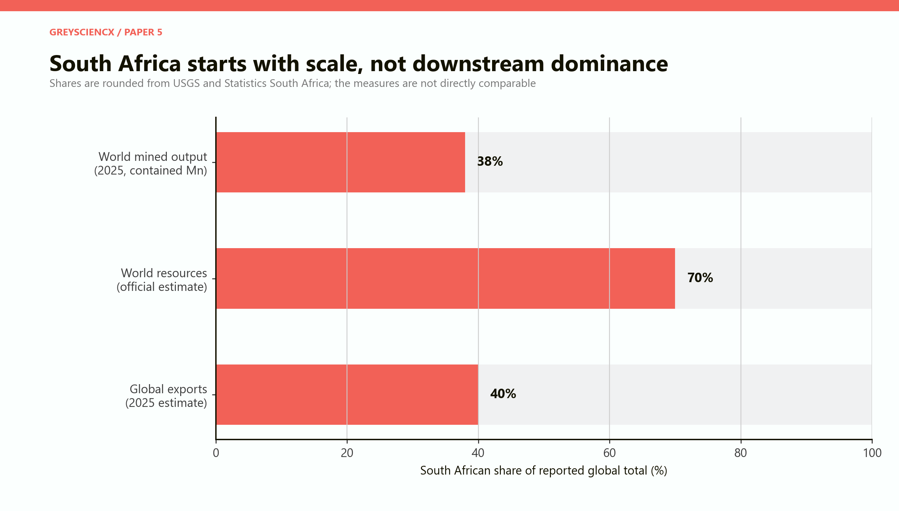

*Figure 1. South Africa has unusual leverage at the mine and export stages. The three shares measure different things, but together they show that mineral scarcity is not the immediate constraint.*

The practical first prize is not a fully national battery, from mine to branded product. It is a **manganese-centred industrial network** with four strong South African positions:

- high-purity manganese metal, oxide and sulphate;
- precursor and cathode material produced with an experienced technology and market partner;
- locally designed packs, battery-management systems, enclosures, power electronics and project integration;
- collection, testing, repurposing and recycling.

Cell manufacturing should remain an option. It becomes a project only after an anchor customer, an experienced operator, a viable chemistry, imported-input arrangements and evidence of sufficient market scale have been secured. A factory announcement cannot substitute for those conditions.

> **The central conclusion:** South Africa should build strategic depth around manganese chemicals and battery systems, not attempt immediate mine-to-cell self-sufficiency. The best first expansion is a qualified 30,000-tonne-a-year HPMSM platform linked to firm offtake. Cathode production should be partner-led. Pack integration and recycling should grow beside it. A 4–6 GWh cell plant is a later, conditional option.

This is not an argument against mining. Ore exports are the cash-generating base, the source of customer relationships and the reason the country matters in manganese at all. Nor is it an argument that every tonne should be beneficiated domestically. Some ore customers will continue to create more value by processing it in locations with cheaper electricity, larger chemical clusters or established steel capacity. The question is how to add a second economy beside the ore-export machine without damaging the first.

## Five findings

**First, the gross-sales tower is real but misleading.** In the paper's central illustration, 1,000 tonnes of contained manganese supports about USD0.5 million of 44 per cent ore sales, USD5.6 million of HPMSM sales, USD133 million of cathode-material sales, USD364 million of cell sales or USD545 million of pack-and-system sales. These are alternative end products, not values to be added. Most of the cell and pack revenue pays for lithium, nickel, graphite, electrolyte, separator film, copper, aluminium, electronics, software, machinery, capital and distribution. It is enabled by manganese; it is not created by manganese alone.

**Second, HPMSM is the clearest first bridge.** South Africa already has mining, hydrometallurgical and high-purity manganese capability. Manganese Metal Company is commissioning a 6,000-tonne-a-year high-purity manganese sulphate monohydrate plant in Mbombela, with qualification volumes expected in the second half of 2026 and an ambition to reach 30,000 tonnes a year. That is a credible brownfield learning path, not a paper megaproject. [Manganese Metal Company, HPMSM project](https://www.mmc.co.za/what-we-do/hpmsm-project).

**Third, qualification and utilisation matter more than nameplate capacity.** The central model assigns a hypothetical 30,000-tonne HPMSM plant R4.5 billion of initial capital and USD1,100 a tonne of operating cost. At 75 per cent utilisation, it requires about USD2,454 a tonne in real product revenue to cover operating cost, annualised capital and sustaining capital. At 90 per cent utilisation the requirement falls to about USD2,228. The paper's deliberately conservative USD1,800 sales case therefore does not clear the full economic cost of the central plant. Lower capital, lower operating cost, premium pricing, grants, concessional capital or higher co-product revenue would be needed.

**Fourth, cell making is the most difficult jump.** China produced more than 80 per cent of battery cells in 2025 and holds dense supply networks across materials, components and equipment. Global nameplate capacity already exceeded 4 TWh, and the International Energy Agency notes that new plants can take more than five years to approach nameplate utilisation. A South African cell plant would enter an oversupplied, rapidly changing market while importing many inputs and much of its equipment. [IEA, *Global EV Outlook 2026: Electric vehicle batteries*](https://www.iea.org/reports/global-ev-outlook-2026/electric-vehicle-batteries).

**Fifth, the strongest policy is staged.** Public support should purchase learning milestones: qualified product, contracted sales, reliable yields, rising local supplier content and safe recycling. It should not purchase idle capacity indefinitely. Every large commitment should be released in tranches and preserve a workable exit if technology, demand or project execution fails.

# PART II: What the chain contains

## From ore to a warranted battery system

A battery economy is not a mine with extra machinery attached. Each stage changes the product, customer, risk and organisation.

**Ore extraction and concentration** produce a bulk mineral product. Commercial success depends on grade, mine cost, rail and port access, product blending and relationships with alloy and chemical customers. The material can tolerate variation that would be unacceptable in a battery chemical.

**Refining and purification** remove unwanted elements and create manganese metal or oxide with controlled chemistry. Electricity, reagents, water and waste treatment become more important. Process discipline begins to matter as much as geology.

**HPMSM** is a battery-grade salt used to make cathode precursors. Its value lies in purity, particle and crystal properties, traceability and repeatability. It must survive a customer's sampling, validation and production trials. A tonne that meets the producer's internal specification but fails the customer's qualification is not equivalent to a saleable tonne.

**Precursor cathode active material and cathode active material**, shortened to pCAM and CAM, combine manganese with nickel, cobalt, iron, phosphate, lithium or other inputs according to chemistry. This is a formulation and manufacturing business. Recipe control, intellectual property, customer relationships and integration with cell makers dominate the decision.

**Battery cells** bring together the cathode, anode, electrolyte, separator, current collectors and casing in a highly controlled process. Yield losses are expensive. A line needs dry rooms, coating, calendaring, slitting, formation, testing and extensive quality systems. A cell that works in a laboratory is not yet a bankable product.

**Packs and systems** combine cells with battery-management electronics, thermal management, enclosures, fire protection, software, power conversion, installation and warranties. This stage is closer to the end user and can reward local knowledge of mines, utilities, telecoms, commercial buildings and African operating conditions.

**Recycling** begins with collection, transport and safe discharge. It includes diagnostics, repurposing and physical or chemical recovery. It can build technical capability before domestic cell manufacturing exists because imported batteries eventually enter the waste stream.

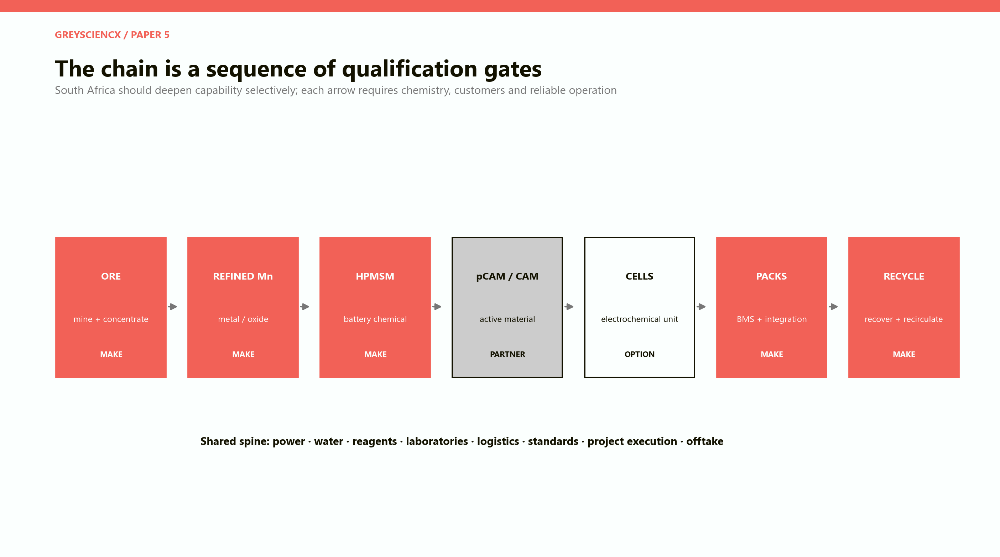

*Figure 2. The proposed sequence is selective. “Make” means build a durable local operating capability; “partner” means share production and learning with an experienced operator; “option” means preserve the possibility without committing before the gates are met.*

## A chain of gates, not a ladder of inevitability

The usual beneficiation picture draws arrows from ore to a finished product and implies that each step naturally follows the previous one. The arrows hide the hard part. A mineral deposit does not supply cathode recipes. A refinery does not create a cell customer. A cheap factory does not create utilisation. Every arrow is a gate.

There are six recurring gates.

**Specification.** Can the product be made within the customer's impurity and consistency limits, not once, but for every batch?

**Yield.** Can the plant reach high saleable output without excessive scrap, reagent use or downtime?

**Offtake.** Is a creditworthy customer willing to purchase enough production for long enough to support financing?

**Input security.** Can the plant obtain reliable electricity, water, reagents, specialist components and logistics at predictable cost?

**Technology access.** Does the operator have the recipes, maintenance practices, process controls and people required to run the facility?

**Bankability.** Are price, exchange-rate, construction, ramp-up and market risks allocated to parties able to carry them?

South Africa's official Critical Minerals and Metals Strategy correctly identifies the upstream bias of the economy and the need for battery hubs. It also acknowledges power, logistics and downstream-capacity constraints. The strategic question is therefore not whether more processing is desirable in the abstract. It is which gates can be cleared in a commercially defensible order. [Department of Mineral and Petroleum Resources, *Critical Minerals and Metals Strategy South Africa 2025*](https://www.gov.za/sites/default/files/gcis_document/202505/critical-minerals-and-metals-strategy-south-africa-2025.pdf).

# PART III: Counting value without fooling ourselves

## The gross-sales illusion

The attraction of downstream manufacturing is visible in the sales price. Ore is sold by the tonne. Battery chemicals command much more per tonne. Cells and packs are sold by energy capacity and service performance. Following the same manganese atoms into a complete system therefore produces a spectacular sales tower.

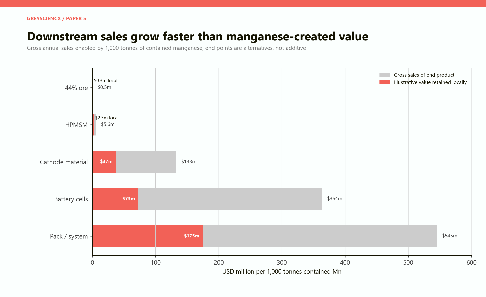

*Figure 3. The grey bars are the sales value of alternative end products enabled by the same contained manganese. The coral bars are an illustrative portion retained as South African value added. The endpoints must not be summed.*

The illustration starts with 1,000 tonnes of contained manganese. At 44 per cent grade it corresponds to about 2,273 tonnes of ore. HPMSM contains roughly one-third manganese, so the same metal content supports about 3,125 tonnes of product. At a representative manganese intensity of 0.22 kilograms per kWh, it could enter cells totalling about 4.5 GWh. A notional cathode product with 11.3 per cent manganese would require about 8,850 tonnes of CAM.

The prices are deliberately round scenario inputs: USD200 a tonne of ore, USD1,800 a tonne of HPMSM, USD15,000 a tonne of cathode material, USD80 per kWh of cells and USD120 per kWh for packs and systems. They are not spot quotes. They provide a common scale for thinking.

The model then asks how much of each end product's sales might remain as local wages, operating surplus, taxes and locally supplied services. It assigns 65 per cent to ore, 45 per cent to HPMSM, 28 per cent to CAM, 20 per cent to cells and 32 per cent to packs and systems. These are assumptions, not observations. They expose a central truth: downstream gross sales can rise much faster than locally retained value when imported inputs, intellectual property and machinery dominate the bill.

A domestically assembled pack containing imported cells can still be valuable. It can employ engineers and technicians, adapt products to local conditions, deepen electronics and fabrication suppliers, earn service revenue and improve energy resilience. But it cannot honestly claim the full pack price as value created by South African manganese.

## Value added, exports and strategic value are different

Three policy objectives are often collapsed into one.

**Value added** measures income created domestically. A business with large sales and expensive imported inputs can have modest local value added.

**Exports** measure foreign sales. Ore can produce large export revenue even when processing is limited. A downstream plant focused on the domestic market can add value without exporting much.

**Strategic value** includes capabilities that improve resilience, learning or future bargaining power. A testing laboratory may have limited direct sales yet enable several factories. A recycling network may initially be small but provide feedstock knowledge and traceability.

These objectives sometimes reinforce one another and sometimes conflict. A disciplined industrial policy states which one is being purchased. It does not attach the word “beneficiation” to all three.

# PART IV: Seven illustrative industrial modules

## The model is a comparison device, not a feasibility study

The paper constructs seven standalone modules in constant 2026 rand. They are deliberately sized as plausible first projects rather than as a physically balanced national chain. A 5-million-tonne mine, a 30,000-tonne HPMSM plant and a 5 GWh cell plant cannot be summed as if they process the same feed. Each is a separate industrial choice.

| Module | Illustrative scale | Capital | Annual sales | Annual local value | Direct jobs |
|---|---:|---:|---:|---:|---:|
| Ore extraction | 5 Mt ore | R10.0bn | R18.0bn | R9.0bn | 2,000 |
| High-purity manganese | 100 kt | R8.0bn | R4.0bn | R1.8bn | 500 |
| HPMSM | 30 kt | R4.5bn | R0.97bn | R0.44bn | 180 |
| pCAM / CAM | 20 kt | R7.0bn | R5.4bn | R1.5bn | 450 |
| Battery cells | 5 GWh | R18.0bn | R7.2bn | R1.44bn | 900 |
| Packs and systems | 2 GWh | R3.0bn | R4.32bn | R1.51bn | 500 |
| Recycling | 10 kt feed | R2.0bn | R0.54bn | R0.32bn | 250 |

The values are engineering-economic assumptions, not plant quotations or investment recommendations. Direct jobs exclude construction, suppliers and induced employment. Exports assume different domestic and foreign sales mixes. Energy, water and freight estimates are order-of-magnitude stress tests. Their purpose is to force consistency: a proposal cannot claim high output, tiny capital, negligible resource use and large employment without revealing how.

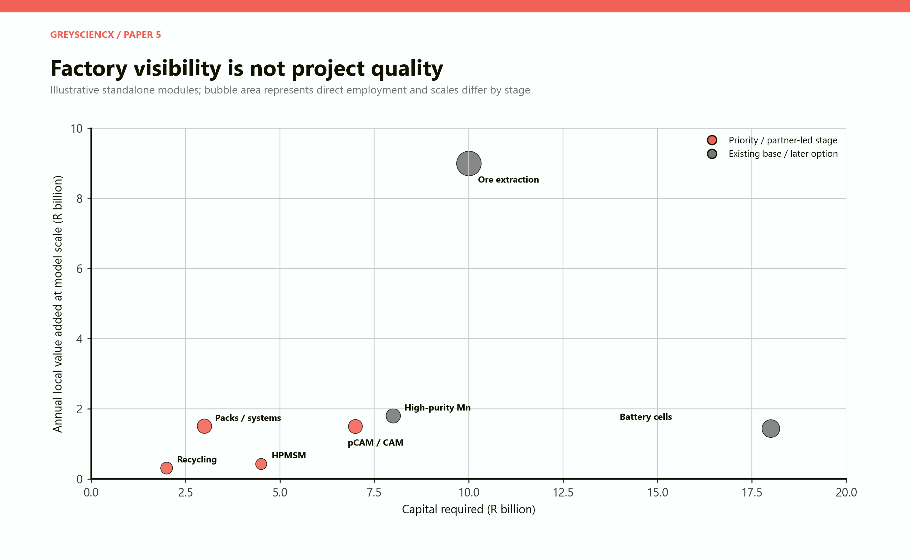

*Figure 4. The mine generates the largest local value in the chosen scale because it is already a very large operation. Cells absorb the most capital while creating modest local value if imported inputs remain dominant. Pack integration and recycling are smaller, more job-dense layers.*

## What the modules imply

**Mining remains economically formidable.** In the central module, the mine requires R10 billion and produces R18 billion of annual sales, R15 billion of exports and R9 billion of local value. This is not a claim that every new mine will earn such returns. It shows why policymakers should not describe ore exports as economically empty. Mining finances wages, taxes, procurement, rail and foreign exchange.

**High-purity manganese is power-sensitive.** A 100,000-tonne metal or intermediate facility is assigned 700 GWh of annual electricity, far more per rand of sales than the other modules. USGS reports that South African manganese-alloy output fell to 182,100 tonnes in 2024 from 197,000 tonnes as high power costs persisted. An industrial strategy that ignores electricity price and reliability is not a strategy. [USGS South Africa minerals profile](https://www.usgs.gov/centers/national-minerals-information-center/south-africa).

**HPMSM is strategically clean but commercially unforgiving.** The modelled plant is small relative to mining and has only 180 direct jobs. Its importance is not mass employment. It creates an exacting chemical capability, connects South African manganese to battery customers and can serve as the first qualification platform. Its economics, however, are fragile at low utilisation or low prices.

**Cathode material needs a partner.** A 20,000-tonne pCAM or CAM facility has better value density than ore and a manageable physical scale. Yet chemistry know-how and customer qualification dominate. A joint venture that embeds an experienced operator and guaranteed market access may retain less nominal ownership but create more actual local value than a wholly domestic plant that cannot sell.

**Cells are capital-intensive and input-hungry.** The 5 GWh module requires R18 billion, more than any other, while only a fifth of revenue is assumed to remain as local value. This reflects imported cathode or precursor material, anode material, separator, electrolyte, equipment, software and specialist services. The assumption can improve over time, but only if a supplier base develops.

**Packs and systems are closer to customers.** They combine imported or local cells with South African engineering, enclosures, controls, power electronics, software, installation and maintenance. This creates more direct jobs per unit of capital than cell production in the illustration. It also permits chemistry-neutral capability: an integrator can choose the best cell while retaining system design and service locally.

**Recycling is an early capability, not a distant afterthought.** Collection, safe handling, diagnostics and second-life decisions can begin with imported batteries. Scale will initially be limited, and end-of-life feedstock will arrive slowly because battery lifetimes are long. The value is learning the material flows before they become a crisis.

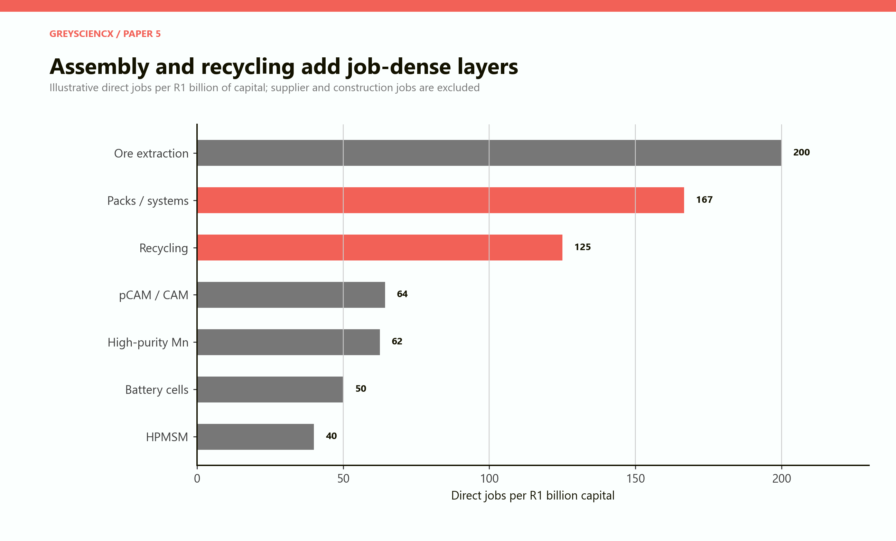

*Figure 5. Direct operating employment is only one objective. Ore mining is job-dense at the chosen scale, while packs and recycling add comparatively job-dense downstream layers. HPMSM is a capability investment rather than a mass-employment programme.*

# PART V: Power, water and logistics

## The bottleneck changes as value density rises

Ore is bulky. The paper's mining module moves 5 million tonnes of outbound product a year. At its model sales level that is almost 278 outbound tonnes per R1 million of revenue. pCAM and CAM move fewer than five tonnes for the same sales value. Processing therefore reduces exposure to bulk rail and port capacity.

It does not remove infrastructure dependence. It changes the dependence.

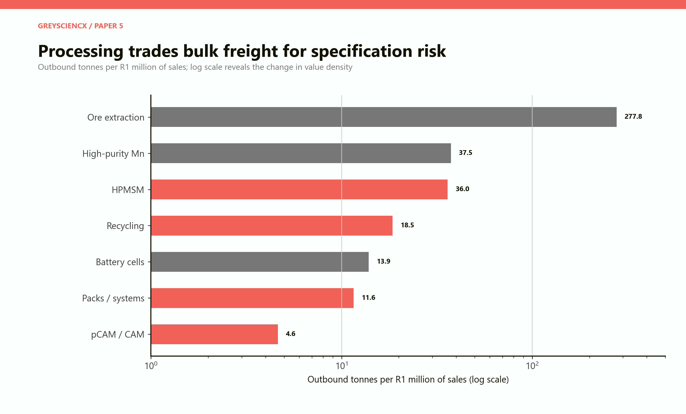

*Figure 6. Downstream products have much higher value density. The trade-off is less bulk logistics and more exposure to purity, hazardous-chemical handling, punctual delivery and customer qualification.*

HPMSM and cathode materials depend on reliable inbound reagents, clean water, effluent treatment and containerised export logistics. Cells require controlled environments and reliable power quality. A brief interruption can destroy work in progress or force lengthy requalification. Packs require dependable imported-cell delivery until local cells exist. Recycling requires safe reverse logistics and clear rules for ownership and transport of hazardous waste.

The model expresses energy and water relative to sales so that stage differences are visible. High-purity manganese is the most electricity-exposed module. HPMSM is more water-intensive relative to its revenue because washing, crystallisation and effluent treatment matter. Pack assembly has low process-energy and water demand, although the upstream cells embody substantial resources outside the system boundary.

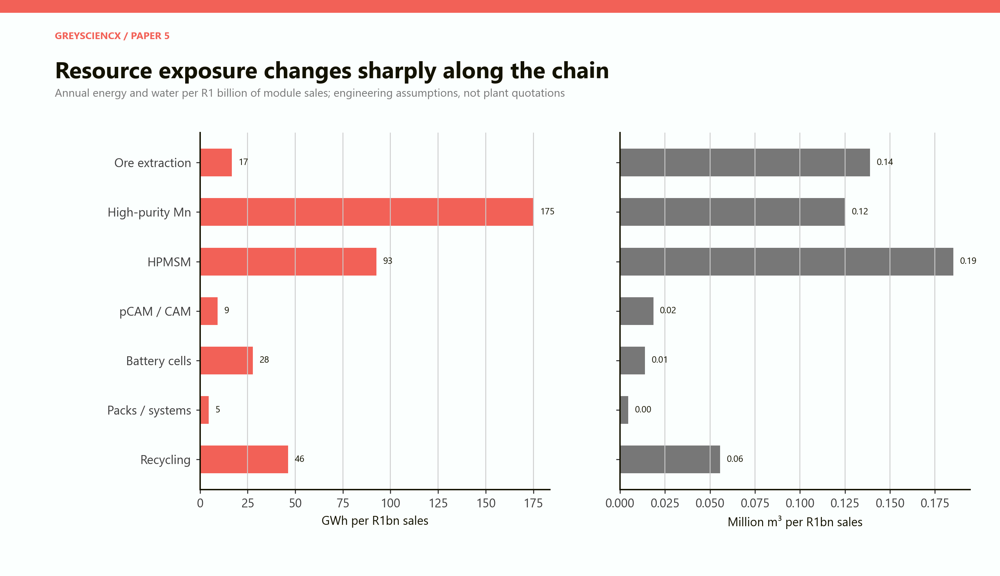

*Figure 7. Resource intensity is measured inside each module boundary. Low pack-assembly energy does not mean the cells were produced without energy; it means that energy was consumed upstream, often abroad.*

The policy implication is precise. Battery-material plants need industrial-grade services, not generic promises of capacity. A credible site must disclose contracted power, outage protection, delivered water, treatment capacity, reagent logistics, waste permits, rail or road access and emergency response. Shared infrastructure can lower the cost for several producers, but it also creates correlated failure if poorly governed.

The South African Renewable Energy Masterplan describes an existing base in mineral refining, casing and assembly, battery-management and energy-management systems, and recycling, while acknowledging that lithium-ion cells are primarily imported and that the economic viability of local cell production still needs to be established. That is the right starting diagnosis. [Department of Electricity and Energy, *South African Renewable Energy Masterplan*, 2025](https://www.gov.za/sites/default/files/gcis_document/202506/south-african-renewable-energy-masterplan.pdf).

# PART VI: The HPMSM bridge

## Why this chemical deserves priority

HPMSM sits close enough to South Africa's existing competence to be plausible and close enough to battery manufacturing to create new relationships. It is also a concentrated market. The IEA estimated in 2025 that China produced about 95 per cent of battery-grade manganese sulphate. Announced projects covered only about 55 per cent of expected 2035 demand in its stated-policies scenario. That creates a diversification argument for producers outside China, although it does not guarantee that they will be competitive. [IEA, *Beyond NMC batteries: supply-chain issues for emerging battery technologies*](https://www.iea.org/reports/global-critical-minerals-outlook-2025/beyond-nmc-batteries-supply-chain-issues-for-emerging-battery-technologies).

Manganese Metal Company's Mbombela project offers a practical route. It begins at 6,000 tonnes a year, plans qualification volumes in the second half of 2026 and envisages expansion to 30,000 tonnes. Because it builds beside existing high-purity electrolytic manganese metal capability, it can use operating knowledge, site services and a known organisation. [Manganese Metal Company, HPMSM project](https://www.mmc.co.za/what-we-do/hpmsm-project).

This brownfield path has three advantages over a greenfield leap.

First, customer qualification occurs at a scale where failure is survivable. Second, capital can follow contracted demand rather than precede it. Third, the country can discover its true reagent, energy, yield and logistics costs before committing to much larger capacity.

## A deliberately demanding break-even test

The central stress test assumes a 30,000-tonne annual plant, R4.5 billion initial capital, USD1,100 a tonne operating cost, 20 years of operation, an 8 per cent real cost of capital and annual sustaining capital equal to 2 per cent of initial investment. It converts dollars at R18. These are model inputs, not a company forecast.

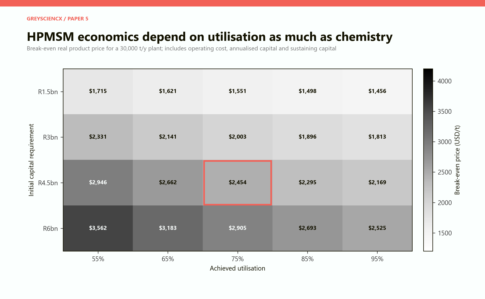

*Figure 8. The coral outline is the central R4.5 billion, 75 per cent utilisation case. Reducing capital and filling the plant lower the required product price dramatically.*

The result is uncomfortable by design. At R4.5 billion and 75 per cent utilisation, the plant requires roughly USD2,454 a tonne. At 90 per cent utilisation it still requires roughly USD2,228. The central sales assumption of USD1,800 does not cover the full economic cost. A low external sponsor case of USD1,419 is far below it; a high sponsor case of USD3,220 clears it.

These external numbers are not apples-to-apples market observations. A 2024 feasibility announcement for a China-based 50,000-tonne battery-grade manganese sulphate plant cited capital of about USD83.5 million, excluding working capital, while an earlier sponsor study used a product price of USD1,419 and operating cost of USD659 a tonne. Giyani Metals' 2026 K.Hill disclosure in Botswana uses an average realised HPMSM price of USD3,220 and initial capital of USD535 million for a much larger integrated project. The dispersion is the point: feedstock, location, scope, price definition, co-products and sponsor assumptions can dominate the answer. [Firebird Metals feasibility announcement, October 2024](https://announcements.asx.com.au/asxpdf/20241028/pdf/069n5ngj0tykvc.pdf); [Firebird Metals study assumptions, November 2023](https://announcements.asx.com.au/asxpdf/20231121/pdf/05xkxrsg8yb1pq.pdf); [Giyani Metals, K.Hill project](https://giyanimetals.com/projects/k-hill-project/).

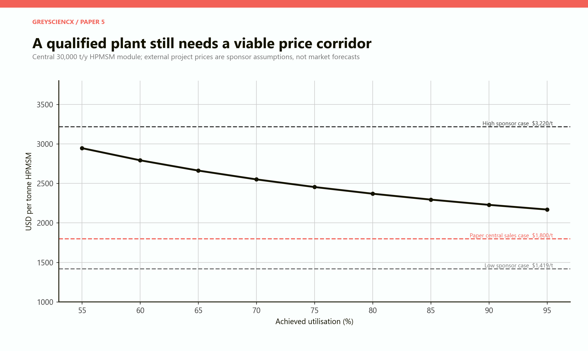

*Figure 9. External sponsor price cases span both sides of the modelled cost curve. No single number should be treated as the market price; bankability depends on the contract actually available to the project.*

The correct public response is not to select the most optimistic price. It is to require a price-and-volume contract, independent technical review and downside protection. Support can be justified for first-of-a-kind learning, customer qualification or shared infrastructure. It should be capped and contingent. If the project only works when all risks are socialised and all upside remains private, it is not an industrial strategy; it is a transfer.

# PART VII: Cathodes, cells and chemistry risk

## Manganese demand can grow without choosing one winner

Manganese appears in familiar nickel-manganese-cobalt cathodes, but chemistry is changing. Lithium iron phosphate has gained share because it is cheaper and avoids nickel and cobalt. In 2025, the IEA estimated that LFP battery packs were more than 40 per cent cheaper than NMC packs. Manganese-rich lithium-ion and sodium-ion chemistries could widen manganese demand, while LMFP adds manganese to the LFP family. None is guaranteed to dominate every vehicle and storage application. [IEA, *Global EV Outlook 2026: Electric vehicle batteries*](https://www.iea.org/reports/global-ev-outlook-2026/electric-vehicle-batteries); [IEA, emerging battery chemistries](https://www.iea.org/reports/global-critical-minerals-outlook-2025/beyond-nmc-batteries-supply-chain-issues-for-emerging-battery-technologies).

South Africa should therefore invest in **chemistry optionality**:

- purification processes that can serve more than one downstream recipe;
- pilot and analytical facilities able to test NMC, LMFP, high-manganese and sodium-ion materials;
- contracts that do not lock public support to one chemistry for decades;
- pack and system capability that can adopt whichever cell wins an application;
- recycling processes that can handle changing feedstock.

This does not mean remaining indecisive. A commercial plant must select a product. It means designing the surrounding institutions so that the country is not stranded if that product loses market share.

## Why pCAM and CAM should be partner-led

The midstream is attractive because value density rises and transport volume falls. It is difficult because the customer is normally a cell producer with a qualified recipe and demanding audit process. A technology partner can contribute three scarce assets: process knowledge, a customer pipeline and credibility during ramp-up.

The partnership should not be a black box. Public support should require a skills plan, local analytical capability, access to operating data, supplier development and a route to greater local decision-making. South Africa should acquire the ability to run and improve the plant, not merely provide land, power and workers to a sealed process.

## Why cells should wait at the gate

Cell manufacturing attracts attention because it is the iconic factory. It is also where scale, yield and supply-chain density become most unforgiving.

The global industry entered 2026 with more than 4 TWh of annual nameplate capacity and substantial excess capacity. China held more than 80 per cent of capacity and output; China, Japan and Korea together produced nearly all cells. The IEA has also observed that production facilities in the United States and European Union can cost 70–130 per cent more per unit of capacity than those in China before financing costs. [IEA, *Global EV Outlook 2026*](https://www.iea.org/reports/global-ev-outlook-2026/electric-vehicle-batteries); [IEA, *Advancing Clean Technology Manufacturing*](https://www.iea.org/reports/advancing-clean-technology-manufacturing/executive-summary).

A 5 GWh South African plant is therefore not simply a construction project. It is a long ramp against experienced Asian incumbents. It needs a buyer willing to qualify and absorb several gigawatt-hours, an operator that has commissioned similar lines, a competitive input bundle, and enough cash to survive low initial yields.

Foreign policy also matters. The United States offers a production tax credit of USD35 per kWh for eligible cells, a scale of support large enough to offset significant conversion and capital costs in some cases. South Africa cannot assume that its factory competes only with private cost. It competes with other states' industrial policies. [US Department of Energy, *2021–2024 Four-Year Review of Supply Chains for the Advanced Batteries Sector*](https://www.energy.gov/sites/default/files/2024-12/20212024-Four%20Year%20Review%20of%20Supply%20Chains%20for%20the%20Advanced%20Batteries%20Sector.pdf).

The Industrial Development Corporation's 2026 corporate plan describes battery-grade precursor materials as a near-term foundation for a possible 4–6 GWh gigafactory and explicitly emphasises partnerships, blended finance, technology and market access. The size is plausible as an option. The sequencing conditions are the important part. [IDC, *Corporate Plan 2026*](https://www.thedtic.gov.za/wp-content/uploads/IDC_Corporate-Plan.pdf).

# PART VIII: The African market

## A regional market must be made visible before it can anchor factories

Africa needs batteries for electricity grids, solar mini-grids, telecoms, mines, commercial backup, electric two- and three-wheelers, buses, industrial vehicles and eventually passenger cars. The demand is fragmented across countries, technologies, currencies and procurement systems. A factory does not finance against a continental slogan. It finances against orders.

The model therefore uses scenarios rather than a forecast. Annual addressable demand is set at 5, 12 or 25 GWh in 2030; 15, 45 or 90 GWh in 2040; and 30, 90 or 180 GWh in 2050. The range is intentionally wide. A World Bank study estimated African mini-grid battery demand at roughly 180 MWh in 2021 and projected 3.6 GWh by 2030. That older benchmark covers only mini-grids and should not be mistaken for total African battery demand. [World Bank, *Battery storage in African mini grids*](https://documents1.worldbank.org/curated/en/099121323112040367/pdf/P1710100aea43a0ae0a038034d730b04087.pdf).

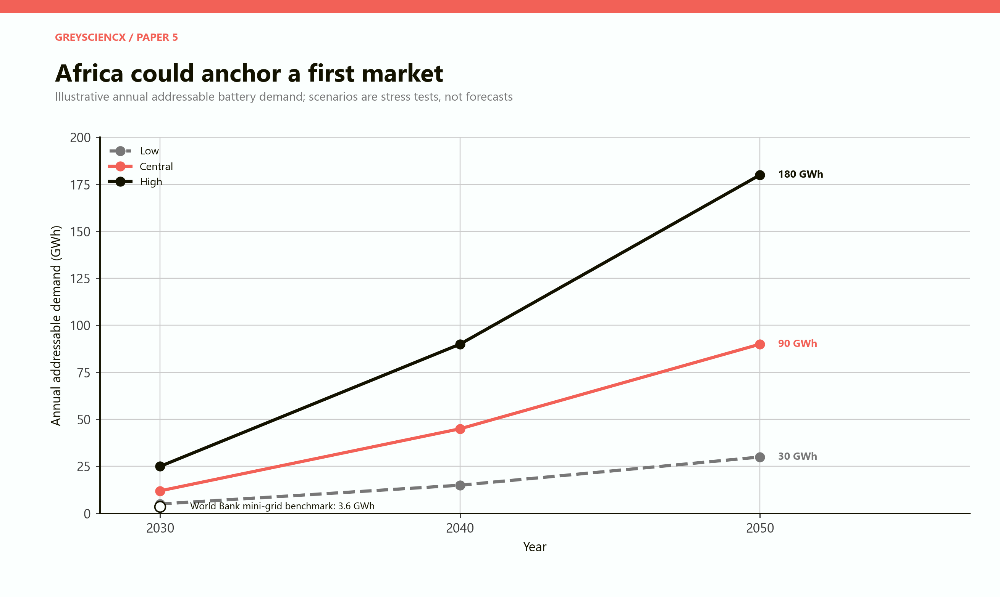

*Figure 10. The scenarios do not predict the market. They reveal that a 5 GWh cell plant could be either modest or larger than the accessible regional market depending on deployment, procurement and competition.*

The central 2030 scenario can support several gigawatt-hours of regional supply, but it does not automatically support a South African cell line. Some applications will use imported LFP cells because they are cheaper. Some purchases will be financed by donors or developers with approved vendor lists. Some projects will be too small or intermittent to aggregate.

The missing institution is a **demand aggregator**. Public utilities, mines, telecoms operators, municipalities, independent power producers and development-finance institutions could publish standardised forward procurement needs. Tenders should specify performance and safety while rewarding service, repairability, traceability and local system integration. This creates a visible market without mandating an uncompetitive cell.

AfCFTA can enlarge the commercial field, while South Africa's 150 per cent qualifying capital allowance for new-energy vehicles and battery manufacturing from March 2026 improves the investment proposition. These advantages do not eliminate border friction, currency risk or local-content conflicts. They work only with practical trade logistics and interoperable standards. [InvestSA, clean technology and component manufacturing](https://www.investsa.gov.za/key-sectors/clean-technology-component-manufacturing/).

# PART IX: Four industrial strategies

## What R50 billion could be asked to do

To expose trade-offs, the model compares four illustrative R50 billion portfolios. The figures are not budget proposals. Each portfolio scales combinations of the seven modules and applies a haircut for utilisation, market access and execution risk.

**Ore-heavy** expands mines and logistics, with limited downstream capability. It produces the highest near-term exports and slightly more direct jobs in the chosen assumptions. It remains exposed to commodity prices and captures less learning.

**Chemicals-first** prioritises purification and HPMSM. It deepens a defensible capability but produces less local value initially because the plants are smaller and the HPMSM central case is commercially tight.

**Partnered midstream** combines ore, qualified chemicals, a pCAM/CAM joint venture, packs, system integration, laboratories and recycling. It creates the highest risk-adjusted local value in the model while retaining almost as many jobs as ore-heavy. Its weakness is organisational: it requires several projects and genuine partnerships rather than one visible asset.

**Cell-first** devotes a large share to a 5 GWh factory before the supplier and customer base is mature. The utilisation and market-access haircut produces the weakest outcome across all three measures.

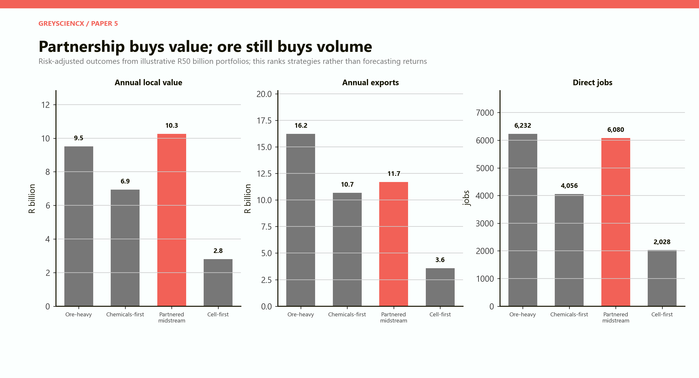

*Figure 11. Ore-heavy wins near-term export volume; partnered midstream narrowly leads modelled local value. Cell-first performs poorly because expensive capacity is committed before utilisation and supply-chain conditions are proven.*

# PART X: Policy architecture

## Support milestones, not narratives

A manganese-to-battery policy should be built around seven instruments.

**1. Qualification finance.** Fund pilot batches, customer trials, analytical work and certification. This is small relative to factory capital and directly addresses the barrier between technical product and commercial sale.

**2. Conditional scale-up capital.** Release support in tranches after minimum yield, quality, offtake and utilisation milestones. Use a mixture of equity, loans, guarantees and grants so that risk is visible.

**3. Shared industrial infrastructure.** Develop reliable power, water treatment, chemical handling, laboratories and emergency services in a governed battery-materials node. Price services transparently rather than hiding permanent subsidies.

**4. Partnered midstream investment.** Require technology transfer, training, local analytical capability and customer access from pCAM or CAM partners. Do not require nominal local ownership that makes the project unbankable.

**5. Demand aggregation.** Publish a rolling pipeline of grid, municipal, mine, telecoms and transport battery demand. Standardise procurement where possible and prevent each small buyer from reinventing technical requirements.

**6. Chemistry-neutral systems support.** Encourage packs, battery-management systems, fire protection, integration, software and maintenance regardless of whether the underlying cell is NMC, LFP, LMFP, sodium-ion or another safe technology.

**7. Producer responsibility and traceability.** Build collection and end-of-life rules early. A battery passport, safe-transport regime and accredited testing network can turn future waste into feedstock.

## What government should refuse

The discipline of refusal is part of industrial policy.

Government should refuse projects with no named technology operator, no credible customer, no transparent imported-input plan, no ramp-up cash, no resource contract or no route to safe closure. It should refuse to report total product sales as local value added. It should refuse to count temporary construction jobs as permanent operating employment. It should refuse permanent operating subsidies whose size rises when the plant underperforms.

It should also refuse a false choice between ore exports and manufacturing. The ore base should continue while selected downstream stages earn scale. A ban on raw exports can simply reduce mine output, tax revenue and logistics utilisation if domestic processors are not competitive.

# PART XI: A ten-year sequence

## Earn the right to move downstream

The recommended sequence begins immediately with activities that are valuable under almost every market outcome and delays irreversible commitments.

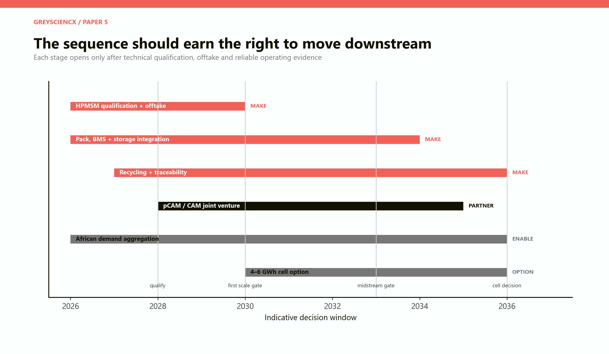

*Figure 12. The dates are decision windows, not promises. The cell option begins as preparation in 2030 and becomes an investment decision only after market, partnership and midstream gates are satisfied.*

**2026–2028: qualify and reveal costs.** Commission the initial HPMSM line, deliver customer samples and publish verified operating ranges. Map domestic and regional battery demand. Establish common safety, testing and traceability rules. Expand pack, software and storage-system integration. Begin accredited collection and diagnostics for used batteries.

**2028–2030: scale the chemical bridge.** Expand toward 30,000 tonnes of HPMSM only against qualification and offtake. Develop shared water, effluent and laboratory infrastructure. Select a pCAM/CAM partner through a process that weights operating record and customer access above promised capital alone.

**2030–2033: prove the midstream.** Commission a partner-led cathode-material line in stages. Increase local reagent, maintenance, instrumentation and engineering supply. Use regional grid and industrial procurement to create a visible demand pool. Continue importing cells while local systems firms learn across chemistries.

**2033–2036: take the cell decision.** Proceed with a 4–6 GWh cell plant only if three conditions are present: contracted multi-year demand sufficient to support high utilisation, an operator with successful lines, and a financing structure that survives a slow yield ramp. If these are absent, continue importing cells and deepen the more defensible stages.

This sequence is not timid. It is an aggressive attempt to learn without making national success depend on a single factory.

# PART XII: Risks and verdict

## The downside cases

**Price compression.** China's scale and excess capacity can push down the value of HPMSM, cathode material and cells. The 2025 average spot price of 44 per cent manganese ore was already 22 per cent below 2024 through October, according to USGS. Downstream prices are not protected from cycles. [USGS, *Mineral Commodity Summaries 2026*](https://pubs.usgs.gov/periodicals/mcs2026/mcs2026.pdf).

**Chemistry displacement.** If LFP remains dominant and manganese-rich chemistries grow slowly, high-purity manganese demand may disappoint. A strategy tied to one cathode formula becomes brittle.

**Execution failure.** Delayed construction, low yields, poor maintenance or weak governance can erase theoretical cost advantage. Battery materials punish inconsistency.

**Infrastructure failure.** Expensive or unreliable power damages high-purity refining and cells. Water and effluent constraints can cap chemical output. Port and customs delays can break customer schedules even when bulk tonnage is low.

**Policy competition.** Rich economies can subsidise production at levels South Africa cannot match. The answer is to choose stages with genuine advantages, not to imitate every incentive.

**Enclave industrialisation.** A plant can operate successfully while importing nearly everything and sharing little knowledge. Supplier, skills and data conditions must be designed before support is awarded.

**Environmental burden.** More local processing means more chemical handling, waste, water use and closure liabilities. These costs must be internalised rather than presented as somebody else's problem.

## The verdict

South Africa has enough manganese to matter globally for decades. What it lacks is not a compelling beneficiation story. It lacks a proven route through qualification, scale, offtake and operating discipline.

The route is visible.

Keep the ore-export engine. Use existing high-purity capability to build a qualified HPMSM platform. Add cathode materials only with a technology and market partner. Expand packs, battery-management systems, power electronics, integration and service because they are close to African customers and adaptable across chemistries. Begin recycling before domestic cells exist. Treat the cell factory as a gated option, not the foundation of the plan.

The deepest economic insight is that ownership of the mineral does not confer ownership of the chain. Value is captured by whoever solves the next customer's problem repeatedly and at scale. For South Africa, the manganese-to-battery economy begins when it can deliver a qualified chemical on time, integrate a reliable system and recover the material at end of life. The flag on the cell can come later.

# Model assumptions and interpretation

## What is included

The model is a transparent scenario workbook expressed in code. It uses constant 2026 rand and a fixed analytical exchange rate of R18 per US dollar. It contains three linked comparisons:

- a product ladder normalised to 1,000 tonnes of contained manganese;
- seven independently sized industrial modules;
- a 30,000-tonne HPMSM break-even stress test and four R50 billion strategy portfolios.

The product ladder uses 44 per cent ore grade, approximately 32 per cent manganese in HPMSM, 11.3 per cent manganese in a representative cathode product and 0.22 kilograms of manganese per kWh of cells. Prices are scenario inputs rather than market observations. Local-value shares represent assumed domestic wages, operating surplus, tax and procurement within the selected boundary.

The HPMSM test uses 20 years, an 8 per cent real capital charge, sustaining capital equal to 2 per cent of initial capital and USD1,100 a tonne operating cost. It excludes tax, working-capital timing, financing fees and co-product credits. This makes it a screening test, not a project valuation.

The seven modules use direct operating jobs. Construction and multiplier effects are excluded because they are easy to exaggerate and cannot be compared cleanly across stages. Energy, water and freight figures are illustrative engineering orders of magnitude.

## What should not be inferred

The output is not a forecast of commodity prices, demand, company profits, fiscal revenue or GDP. It does not value environmental damage or mine depletion. It does not select a plant site. It does not certify any technology. It does not claim that a representative chemistry will dominate.

The product-ladder endpoints cannot be added. The modules cannot be assembled into a mass-balanced complex without further engineering. The strategy portfolios are rankings under stated assumptions, not investment returns. Changing utilisation, imported-input shares, product price or capital cost can reverse conclusions.

That sensitivity is intentional. The model is most useful when a proposal replaces its assumptions with contracted prices, independently reviewed capital, plant-specific resource requirements and customer qualification data.

# Sources

## Primary and institutional references

- Department of Electricity and Energy. *South African Renewable Energy Masterplan*, 2025. [Official PDF](https://www.gov.za/sites/default/files/gcis_document/202506/south-african-renewable-energy-masterplan.pdf).

- Department of Mineral and Petroleum Resources. *Critical Minerals and Metals Strategy South Africa 2025*. [Official PDF](https://www.gov.za/sites/default/files/gcis_document/202505/critical-minerals-and-metals-strategy-south-africa-2025.pdf).

- Industrial Development Corporation. *Corporate Plan 2026*. [Official PDF](https://www.thedtic.gov.za/wp-content/uploads/IDC_Corporate-Plan.pdf).

- International Energy Agency. *Advancing Clean Technology Manufacturing*. [Executive summary](https://www.iea.org/reports/advancing-clean-technology-manufacturing/executive-summary).

- International Energy Agency. *Beyond NMC batteries: supply-chain issues for emerging battery technologies*, 2025. [IEA analysis](https://www.iea.org/reports/global-critical-minerals-outlook-2025/beyond-nmc-batteries-supply-chain-issues-for-emerging-battery-technologies).

- International Energy Agency. *Global EV Outlook 2025: Electric vehicle batteries*. [IEA analysis](https://www.iea.org/reports/global-ev-outlook-2025/electric-vehicle-batteries).

- International Energy Agency. *Global EV Outlook 2026: Electric vehicle batteries*. [IEA analysis](https://www.iea.org/reports/global-ev-outlook-2026/electric-vehicle-batteries).

- International Energy Agency. *Global battery markets are growing strongly – and so are the supply risks*. [IEA commentary](https://www.iea.org/commentaries/global-battery-markets-are-growing-strongly-and-so-are-the-supply-risks).

- InvestSA. *Clean technology and component manufacturing*. [Investment profile](https://www.investsa.gov.za/key-sectors/clean-technology-component-manufacturing/).

- Statistics South Africa. *Mbalo Brief*, February 2026. [Official PDF](https://www.statssa.gov.za/publications/MbaloBrief/MbaloBriefFebruary2026.pdf).

- US Department of Energy. *2021–2024 Four-Year Review of Supply Chains for the Advanced Batteries Sector*. [Official PDF](https://www.energy.gov/sites/default/files/2024-12/20212024-Four%20Year%20Review%20of%20Supply%20Chains%20for%20the%20Advanced%20Batteries%20Sector.pdf).

- US Geological Survey. *Mineral Commodity Summaries 2026*. [Official PDF](https://pubs.usgs.gov/periodicals/mcs2026/mcs2026.pdf).

- US Geological Survey. *South Africa minerals profile*. [Country page](https://www.usgs.gov/centers/national-minerals-information-center/south-africa).

- World Bank. *Battery storage in African mini grids*. [Official PDF](https://documents1.worldbank.org/curated/en/099121323112040367/pdf/P1710100aea43a0ae0a038034d730b04087.pdf).

## Company and project disclosures

- Firebird Metals. Feasibility-study announcement, October 2024. [ASX PDF](https://announcements.asx.com.au/asxpdf/20241028/pdf/069n5ngj0tykvc.pdf).

- Firebird Metals. Study assumptions, November 2023. [ASX PDF](https://announcements.asx.com.au/asxpdf/20231121/pdf/05xkxrsg8yb1pq.pdf).

- Giyani Metals. *K.Hill project*. [Project disclosure](https://giyanimetals.com/projects/k-hill-project/).

- Manganese Metal Company. *HPMSM project*. [Company project page](https://www.mmc.co.za/what-we-do/hpmsm-project).

Company disclosures are used as project-specific examples and sponsor assumptions, not as independent market forecasts. Sources and model inputs were reviewed in September 2026.
