# The Platinum-to-Hydrogen Economy

## Can South Africa turn PGM dominance into globally competitive catalysts, fuel-cell systems and electrolysers?

# PART I: The answer

## Own the difficult components before trying to own the whole hydrogen economy

South Africa possesses the strongest possible starting point for a platinum-based hydrogen industry: the metal itself. The United States Geological Survey estimates that the country mined about 120,000 kilograms of platinum in 2025, roughly 71 per cent of reported world output, and holds about 63 million kilograms of platinum-group-metal reserves. That is more than four-fifths of the reported global reserve base. Yet geological dominance does not automatically become manufacturing dominance. A mine supplies atoms; a competitive industrial system also needs chemistry, intellectual property, reliable production, qualification, customers, finance, electricity and service capability. [USGS, *Mineral Commodity Summaries 2026*](https://pubs.usgs.gov/periodicals/mcs2026/mcs2026.pdf).

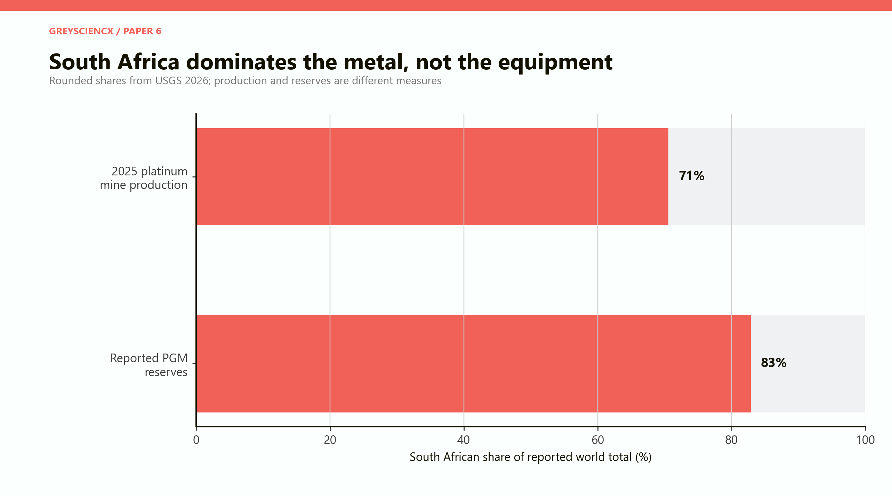

*Figure 1. South Africa dominates platinum supply and the reported PGM reserve base. The figures use different denominators, but together they establish the country’s exceptional upstream position.*

The attractive story runs from platinum mine to catalyst, electrolyser, fuel cell, green-hydrogen plant and export terminal. It is technically possible but commercially misleading. Catalyst chemistry, precision coating, stack manufacture, system integration, hydrogen production and transport are different businesses with different customers and risks.

South Africa should therefore pursue a selective platinum-to-hydrogen economy, not a compulsory mine-to-molecule chain.

> **The central conclusion:** The country should build a globally qualified PGM-component platform—precursor salts, catalysts, inks, catalyst-coated membranes, membrane-electrode assemblies, testing and closed-loop recycling—then use domestic anchor markets to develop selected fuel-cell and electrolyser systems. Commodity-scale electrolyser assembly and green-hydrogen exports should proceed only where customers, technology partners and low-cost electricity are already contracted.

The sequence is simple: protect mining and refining; qualify catalysts and MEAs; add testing and recycling; develop systems around concentrated domestic users; expand complete electrolysers only after orders and yield are proven; and finance hydrogen production on its own energy economics. This is less cinematic than a hydrogen valley, but harder to displace.

## Six findings

**First, platinum ownership creates leverage, not automatic competitiveness.** Customers buy performance, durability, consistency and a warranty. South Africa must convert resource security into trusted products.

**Second, downstream sales are large but cannot be attributed entirely to platinum.** One kilogram is worth about USD38,600 as refined metal in the model, but can enable USD3.2 million of complete fuel-cell systems. The endpoints are alternatives, not a sum, and most system revenue pays for non-PGM components and services.

**Third, components offer a better early balance of capital, capability and market reach.** Catalyst, MEA and recycling modules require less capital than a gigawatt factory or hydrogen project. They are not mass employers, but they are exportable and knowledge-dense.

**Fourth, hydrogen demand is large but clean hydrogen remains tiny.** The IEA estimates that demand exceeded 100 million tonnes in 2025, while low-emissions supply was about 1 million tonnes. The transition market exists, but is not yet a mass market. [IEA, *Global Hydrogen Review 2026: Executive summary*](https://www.iea.org/reports/global-hydrogen-review-2026/executive-summary); [IEA, *Global Hydrogen Review 2026: Demand*](https://www.iea.org/reports/global-hydrogen-review-2026/demand).

**Fifth, using less PGM is both threat and route to scale.** US Department of Energy targets move from about 0.8 grams of PGM per kilowatt in 2022 toward 0.1 grams in 2026 and ultimately 0.03 grams. South Africa should sell the technology that economises on scarce iridium, not defend high loadings that shrink the market. [US Department of Energy, PEM electrolysis technical targets](https://www.energy.gov/cmei/fuels/technical-targets-proton-exchange-membrane-electrolysis).

**Sixth, nearby platinum does not make hydrogen cheap.** A central 100 MW project with R8 billion of integrated capital, 65 per cent utilisation and R0.75/kWh electricity breaks even near USD8.25/kg. Capital utilisation and power overwhelm the electrolyser’s PGM value.

# PART II: What the value chain actually contains

## From ore to a warranted machine

The phrase “platinum beneficiation” makes the chain sound like a sequence of furnaces. In reality, the further downstream the country moves, the less the business resembles mining.

**Mining and concentration** recover an ore containing several platinum-group metals and base metals. Deep shafts, labour, electricity, safety, geology and ore grades dominate economics. The metals occur together, so the supply of one is partly determined by the economics of the others.

**Smelting and refining** separate and purify platinum, palladium, rhodium, iridium and related metals. This is capital-intensive process industry. South Africa already possesses important refining capability, although electricity reliability, maintenance and logistics remain material constraints.

**Precursors and catalyst powders** convert high-purity metal into chemical compounds or nanoscale particles supported on carbon or oxides. Performance depends on particle size, surface area, dispersion, contamination and formulation. A tiny physical quantity may carry a large warranty risk.

**Catalyst inks and catalyst-coated membranes** combine the catalyst with solvents and ion-conducting materials, then apply it in a uniform layer. The coating process must control thickness, loading, adhesion and defects over large areas.

**Membrane-electrode assemblies**, or MEAs, combine catalyst layers, a membrane and gas-diffusion media into the electrochemical heart of a proton-exchange-membrane fuel cell. Related catalyst-coated components are used in PEM electrolysers, although electrolyser and fuel-cell designs differ.

**Stacks** repeat cells with bipolar plates, seals and compression structures. They must manage water, heat and gases while minimising electrical resistance. A laboratory cell can perform brilliantly and still fail when enlarged, repeated or subjected to vibration and cycling.

**Complete systems** add pumps, compressors, humidification, thermal management, sensors, controls, power electronics, enclosures and safety systems. Much of the invoice no longer concerns platinum. Integration, software and after-sales support become central.

**Hydrogen production** uses electricity and water to operate an electrolyser. The economics depend mainly on the electricity price, the fraction of the year the asset runs, conversion efficiency, capital cost, financing and the value of any oxygen or heat.

**Storage and transport** compress, liquefy, chemically bind or convert hydrogen into a carrier such as ammonia or methanol. Every conversion adds capital, energy loss, handling requirements and a new customer specification.

**End use** converts hydrogen back into power or uses it as a chemical feedstock or reductant. Fuel cells compete with batteries and combustion engines; green hydrogen competes with fossil hydrogen, direct electrification and alternative industrial processes.

**Recycling** recovers platinum-group metals from catalysts, coated membranes and stacks. It reduces exposure to scarce iridium, lowers working-capital needs and creates a closed-loop customer service.

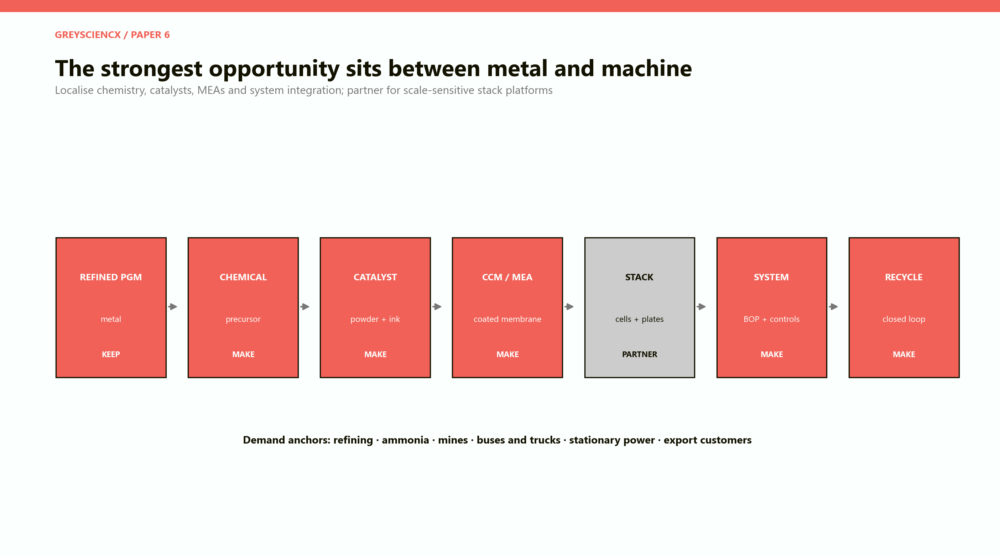

*Figure 2. The recommended strategy concentrates ownership in PGM chemistry, coated components, testing and recycling; uses partnerships for high-volume stacks and electrolysers; and treats molecule production as a separately bankable project.*

## Every arrow is a commercial gate

The chain is often drawn as if domestic metal will naturally flow into domestic machines. It will not. Each arrow is a test.

**Purity:** Can the producer deliver the required chemical form and contamination limits repeatedly?

**Performance:** Does the catalyst reach the required efficiency, power density and degradation rate?

**Manufacturing yield:** Can coating and assembly lines turn expensive material into saleable components without excessive scrap?

**Qualification:** Will an original-equipment manufacturer approve the product after long-duration testing?

**Volume:** Are orders large and predictable enough to use the plant?

**Warranty:** Can the producer diagnose failures, replace defective units and finance warranty exposure?

**Service:** Can field technicians maintain systems where customers operate them?

**Bankability:** Will lenders and customers rely on the technology supplier for twenty years?

The metal advantage is most useful at the first four gates. It provides secure feedstock, refining knowledge, metal accounting and an incentive to build recycling. It is much less useful at the last four, where commercial scale, reputation and customer access dominate.

# PART III: Counting value without double-counting platinum

## The same kilogram can support very different invoices

The model follows a notional kilogram of platinum into alternative end products. It uses a round analytical metal price of USD1,200 per troy ounce, equivalent to roughly USD38,600 per kilogram. This is a scenario input, not a current spot quote.

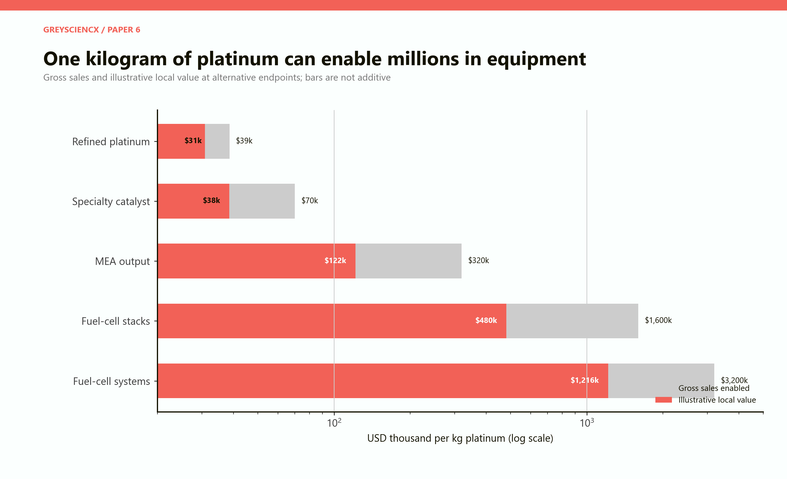

*Figure 3. The grey bars show gross sales of alternative products enabled by one kilogram of platinum. The coral bars show an assumed South African value-added share. The endpoints are alternatives and must never be added together.*

As refined metal, the kilogram has a gross sales value of about USD38,600. The model assigns 80 per cent as local value because mining and refining dominate the product. As speciality catalyst it supports USD70,000 of sales, but imported supports, chemicals, licences, equipment and distribution reduce the assumed local share to 55 per cent. As MEA output it enables USD320,000 of sales, with 38 per cent retained locally. In stacks, the invoice reaches USD1.6 million and local value USD480,000. In complete systems, gross sales reach USD3.2 million while the assumed local value is USD1.216 million.

These estimates are not observed prices for a single standard product. Platinum loading varies greatly by technology, power density, durability requirement and production volume. They are a disciplined way to expose the difference between **value enabled** and **value created by the metal**.

A fuel-cell system worth USD3.2 million is not a platinum bar with a large mark-up. It may contain membranes, bipolar plates, carbon materials, seals, pumps, compressors, cooling equipment, power electronics, sensors, software, tanks, housings and a long warranty. If most of these are imported, claiming the entire system as South African beneficiation would be fiction.

The model therefore applies a local-value share to each stage. That share includes domestic wages, operating surplus, taxes and locally supplied inputs. It excludes imported components and foreign intellectual property. The estimate can rise over time if local suppliers genuinely take over functions. It should not rise because a ministry changes the label on imported equipment.

## Three measures, three different policy choices

**Gross sales** reward scale but can conceal imported content. An assembler may report large turnover and create little domestic income.

**Local value added** measures income created inside the economy. It is the closest indicator of whether industrialisation is actually occurring.

**Exports** earn foreign exchange but say nothing by themselves about domestic depth. Refined platinum can be a stronger export than a subsidised system assembled mainly from imports.

There is also **strategic capability**: laboratories, process knowledge, standards, supplier relationships and technicians that make future products possible. A testing centre may create little direct turnover while raising the value of several manufacturers. Industrial policy should state which measure it is buying.

# PART IV: The South African starting position

## Strong geology, thin commercial bridges

South Africa is not starting from zero. It possesses mines, refineries, universities, PGM research programmes, fuel-cell demonstrations and an emerging component facility. The important question is whether these elements form a commercial production system.

Isondo Precious Metals describes a vertically integrated facility at the OR Tambo Special Economic Zone covering PGM chemistry, catalyst powders, inks, catalyst-coated membranes, MEAs and testing. The published design capacity is about four tonnes of catalyst and 18 million MEAs a year. InvestSA describes the project as a roughly USD50 million investment with commissioning underway. This is significant because it attempts to cross the gap from metal into qualified electrochemical components. It is not yet evidence of a mature export industry: commissioning, qualification, utilisation and repeat orders still have to follow. [Isondo Precious Metals, company overview](https://www.isondopm.com/about); [Isondo Precious Metals, products](https://www.isondopm.com/products); [InvestSA, automotive and components](https://www.investsa.gov.za/key-sectors/automotive-and-components/).

The official Green Hydrogen Commercialisation Strategy proposes support for more than 1 GW a year of local electrolyser and fuel-cell manufacturing capacity and identifies catalyst-coated membranes and MEAs as opportunities. The ambition is directionally sensible, but a capacity target is not a demand forecast. A gigawatt line used at 20 per cent produces less learning and value than a 250 MW line used at 80 per cent. [Department of Trade, Industry and Competition, *Green Hydrogen Commercialisation Strategy*](https://www.thedtic.gov.za/wp-content/uploads/Full-Report-Green-Hydrogen-Commercialisation-Strategy.pdf).

Government has also identified strategic hydrogen projects and secured German development support, including a reported EUR23 million KfW grant. Project designation helps coordination; it does not make the projects bankable. The decisive evidence will be signed offtake, finance, construction performance and operating data. [the dtic, implementation of the Green Hydrogen Commercialisation Strategy](https://www.gov.za/news/media-statements/trade-industry-and-competition-implementation-green-hydrogen).

## Demonstration is not commercialisation

South Africa has generated valuable demonstrations, including Anglo American’s hydrogen-battery hybrid haul-truck prototype at Mogalakwena. The vehicle used a large fuel-cell and battery power system and was a credible attempt to solve a mine-specific decarbonisation problem. It also illustrates why a pilot must not be treated as a factory order book. Anglo American later stopped funding First Mode, and Cummins acquired most of the company’s assets, intellectual property and staff in 2025. The technical experiment created knowledge; it did not prove the original commercial structure. [Anglo American, zero-emission haulage system launch](https://www.angloamerican.com/media/press-releases/2022/06-05-2022); [First Mode, company update](https://firstmode.com/news/blog/).

This is not a reason to avoid pilots. It is a reason to design them as learning contracts. A useful pilot should report availability, fuel consumption, degradation, maintenance hours, safety incidents, total cost and the customer’s willingness to purchase the next units. A ceremonial launch without those measures is a marketing event.

# PART V: Ten illustrative industrial modules

## The model compares projects; it does not pretend they form one balanced factory

The paper constructs ten standalone modules in constant 2026 rand. Their scales are intentionally different. They cannot be summed into a physical national chain, because a 100,000-ounce refining module, a four-tonne catalyst line, a one-gigawatt electrolyser factory and a 100 MW hydrogen project do not consume the same material or serve the same volume.

| Module | Illustrative scale | Capital | Annual sales | Local value | Direct jobs |
|---|---:|---:|---:|---:|---:|
| PGM refining | 100 koz Pt-equivalent/year | R4.0bn | R2.16bn | R1.40bn | 300 |
| Catalysts and chemicals | 4 t catalyst/year | R0.9bn | R1.70bn | R0.65bn | 60 |
| MEAs | 30,000 vehicle-equivalents/year | R1.2bn | R3.20bn | R1.15bn | 100 |
| Fuel-cell stacks | 500 MW/year | R3.5bn | R3.60bn | R1.10bn | 350 |
| Fuel-cell systems | 300 MW/year | R2.5bn | R4.32bn | R1.65bn | 500 |
| PEM components | 1 GW/year | R4.0bn | R4.50bn | R1.50bn | 250 |
| PEM electrolysers | 1 GW/year | R8.0bn | R12.60bn | R3.80bn | 500 |
| Green-hydrogen production | 100 MW at 65% use | R8.0bn | R0.75bn | R0.40bn | 60 |
| Mining/heavy-duty systems | 100 systems/year | R2.0bn | R2.80bn | R1.00bn | 300 |
| PGM recycling | 2 t recovered/year | R1.5bn | R1.50bn | R0.60bn | 120 |

The values are judgement-based engineering-economic assumptions, not quotations, audited business plans or investment advice. Direct jobs exclude construction and induced employment. Annual local value is not profit. It combines wages, locally purchased inputs, domestic depreciation, taxes and operating surplus.

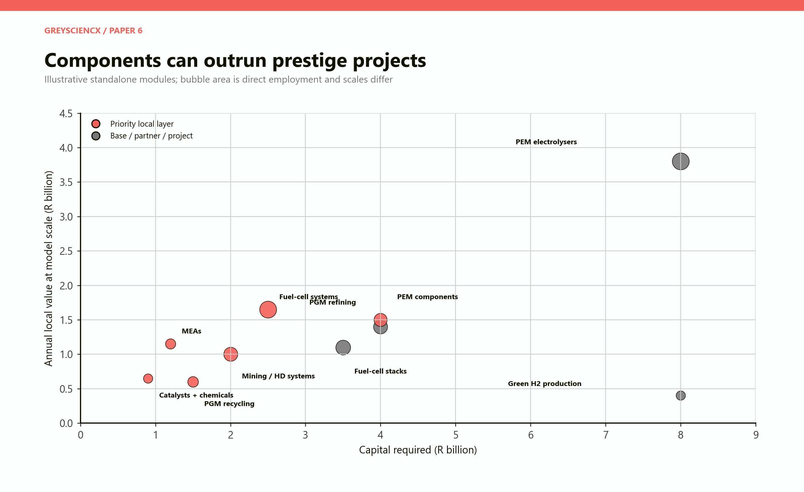

*Figure 4. Components and application-specific systems offer attractive local value at manageable capital. The electrolyser factory has the largest potential annual value but also requires a deep order book. Green-hydrogen production is capital-heavy and operationally lean.*

## What the modules reveal

**Refining remains the foundation.** A functioning refinery creates high local content and secures feedstock knowledge. It also provides the metal-accounting and separation expertise required for catalyst and recycling businesses. It should not be disparaged as insufficiently downstream.

**Catalysts and MEAs are compact but demanding.** Their direct job counts are modest. Their strategic value lies in exacting production, exportability and recurring customer qualification. A few dozen specialised jobs can support much larger invoices, but only if the products meet performance guarantees.

**Stacks and systems create broader engineering work.** They bring mechanical fabrication, electronics, controls, software, installation and service into the chain. In the model, complete fuel-cell systems create 500 direct jobs and R1.65 billion of local value for R2.5 billion of capital. The result depends on orders and does not mean a plant will earn that value automatically.

**A one-gigawatt electrolyser line is a market bet.** Its R12.6 billion of annual sales looks compelling. If the plant sells half its intended output, however, unit overhead and capital recovery deteriorate sharply. The global industry already has excess manufacturing capacity, particularly in China. A South African project needs a technology partner, customers and a credible route to export before equipment is ordered.

**Hydrogen production is not a manufacturing substitute.** The 100 MW project uses around 570 GWh of electricity a year in the central case and directly employs only about 60 people during operation. Its value is decarbonised feedstock or export earnings, not manufacturing employment. Construction creates a temporary employment pulse, but a molecule plant cannot honestly be sold as a permanent mass-jobs programme.

**Recycling closes the economic loop.** It recovers expensive materials, provides metal leasing or take-back options and reduces supply risk. The feedstock will initially be limited, so the facility should accept diverse PGM-bearing streams rather than wait for a large domestic fuel-cell fleet.

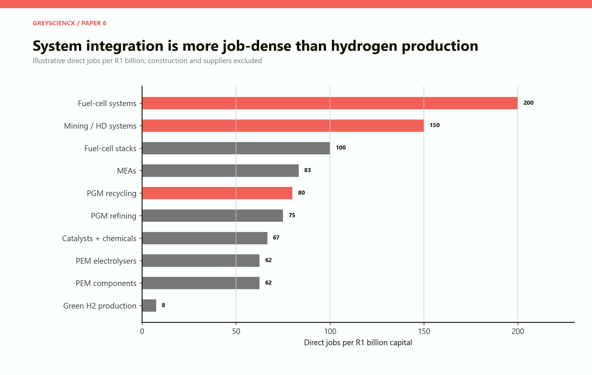

*Figure 5. Systems and application integration are more job-dense than commodity hydrogen production in the chosen scales. Component manufacturing creates valuable capability, not mass employment.*

# PART VI: The global market is real, late and brutally competitive

## A hundred-million-tonne market can still be a small clean market

Hydrogen is already an industrial commodity. Refineries remove sulphur and upgrade fuels with it. Chemical plants use it to make ammonia and methanol. The problem is not the absence of hydrogen demand. It is that almost all current hydrogen is produced from fossil fuels without capturing the associated emissions.

The IEA estimates that demand exceeded 100 million tonnes in 2025. Low-emissions hydrogen contributed only about 1 million tonnes. That distinction matters. A strategy that cites total hydrogen demand as the addressable market for green hydrogen overstates the near-term opportunity by roughly two orders of magnitude.

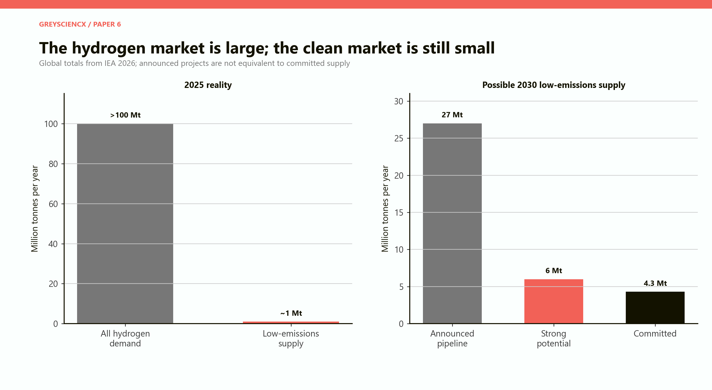

*Figure 6. Existing demand is large, but the low-emissions portion remains about one per cent. The first practical market is often replacement of fossil hydrogen at existing industrial sites.*

The strongest near-term projects therefore have a visible existing consumer: an ammonia plant, refinery or chemical facility already buying or making fossil hydrogen. The green project replaces known demand rather than waiting for a new global commodity market to appear.

Export-oriented projects face additional risks. A foreign customer may prefer green ammonia, methanol, direct-reduced iron or another derivative rather than gaseous hydrogen. The producer must meet carbon-accounting rules, certification standards, shipping requirements and delivery schedules. Offtake contracts must allocate the risk that policy support, carbon prices or competing technologies change.

## Announcements are not construction

The IEA’s 2026 review says the announced 2030 low-emissions-hydrogen pipeline had fallen to about 27 million tonnes. Only 4.3 million tonnes was associated with committed projects, while a little more than 6 million tonnes might be achieved if projects with strong potential reach final investment decision. In the previous year’s review, the announced pipeline was larger, but only a small fraction had reached final investment decision. Project cancellations are not a footnote; they are the market revealing weak offtake and difficult economics. [IEA, *Global Hydrogen Review 2026: Production*](https://www.iea.org/reports/global-hydrogen-review-2026/production); [IEA, *Global Hydrogen Review 2025: Executive summary*](https://www.iea.org/reports/global-hydrogen-review-2025/executive-summary).

Electrolysis capacity exceeded 4 GW globally in 2025, with China accounting for about three-quarters of new installations. Chinese manufacturers also dominate factory capacity. The IEA has reported substantial underutilisation and consolidation as announced demand arrives more slowly than factories expected. [IEA, *Global Hydrogen Review 2026: Investment and innovation*](https://www.iea.org/reports/global-hydrogen-review-2026/investment-and-innovation); [IEA, electrolysers](https://www.iea.org/energy-system/hydrogen/electrolysers).

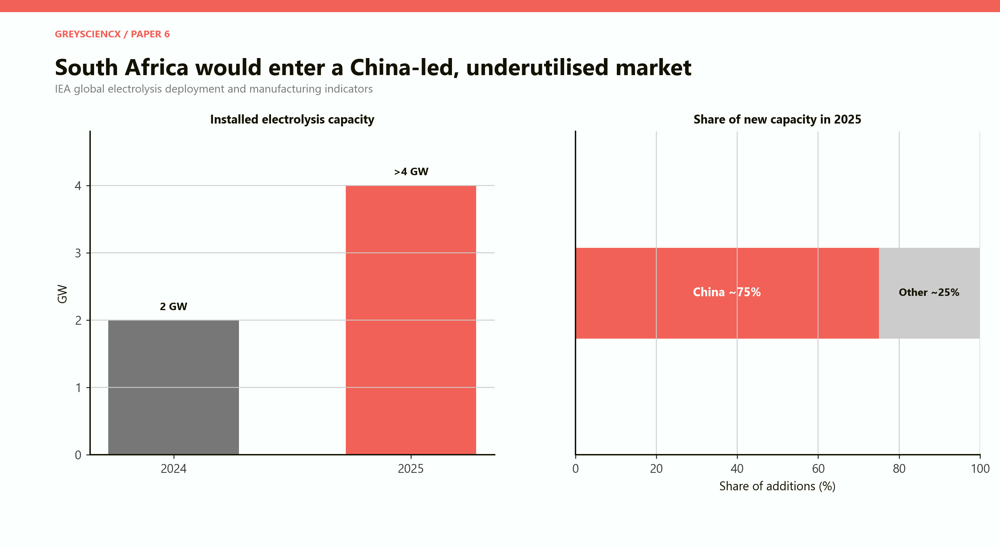

*Figure 7. Electrolysis is growing, but production and manufacturing capacity are concentrated. A South African factory enters an industry with powerful incumbents and surplus capacity.*

The lesson is not that South Africa has missed the market. PEM electrolysers can be attractive where rapid response, compactness and variable operation are valuable. The lesson is that a generic one-gigawatt factory cannot rely on global market growth to fill its books. It must have a specific cost, performance or customer advantage.

# PART VII: The PGM intensity dilemma

## Iridium is a bottleneck hidden inside the platinum story

PEM fuel cells generally use platinum catalysts. PEM water electrolysers use platinum at the cathode and iridium-rich catalyst at the oxygen-producing anode. Iridium is far scarcer than platinum and is largely produced as a by-product of South African PGM operations. Its price, availability and recycling can constrain PEM deployment even if platinum is abundant.

The US Department of Energy’s technical assessment describes commercial PEM electrolysers using roughly 0.5 to 0.8 grams of iridium per kilowatt and identifies large reductions as essential. Its formal technical targets reduce total PGM content toward 0.1 grams per kilowatt in 2026 and 0.03 grams ultimately. The definitions and dates should not be mixed as if they describe one commercial machine, but the direction is unmistakable. [US Department of Energy, *Water Electrolysis Technology Assessment*](https://www.energy.gov/sites/default/files/2024-12/hydrogen-shot-water-electrolysis-technology-assessment.pdf); [US Department of Energy, PEM electrolysis technical targets](https://www.energy.gov/cmei/fuels/technical-targets-proton-exchange-membrane-electrolysis).

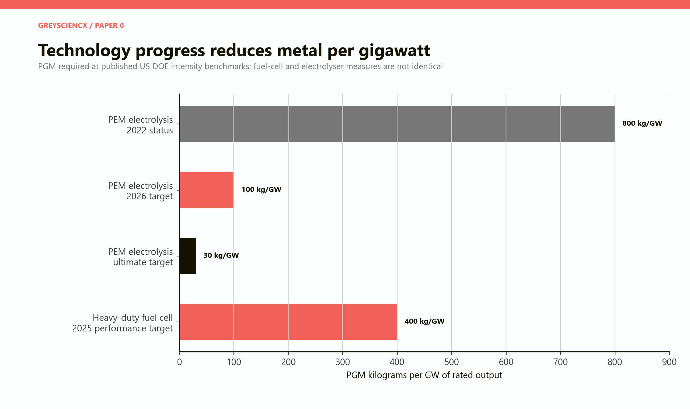

*Figure 8. Lower PGM loadings reduce metal demand per gigawatt, but they can unlock a much larger equipment market. South Africa’s rational position is to lead the thrift and recycling technologies.*

At 0.8 grams per kilowatt, a gigawatt of PEM electrolysers contains about 800 kilograms of PGM. At 0.1 grams, it contains only 100 kilograms. A mining company might read this as demand destruction. A technology company should see an addressable-market expansion: less metal cost, less supply anxiety and more feasible projects.

The correct national strategy is therefore not to maximise PGM loading. It is to maximise South African income from the materials science that permits lower loading without sacrificing durability. Catalyst architecture, coating, recovery, leasing and metal management can be valuable even as the metal mass falls.

Low-PGM and non-PGM technologies remain a substitution risk. Alkaline electrolysers use little or no PGM and have long commercial histories. Anion-exchange-membrane and other technologies aim to combine low catalyst cost with flexible operation. Batteries compete with fuel cells in transport. Direct electrification avoids hydrogen conversion losses in many applications. Industrial policy must be technology-aware without becoming technologically captive.

## Recycling is industrial insurance

Recycling does more than recover scrap value. It can reduce working capital by returning metal to the customer, support leasing arrangements, verify chain of custody and make scarce iridium available for new equipment. The US Department of Energy’s supply-chain assessment stresses the concentration of iridium supply and the importance of both lower loading and high recovery. [US Department of Energy, *Fuel Cells and Electrolyzers Supply Chain Report*](https://www.energy.gov/sites/default/files/2022-02/Fuel%20Cells%20%26%20Electrolyzers%20Supply%20Chain%20Report%20-%20Final.pdf).

A South African component producer should therefore offer a product lifecycle: supply the catalyst, track its deployment, receive spent units, recover the metals and return them into new products. This converts a commodity sale into a long customer relationship.

# PART VIII: The economics of the molecule

## A deliberately demanding 100 MW project

The central scenario models a 100 MW electrolyser running 65 per cent of the year and consuming 54 kilowatt-hours per kilogram of hydrogen. It produces about 10,544 tonnes a year. The integrated project costs R8 billion, including the electrolyser and associated power, water, compression and site infrastructure. Delivered electricity costs R0.75 per kilowatt-hour. Capital is recovered over twenty years at an 8 per cent real rate; annual fixed operating cost is 3 per cent of capital; non-power variable cost is R8 per kilogram.

Under those assumptions, break-even is approximately USD8.25 per kilogram at an analytical exchange rate of R18 to the dollar. This is intentionally not presented as “the South African hydrogen price.” Actual projects differ in renewable-resource quality, grid connection, financing, construction cost, utilisation, storage, water treatment, compression, oxygen revenue and tax.

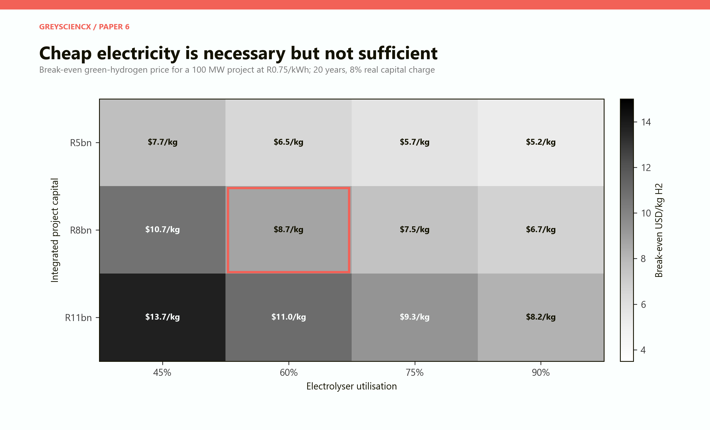

*Figure 9. The central cell is outlined. High utilisation spreads capital over more kilograms; lower capital matters enormously. A project with cheap electricity can still fail if expensive equipment sits idle.*

The map shows why project structure matters. At R5 billion of integrated capital and 90 per cent utilisation, the illustrative cost falls near USD5.20 per kilogram. At R11 billion and 45 per cent utilisation, it rises toward USD13.70. The range is not statistical uncertainty. It is a set of distinct project designs.

Renewable electricity is variable. Oversizing solar and wind, combining resources, using grid power or adding storage can raise electrolyser use, but each method has a cost. Reporting a low renewable-energy tariff without showing delivered electricity, curtailment, grid charges and utilisation is not enough.

## Electricity matters, but stranded capital matters more

At 65 per cent utilisation, reducing the delivered electricity tariff from R1.20 to R0.40 per kilowatt-hour lowers the modelled cost from about USD9.60 to USD7.20 per kilogram. That is a meaningful improvement. Yet the capital and fixed-operating component remains around USD5.50 per kilogram in this deliberately capital-heavy project.

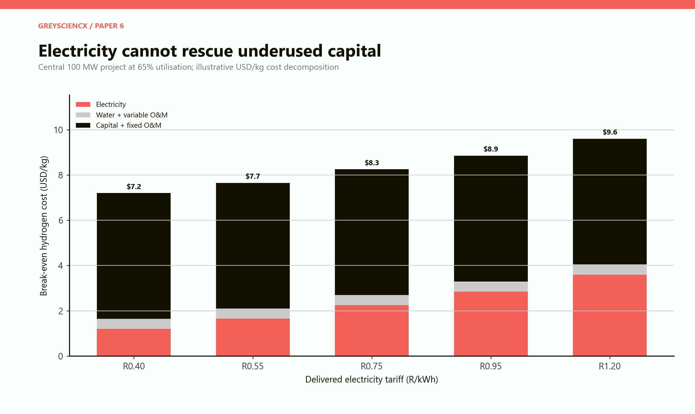

*Figure 10. Electricity is the largest variable input, but the central integrated project remains expensive even at low tariffs because its capital charge is spread over limited annual output.*

This result disciplines two common claims. First, world-class sunshine does not erase financing and construction risk. Second, local electrolyser manufacturing does not necessarily make the hydrogen project cheap. A local machine can reduce logistics and develop service capability, but if its production scale is small or imported components dominate, it may initially cost more than an imported alternative.

## Water is locally important even when it is not the largest cost

Electrolysis chemically consumes about nine litres of purified water per kilogram of hydrogen, with additional requirements for treatment and cooling depending on design. The central project’s modelled process use is about 0.19 million cubic metres a year. Nationally this is small; locally, in a water-stressed industrial zone, it can be decisive.

Desalination can make water physically available at coastal sites, but it adds power, capital, brine management and permitting. Municipal wastewater can be valuable where treatment and pipeline infrastructure are practical. Every project should publish a water balance and show who loses access in drought conditions.

Storage and transport can dominate the delivered cost. Hydrogen has low volumetric energy density. Compression uses energy and expensive equipment. Liquefaction uses still more energy and requires cryogenic infrastructure. Conversion to ammonia improves transportability but adds synthesis, storage, shipping and reconversion costs. South Africa should therefore export the product customers actually want, not hydrogen for the symbolism of exporting hydrogen.

# PART IX: Where fuel cells may work first

## Concentrated demand beats a scattered consumer market

Fuel cells are not universally superior. Batteries are efficient and increasingly capable. Grid electricity avoids producing and reconverting hydrogen. Diesel infrastructure is mature. Fuel cells become attractive when long range, rapid refuelling, high utilisation, payload, clean operation or resilient power is worth the extra system complexity.

The model scores six applications on demand visibility, technical fit and PGM-component opportunity. The scores are explicit judgements, not forecasts.

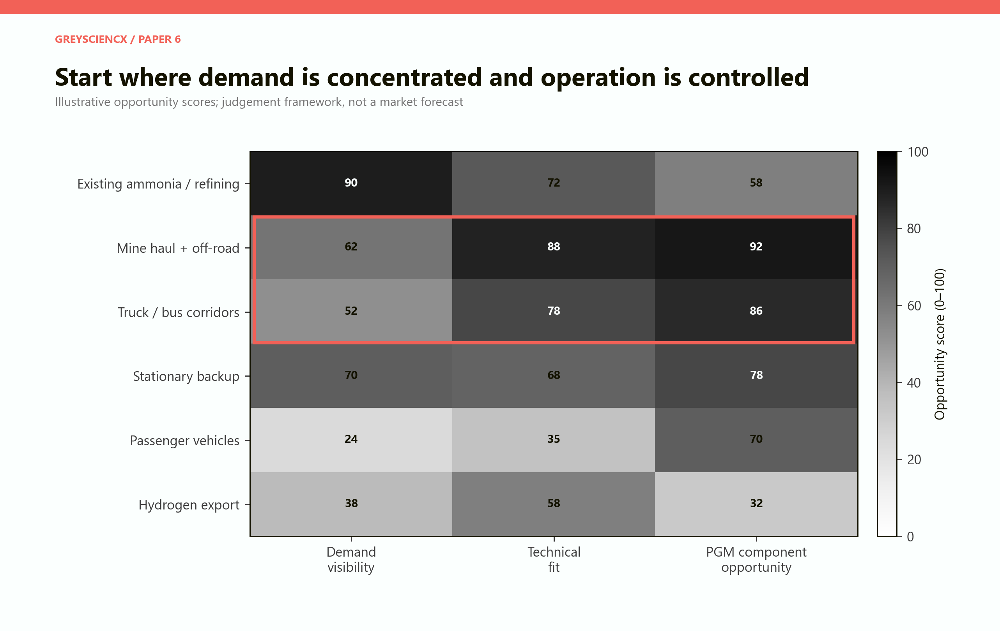

*Figure 11. Mine and off-road systems, controlled truck or bus corridors and stationary applications offer concentrated operations and service access. Passenger vehicles and undifferentiated hydrogen exports are weaker opening bets.*

**Existing ammonia and refining** have the clearest hydrogen demand. The customer, site and industrial use already exist. The commercial problem is replacing fossil hydrogen at an acceptable premium while preserving reliability.

**Mines and off-road fleets** offer controlled routes, central refuelling, high vehicle use and direct pressure to reduce diesel emissions. Their vehicles are expensive and specialised, which can support engineering-intensive systems. The mine can measure performance and maintain equipment on site. The danger is designing a unique prototype that never becomes a repeatable product.

**Truck and bus corridors** concentrate refuelling and maintenance. A small number of depots can support many high-utilisation vehicles. The market requires vehicle suppliers, fleet operators, fuel producers and infrastructure owners to commit together. Without coordinated volume, every participant waits for the others.

**Stationary backup and remote power** can value quiet operation, low local emissions and long autonomy. Yet batteries and generators are strong competitors. The product must target places where hydrogen logistics and reliability create an actual advantage.

**Passenger fuel-cell vehicles** are a weak first domestic bet. They require a broad, expensive refuelling network and compete with rapidly scaling battery vehicles. The IEA reports a global fuel-cell-vehicle stock of only about 130,000 in 2025, with policy-led deployment concentrated in a few markets. Heavy trucks are growing more quickly but still face total-cost disadvantages. [IEA, *Global Hydrogen Review 2026: Demand*](https://www.iea.org/reports/global-hydrogen-review-2026/demand).

The US Department of Energy’s heavy-duty fuel-cell assessment illustrates the role of scale. Its 2022 analysis projected a system cost around USD179 per kilowatt at 50,000 systems a year, against programme targets of USD140 and later USD80 per kilowatt at high manufacturing volumes. These are modelled US volume costs and targets, not South African market prices. They show why a small factory cannot assume mass-production economics. [US Department of Energy, *Heavy-Duty Fuel Cell System Cost 2022*](https://www.hydrogen.energy.gov/docs/hydrogenprogramlibraries/pdfs/23002-hd-fuel-cell-system-cost-2022.pdf); [US Department of Energy, Hydrogen and Fuel Cell Technologies Multi-Year Program Plan](https://www.energy.gov/cmei/fuels/hydrogen-and-fuel-cell-technologies-multi-year-program-plan).

# PART X: Building markets without building permanent subsidies

## Domestic procurement should buy performance and learning

Government and state-owned enterprises can create an early market, but badly designed procurement can shelter weak products indefinitely. A useful contract buys a service—hours of reliable power, tonnes moved, kilometres driven or kilograms of verified low-carbon hydrogen—not a national-origin label alone.

Procurement should include:

- minimum availability and efficiency;
- transparent degradation and maintenance reporting;
- a declining price or subsidy path;
- local engineering, testing and supplier milestones;
- take-back and recycling obligations;
- independent measurement of emissions and local value;
- the right to stop after a failed stage.

A mine-haul programme might begin with ten systems across two operating environments, advance only after a year of measured availability, and then order fifty standardised units. An electrolyser programme might begin with a 100–250 MW assembly and service line linked to actual projects, with a later gigawatt expansion triggered by contracted orders and yield.

## Export the narrow excellence

South Africa does not need to export every component. It needs a small number of products that customers choose on performance. PGM precursor chemistry, catalyst powders, inks, coated membranes, MEAs, recycling services and mine-duty system integration are plausible candidates because they connect directly to existing capabilities or operating conditions.

Export success will require certification, traceability, technical sales offices, warranty reserves and rapid failure analysis. These soft capabilities are easy to omit from a factory budget and difficult to improvise after a product fails in another country.

The World Platinum Investment Council has projected rising platinum demand from hydrogen technologies, although it revised its electrolysis-related estimate downward in early 2026 as the project pipeline weakened. Because the council promotes platinum investment, its projections should be treated as an informed industry scenario rather than an independent forecast. The revision is itself useful evidence: hydrogen-linked PGM demand can grow while remaining sensitive to project delays and technology loading. [World Platinum Investment Council, hydrogen demand](https://platinuminvestment.com/about/hydrogen-demand); [WPIC, January 2026 electrolysis update](https://platinuminvestment.com/index.php/investment-research/perspectives/pem-capacity-growth-revised-downward-in-iea-update-dampening-platinum-demand-despite-rising-electrolysis?category=&page=1&term=).

## Skills and institutions before scale

The industrial workforce needs electrochemists, coating and roll-to-roll engineers, metallurgists, membrane specialists, control engineers, software developers, safety professionals, technicians and commercial staff. Universities can train some of them. Factories create the tacit knowledge that classrooms cannot.

Public infrastructure should prioritise shared testing and metrology where it reduces duplicated capital. Long-duration stack test stands, contaminant analysis, coating inspection, accelerated degradation, hydrogen safety training and certification services can help several firms. The facility must have industry governance and publish service standards; otherwise it risks becoming an underused research monument.

# PART XI: Four R20 billion strategies

## A portfolio is safer than a flagship

The model compares four illustrative ways to allocate R20 billion. It assigns each a nominal outcome and a delivery-risk factor, then shows risk-adjusted annual local value, exports and direct jobs. This is a ranking framework, not a government budget proposal.

**Metal-export base** protects mining, refining and logistics. It produces strong exports and lower technological risk but adds limited downstream depth.

**Components-first** concentrates on catalysts, coated components, MEAs, testing and recycling, with selective international partnerships. It balances exports, capability and manageable project size.

**Systems plus anchors** combines components with mine, heavy-transport, stationary and industrial projects that create local orders. It produces the highest risk-adjusted local value and jobs in the model, although exports are below the metal base.

**Hydrogen-export first** devotes most capital to production and export infrastructure. It is capital-intensive, exposed to electricity and offtake, and creates relatively few permanent jobs. It performs worst after the risk adjustment.

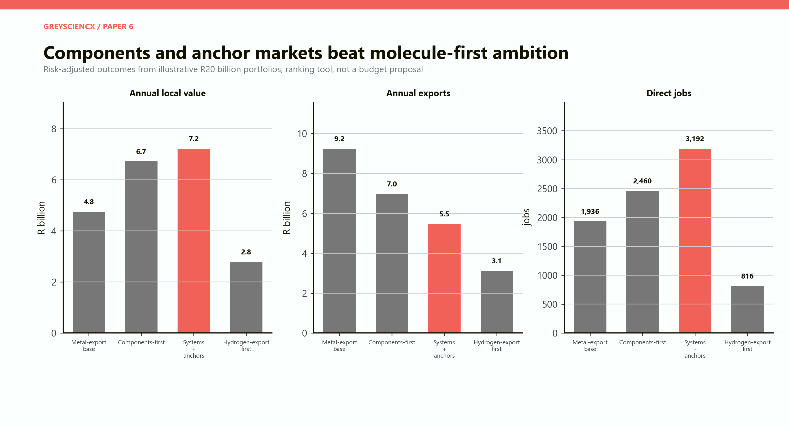

*Figure 12. A systems-and-anchor portfolio creates the most risk-adjusted local value and jobs in the illustration. The metal base remains strongest for exports. A molecule-first strategy performs poorly because capital, market and execution risks compound.*

The result is not a recommendation to abandon hydrogen exports. It is a recommendation to avoid making them the organising centre of the industrial strategy. A well-contracted green-ammonia project can be worthwhile. It should proceed because its power, customer, finance and delivery economics work—not because the country owns platinum.

## A staged ten-year programme

**Years 1–2: qualify and measure.** Commission the existing catalyst and MEA footprint; secure multiple customer qualification programmes; establish shared testing and traceability; develop recycling take-back; identify two or three concentrated domestic applications; publish standardised project economics.

**Years 3–5: repeat, do not merely demonstrate.** Move successful pilots into repeat orders; localise non-PGM parts where suppliers can meet cost and quality; open export technical support; form an electrolyser partnership around contracted domestic demand; use concessional finance only against measurable milestones.

**Years 6–10: scale what has customers.** Expand coating, MEA, stack or electrolyser capacity only when utilisation is visible. Connect recycling to metal leasing. Build export production or derivatives where long-term offtake and delivered energy economics are proven. Close or repurpose lines that fail their gates.

## The policy scoreboard

Every supported project should publish a compact scoreboard:

| Test | Minimum evidence before expansion |
|---|---|
| Market | Binding orders covering a material share of the next capacity block |
| Product | Independent performance and durability results |
| Plant | Saleable yield, utilisation and defect rates |
| Local value | Auditable domestic wages, inputs, tax and operating surplus |
| Imports | Transparent component and intellectual-property payments |
| Finance | Capital at risk from private sponsors and technology partners |
| Energy | Delivered tariff, reliability, carbon intensity and utilisation |
| Water | Source, treatment, drought priority and full balance |
| Recycling | Take-back route and verified recovery rate |
| Exit | Predetermined stop, sale or repurposing option |

This makes support conditional on industrial learning. It also allows failure without pretending failure did not happen.

# PART XII: Risks, counterarguments and verdict

## The strongest counterarguments

**“A cautious strategy will miss the global market.”** It might. Speed matters when standards and supplier relationships are forming. But an unqualified gigawatt factory built before orders exist is not speed; it is premature scale. The proposed sequence moves quickly on components, testing and anchor markets while preserving the option to expand.

**“South Africa should use its resource power to require local production.”** Local-content rules can create demand, but they can also raise project cost and encourage screwdriver assembly. Requirements should target measured local value and capability, allow temporary imports during qualification, and tighten only when domestic suppliers prove performance.

**“The country should export hydrogen because it has excellent renewable resources.”** Renewable resources are necessary. Delivered electricity, utilisation, capital cost, ports, conversion, water, certification and offtake determine whether they are sufficient. Export projects should compete on delivered product cost.

**“Lower PGM loading destroys the national advantage.”** It reduces metal intensity per machine. It also reduces cost and supply risk, making a larger PEM market possible. South Africa earns more from owning the low-loading catalyst, coating process and recycling loop than from insisting customers use unnecessarily high quantities of metal.

**“Fuel cells have lost to batteries.”** Batteries have won many applications and are the default competitor. Fuel cells can still fit heavy, high-utilisation, rapid-refuelling or long-duration uses. The industrial strategy should target those niches and remain ready to abandon applications where batteries are better.

## What could break the strategy

The most serious risks are not geological.

**Demand risk:** low-emissions-hydrogen projects continue to be delayed, reducing equipment orders.

**Technology risk:** alkaline, anion-exchange or other low-PGM electrolysers outperform PEM in important markets; batteries improve faster in heavy transport.

**Scale risk:** local factories never reach competitive utilisation.

**Input risk:** membranes, plates, carbon materials, electronics and equipment remain imported and volatile.

**Infrastructure risk:** electricity, ports, rail, municipal services and water undermine production.

**Execution risk:** construction overruns, commissioning delays and weak maintenance consume the advantage.

**Governance risk:** support follows political visibility instead of measured performance.

**Commodity risk:** PGM prices and co-product economics alter mine output, even when downstream demand is strong. USGS estimated that South African PGM mine production declined in 2025 amid palladium-price pressure, deep-mining cost and electricity disruption. The same endowment that creates strategic leverage also sits inside a volatile co-product system. [USGS, *Mineral Commodity Summaries 2026*](https://pubs.usgs.gov/periodicals/mcs2026/mcs2026.pdf).

## Final verdict

South Africa can build a meaningful platinum-to-hydrogen economy. It is unlikely to do so by treating the entire chain as one national project.

The country’s defensible advantage begins with the ore body and refineries, but it becomes industrially interesting in PGM chemistry, catalyst manufacture, coatings, MEAs, testing, metal management and recycling. Those capabilities can serve fuel cells and PEM electrolysers in several markets. They can be exported without first building a domestic passenger-car network or a giant hydrogen terminal.

Selected systems should grow around visible domestic demand: replacement hydrogen at refineries and ammonia plants, mine and off-road equipment, controlled fleet corridors and stationary applications where the operating case is strong. These anchors should buy measured service and repeatable products, not demonstrations for their own sake.

Complete electrolyser manufacturing should be earned in stages. A smaller line with a serious technology partner and real orders can build yield, service and supplier knowledge. Expansion to one gigawatt should follow customers, not precede them.

Green-hydrogen production must survive a separate test. At the model’s central assumptions, it is an expensive molecule because capital, utilisation and electricity dominate. Local platinum changes only a small portion of that arithmetic. Projects should proceed where a customer will pay, electricity is credibly delivered and the finance can bear the risk.

The policy aim is not the longest domestic value chain. It is the strongest set of positions South African firms can defend. On that measure, components, recycling and application-specific engineering outrank a molecule-first prestige strategy.

# Model assumptions and interpretation

## Scope

The model is a transparent scenario framework, not a forecast, feasibility study, valuation or investment recommendation. All rand values are in constant 2026 terms unless stated otherwise. The analytical exchange rate is R18 per US dollar. The platinum price used for the one-kilogram illustration is USD1,200 per troy ounce.

## Value-ladder assumptions

The gross sales enabled by one kilogram of platinum are set at USD38,581 for refined platinum, USD70,000 for speciality catalyst, USD320,000 for MEAs, USD1.6 million for stacks and USD3.2 million for complete systems. Assumed domestic value-added shares are 80, 55, 38, 30 and 38 per cent respectively. These endpoints are alternatives, not additive stages.

## Industrial modules

The ten modules use independent scales and are not mass-balanced. Capital, annual sales, exports, local value, jobs, electricity and water are judgement inputs chosen to compare industrial character. They should be replaced with vendor quotations, customer contracts and site-specific engineering before any real decision.

## Hydrogen project

The central project is 100 MW, runs at 65 per cent utilisation, consumes 54 kWh per kilogram and produces about 10,544 tonnes of hydrogen a year. Integrated capital is R8 billion. Delivered electricity is R0.75/kWh. The capital-recovery period is twenty years at an 8 per cent real rate. Fixed operating cost is 3 per cent of capital each year and non-power variable cost is R8/kg. The resulting break-even is about USD8.25/kg.

## Portfolio adjustment

The four R20 billion portfolios begin with nominal estimates of local value, exports and direct jobs. Each is multiplied by a delivery-risk factor—0.88 for the metal base, 0.82 for components-first, 0.76 for systems plus anchors and 0.48 for hydrogen-export first. These factors are judgement, not probabilities derived from data. They force the comparison to recognise that ambitious projects fail more often.

## Exclusions

The model does not calculate full mine economics, tax, financing structure, construction employment, carbon prices, grid expansion, port infrastructure, pipeline networks, land, environmental remediation, macroeconomic multipliers or public-sector contingent liabilities. It does not assign probability distributions to technology outcomes. It does not claim that local value automatically becomes social welfare.

# Sources

- United States Geological Survey. [*Mineral Commodity Summaries 2026*](https://pubs.usgs.gov/periodicals/mcs2026/mcs2026.pdf).
- International Energy Agency. [*Global Hydrogen Review 2026: Executive summary*](https://www.iea.org/reports/global-hydrogen-review-2026/executive-summary).
- International Energy Agency. [*Global Hydrogen Review 2026: Production*](https://www.iea.org/reports/global-hydrogen-review-2026/production).
- International Energy Agency. [*Global Hydrogen Review 2026: Demand*](https://www.iea.org/reports/global-hydrogen-review-2026/demand).
- International Energy Agency. [*Global Hydrogen Review 2026: Investment and innovation*](https://www.iea.org/reports/global-hydrogen-review-2026/investment-and-innovation).
- International Energy Agency. [*Global Hydrogen Review 2025: Executive summary*](https://www.iea.org/reports/global-hydrogen-review-2025/executive-summary).
- International Energy Agency. [Electrolysers](https://www.iea.org/energy-system/hydrogen/electrolysers).
- Department of Science and Innovation. [*South African Hydrogen Society Roadmap*](https://www.dsi.gov.za/images/South_African_Hydrogen_Society_RoadmapV1.pdf).
- Department of Trade, Industry and Competition. [*Green Hydrogen Commercialisation Strategy*](https://www.thedtic.gov.za/wp-content/uploads/Full-Report-Green-Hydrogen-Commercialisation-Strategy.pdf).
- the dtic. [Implementation of the Green Hydrogen Commercialisation Strategy](https://www.gov.za/news/media-statements/trade-industry-and-competition-implementation-green-hydrogen).
- Isondo Precious Metals. [Company overview](https://www.isondopm.com/about) and [products](https://www.isondopm.com/products).
- InvestSA. [Automotive and components](https://www.investsa.gov.za/key-sectors/automotive-and-components/).
- US Department of Energy. [PEM electrolysis technical targets](https://www.energy.gov/cmei/fuels/technical-targets-proton-exchange-membrane-electrolysis).
- US Department of Energy. [*Water Electrolysis Technology Assessment*](https://www.energy.gov/sites/default/files/2024-12/hydrogen-shot-water-electrolysis-technology-assessment.pdf).
- US Department of Energy. [*Fuel Cells and Electrolyzers Supply Chain Report*](https://www.energy.gov/sites/default/files/2022-02/Fuel%20Cells%20%26%20Electrolyzers%20Supply%20Chain%20Report%20-%20Final.pdf).
- US Department of Energy. [*Heavy-Duty Fuel Cell System Cost 2022*](https://www.hydrogen.energy.gov/docs/hydrogenprogramlibraries/pdfs/23002-hd-fuel-cell-system-cost-2022.pdf).
- US Department of Energy. [Hydrogen and Fuel Cell Technologies Multi-Year Program Plan](https://www.energy.gov/cmei/fuels/hydrogen-and-fuel-cell-technologies-multi-year-program-plan).
- Anglo American. [Zero-emission haulage system launch](https://www.angloamerican.com/media/press-releases/2022/06-05-2022).
- First Mode. [Company updates](https://firstmode.com/news/blog/).
- World Platinum Investment Council. [Hydrogen demand](https://platinuminvestment.com/about/hydrogen-demand) and [January 2026 electrolysis update](https://platinuminvestment.com/index.php/investment-research/perspectives/pem-capacity-growth-revised-downward-in-iea-update-dampening-platinum-demand-despite-rising-electrolysis?category=&page=1&term=).
