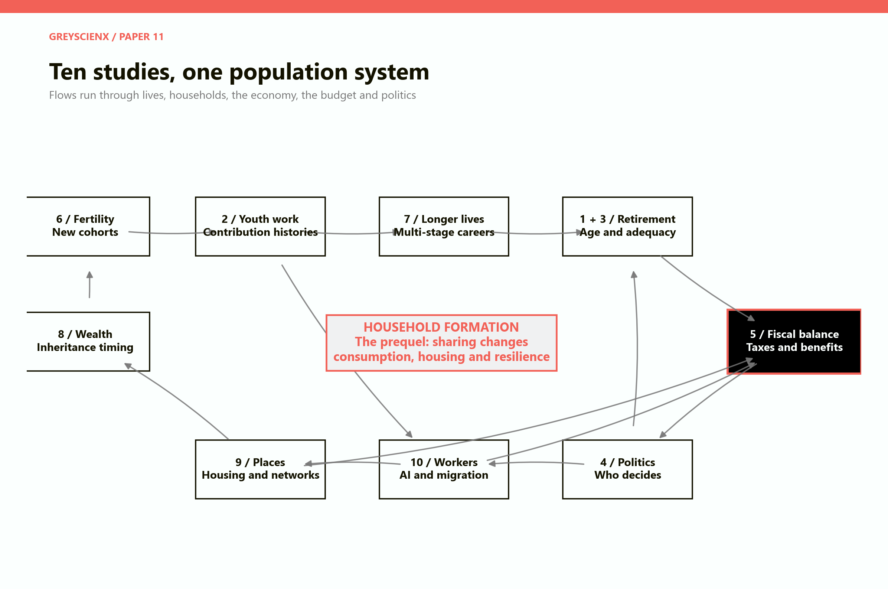
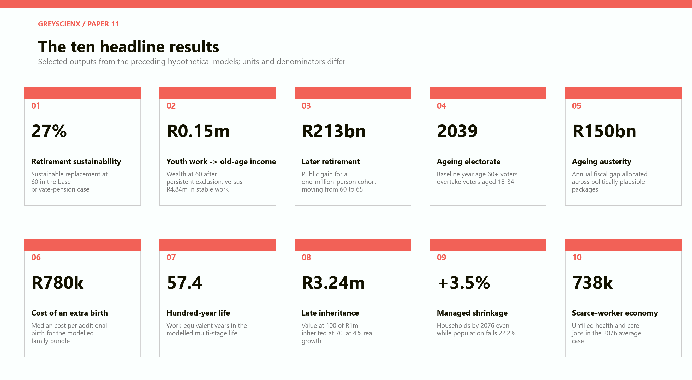
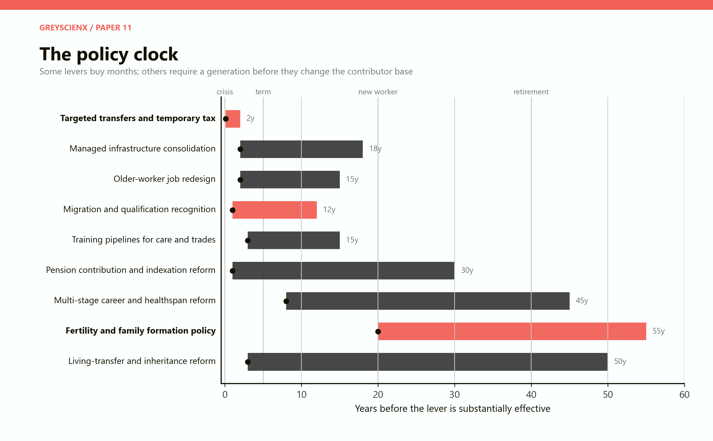
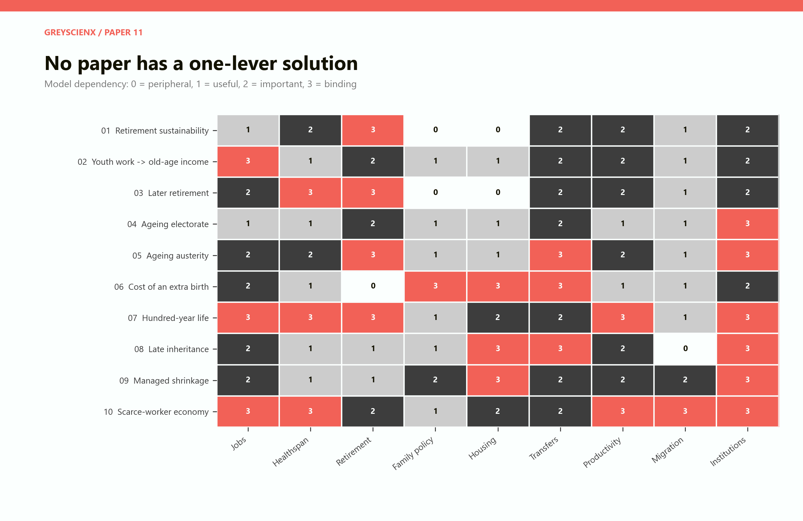
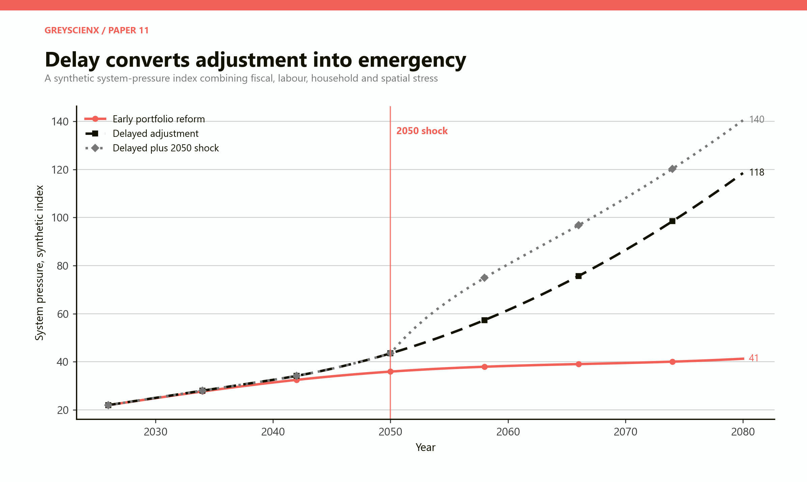

# The Population System
## What ten GreyScienx studies say when they are read as one argument

# Part I: The finding

The first ten papers do not describe ten separate crises. They describe one population system viewed from ten different windows.

The retirement paper begins at the end of working life. The unemployment paper begins forty years earlier. The fertility paper begins twenty years before a future worker enters the labour market. The inheritance paper follows capital across generations. The shrinking-country paper follows people and households across space. The scarce-worker paper asks whether technology, migration and longer careers can fill the physical gaps. The politics and austerity papers ask who carries the cost when the arithmetic no longer balances.

Read together, the central result is simple.

> Demographic pressure is rarely a shortage of people in the abstract. It is a failure of timing, matching and institutions: income arrives after it is useful, workers exist outside the jobs that need them, homes stand in the wrong places, and reform begins after the cheap options have expired.

The models repeatedly overturn intuitive shortcuts.

- A smaller population can need more homes because average household size falls.
- Higher productivity can preserve GDP while hospitals remain understaffed.
- Later retirement can strengthen pensions while harming workers whose health or occupations do not permit it.
- Immigration can repair the near-term contributor base but cannot permanently abolish ageing.
- A birth subsidy can create future workers, but not in time for the next decade's fiscal gap.
- An inheritance can be large and still arrive too late to finance a first home, children or a business.
- A pension system can appear funded in aggregate while a cohort with interrupted work reaches old age with almost nothing.
- A politically easy austerity package can be the most expensive package once health, education, growth and future taxes are counted.

The broad policy lesson is therefore not to choose one heroic lever. It is to build a portfolio that acts on several clocks: immediate protection, medium-term labour and housing adjustment, and long-term changes to careers, families and retirement.

The models are hypothetical. They use South African rand and South-African or Gauteng-scale examples to make magnitudes concrete. They are not forecasts. Their value is structural: they show how decisions made at one stage of life reappear somewhere else in the system.

# Part II: Ten studies, one machine

Population debates are usually separated into ministries. Pensions belong to finance and social development. Youth unemployment belongs to labour. Fertility belongs to families and health. Housing belongs to cities. Immigration belongs to home affairs. Education belongs to schools and universities. The separation is administratively convenient and analytically dangerous.

The system does not respect those boundaries.

*Figure 1. The ten studies form a feedback system. Household formation is the prequel: it changes housing demand, consumption, care, risk sharing and the capacity to save before any pension or demographic calculation begins.*

A child born after a successful family policy enters school, later enters work, contributes taxes, forms a household, perhaps migrates, supports retirees and eventually becomes a retiree. A failed school or a long spell of youth unemployment changes every later stage. Lower earnings reduce pension saving and tax paid. Delayed household formation lowers or postpones fertility. Lower fertility narrows the future workforce. A narrower workforce raises the tax burden. That burden changes wages, migration and political conflict.

Capital follows another route. Housing wealth accumulates in older households. Longer life delays inheritance. Adult children finance homes and children without that capital, then receive it near retirement. The same asset that could have changed family formation at 35 becomes a late-life balance-sheet transfer at 70. If housing is concentrated in declining areas, even the headline value can overstate what can be sold or used.

Politics closes the loop. Older people vote at higher rates, benefits are visible, and the cost of reform is immediate. The benefits of education, fertility support, preventive health and infrastructure maintenance arrive slowly. A government can therefore protect current transfers while underfunding the very systems that create future taxpayers. The feedback is not inevitable, but the incentives are strong.

The system has no single control dial. Raising taxes changes work and compliance. Raising retirement ages changes labour supply and disability claims. Raising birth incentives changes public cost now and labour supply decades later. Increasing immigration changes the contributor base quickly but creates integration, housing and future retirement obligations. Automation changes output faster than it changes the supply of carers, nurses and tradespeople.

This is why the papers should be read as a portfolio rather than a menu.

# Part III: The ten headline results

The following metrics are not directly comparable. Each comes from a different model with its own denominator and horizon. Together they show where the system becomes tight.

*Figure 2. One selected result from each study. These are outputs from declared thought experiments, not observed national forecasts.*

| No. | Study | Core result |
|---|---|---|
| 1 | When Retirement Becomes Impossible | At retirement 60, 12% saving and 3% real returns supported about 27% of final salary to age 90, not the desired 60% |
| 2 | Today's Unemployment Is Tomorrow's Pension Crisis | Stable formal work produced R4.84m at 60; persistent exclusion produced R0.15m and heavy grant dependence |
| 3 | Does Raising the Retirement Age Actually Work? | Moving one million people from 60 to 65 improved the public balance by R213bn, but displaced 0.50m youth job-years and raised disability exposure |
| 4 | The Politics of an Ageing Electorate | In the baseline, voters aged 60+ overtook voters aged 18-34 around 2039 and reached roughly 46% of votes by 2100 |
| 5 | Emergency Ageing Austerity | A balanced package closed a R150bn annual gap at much lower welfare cost than the politically easier package built around delay and borrowing |
| 6 | The Price of Another Child | A broad family bundle generated about 99,000 additional births at a median R780,000 each; fiscal payback required a strong future employment path |
| 7 | The Hundred-Year Life | A multi-stage life contained 57.4 work-equivalent years, recurring education, breaks and gradual retirement rather than one continuous career |
| 8 | Inheritance After Retirement | R1m received at 70 grew to R3.24m by 100, versus R12.80m when transferred at 35 under the same 4% real return |
| 9 | How to Shrink a Country Without Breaking It | Population fell 22.2% but household numbers rose 3.5% as household size fell; delayed spatial adjustment created a 54,000-home gap |
| 10 | The Scarce-Worker Economy | Aggregate output grew in the average case, yet health and care still lacked 738,000 workers by 2076 |

The headline numbers matter less than the contradictions they reveal. The same society can be wealthier per person, short of workers, burdened by age-related costs, under-housed and full of underemployed young adults. National averages do not cancel local and lifecycle mismatches.

# Part IV: Retirement begins with the first job

The retirement sustainability model looked like a familiar pension calculation. A 25-year-old earned R30,000 a month, saved 12% and retired at 60. At a 3% real return, a pension equal to 60% of final salary was exhausted around age 70 if the person lived to 90. The sustainable replacement rate was about 27%.

That result could be framed as a saving problem. The unemployment paper shows why it is also a labour-market problem.

The stable formal worker in the second model accumulated R4.84 million by 60. A five-year youth shock reduced the amount to R3.99 million. Entry at 30 reduced it to R3.09 million. A mostly informal career produced R0.91 million. Persistent exclusion produced only R0.15 million.

The financial mechanism is compounding, but the economic mechanism is more severe. Early work does four things at once: it generates contributions, creates experience, raises later wages and establishes a habit of formal participation. A missed year at 22 is therefore not equivalent to a missed year at 58. It loses the contribution, the return on that contribution and part of the career ladder built on the year.

This connects private and public retirement systems. When a poorly funded cohort retires together, the private shortfall becomes a public grant, healthcare and family-care obligation. The state does not avoid the pension cost merely because no formal pension promise was made. It receives the liability later in a less funded and more politically urgent form.

The one-million-person persistent-exclusion scenario weakened the cohort's lifetime fiscal balance by about R1.80 trillion relative to stable formal employment. That number should not be read as a bill sent to unemployed people. It is a measure of the tax base, saving and public support the economy fails to create when exclusion persists.

The combined conclusion is stronger than either paper alone:

> Youth employment policy is pension prefunding. A contribution subsidy, apprenticeship or first stable job can be cheaper than financing old-age poverty forty years later.

This does not mean every job solves retirement. Low-paid, insecure and informal work may create little pension wealth. The relevant goal is sustained, progressively more productive participation with portable contributions. A job count without earnings, duration and coverage can give a false sense of security.

# Part V: The retirement-age lever has a human boundary

The third paper tested retirement at 60, 65, 70 and 75. Delaying retirement improved the public balance through additional taxes and contributions, fewer pension years and more private saving. For a one-million-person cohort, moving from 60 to 65 produced a modelled public gain of R213 billion. Moving to 70 produced R369 billion; moving to 75 produced R448 billion.

The marginal gain diminished while the human cost rose. The model generated 0.27 million disability claim-years by 65, 0.81 million by 70 and 1.61 million by 75. Youth job displacement also rose, although far less than a literal one-for-one replacement of old workers with young workers.

The hundred-year-life paper explains why the answer cannot be a single higher age. If people live to 100 or 120, a forty-year career followed by fifty or sixty years of full retirement is difficult to finance. Yet extending the same continuous job for seventy years is equally implausible. Skills decay, occupations change, health differs and family duties arrive at several points.

The workable design is a multi-stage life. Education recurs. Work intensity rises and falls. People take care breaks. Older workers move into different roles. Pensions become partial and gradual rather than a switch thrown on one birthday.

This reframes the argument about retirement age. The question is not whether 65, 70 or 75 is correct for everyone. It is how many healthy, productive work-equivalent years a person can contribute across a lifetime, and how the system protects those whose occupations consume health faster.

An office professional with assistive technology may work productively at 72. A miner, nurse, emergency responder or construction worker may not. A uniform age treats unequal bodies as if they were equal. Occupation-specific pathways, disability insurance, retraining and partial pensions are not side policies. They make later retirement credible.

The youth-employment objection also needs precision. Older and younger workers are sometimes substitutes, but often complements. Senior workers supervise, train, sell relationships and carry institutional knowledge. The damaging case occurs when firms retain older workers in unchanged posts while removing the entry-level rungs beneath them. Later retirement works best when the labour market creates a distinct set of later-life roles and protects apprenticeships for younger entrants.

# Part VI: Fiscal arithmetic becomes political arithmetic

The pension system can balance in several ways: more workers, higher productivity, higher taxes, lower benefits, later retirement or lower costs. None is politically neutral.

The retirement sustainability paper found that a public payroll burden could rise from 18% in a short-retirement structure to 42% in an ageing squeeze and 65% in a century-life case. In a stylised system with fertility of 1.7, 80% contribution coverage, a benefit equal to 40% of covered earnings and price indexation, keeping the burden below 20% required retirement at 71 when longevity reached 90, 75 when it reached 95, and 79 when it reached 100.

Those ages are not recommendations. They show the size of the gap that must be closed elsewhere if retirement ages remain unchanged.

The austerity paper allocated a R150 billion annual ageing deficit across taxes, contributions, benefit changes, means testing, retirement-age reform, weaker indexation, health cuts, non-age cuts and borrowing. The balanced transition package had the lowest modelled welfare loss. It combined targeted pension measures, prefunding, worker taxation, later retirement, limited weaker indexation and temporary borrowing. It avoided health and non-age cuts.

The politically easiest package relied more heavily on measures whose cost was delayed or obscured. It had much higher welfare loss and accumulated R720 billion of debt over ten years. Delay felt cheaper because current voters did not see the full future bill.

The politics paper explains why. In its baseline, voters aged 60 and older overtook voters aged 18 to 34 around 2039. By 2100, older voters cast around 46% of votes under fixed turnout and just over 47% when political feedback raised their relative participation. In the accelerated-ageing case, the median voter became retired during the 2080s.

An older electorate does not automatically vote selfishly. Older people have children, grandchildren, communities and long horizons. The danger is institutional asymmetry. Pensions are individual, monthly and visible. The loss from a smaller university cohort, a deferred water repair or a missing apprenticeship is diffuse. Budget protection follows salience as much as need.

The feedback loop can run in either direction.

- If older voters protect benefits by cutting education, housing and youth programmes, younger people receive less, participate less and distrust the welfare state.
- If universal promises remain credible across the lifecycle, younger workers can support old-age benefits because they expect fair treatment later.
- If benefits are transparently progressive and reform shares the burden, ageing need not become fiscal gerontocracy.

The design objective is not to weaken older voters. It is to prevent any age group from externalising the cost of its protection onto people who arrive later or vote less.

# Part VII: Fertility is a long-duration investment with uncertain delivery

The fertility study asked when subsidising an additional child becomes cheaper than financing the consequences of ageing. The answer depended less on the size of the cheque than on whether the policy changed completed family size.

In the model of one million prospective households, a broad family bundle generated about 99,000 additional births at a median public cost of R780,000 per additional birth. Childcare support cost about R720,000 per additional birth. A simple cash top-up cost R1.76 million; a parent tax exemption cost R4.18 million because many recipients would have had the child without the subsidy.

This is the deadweight problem. Governments observe a subsidised birth, not the counterfactual birth that would have occurred without payment. A programme can transfer a great deal of money to families and still have a small effect on completed fertility.

The modelled present value of lifetime production was R1.45 million in a weak outcome, R3.73 million in an average outcome and R5.83 million in a strong outcome. The corresponding direct fiscal value was negative R610,000, positive R190,000 and positive R960,000 before the policy cost. None of the policies paid back under the average fiscal path. Childcare, flexibility and the family bundle could pay back under the strong path.

The result is not that children should be valued by future taxes. A child's welfare is not a fiscal instrument. The calculation answers a narrower question: whether a government can justify large family support solely as a way to finance future ageing. Usually it cannot unless the programme causes genuinely additional births and the future economy integrates those children into productive employment.

The time lag is decisive. A child born in 2030 cannot staff a hospital in 2035. Fertility policy belongs to the long-term portfolio; migration, training, productivity and later work must bridge the near term.

Housing and relationship stability also matter. A grant cannot compensate indefinitely for insecure employment, unaffordable space, long working hours and a weak expectation that a relationship will endure. Fertility policy that ignores household formation pays against the current rather than changing it.

# Part VIII: Capital can arrive after the decision it was meant to support

The inheritance model held the transfer constant at R1 million and changed only its timing. At a 4% real return to age 100, a transfer at 35 became R12.80 million. Inheritance at 40 became R10.52 million; at 55, R5.84 million; at 70, R3.24 million; and at 85, R1.80 million.

The arithmetic is compounding. The economics is option value.

Money at 35 can become a deposit, business capital, retraining, childcare or relocation. Money at 70 may still be valuable, but it is more likely to fund retirement, care or the next generation. The transfer has changed function.

Longer lives therefore create a new form of inequality. Two families may leave the same estate. One provides living transfers when adult children face their tightest constraints. The other preserves assets until death. The first family can alter education, housing, family formation and entrepreneurship; the second may create a larger-looking bequest after the decisive choices have passed.

This links inheritance to the shrinking-country paper. Much household wealth sits in housing. If older owners remain in large homes in declining suburbs while younger households need homes near jobs, the aggregate asset value conceals a spatial mismatch. The house cannot finance a deposit elsewhere unless it can be sold, borrowed against or shared.

Policy can influence timing without forcing parents to surrender security. Portable property taxation, deferral options, equity release, protected living gifts and inheritance-tax rules can reduce the penalty for transferring some wealth earlier. The key is to preserve late-life care and housing security while releasing capital when it has more social and economic use.

# Part IX: Population decline does not empty the housing market evenly

The regional contraction model began with 1.2 million people and 419,580 households in 2026. Population fell to 934,000 by 2076, a decline of 22.2%. Average household size fell from 2.86 to 2.15. The number of households therefore rose to 434,000, an increase of 3.5%.

The conclusion is counterintuitive only if a home is confused with a person. Housing demand is driven by households. Divorce, delayed marriage, widowhood, lower fertility and independent living can increase the number of households even when the number of residents falls.

Delayed adjustment created a gap of about 54,000 homes in the model. At the same time, peripheral infrastructure became uneconomic. A satellite town fell below 90% network utilisation from the start; an outer edge crossed that threshold in 2033. By 2076, delayed adjustment left some network coverage ratios at 41% and 72% while managed shrinkage concentrated service and lifted them to roughly 107% and 113%.

Managed shrinkage saved R18.6 billion in present-value costs and kept schools at 82% utilisation rather than 47%. The saving did not come from abandoning people. It came from helping people move, consolidating services and retiring networks deliberately.

This creates a hard political distinction. Protecting every pipe, school and road in its historical location is not the same as protecting every resident. When the tax base shrinks, trying to preserve all places can exhaust the resources needed to help people.

The household model that preceded this series adds another layer. Cohabitation reduces the number of kitchens, roofs, utility connections and duplicate durable goods required per adult. Relationship fragmentation reverses that dividend. It can keep rents and housing demand high while population slows. Household formation is therefore infrastructure policy by another name.

# Part X: Output can be abundant while workers are scarce

The scarce-worker model began with 12 million full-year-equivalent workers, three million retirees and a population of 22 million. In the average case, the resident workforce fell to 8.88 million by 2076. Later work added 700,000 workers. Annual immigration of 75,000 young adults contributed 2.02 million employed residents, after integration and retention. Total workers reached 11.60 million while total retirees reached 6.48 million.

Productivity filled the aggregate gap. General improvement of 0.6% a year plus 0.3% from automation raised output per worker by about 57%. Real GDP reached an index of 151. GDP per person reached 152.

Yet the economy still lacked 738,000 health and care workers, 123,000 construction and maintenance workers, and 121,000 education, safety and public-service workers. Digital and administrative labour had a surplus.

This is the difference between worker-equivalent output and a person. Software can reduce documentation, scheduling and diagnosis time. It cannot be physically present in every care interaction. A displaced administrator does not become a nurse because both count as one unit in a national labour total.

The fiscal burden also remained. Age-related spending began near 8.3% of covered wages and reached 17.0% in the average case, 28.4% in the worst and 10.9% in the best. Productivity supported the burden only to the extent that its income reached wages or the tax base.

Immigration was powerful but temporary. The average case needed about 90,000 young arrivals a year to hold contributor headcount at 12 million by 2076; it admitted 75,000. Early migrants had also begun to retire by the end of the horizon. A continuing inflow, strong integration and productivity were all required.

The strongest link across the papers appears here. Youth unemployment, migration, later retirement, fertility, education and automation are not alternative stories about labour supply. They are layers with different clocks and different limits.

# Part XI: The cohabitation dividend is the household foundation

The cohabitation research sat before the numbered series, but it supplies the microeconomic foundation for it.

Two adults living separately duplicate fixed costs: rent, electricity connections, internet, appliances, furniture, insurance and travel between homes. Living together can release a cohabitation dividend even when income does not rise. The saving can become consumption, emergency reserves, debt repayment, education, a deposit or retirement contributions.

That dividend is not free. Larger households use more utilities, food and space. Commuting may change. Relationship risk can create moving, legal and asset-division costs. Unpaid labour can be divided unequally. Combined wealth is not proof of equal control or welfare.

The macroeconomic effect also has two sides. Household consolidation can reduce near-term housing demand, utility connections and duplicate consumption. It can increase saving and investment. But it can also reduce expenditure in sectors that sell duplicate goods. If cohabitation supports partnership stability and children, it changes future population. If housing pressure forces unrelated or unstable cohabitation, the measured saving may coexist with lower privacy and security.

The numbered studies repeatedly depend on these household conditions.

- Retirement saving is easier when fixed costs are shared.
- Delayed cohabitation can delay children and raise the subsidy needed to change fertility.
- Longer lives produce more widowed or separated one-person households unless new forms of shared living develop.
- Late inheritance may finance adult children's homes only after years of high rent.
- Shrinking populations can still need more dwellings when cohabitation falls.
- Essential workers cannot fill jobs in expensive regions if household housing costs absorb the wage.

Household structure is not merely a private preference variable. It connects wages to housing, care, fertility, saving and urban form.

# Part XII: Five laws across the models

## 1. Delay compounds

The most expensive problems begin as cheap problems with a long lead time. A missing contribution at 25 compounds for thirty-five years. A delayed birth enters work two decades later. Deferred maintenance becomes network failure. Delayed pension reform leaves fewer cohorts over which to spread the transition.

This does not mean every policy should be implemented early at any cost. It means waiting is itself a policy with a price.

## 2. Denominators govern

The same numerator can look safe or dangerous depending on what supports it.

- Pension cost depends on contributors and covered wages, not only retiree count.
- Housing demand depends on households, not only population.
- Political power depends on turnout, not only age structure.
- Infrastructure cost depends on users per kilometre, not only municipal population.
- Fiscal productivity depends on taxable income, not only GDP.

Many policy errors come from watching the visible count and ignoring the denominator.

## 3. Timing changes function

Income at 25 can build a career. The same income at 65 can repair retirement. Capital at 35 can form a household. The same capital at 75 becomes care finance or a dynastic transfer. Immigration in the next five years changes staffing; fertility policy does not.

A policy should be judged by whether it arrives before the decision or constraint it is meant to change.

## 4. Aggregates conceal mismatch

GDP can grow while care fails. Population can fall while rents rise. Pension assets can be large while excluded cohorts have none. A city can have empty houses and a housing shortage at the same time because the homes, jobs and households are in different places.

The correct response is usually matching, mobility and institutional redesign, not simply producing more of the aggregate.

## 5. Institutions determine whether a lever works

Migration has value when qualifications are recognised and people remain. Later work has value when jobs fit older bodies. Automation has value when organisations redesign tasks. Fertility support has value when housing, work and relationships make an additional child possible. Managed shrinkage has value when people trust relocation and compensation.

The policy instrument is rarely sufficient by itself. Delivery institutions create the result.

# Part XIII: The policy clock

Demographic policy fails when a long-horizon instrument is assigned a short-horizon job.

*Figure 3. Approximate periods before selected interventions become substantially effective. The bars are organising ranges, not estimated implementation lags for South Africa.*

Targeted transfers, emergency borrowing and temporary taxes act immediately. Migration can change labour supply within a few years if integration is fast. Training pipelines take longer. Infrastructure consolidation and older-worker redesign may show meaningful effects inside a decade. Pension reform can improve confidence quickly but requires many years to distribute the transition fairly.

Fertility policy is the slowest labour-supply lever. It may affect births within a few years, but those births do not become workers for roughly two decades. Multi-stage life reform is similarly generational because people need to plan education, mortgages, health and careers differently from an early age.

The portfolio should therefore have three layers.

## Immediate layer

- Protect basic consumption and health during shocks.
- Keep young people attached to work and training.
- Use temporary, progressive financing with explicit expiry.
- Prevent destructive arrears in pensions, municipalities and maintenance.

## Transition layer

- Expand care and trade training capacity.
- Create later-life and partial-retirement jobs.
- Recognise migrant qualifications and improve retention.
- Consolidate infrastructure with relocation and household support.
- Broaden pension coverage for informal and interrupted workers.

## Generational layer

- Make family formation compatible with housing and employment.
- Build healthspan from early adulthood.
- Normalise recurring education and career changes.
- Reform living transfers, housing equity and inheritance timing.
- Preserve political representation across ages.

The layers are complements. An immediate programme without structural reform becomes permanent emergency spending. A generational programme without a bridge arrives after the system has already failed.

# Part XIV: The intervention matrix

No study has a one-lever solution, and no lever belongs to only one study.

*Figure 4. A qualitative dependency map built from the ten models. A value of 3 means the lever is binding to the modelled outcome; 0 means it is peripheral. It is not an empirical ranking of policy effectiveness.*

Institutions appear across every row because implementation changes the effective value of every other intervention. Jobs dominate the youth-pension and scarce-worker papers. Healthspan dominates later retirement. Housing dominates fertility, inheritance and managed shrinkage. Transfers dominate austerity and family policy. Productivity is central to long lives and scarce labour but less able to fix spatial or distributional mismatch by itself.

The matrix suggests an order of operations.

First, protect the entry points into the system: early work, housing access, family stability and education. Second, extend productive capacity through health, skills, technology and migration. Third, redesign retirement and wealth transfers so longer lives do not merely lengthen dependence. Fourth, align budgets and political institutions so current voters cannot finance promises by silently consuming the future tax base.

# Part XV: Best, average and worst system paths

The ten studies each contain best, average and worst cases. A combined scenario should not simply select every optimistic or pessimistic input. The assumptions interact.

## Best case: early portfolio reform

The best path begins before the support ratio becomes urgent. Youth attachment improves. Pension contributions broaden. Housing supply follows household counts. Care training expands. Later-life work is redesigned rather than mandated. Migration is integrated. Family support focuses on time, housing and childcare. Cities consolidate infrastructure while relocation is still affordable. Fiscal rules allow shocks but force transparent medium-term repair.

This path does not prevent ageing or population decline. It makes them governable. More people arrive at retirement with private assets. The public promise can focus on poverty protection and catastrophic care. Productivity gains enter the tax base. Political conflict remains, but adjustment is spread across cohorts and decades.

## Average case: partial adaptation

Some reforms work. Productivity and immigration support GDP. Retirement ages rise modestly. Pension benefits are trimmed. Cities repair central networks but postpone peripheral closure. Family policy transfers money without resolving housing or working time. Youth employment improves slowly.

The system remains solvent but tight. Care shortages grow. Tax rates rise. Older voters defend benefits. Younger households delay formation. Growth looks acceptable while public services become less reliable. This is the most deceptive scenario because no single indicator signals collapse.

## Worst case: delay until fiscal emergency

Reform waits for the funding gap. Governments borrow, suppress visible prices, defer maintenance and cut programmes with weak constituencies. Youth employment remains poor. The excluded cohort reaches retirement without savings. Skilled young workers leave. Fertility falls further. Household fragmentation keeps housing demand high. Peripheral networks fail suddenly.

The eventual package is harsher because the cheap margins are gone. Later retirement is imposed without healthy jobs. Benefits are reduced after people have lost the time to save. Taxes rise on a smaller contributor base. Political trust falls because every group believes another was protected first.

*Figure 5. A synthetic system-pressure illustration. The index combines non-comparable domains only to show path dependence: early reform slows pressure, delay steepens it, and a major 2050 shock turns adjustment into emergency.*

The next paper takes the final path seriously. It asks what happens when a pandemic, war and recession hit an already ageing fiscal system in 2050, and emergency power changes the distribution and visibility of the loss.

# Part XVI: What the synthesis rules out

The combined research rules out several comforting answers.

It rules out waiting for fertility alone. Even a successful birth programme cannot solve a contributor shortage that arrives within twenty years.

It rules out automation alone. Output can be abundant while essential human services remain short of staff.

It rules out immigration alone. Migrants age, integration can fail, and sending countries also face scarcity.

It rules out a universal retirement-age answer. Health and occupations differ too much.

It rules out preserving every historical settlement pattern. Fixed networks become unaffordable when users disappear.

It rules out solving the fiscal problem only through debt. Borrowing reallocates the tax burden into the future and becomes expensive precisely when another shock arrives.

It rules out treating private wealth as available social capacity. Wealth can be illiquid, concentrated, delayed and controlled by someone other than the person who needs it.

It also rules out fatalism. None of the models says population ageing mechanically produces collapse. Each shows margins of adaptation. The issue is whether institutions use them early enough and distribute the transition credibly.

# Part XVII: A governing dashboard

A government trying to manage this system needs a dashboard that follows lives rather than departments.

| Domain | Minimum indicator | Why the usual headline is insufficient |
|---|---|---|
| Youth work | Share of each cohort with five years of covered work by 30 | Headline unemployment misses contribution history and duration |
| Retirement | Sustainable replacement rate by cohort and occupation | Aggregate pension assets hide coverage gaps |
| Healthspan | Healthy work capacity by occupation at 60, 65 and 70 | Life expectancy does not show capacity to work |
| Families | Completed births by cohort, housing status and policy exposure | Annual births cannot distinguish postponement from permanent decline |
| Households | Households, size, tenure and location | Population alone does not determine housing demand |
| Places | Users and revenue per network kilometre | Municipal population hides spatial cost density |
| Labour | Vacancies, training pipeline and worker-equivalent output by occupation | Total employment hides simultaneous surplus and shortage |
| Migration | Employment, field match, retention and age | Visas issued do not equal contributors retained |
| Wealth | Age and use of transfers, not only estate value | Bequests can arrive after capital-constrained decisions |
| Politics | Age-specific turnout, benefit incidence and intergenerational spending | Population shares do not reveal effective voting power |
| Fiscal resilience | Explicit debt plus arrears, guarantees, maintenance and pension promises | Official debt omits liabilities shifted off budget |

No dashboard removes political choice. It makes the trade-off visible before emergency conditions make honest choice harder.

# Part XVIII: A research programme after the first ten papers

The synthesis suggests several next questions.

First, the models should be linked at cohort level. A person should move from family conditions to school, work, household formation, migration, pension saving, retirement and care. This would reveal which early intervention produces the largest later fiscal and welfare gain.

Second, geography should be explicit. Gauteng can have labour demand and housing pressure while another region loses people and infrastructure capacity. National balance can conceal regional collapse.

Third, household bargaining should enter the model. Combined income does not show who controls saving, who provides unpaid care or who can leave. The cohabitation dividend needs a distributional layer.

Fourth, political feedback should be endogenous. Benefit protection, youth disengagement, migration and trust change the electorate that decides the next reform.

Fifth, uncertainty should be treated as a central output. Fertility response, productivity, healthy life expectancy, migrant retention and investment returns are not known. Policy should be robust across ranges rather than optimised for one average.

The research programme is therefore not a prediction of how many people a country will have. It is a study of whether institutions can keep time: whether they can match slow demographic change with early decisions, absorb shocks without destroying future capacity, and preserve a credible bargain between people who live at different points on the same lifecycle.

# Part XIX: Model assumptions and reading guide

This paper is a synthesis. It does not merge the ten underlying models into a single calibrated national forecast. Their starting populations, cohorts, currencies, horizons and denominators differ. The synthesis preserves those differences and connects mechanisms.

The system-pressure line in Figure 5 is deliberately normalised. It illustrates how delay and a later shock interact; it does not estimate a national crisis probability. The intervention matrix in Figure 4 is a qualitative reading of model dependency, not a measured treatment effect.

All monetary values are constant 2026 rand unless the originating study stated otherwise. Present values use the discount rates declared in those studies. Best, average and worst cases are coherent hypothetical packages. They are not confidence intervals.

The report keeps mathematical notation out of the main text. The economics remains embedded in the model through contribution histories, compounding, dependency ratios, productivity, household formation, fiscal incidence and discounted lifetime value.

## The ten source studies

1. *When Retirement Becomes Impossible* - retirement age, longevity, contribution rates, benefits and sustainable support ratios.
2. *Today's Unemployment Is Tomorrow's Pension Crisis* - cohort employment histories, pension accumulation and lifetime fiscal contribution.
3. *Does Raising the Retirement Age Actually Work?* - public savings, youth displacement, wages, productivity and disability claims.
4. *The Politics of an Ageing Electorate* - age structure, turnout, median voter and intergenerational spending.
5. *Emergency Ageing Austerity* - tax, pension, health, borrowing and welfare-loss packages.
6. *The Price of Another Child* - behavioural response, cost per additional birth and future fiscal value.
7. *The Hundred-Year Life* - education, work, breaks, housing and gradual retirement over very long lives.
8. *Inheritance After Retirement* - transfer timing, compounding, housing and dynastic wealth.
9. *How to Shrink a Country Without Breaking It* - households, housing, schools and infrastructure under population contraction.
10. *The Scarce-Worker Economy* - automation, immigration, older work, occupational bottlenecks and GDP.

## Selected external evidence used across the series

- [Statistics South Africa, Quarterly Labour Force Survey](https://www.statssa.gov.za/?page_id=1854&PPN=P0211) and [mid-year population estimates](https://www.statssa.gov.za/?page_id=1854&PPN=P0302) for the labour and population context.
- [OECD, Pensions at a Glance 2025](https://www.oecd.org/en/publications/pensions-at-a-glance-2025_e40274c1-en.html) for comparative retirement, employment and pension-system evidence.
- [United Nations, World Population Prospects](https://population.un.org/wpp/) for international demographic framing.
- [International Labour Organization, World Employment and Social Outlook](https://www.ilo.org/publications/flagship-reports/world-employment-and-social-outlook) for labour-market context.
- [World Health Organization, health workforce](https://www.who.int/health-topics/health-workforce) for the human-service staffing constraint.
- [International Monetary Fund, Gen-AI and the future of work](https://www.imf.org/en/Publications/Staff-Discussion-Notes/Issues/2024/01/14/Gen-AI-Artificial-Intelligence-and-the-Future-of-Work-542379) for automation exposure and complementarity.

# Part XX: Conclusion

The first ten studies lead to one governing proposition.

> A society does not become unsustainable merely because it ages, shrinks or lives longer. It becomes unsustainable when the institutions that connect generations adjust more slowly than the population does.

The practical response is a timed portfolio.

- Protect entry into work because employment at 25 becomes retirement security at 65.
- Design housing for households, not population totals.
- Build healthspan and later-life jobs before raising retirement ages.
- Use immigration as a bridge and integration as the value-creating mechanism.
- Use automation to release scarce human time, especially in care and maintenance.
- Support families through housing, childcare, time and relationship stability, not only cash.
- Move some capital earlier without exposing older people to insecurity.
- Consolidate places while there is enough money and trust to protect residents.
- Make fiscal incidence explicit and preserve representation across generations.

The cost of ageing is not fixed. It is partly the cost of choices made too late. The next paper asks how much worse that timing problem becomes when a major 2050 emergency allows the state to hide losses, compel finance and weaken the institutions needed for recovery.

