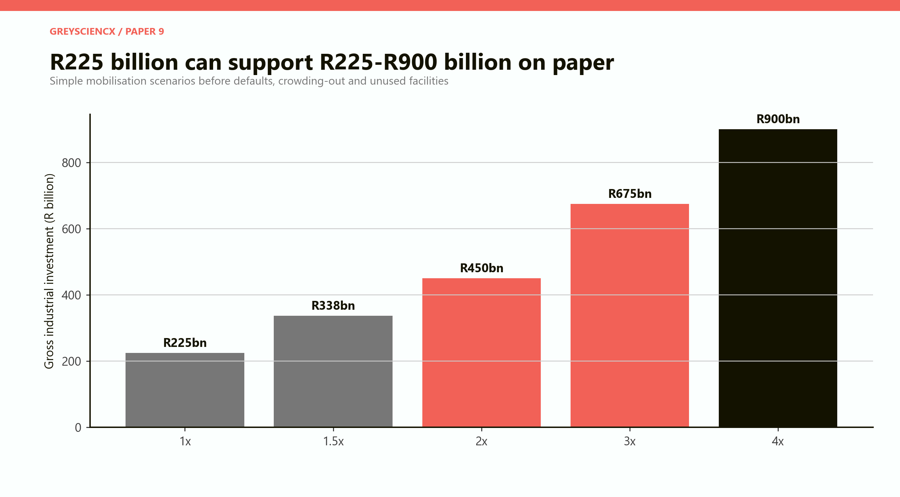
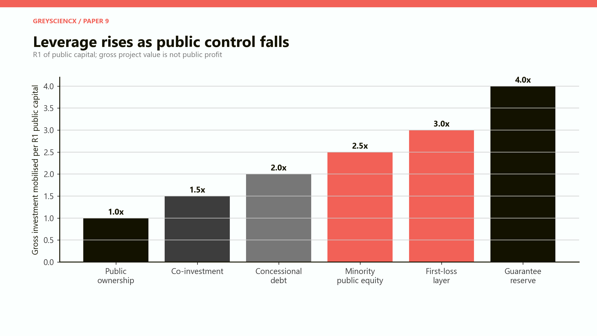
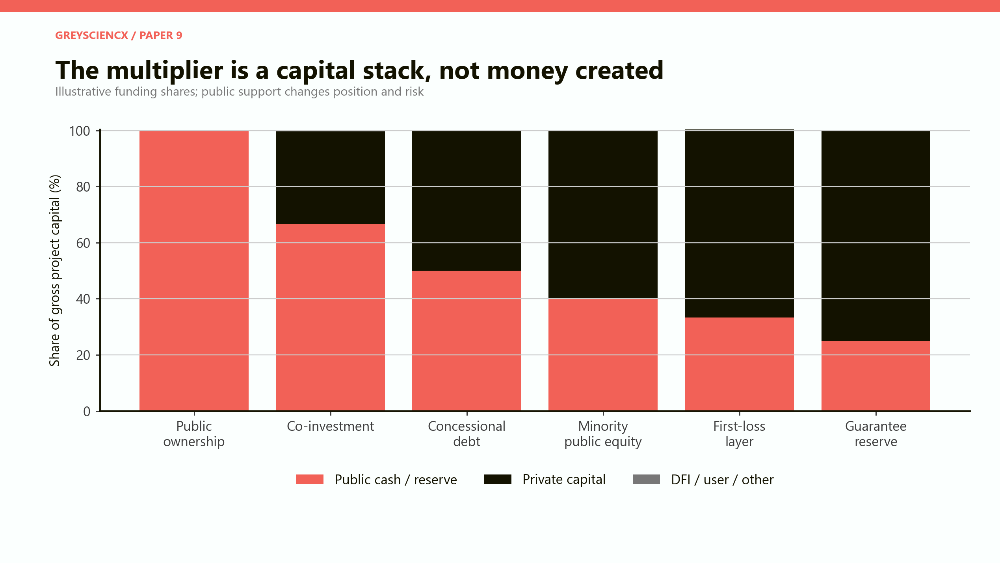
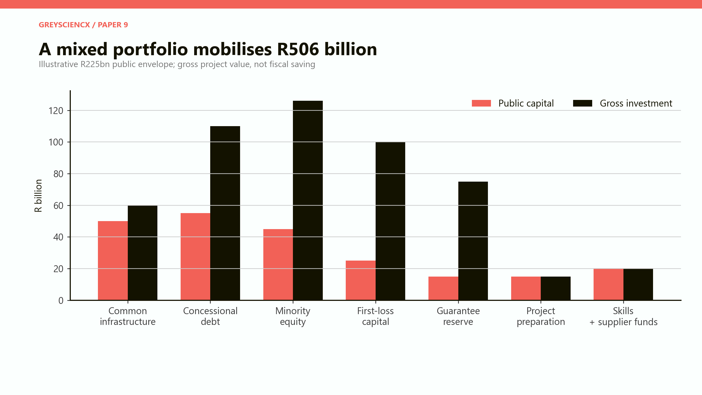
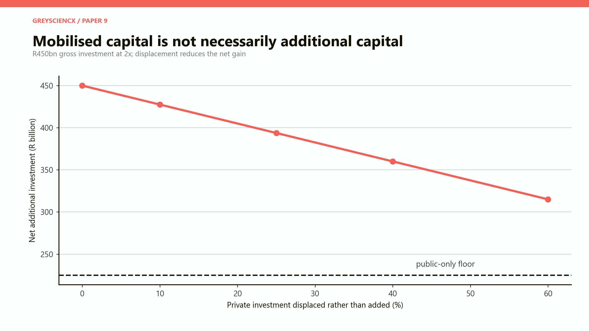
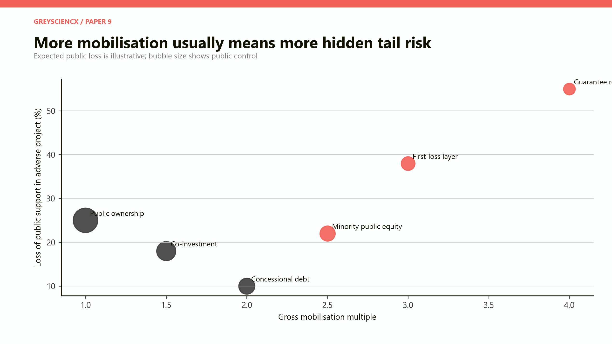
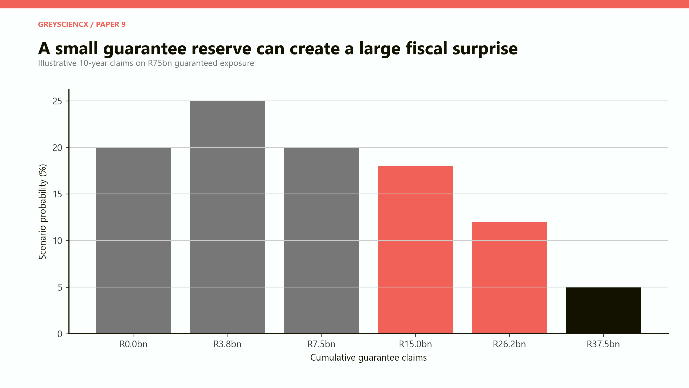
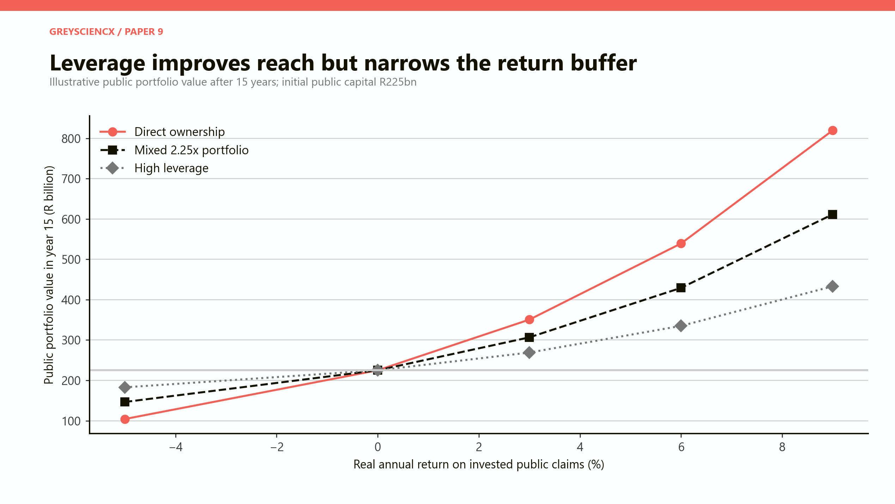
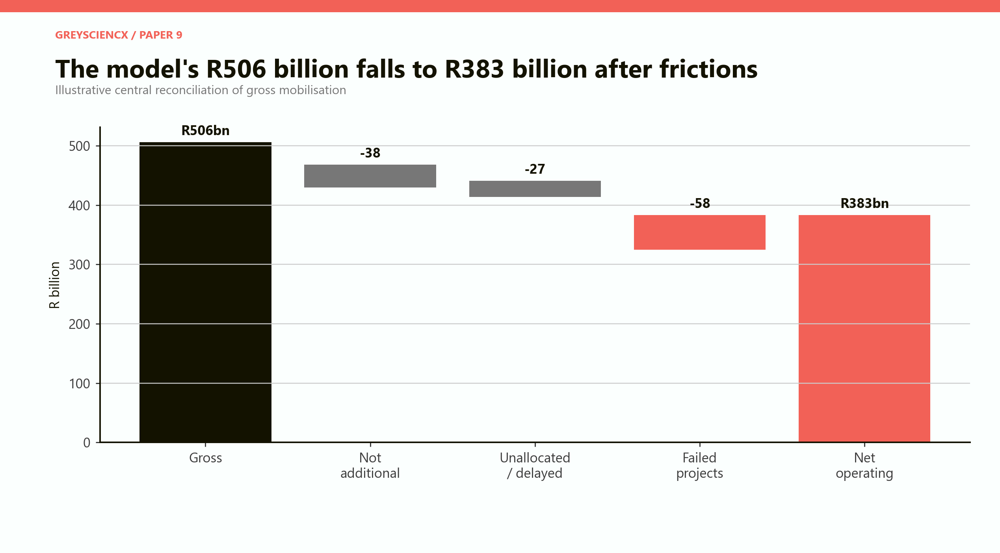
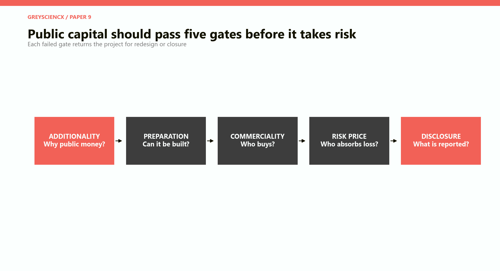

# The Public-Capital Multiplier

## How much productive investment can R1 of public industrial capital mobilise—and how much risk returns to the state?

# PART I: The answer

## The useful multiplier is closer to two than to magic

Public capital can mobilise private investment, but a multiplier is not money created. It is a description of a capital stack: who provides equity, who lends, who is paid first, who absorbs the first loss, who controls the asset and which promises remain with government.

With R225 billion of public industrial capital, the simplest outcomes are R225 billion at one-to-one public ownership, R338 billion at 1.5 times, R450 billion at twice, R675 billion at three times and R900 billion at four times. These gross totals look powerful. They say nothing about whether the private capital was additional, whether the factory operates, whether the public claim earns a return, or whether a guarantee becomes debt in a recession.

*Figure 1. The arithmetic range is easy. The economic question is how much survives crowding-out, delay, failure and fiscal risk.*

The paper's central mixed portfolio allocates R225 billion across common infrastructure, concessional debt, minority equity, first-loss capital, a guarantee reserve, project preparation, skills and supplier funds. It mobilises R506 billion of gross investment, a headline multiple of 2.25. After deducting capital judged non-additional, delayed or unallocated funding and failed projects, R383 billion remains operating—1.70 times the public envelope.

> **The central conclusion:** South Africa should target a portfolio-wide gross mobilisation range of roughly 1.5-2.5 times, not maximise a single headline ratio. Common infrastructure and project preparation may have low measured leverage but high economic additionality. Guarantees and first-loss layers can show spectacular cash multiples while placing concentrated downside on the state. Every instrument should be measured by net additional operating investment, development value and risk-adjusted public cost.

## Seven findings

**First, leverage changes ownership and control.** At one-to-one public ownership, the state owns the asset and all its risk. At four times through a guarantee reserve, public cash is small relative to the project but control is weak and contingent exposure can be large.

**Second, project preparation can outperform financial engineering.** A bankable feasibility study, permit, grid agreement and customer contract can attract private finance without a permanent subsidy. A guarantee cannot make an unprepared project sound.

**Third, leverage is not additionality.** If a profitable firm would have invested anyway, adding cheap public money changes its financing but not national investment. The programme has mobilised capital statistically while wasting scarce concession.

**Fourth, private discipline helps only when private investors can lose.** A fully guaranteed lender is private in name but public in risk. Genuine crowding-in requires meaningful private equity or uncovered debt.

**Fifth, the cheapest-looking instrument can have the largest tail.** A R15 billion guarantee reserve may support R75 billion of projects in the model. Severe claims can exceed the reserve and arrive together during a downturn.

**Sixth, pension capital is not public money.** The Public Investment Corporation manages more than R3 trillion for public-sector clients, but those assets belong to beneficiaries and carry return obligations. They can invest in suitable industrial infrastructure; they cannot be appropriated to rescue weak policy projects. [Public Investment Corporation, corporate overview](https://www.pic.gov.za/).

**Seventh, the multiplier must fall as the market matures.** First projects may need preparation grants or subordinated capital. Repeat projects should require less concession. Permanent subsidy signals that the market was never created.

# PART II: What mobilisation means

## Six instruments, six different bargains

*Figure 2. Illustrative gross multiples rise as public capital becomes more subordinated or contingent. They are not observed South African averages.*

**Full public ownership** buys one rand of project for one rand of public capital. Government controls the asset, receives the upside and absorbs the loss. It is appropriate for common infrastructure or strategic functions that cannot charge commercial tariffs. It is a poor default for competitive manufacturing when capable private operators exist.

**Co-investment** places public and private equity beside each other. It can combine policy purpose with commercial discipline, but shareholder agreements, appointments, exit rights and related-party transactions matter.

**Concessional debt** lends below the market rate, for longer or with a grace period. The public institution can recover capital if the project succeeds. The subsidy is the difference between market and concessional terms plus expected loss—not the full loan amount.

**Minority public equity** uses state capital to anchor a larger equity and debt package. It gives upside and some governance rights while leaving operation with a commercial sponsor. Valuation and exit discipline are crucial.

**First-loss capital** absorbs early losses so senior lenders accept risk. It can open a new market but easily overpay investors if the layer is larger than necessary.

**A guarantee** promises payment if a borrower or project fails. It uses little immediate cash, which produces a high apparent multiplier. It can also move debt off the visible budget until the worst moment.

*Figure 3. Public support occupies different positions in the stack. A lower cash share does not necessarily mean lower economic exposure.*

## Funding is not financing

Finance provides capital now in expectation of repayment. Funding is the revenue that ultimately repays it: customer sales, user charges, taxes, availability payments or asset proceeds. A project cannot be made viable by rearranging lenders if no one pays for its output.

This distinction is vital for factories. A battery plant needs credible orders. A water connection may be repaid through tariffs. A research laboratory may require budget funding because its benefits spill across firms. The correct instrument follows the underlying cash flow.

# PART III: South Africa's institutional starting point

## The country already blends capital

The Development Bank of Southern Africa's Infrastructure Fund is mandated to develop blended-finance solutions that crowd in investment. The DBSA reported R37.6 billion of Budget Facility for Infrastructure approvals since inception. A 2024 programme update described 26 projects with a combined capital value of R102 billion, drawing R37 billion from the Infrastructure Fund, R54.8 billion from private contributions and R6.7 billion of public equity. [DBSA, *Integrated Annual Report 2025*](https://www.dbsa.org/sites/default/files/media/documents/2025-09/DBSA%20Integrated%20Annual%20Report%202025.pdf); [DBSA, “Unlocking Mega Capital Projects Through Strategic Partnerships”](https://www.dbsa.org/press-releases/unlocking-mega-capital-projects-through-strategic-partnerships).

Those figures demonstrate capacity and also the difficulty of a clean multiplier. The funding categories overlap programme roles, and approved or packaged projects are not identical to completed operating assets. A credible measure follows capital from approval to financial close, construction and operation.

The DBSA Climate Finance Facility provides a sharper example. It began with R2 billion of committed debt, co-funded by DBSA and the Green Climate Fund, and targets portfolio leverage of one to five. The target is appropriate for a diversified facility; it should not be read as a guaranteed outcome for every project. [DBSA, Climate Finance Facility](https://www.dbsa.org/climate-finance-facility).

National Treasury amended public-private-partnership regulations in 2025. Projects below R2 billion face streamlined approval, and new guidance strengthens reporting of fiscal commitments and contingent liabilities. This matters because South Africa completed 35 PPPs valued at about R91.4 billion since 1998, but only three reached financial close between 2015 and 2025. Reforming process helps; it does not replace a pipeline of bankable projects. [National Treasury, *Framework and Guidelines for Management of Fiscal Commitments and Contingent Liabilities*](https://www.treasury.gov.za/comm_media/press/2025/Framework%20and%20Guidelines%20for%20Management%20of%20FCCLs.pdf).

# PART IV: The central R225 billion portfolio

## Diversify the way the state participates

*Figure 4. The illustrative portfolio mobilises R506 billion of gross investment. Project preparation and skills are not leveraged because their benefit appears through the investability of other projects.*

| Public instrument | Public capital | Assumed multiple | Gross investment |
|---|---:|---:|---:|
| Common infrastructure | R50bn | 1.2x | R60bn |
| Concessional debt | R55bn | 2.0x | R110bn |
| Minority public equity | R45bn | 2.8x | R126bn |
| First-loss capital | R25bn | 4.0x | R100bn |
| Guarantee reserve | R15bn | 5.0x | R75bn |
| Project preparation | R15bn | 1.0x | R15bn |
| Skills and supplier funds | R20bn | 1.0x | R20bn |

The R50 billion infrastructure allocation builds connections and common services whose returns are spread across firms. It has a low direct financing multiple and may have the highest system effect.

The R55 billion concessional-debt portfolio is the largest recoverable public instrument. It co-finances proven plants, supplier equipment and infrastructure with commercial lenders.

The R45 billion minority-equity portfolio anchors strategic operating companies while preserving commercial control. The state requires board rights, audited transfer pricing and a planned exit or dividend policy.

The R25 billion first-loss allocation is confined to new technologies or markets where a defined risk prevents finance. It sunsets after a demonstration fleet.

The R15 billion reserve supports up to R75 billion of guaranteed exposure. Exposure is capped by sector, sponsor and maturity; the reserve is not counted as available for other spending.

Preparation, skills and supplier funds complete the system. Their value lies in raising utilisation and reducing failure across the leveraged portfolio.

# PART V: The multiplier is not additionality

## The counterfactual question

Would the project happen, at the same scale and time, without public support? If yes, the public contribution is not additional. It may still buy public ownership or policy conditions, but it has not increased total investment.

*Figure 5. In a simple two-times scenario, displacement of private capital reduces net additional investment even while the gross financing package remains R450 billion.*

With no crowding-out, R225 billion public plus R225 billion private produces R450 billion of additional investment. If 25 per cent of the private amount would have been invested anyway, net additional investment falls to roughly R394 billion. At 60 per cent displacement, it falls to R315 billion.

Additionality is difficult to observe because firms know more than government about their intentions. The test therefore needs evidence: rejected commercial finance, technology or market risk that public support specifically resolves, competitive allocation, and a reduction in concession for repeat projects.

The International Finance Corporation's blended-finance principles require a clear rationale, crowding-in, minimum concessionality, commercial sustainability, market reinforcement and high standards. The aim is to use only enough subsidy to unlock the project and avoid permanent dependence or market distortion. [IFC, “How Blended Finance Works”](https://www.ifc.org/en/what-we-do/sector-expertise/blended-finance/how-blended-finance-works).

# PART VI: Risk travels through the stack

## Someone always owns the downside

*Figure 6. The plotted loss shares are illustrative. The point is structural: leverage can lower cash committed while increasing subordination or contingent risk.*

Full public ownership exposes the whole asset but also gives control and residual value. Concessional debt may have relatively low expected loss because it is senior to equity and secured. Minority equity shares upside and downside. First-loss capital is explicitly designed to be lost before private senior capital. Guarantees create a remote but potentially severe claim.

Risk should be measured in four ways:

- **cash committed**, the amount paid today;

- **maximum exposure**, the legal amount that may be claimed;

- **expected loss**, probability-weighted present cost under normal scenarios; and

- **stressed loss**, correlated claims under recession, commodity shock or state failure.

Reporting only the first makes guarantees appear almost free. Reporting only maximum exposure makes every guarantee look like certain debt. A fiscal risk register needs all four.

# PART VII: The guarantee stress test

## R15 billion cash can face R75 billion of exposure

*Figure 7. The distribution is a scenario set, not an actuarial forecast. Claims above R15 billion exceed the model's cash reserve and require recovery, recapitalisation or budget support.*

The model assigns a 20 per cent probability to no claims over ten years, 25 per cent to R3.8 billion, 20 per cent to R7.5 billion, 18 per cent to R15 billion, 12 per cent to R26.3 billion and 5 per cent to R37.5 billion.

Projects also fail together: rates, currency, electricity, recession or commodity prices can hit an entire portfolio. The IMF warns that PPPs can convert short-term costs into long-term direct or contingent liabilities. Transparent ceilings must therefore be tested against correlated stress, not average defaults. [IMF, *South Africa: 2024 Article IV Consultation*](https://www.elibrary.imf.org/view/journals/002/2025/028/article-A001-en.xml); [IMF, “Fiscal Risks in Infrastructure”](https://www.elibrary.imf.org/display/book/9781513511818/ch011.xml).

The reserve covers the first four outcomes. The tail exceeds it. Government may have legal rights against assets and sponsors, but recoveries arrive late and can be small during a systemic shock.

A sound guarantee therefore has a fee, expiry, maximum claim, exclusions, private first-loss, collateral where possible, monitoring rights and a budgeted reserve. Parliament sees both annual expected cost and stressed exposure. Renewal is not automatic.

Guarantees should cover risks government can influence or diversify—such as defined policy or connection obligations—more readily than technology performance, commodity price or weak management.

# PART VIII: Returns and ownership

## Mobilising more can mean owning less

*Figure 8. This stylised comparison shows the value of public financial claims, not total project assets or social benefits. High leverage leaves a smaller participating public claim.*

At a zero real return, all three structures preserve the initial R225 billion in the simplified chart. At negative returns, direct ownership loses most because the state holds the full operating claim; highly leveraged structures preserve more public cash but may still face guarantees not shown in the return line. At strong positive returns, direct ownership captures more upside.

This is the political bargain. Private capital does not multiply public ownership. It expands the asset base in exchange for returns, control, security or contractual payment. Government must decide what it values: strategic control, fiscal recovery, rapid scale, service delivery, learning or jobs.

Public equity should have an ownership policy. Strategic assets may be held. Competitive factories should normally have dividend and exit rules. Selling a mature stake can recycle capital into the next market failure; holding every asset forever eventually turns the fund into a sprawling conglomerate.

Pension funds and insurers belong in the senior, stable part of the stack once construction, technology and offtake risks are controlled. Their participation is evidence of investability, not permission to socialise failure. The PIC's more than R3 trillion under management gives scale, but fiduciary obligations remain.

# PART IX: From headline to operating capital

## Reconcile every deduction

*Figure 9. The central portfolio's R506 billion headline falls to R383 billion after illustrative deductions for non-additional capital, delay and failure.*

The first R38 billion deduction represents private capital that would have invested without the public instrument. The next R27 billion is committed but delayed or never allocated because projects fail preparation. A further R58 billion belongs to projects that are built but fail or operate too poorly to count as productive capital.

The remaining R383 billion is not necessarily worth R383 billion in economic terms. Some assets may produce below-market financial returns but high social benefits. Others may have large invoices and little local value. The waterfall simply improves the denominator: operating investment is more meaningful than announced mobilisation.

Programme reporting should publish four ratios:

1. committed gross investment per rand of public support;

2. financial-close investment per rand;

3. operating investment per rand; and

4. net additional operating investment per rand of risk-adjusted public cost.

The last is hardest and most valuable.

# PART X: Project selection

## Public money should solve a named problem

*Figure 10. A project that cannot answer a gate returns for redesign or closure. Approval is not a one-way door.*

**Additionality:** What market failure prevents the investment? Is it preparation, policy risk, a missing connection, first-technology risk, financing tenor or a genuine public good?

**Preparation:** Are land, permits, engineering, grid, water, feedstock and construction arrangements credible?

**Commerciality:** Who buys the output, at what price and for how long? Which revenue is contracted and which is speculative?

**Risk price:** Which party controls each risk, who absorbs loss, and what fee or return compensates them? Public support goes only where the state can bear risk better or values the external benefit.

**Disclosure:** What cash, exposure, subsidy, return, local value and performance will be published? Commercial confidentiality cannot hide the amount or purpose of public concession.

Independent investment committees should include engineering, market, legal, environmental and credit expertise. Ministers set policy envelopes but do not alter individual risk ratings. Related-party transactions and political appointments are disclosed.

# PART XI: Best, central and adverse cases

## The multiplier is an outcome, not a target engraved in advance

| Driver | Best case | Central case | Adverse case |
|---|---|---|---|
| Gross multiple | 2.5-3.0x | 2.25x | 1.5x headline |
| Additionality | strong, tested | partial | mostly refinancing |
| Project readiness | bankable pipeline | mixed delays | political concepts |
| Private risk | meaningful equity and uncovered debt | shared | guaranteed away |
| Operating success | high utilisation | R383bn remains | widespread underuse |
| Fiscal tail | capped and funded | manageable with reserve | correlated claims |
| Public return | recycled into new projects | capital partly recovered | recapitalisation |

In the best case, preparation and common infrastructure draw in genuine private capital. First projects demonstrate commercial replication and later projects need less concession. The gross ratio approaches three while fiscal risk stays capped.

In the central case, the R225 billion portfolio mobilises R506 billion gross and R383 billion operating after frictions. It is useful but not miraculous. Some losses are expected and transparently absorbed.

In the adverse case, government chases a high ratio through guarantees. Sponsors contribute little equity, projects would partly have happened anyway, construction is delayed and claims cluster. The official ratio remains impressive until the guarantee is called.

# PART XII: Verdict

## Crowd in discipline as well as money

The strongest reason to use private capital is not that government runs out of rand. It is to add customer knowledge, technical skill, construction discipline, risk pricing and external scrutiny. The weakest partnership is one in which private investors receive market returns while government absorbs every material loss.

R1 of public capital can credibly support more than R1 of industrial investment. Across a diverse South African portfolio, a gross range of 1.5-2.5 times is ambitious and plausible. The central model's 2.25 times becomes 1.70 times after realistic frictions. That is still valuable.

The multiplier should never be maximised in isolation. A grid connection with no leverage may unlock five factories. A guarantee with five-times leverage may merely move debt into the future. The objective is additional, operating, productive capital with the smallest necessary public concession and an explicit price on risk.

---

# Model assumptions and interpretation

All amounts are constant 2026 rand. The R225 billion public envelope links this paper to Paper 8. Instrument multiples, loss shares, control scores, crowding-out and failure deductions are transparent scenarios, not observed averages or forecasts.

Gross mobilisation includes public, private, DFI and other capital associated with a structure. It is not public profit, fiscal saving, value added or proof of additionality. The central portfolio sums instrument-level gross project values without assuming every project reaches operation.

The R383 billion operating result deducts R38 billion judged non-additional, R27 billion delayed or unallocated and R58 billion in failed projects. These deductions are judgement cases used to expose concepts. They are not probability estimates.

The guarantee distribution is an illustrative ten-year stress set on R75 billion of exposure. Expected and stressed losses require project-level credit analysis. The returns chart excludes guarantees and non-financial social benefits so that ownership trade-offs remain visible.

## Sources

- Development Bank of Southern Africa. [*Integrated Annual Report 2025*](https://www.dbsa.org/sites/default/files/media/documents/2025-09/DBSA%20Integrated%20Annual%20Report%202025.pdf).
- Development Bank of Southern Africa. [Climate Finance Facility](https://www.dbsa.org/climate-finance-facility).
- Development Bank of Southern Africa. [“Unlocking Mega Capital Projects Through Strategic Partnerships”](https://www.dbsa.org/press-releases/unlocking-mega-capital-projects-through-strategic-partnerships).
- National Treasury. [*Budget Review 2025*](https://www.treasury.gov.za/documents/National%20Budget/2025Mar/review/FullBR.pdf).
- National Treasury. [*Medium Term Budget Policy Statement 2025*](https://www.treasury.gov.za/documents/mtbps/2025/mtbps/FullMTBPS.pdf).
- National Treasury. [*Framework and Guidelines for Management of Fiscal Commitments and Contingent Liabilities*](https://www.treasury.gov.za/comm_media/press/2025/Framework%20and%20Guidelines%20for%20Management%20of%20FCCLs.pdf).
- International Finance Corporation. [How Blended Finance Works](https://www.ifc.org/en/what-we-do/sector-expertise/blended-finance/how-blended-finance-works).
- International Finance Corporation. [*The Role of Blended Finance in an Evolving Global Context*](https://www.ifc.org/content/dam/ifc/doc/2025/role-of-blended-finance-in-an-evolving-global-context.pdf).
- International Monetary Fund. [*South Africa: 2024 Article IV Consultation*](https://www.elibrary.imf.org/view/journals/002/2025/028/article-A001-en.xml).
- International Monetary Fund. [“Fiscal Risks in Infrastructure”](https://www.elibrary.imf.org/display/book/9781513511818/ch011.xml).
- Public Investment Corporation. [Corporate overview](https://www.pic.gov.za/).
- World Bank PPP Resource Center. [Beyond Leverage Ratios](https://ppp.worldbank.org/library/beyond-leverage-ratios-strategic-approach-blended-finance).
