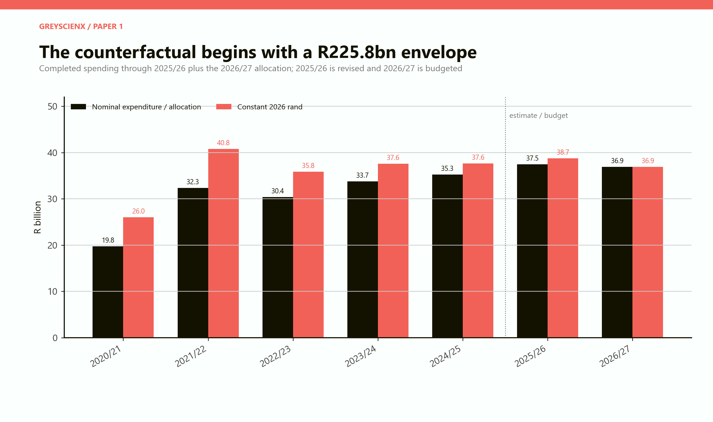
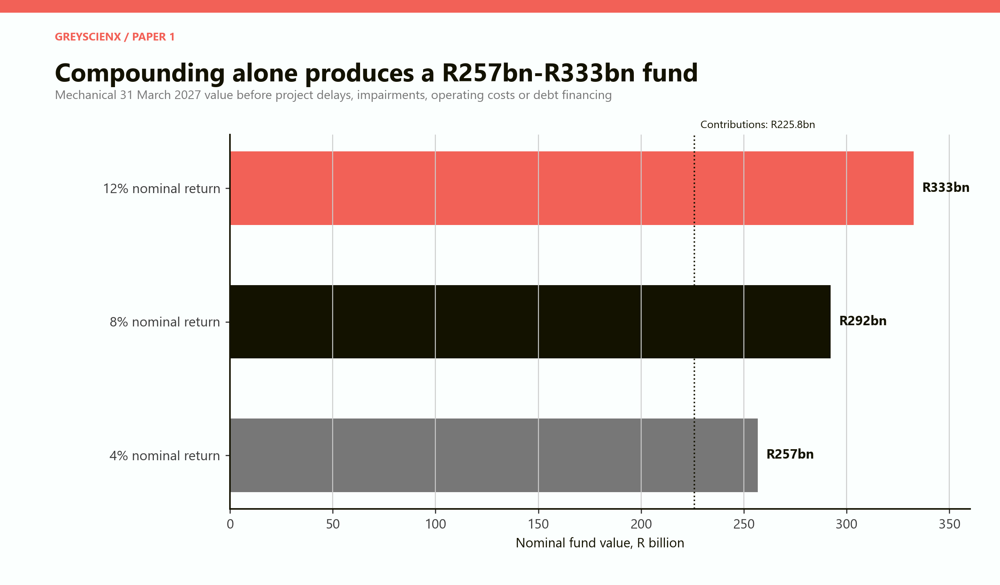
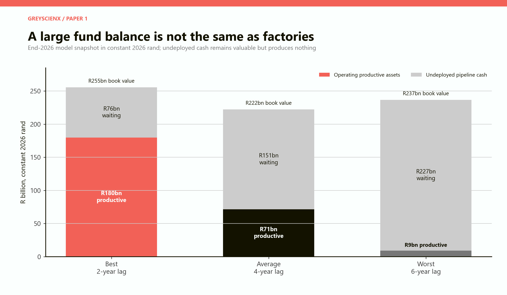
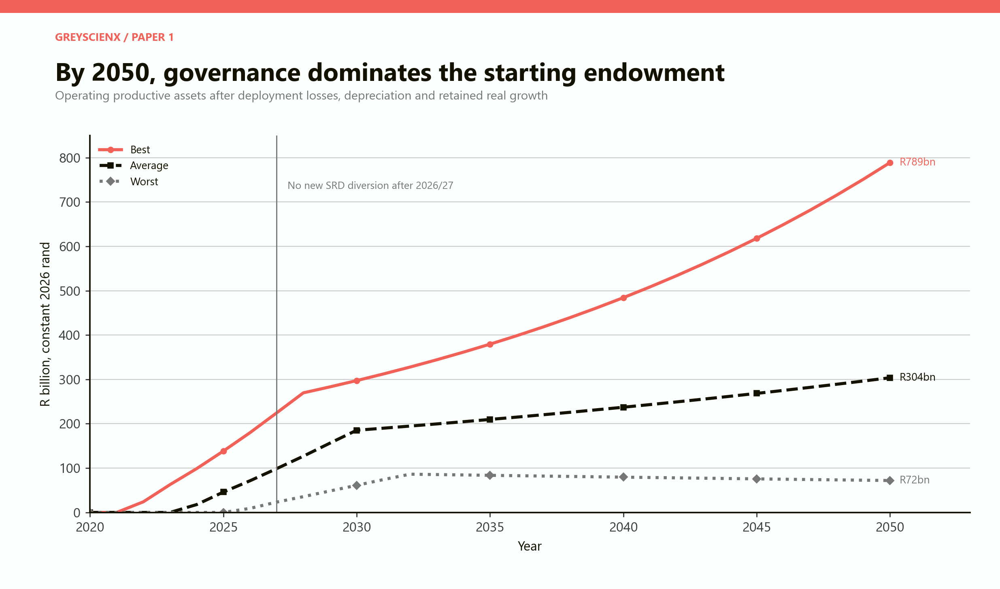
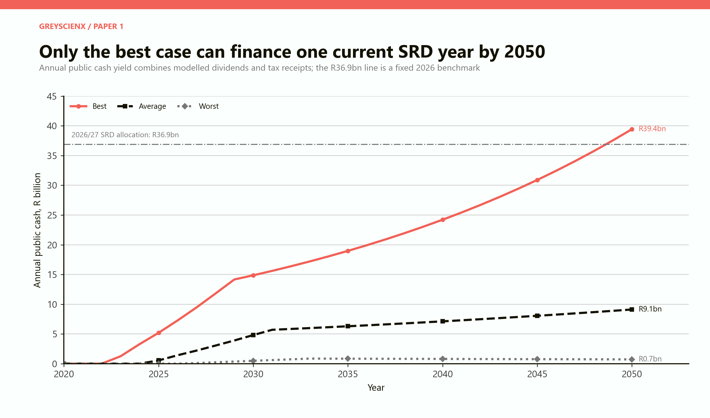
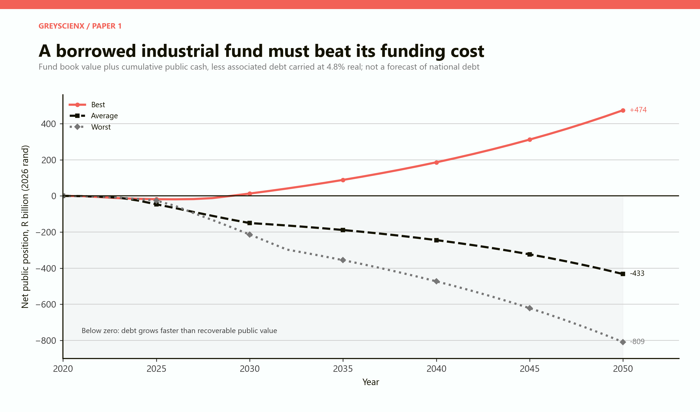
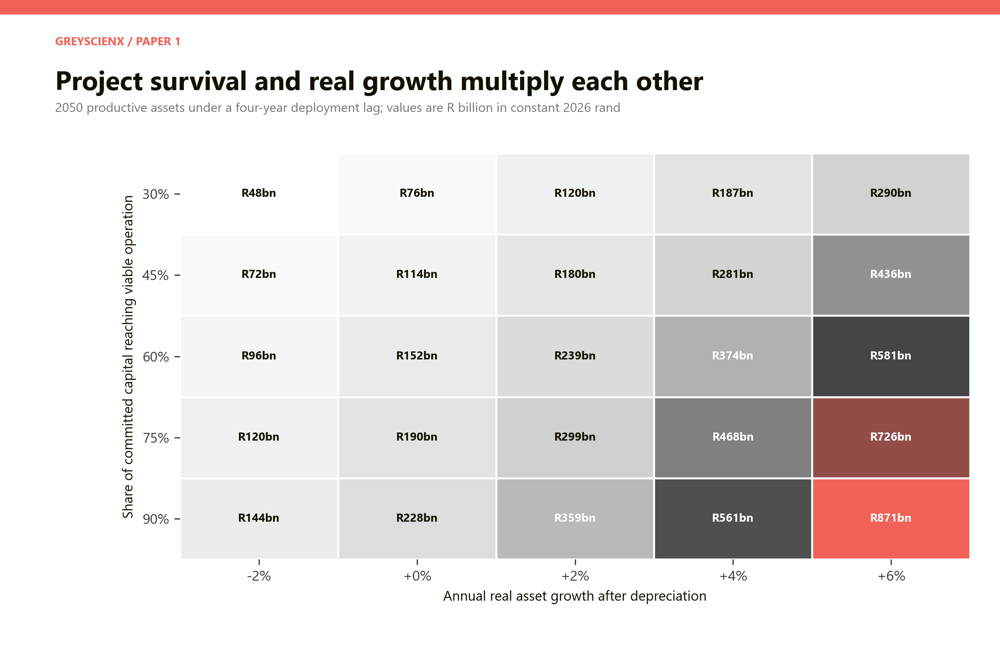
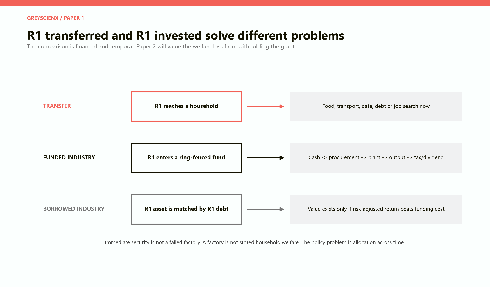

# The R350 Industrialisation Counterfactual

## What South Africa might have owned if social-relief spending had been converted into productive capital

# PART I: The result in one sitting

## The short answer

South Africa could plausibly have assembled a very large industrial endowment from the fiscal envelope devoted to the Social Relief of Distress grant. The envelope from 2020/21 through the 2026/27 allocation is **R225.8 billion in nominal rand**, or about **R253.5 billion when each year's amount is restated in constant 2026 purchasing power**. That is the raw counterfactual resource. It is not yet a factory, a power line, a logistics terminal or a stream of dividends.

The answer therefore turns on a distinction that political arguments usually blur. If the grant was financed from revenue that could genuinely have been saved or reprioritised, the state might now own a material pool of financial and productive assets. If the same industrial programme had simply been added to borrowing, the public balance sheet would acquire an asset and a matching liability. In that second version, the project creates net public wealth only when its risk-adjusted returns beat the state's funding cost.

Our best-case industrial fund becomes large enough to matter nationally. By 2050 it holds about **R789 billion in productive assets, in 2026 rand**, and generates roughly **R39 billion a year in public cash** through the modelled combination of dividends and tax receipts. That annual cash flow finally exceeds one current SRD budget year, but only around 2049. The average case reaches roughly **R304 billion** in productive assets and **R9 billion** in annual public cash by 2050. The worst case reaches just **R72 billion** and **R0.7 billion** a year.

> **The central finding:** the counterfactual is large enough to be economically serious, but it is not automatically superior. The result is governed less by the original R225.8 billion than by whether projects are selected, built, operated and renewed well enough for decades.

This paper is deliberately a financial and industrial counterfactual. It asks what public asset could have existed. It does **not** count the food, transport, data, debt service, job search, health protection, informal trade and local demand purchased by the actual grant. A complete welfare verdict requires the companion paper that values what households and the economy would have lost if the grant had never been paid.

## What the numbers do and do not mean

The historical ledger uses actual SRD expenditure where a final outturn is available, a revised estimate for 2025/26 and the voted allocation for 2026/27. The Department of Social Development reports **R32.33 billion** of actual COVID-19 SRD expenditure in 2021/22. The National Treasury's 2026 Estimates of National Expenditure provides the later actuals, the 2025/26 revised estimate and the 2026/27 budget. These are programme amounts, not a claim that every rand in the latest allocation had already left the fiscus at the time of writing. [Department of Social Development 2021/22 Annual Report](https://portal.dsd.gov.za/DSD-AR/files/basic-html/page234.html); [National Treasury, 2026 ENE Vote 19](https://www.treasury.gov.za/documents/National%20Budget/2026/ene/Vote%2019%20Social%20Development.pdf).

The model is stated mainly in constant 2026 rand so that a 2021 rand and a 2050 rand are not treated as though they buy the same amount. Historical conversion uses Statistics South Africa's consumer-price indices through 2024 and the National Treasury's 2025 and 2026 inflation estimates. [Statistics South Africa, CPI March 2025](https://www.statssa.gov.za/publications/P0141/P0141March2025.pdf); [National Treasury, 2026 Budget presentation](https://www.treasury.gov.za/documents/National%20Budget/2026/2026%20Budget%20presentation.pdf).

*Figure 1. Actual, revised and budgeted SRD programme amounts. Constant-rand bars show the purchasing power of each year's allocation in 2026 terms.*

## The three counterfactuals hiding inside one question

There is no single honest answer to “what if the SRD grant had been invested?” because the financing source changes the economics.

1. **Reprioritised industrial fund.** Existing revenue is diverted from the grant into a legally ring-fenced fund. The public sector sacrifices immediate household relief and acquires an asset without creating matching new debt. This is the cleanest version of the thought experiment and the one used for the asset paths.

2. **Debt reduction instead.** If the grant was debt-financed at the margin, cancelling it could have lowered public borrowing. The relevant alternative is then not “factory versus nothing” but “factory versus less debt”. An industrial fund must outperform the interest and risk that debt reduction would have avoided.

3. **Borrowed industrial fund.** Government pays the grant and borrows an additional equal amount for industry. This creates an asset and a liability at the same time. It works only when retained asset growth plus recoverable public cash exceed the carrying cost of the debt.

The first version can create a large public endowment even at moderate returns. The third is a leveraged investment strategy. Calling both “investment” does not make their risks equivalent.

| Counterfactual | What changes in 2020-2027 | Immediate balance-sheet effect | Test of success |
|---|---|---|---|
| Reprioritised fund | Grant is withheld; revenue enters fund | Public asset rises | Asset and public returns survive the welfare sacrifice |
| Debt reduction | Grant is withheld; borrowing falls | Public liability falls | Interest and risk avoided exceed foregone welfare |
| Borrowed fund | Grant continues; extra borrowing finances industry | Asset and debt both rise | Risk-adjusted public return beats funding cost |

## Five headline numbers

| Measure | Model result | How to read it |
|---|---:|---|
| Completed or revised SRD through 2025/26 | R188.95bn nominal | Historical outturns plus the 2025/26 revised estimate |
| 2026/27 SRD allocation | R36.89bn nominal | A budget amount, not a completed outturn |
| Full 2020/21-2026/27 envelope | R225.84bn nominal | The headline fiscal counterfactual |
| Same envelope in 2026 purchasing power | R253.54bn | The starting resource used in the real model |
| 2050 productive assets | R72bn to R789bn real | The range created by governance, survival and growth assumptions |

---

# PART II: From cash ledger to industrial fund

## The mechanical fund

The simplest calculation imagines that each annual grant amount entered a liquid portfolio and earned a steady nominal return until 31 March 2027. Before any factory was planned, any tender issued or any project impaired, the resulting gross balance would be approximately **R257 billion at 4 per cent**, **R292 billion at 8 per cent** or **R333 billion at 12 per cent**.

This calculation is useful because it fixes the scale of the opportunity. It is also the easiest number to misuse. A quoted fund value assumes immediate deposit, continuous compounding, no administrative expense, no financing cost, no tax leakage, no corruption, no construction delay and no difference between a liquid security and an industrial project. The real counterfactual begins after those assumptions are removed.

*Figure 2. A gross financial benchmark. These balances precede deployment lags, project losses, operating costs and debt financing.*

At about R225.8 billion nominal, the seven-year programme envelope is roughly **2.8 per cent of forecast 2026 nominal GDP**. It is also about one and a half times the Industrial Development Corporation's reported R144.3 billion asset base for 2024/25. The comparison is not like-for-like, but it shows that the imagined fund would be a national institution rather than a pilot programme. [National Treasury, 2026 Budget presentation](https://www.treasury.gov.za/documents/National%20Budget/2026/2026%20Budget%20presentation.pdf); [IDC Integrated Report 2025](https://www.idc.co.za/integrated-report/wp-content/uploads/2025/09/IDC-Integrated-Report-2025.pdf).

## Cash is not a factory

Industrial capital passes through a pipeline. Money is appropriated, governance is established, projects are originated, land and permits are secured, procurement is completed, construction occurs, commissioning follows and only then can an operating asset produce output. A fund can therefore look wealthy on paper while the productive economy sees little new capacity.

The 2026 snapshot makes this visible. Under the best case, about **R180 billion** has reached operating assets and **R76 billion** remains in the pipeline. Under the average case, only **R71 billion** is operating while **R151 billion** is waiting. Under the worst case, the book still shows roughly **R237 billion**, but only **R9 billion** is productive; nearly all the apparent wealth is undeployed cash.

*Figure 3. Modelled end-2026 fund anatomy. A cash balance retains financial value, but it has not yet created industrial capacity.*

This is not an arbitrary concern. The Auditor-General's 2024/25 national and provincial infrastructure review examined 152 projects and reported findings on 136 of them, with an average delay of 41 months among the projects assessed. That evidence does not mean every industrial project would fail. It means a model that assumes instant, flawless conversion of appropriations into plants is not a South African base case. [Auditor-General South Africa, PFMA 2024/25 General Report](https://www.agsa.co.za/Portals/0/Reports/PFMA/2024-25/PFMA%20GR%202024-25%20Interactive%20W_compressed_compressed.pdf?ver=3OlKZPN3_6KOKRu9Ru5FzA%3D%3D).

## The scenario architecture

The model follows each year's constant-rand contribution separately. A contribution waits for the scenario's deployment lag, loses a share to failed or non-viable projects at commissioning, and then grows or shrinks in real terms as operating assets are maintained, expanded, depreciated or impaired. A separate public cash yield represents the recoverable flow to the state through dividends and tax receipts. No new SRD-sized contributions enter after 2026/27.

| Assumption | Best | Average | Worst |
|---|---:|---:|---:|
| Deployment lag | 2 years | 4 years | 6 years |
| Capital surviving into viable operation | 92% | 68% | 35% |
| Annual real asset growth after depreciation | 5.0% | 2.5% | -1.0% |
| Annual public cash yield | 5.0% | 3.0% | 1.0% |
| Interpretation | Exceptional execution and reinvestment | Mixed portfolio with delays and impairments | Chronic delay, weak operation and capital destruction |

The terms “best”, “average” and “worst” are scenario labels, not statistical confidence intervals. The average case is not an empirical forecast. It is a disciplined middle path designed to expose which assumptions matter. The model is deliberately transparent enough that a reader can reject an assumption without losing the whole argument.

## Why project survival matters twice

Failed capital is not merely a one-off accounting loss. It also loses every future year of production, reinvestment, wages, tax and dividends that a viable plant might have generated. A four-year delay has a similar double cost: households have already surrendered the transfer, but the productive asset has not yet arrived. The fund bears political and financial risk during the wait while the economy receives neither the original household spending nor the promised new output.

The IDC's 2025 integrated report illustrates the seriousness of portfolio risk: it reported an impairment ratio of 30.6 per cent and a non-performing-loan ratio of 41.7 per cent. Those figures should not be pasted mechanically onto a sovereign fund, but they are a warning that development finance is not a savings account with an industrial label. [IDC Integrated Report 2025](https://www.idc.co.za/integrated-report/wp-content/uploads/2025/09/IDC-Integrated-Report-2025.pdf).

---

# PART III: The lifetime of the alternative fund

## Productive assets through 2050

Once deployment is complete, small annual differences dominate the original endowment. The best case retains and expands productive capacity at 5 per cent a year in real terms. It reaches about **R789 billion** by 2050. The average case grows at 2.5 per cent and reaches **R304 billion**. The worst case loses 1 per cent of real operating value each year and ends at **R72 billion** despite beginning with the same fiscal envelope.

*Figure 4. Modelled operating productive assets in constant 2026 rand. After 2027 the paths differ because the same starting endowment is governed, maintained and renewed differently.*

The best case turns every real rand committed into about **R3.11 of productive assets by 2050**. The average case reaches **R1.20**. The worst case preserves only **28 cents** of productive value per real rand committed. Those ratios are not total social returns: they exclude consumer welfare foregone, wages paid, supplier effects, environmental costs and any output that accrues privately rather than to the fund. They are a narrow measure of the surviving productive asset.

## When can industry pay for the grant it replaced?

A public asset is fiscally useful only to the extent that the state can recover cash without stripping the asset of the reinvestment needed to survive. The model therefore separates operating asset value from annual public cash. In the best case, the recoverable flow rises to **R39.4 billion a year** by 2050. In the average case it reaches **R9.1 billion**; in the worst case, **R0.7 billion**.

The 2026/27 SRD allocation of R36.9 billion is used as a fixed benchmark. Only the best case crosses it, and then only near 2049. This matters because the slogan “invest today so returns can fund grants tomorrow” is directionally possible but temporally demanding. A generation could lose relief before the replacement revenue becomes large enough to finance relief at the original scale.

*Figure 5. Annual public cash generated by the modelled asset. The benchmark is one 2026/27 SRD allocation held constant in real terms.*

By 2050 the best case has generated about **R583 billion** of cumulative public cash in constant 2026 rand. The average has generated **R161 billion** and the worst **R17 billion**. This cumulative amount is an undiscounted real total and should not be read as money sitting untouched in a bank account. It may have financed services, been reinvested, paid interest or been distributed. Its purpose is to show the scale of fiscal flows created by successful operation.

## The borrowing test

The model then asks a stricter question. Suppose the industrial fund was debt-financed and the associated liability carried a 4.8 per cent real annual cost. By 2050, the debt associated with the contributions would have grown to about **R898 billion in 2026 rand** if no principal were retired. The best case's asset plus cumulative public cash exceeds that liability by approximately **R474 billion**. The average case falls short by about **R433 billion**, and the worst case by **R809 billion**.

*Figure 6. Net public position for a separately borrowed fund. Positive values mean modelled fund value plus cumulative public cash exceeds the associated debt; this is not a forecast of total national debt.*

The result is not saying that government debt literally compounds without coupon payments until 2050. It is an opportunity-cost account: if debt service is paid from general revenue, the same real carrying cost is still borne elsewhere in the budget. Nor does it assume 4.8 per cent is the one true funding cost. It is a modelling benchmark chosen to make the financing constraint explicit. National Treasury documents show a sovereign balance sheet already exposed to high debt-service costs and predominantly domestic borrowing, which makes a borrowed industrial fund a materially different proposition from a saved one. [National Treasury, 2026 Budget Review Chapter 7](https://www.treasury.gov.za/documents/National%20Budget/2026/review/Chapter%207.pdf).

## A practical break-even rule

The borrowed version should be approved only when the expected public return clears four hurdles together: the sovereign funding cost, expected project losses, the value of liquidity and a risk margin for construction and policy failure. A project that merely promises a nominal yield above inflation is not enough. A project that creates jobs but loses public capital may still be socially worthwhile, but it belongs in an explicit subsidy programme rather than being sold as a self-financing wealth fund.

For a reprioritised fund, the hurdle is different. There is no matching new debt, but the opportunity cost is the welfare and stabilisation value of the grant. The fund must therefore beat the social return on immediate household relief, not merely generate a positive financial number.

---

# PART IV: Who should own the alternative economy?

## Four ownership designs

**A wholly public operating company** gives the state direct control over strategic assets and the largest theoretical claim on dividends. It also places procurement, appointments, maintenance and pricing inside the political system. Concentrated control makes both mission and capture easier.

**A sovereign holding fund with commercial subsidiaries** separates capital allocation from plant operation. The fund appoints professional boards, publishes audited portfolio results and treats each investment as a subsidiary or security. This design can make losses legible and prevent one failed project from contaminating every other project.

**Co-investment with private operators** lets the state contribute patient capital while private partners bring technology, market access and operating discipline. The state receives a minority equity stake, royalties, tax receipts or a capped return. The danger is socialising downside while private partners keep upside, especially when guarantees are opaque.

**Public infrastructure with competitive private use** concentrates the fund on power connections, water systems, logistics, serviced industrial land, laboratories and shared equipment. Firms then compete on top of the platform. This gives the fund less direct dividend income but can have broader spillovers and lower firm-specific risk.

| Design | Fiscal upside | Main risk | Best use |
|---|---|---|---|
| State operator | High direct dividends if successful | Political control and operating failure | Natural monopoly or strategic capability |
| Sovereign holding fund | Portfolio diversification and clearer accounts | Board capture and hidden cross-subsidy | Mixed industrial equity portfolio |
| Public-private co-investment | Leverage, expertise and market access | Guarantees and asymmetric deals | Export-oriented or technology-intensive plants |
| Open-access infrastructure | Broad productivity spillovers | Revenue capture may be indirect | Grid, rail, water, logistics and industrial parks |

## The model's preferred institutional form

The safest architecture is a **ring-fenced sovereign industrial holding fund that mostly owns portfolios, not ministries that operate factories**. Its mandate would be dual but explicit: preserve public capital in real terms and build specified productive capabilities. Commercial returns and policy subsidies would be reported separately. A project could be approved for strategic reasons, but the subsidy component would be appropriated transparently rather than buried in an inflated asset valuation.

The governance design would include an independently appointed investment committee, fixed terms, public beneficial-ownership disclosure for every counterparty, competitive procurement, project-level audited accounts, quarterly deployment dashboards, a prohibition on unfunded guarantees and automatic parliamentary review of projects that miss cost or schedule thresholds.

## What should the fund have bought?

The counterfactual should not be imagined as one giant factory. A portfolio able to survive South African constraints would probably mix four layers.

- **Reliability capital:** electricity, water, rail interfaces, ports, digital backbone and serviced industrial sites. These remove constraints across many firms.

- **Capability capital:** testing laboratories, tooling centres, technical training, applied research and supplier-development facilities. These make production possible without selecting a single national champion.

- **Scalable commercial assets:** firms or plants with existing customers, export channels and credible operators. Capital follows demonstrated demand rather than substituting for it.

- **High-risk strategic options:** small, capped stakes in new technologies or infant industries. Losses are expected and contained; successes can be scaled later.

The allocation should have been paced by project readiness, not by the political need to announce the full R225.8 billion. Undeployed money could remain in liquid securities until projects clear the gate. The cost of waiting would be reported, but the fund would not convert cash into weak projects simply to improve an expenditure rate.

## Employment is a result, not an asset class

South Africa's official unemployment rate was **33.6 per cent in the second quarter of 2026**, with 8.5 million people unemployed under the official definition. This makes job creation a compelling objective, but it can also tempt the state to approve capital-intensive projects with impressive construction employment and weak long-run economics. [Statistics South Africa, QLFS Q2 2026](https://www.statssa.gov.za/publications/P0211/Media%20Release%20QLFS%20Q2%202026.pdf).

A serious scorecard would distinguish temporary construction jobs, permanent direct jobs, supplier jobs, wage quality, training value and displacement of other firms. It would also report public capital per sustainable job. None of those benefits is included in the asset-value model; this is conservative when viable projects create broad spillovers, but dangerously optimistic if “jobs created” becomes a substitute for measuring whether the asset operates.

---

# PART V: Failure, uncertainty and the R1 choice

## The sensitivity map

The most important variables are the share of committed capital that reaches viable operation and the real growth of the resulting assets. With a four-year deployment lag, only 30 per cent survival and annual real shrinkage of 2 per cent leaves about **R48 billion** of productive assets in 2050. At the opposite corner, 90 per cent survival and 6 per cent real growth produces about **R871 billion**.

*Figure 7. Productive asset value in 2050 under alternative survival and real-growth assumptions. Values are R billion in constant 2026 rand.*

The multiplicative pattern matters. Strong operating growth cannot rescue capital that never reaches viable operation. High project survival cannot build a transformative fund if assets then depreciate faster than they are renewed. Governance must work at both the front gate and during the following three decades.

## A failure taxonomy

**Leakage before construction.** Inflated procurement, politically connected intermediaries, advisory fees and land transactions reduce the capital that reaches a physical asset. This is the cleanest form of loss and the easiest to imagine, but it is not the only one.

**Delay without theft.** Permits, grid connections, litigation, design changes and coordination failures can postpone commissioning for years. The money may remain traceable while the economic return disappears through time.

**Completion without viability.** A plant can be built on budget and still lack reliable power, inputs, customers, management or working capital. Physical completion is not productive survival.

**Operation without renewal.** A once-successful asset can decay when maintenance, technology upgrades and skills are underfunded. This is how the worst-case path continues losing real value after commissioning.

**Fiscal extraction.** Government can weaken its own fund by demanding dividends during budget crises. The state receives cash today while reducing tomorrow's asset base. The model's public cash yield assumes distributions are compatible with retained growth; in practice, this needs a rule.

## Stress tests beyond the three scenarios

The counterfactual is especially vulnerable to correlated shocks. Electricity insecurity can impair many firms together. A currency crisis can raise imported equipment costs across the portfolio. A recession can destroy demand just as new plants are commissioned. A change in administration can replace boards, rewrite mandates or force the fund to refinance politically favoured projects. Diversification across firms does not eliminate common exposure to the same grid, logistics network, sovereign and political system.

The industrial fund should therefore have held liquidity, limited guarantees, staged capital commitments and required projects to demonstrate off-take or demand before full build-out. It should also have published a downside value, not only a central forecast. The best case is a destination to earn through institutions, not a return assumption to insert into a budget speech.

## R1 transferred versus R1 invested

The transfer and the investment solve different problems on different clocks. The transferred rand reaches a household immediately. It can buy food, transport, electricity, mobile data, medicine, debt relief or the next job application. Its public balance-sheet value is usually exhausted when it is spent, but its social value may persist through better nutrition, continued job search, avoided distress sales or support for local commerce.

The invested rand enters a chain of institutions before it reaches production. It may become a durable asset that pays wages, raises output and returns tax or dividends for decades. It may also wait, leak, fail or create an asset whose return belongs mostly to someone else. The borrowed invested rand begins with a further handicap: it is matched by debt.

*Figure 8. The temporal and financial paths of a transferred rand, a reprioritised invested rand and a borrowed invested rand.*

| Dimension | R1 transferred | R1 in a funded industrial programme | R1 in a borrowed industrial programme |
|---|---|---|---|
| First recipient | Household | Ring-fenced fund | Fund and lender |
| Time to primary effect | Immediate | Years | Years, while interest accrues |
| Main benefit | Consumption smoothing and security | Productive capacity and future fiscal flow | Additional capacity without cancelling transfer |
| Main risk | Low durable public asset creation | Delay, capture and project failure | Same project risks plus funding-cost risk |
| Public break-even | Not a financial objective | Social return exceeds household welfare foregone | Public return exceeds debt cost and risk |

## The missing side of the ledger

This paper cannot legitimately conclude that the SRD grant was “wasted”. The grant operated during and after an extraordinary labour-market shock and in an economy with extremely high unemployment. Removing R225.8 billion from low-income households would have reduced consumption and local demand. It might have increased hunger, borrowing, informal support burdens and social instability. It might also have changed labour search, migration and household formation. Those effects are not decorative caveats; they are part of the return on the actual policy.

South Africa's real GDP grew by only **1.1 per cent in 2025**, while gross fixed capital formation fell **2.2 per cent**. A credible industrial strategy therefore matters greatly, but weak aggregate demand and weak investment can also interact: suppressing household spending to finance investment may make some new capacity harder to sell. [Statistics South Africa, GDP Q4 2025](https://www.statssa.gov.za/publications/P0441/P04414thQuarter2025.pdf).

The companion welfare paper should value at least six channels: immediate consumption, poverty depth, food security, health and human capital, local multiplier effects, labour-market search and the insurance value of predictable income. Only then can the industrial return and the transfer return be placed on a common social scale.

---

# PART VI: What a serious policy experiment would look like

## The false choice and the real choice

The false choice is “all grants” versus “all factories”. A state facing mass unemployment needs both social protection and productive transformation. The real choice is at the margin: how much current relief should be preserved, how much capital can be saved without destabilising households, which assets genuinely need public finance, and what governance system makes the investment credible.

A more plausible experiment would have diverted a stable minority of new fiscal space rather than retroactively cancelling the grant. It could have paired every rand of public industrial equity with independent due diligence, co-investment and published milestones. The fund could also have been capitalised from windfalls, asset sales, spectrum proceeds or a dedicated share of future revenue rather than debt issued solely to chase uncertain returns.

## Seven rules for a durable fund

1. **Separate welfare from investment accounts.** The grant budget and the industrial fund should have distinct objectives, appropriations and performance measures.

2. **State the financing source.** Every investment proposal should say whether it is funded by revenue, reprioritisation, asset recycling or additional debt.

3. **Report committed, deployed and operating capital separately.** A signed allocation is not an operating asset.

4. **Recognise impairments early.** Delayed recognition turns an industrial fund into an archive of political promises.

5. **Cap project and sector concentration.** No single flagship should be able to destroy the national endowment.

6. **Protect maintenance and reinvestment.** Dividends should be limited by a rule that preserves real productive value.

7. **Publish the counterfactual.** Each project should be compared with debt reduction, open-access infrastructure and private financing, not merely with doing nothing.

## A staged decision gate

The imagined fund would release money in stages. Concept funding would be small. Development funding would require a credible site, permits, grid and water pathway, management team and demand case. Construction funding would require competitive procurement, a fixed risk allocation and co-financing where possible. Final expansion would follow demonstrated operating performance. Projects that fail a gate would return unused capital to the liquid portfolio rather than being kept alive to protect reputations.

The aim is not bureaucratic perfection. It is to preserve the option to stop. In the model, capital survival is one of the two dominant variables; real-world decision gates are how survival is raised.

## The verdict

The R350 industrialisation counterfactual is **large enough to be plausible but too governance-sensitive to be romanticised**. A genuine reprioritised fund could have left South Africa with an asset base worth several hundred billion rand. Under exceptional execution it could eventually generate enough annual public cash to finance a grant of today's size while preserving the underlying capital. Under a mixed but plausible record, it creates a useful asset but does not replace the grant's fiscal scale. Under chronic delay and weak operation, most of the promise disappears.

The borrowed version is harsher. At a 4.8 per cent real funding benchmark, the average and worst cases destroy net public value by 2050. Only the best case clears the debt. This is why the financing source cannot be a footnote.

The deepest lesson is not that transfers should have been abolished. It is that **South Africa lacked a trusted mechanism capable of converting a sustained fiscal stream into productive public wealth while protecting vulnerable households during the wait**. Building that mechanism is still possible. Pretending it is already solved would be the most expensive assumption in the model.

---

# APPENDIX: Model notes and source ledger

## Valuation date and units

Historical programme amounts are organised by fiscal year from 2020/21 to 2026/27. The long-run model labels annual positions by calendar year for readability. Results marked “real” or “constant 2026 rand” hold purchasing power at the 2026 price level. Results marked “nominal” are not inflation-adjusted.

The model uses the 2026/27 allocation as part of the full counterfactual envelope while clearly separating it from completed expenditure. Readers who want only the completed and revised period through 2025/26 should use **R188.95 billion nominal** as the relevant figure.

## Fiscal ledger used

| Fiscal year | SRD amount, Rbn nominal | Status in model | Principal source |
|---|---:|---|---|
| 2020/21 | 19.7566 | Actual | National Treasury 2022 ENE |
| 2021/22 | 32.3307 | Actual | DSD 2021/22 Annual Report |
| 2022/23 | 30.3791 | Actual | National Treasury 2026 ENE |
| 2023/24 | 33.7429 | Actual | National Treasury 2026 ENE |
| 2024/25 | 35.2763 | Actual | National Treasury 2026 ENE |
| 2025/26 | 37.4625 | Revised estimate | National Treasury 2026 ENE |
| 2026/27 | 36.8893 | Budget allocation | National Treasury 2026 ENE |

## Principal sources

- [National Treasury, 2026 Estimates of National Expenditure, Vote 19: Social Development](https://www.treasury.gov.za/documents/National%20Budget/2026/ene/Vote%2019%20Social%20Development.pdf)

- [National Treasury, 2022 Estimates of National Expenditure, Vote 19: Social Development](https://www.treasury.gov.za/documents/national%20budget/2022/ene/Vote%2019%20Social%20Development.pdf)

- [Department of Social Development, Annual Report 2021/22](https://portal.dsd.gov.za/DSD-AR/files/basic-html/page234.html)

- [Statistics South Africa, Consumer Price Index, March 2025](https://www.statssa.gov.za/publications/P0141/P0141March2025.pdf)

- [National Treasury, 2026 Budget presentation](https://www.treasury.gov.za/documents/national%20budget/2026/2026%20Budget%20presentation.pdf)

- [National Treasury, 2026 Budget Review, Chapter 7](https://www.treasury.gov.za/documents/National%20Budget/2026/review/Chapter%207.pdf)

- [Industrial Development Corporation, Integrated Report 2025](https://www.idc.co.za/integrated-report/wp-content/uploads/2025/09/IDC-Integrated-Report-2025.pdf)

- [Auditor-General South Africa, PFMA 2024/25 General Report](https://www.agsa.co.za/Portals/0/Reports/PFMA/2024-25/PFMA%20GR%202024-25%20Interactive%20W_compressed_compressed.pdf?ver=3OlKZPN3_6KOKRu9Ru5FzA%3D%3D)

- [Statistics South Africa, Quarterly Labour Force Survey, Q2 2026](https://www.statssa.gov.za/publications/P0211/Media%20Release%20QLFS%20Q2%202026.pdf)

- [Statistics South Africa, Gross Domestic Product, Q4 2025](https://www.statssa.gov.za/publications/P0441/P04414thQuarter2025.pdf)

## Limits

This is a transparent scenario model, not a forecast or causal estimate. It does not model macroeconomic feedback from removing household transfers, endogenous interest rates, exchange-rate changes, crowding in or crowding out of private investment, sector-specific production functions, construction-price inflation, distributional incidence, environmental externalities or the probability distribution of political regimes. Public cash combines tax and dividend recovery in one scenario yield. Asset growth is net of depreciation and compatible with that cash distribution by assumption.

The model's value is not precision. It makes the hidden conditions of the counterfactual visible: financing, deployment, survival, growth, public capture and time.

## Reproducibility checklist

The scenario can be rebuilt from the seven annual fiscal entries in the source ledger. Each amount is first converted to 2026 purchasing power. It remains in the pipeline for the stated deployment lag, after which the scenario's viable-operation share becomes a productive asset. That asset then follows the scenario's real growth path through 2050. Public cash is recorded as the stated share of operating productive assets each year. The borrowed-fund test carries an associated liability at 4.8 per cent a year in real terms and compares it with the remaining fund value and cumulative public cash.

The calculation makes four conservative presentation choices. It stops new contributions after 2026/27; it does not invent proceeds from selling successful assets; it does not capitalise employment or supplier benefits into the fund's book value; and it keeps the SRD comparison fixed at the 2026/27 real allocation rather than assuming that future eligibility or benefits expand.

It also makes choices that may flatter the investment case. Pipeline cash is not charged a management cost. Once capital becomes productive, the scenario assumes the public cash yield can coexist with the stated real asset growth. The model does not impose a separate tax for foreign-exchange, construction-cost or refinancing shocks. Most importantly, the reprioritised fund is treated as though the fiscal resources could have been withdrawn from households without changing the macroeconomic path. The welfare companion must relax that assumption.

## How to challenge the result

A reader who believes South Africa could deploy industrial capital quickly should shorten the lag and raise the viable-operation share. A reader who expects political allocation, infrastructure constraints and weak maintenance should lengthen the lag and lower survival. Someone who expects the fund to crowd in private capital can raise operating growth or public cash; someone who expects it to displace private projects should lower them. If the fund is debt-financed, the real funding benchmark should be replaced with the reader's preferred sovereign opportunity cost.

The decisive question is not whether a particular point estimate feels optimistic. It is which institutional arrangement makes a chosen set of assumptions believable. The sensitivity map is therefore the centre of the model: it turns an argument about intentions into an argument about observable delivery and operating performance.

## Audit trail for future editions

Future editions should replace revised estimates and budgets with audited outturns, update the inflation conversion, separate dividends from tax receipts and assign project-level cash-flow profiles. A sectoral extension should divide the portfolio among infrastructure, manufacturing, minerals beneficiation, digital capability and human-capital assets. A macroeconomic extension should estimate the household-demand contraction caused by withholding the transfer and the investment multiplier created by the fund. A distributional extension should identify which households surrender relief, which workers obtain jobs and who ultimately owns the productive return.

Until those extensions are made, the correct reading is conditional: **R225.8 billion was enough to create a major industrial institution; whether it would have created national wealth depends on financing and execution; whether it would have improved welfare depends on what the grant itself achieved.**
