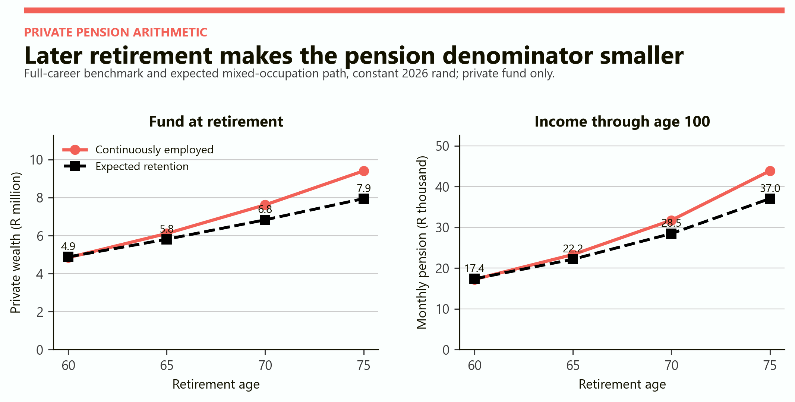
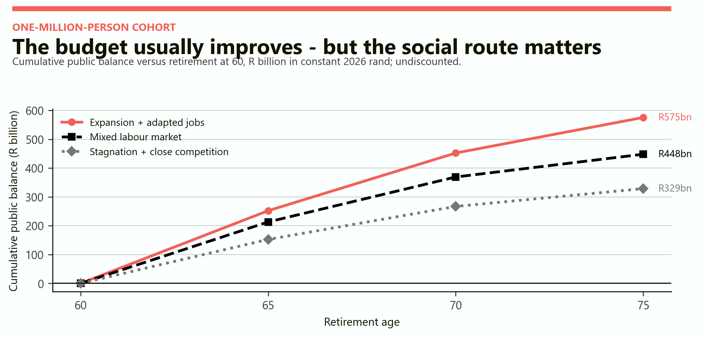
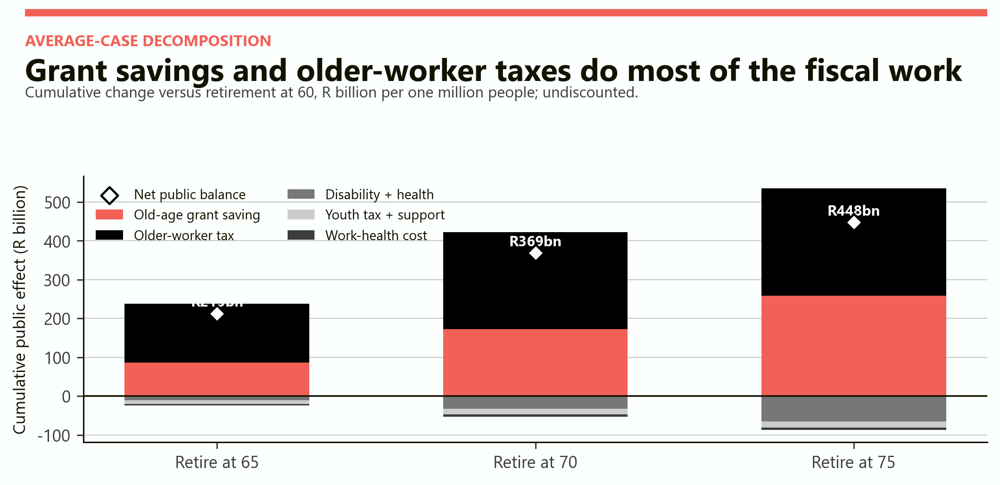
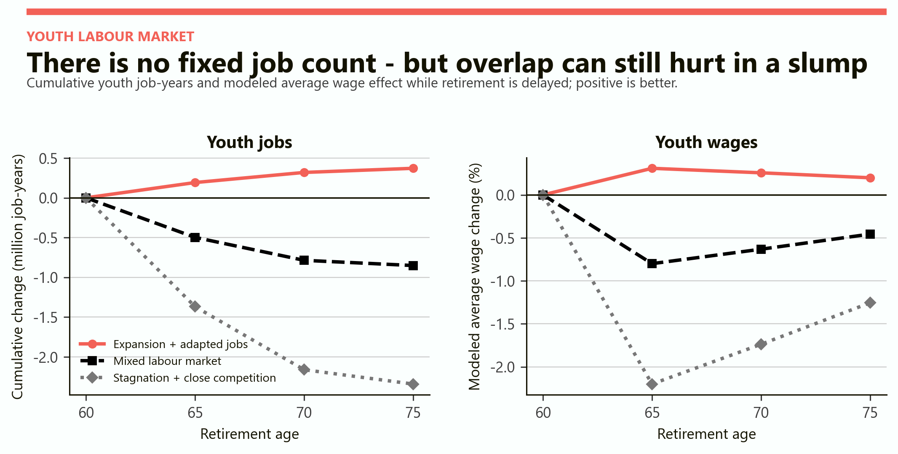
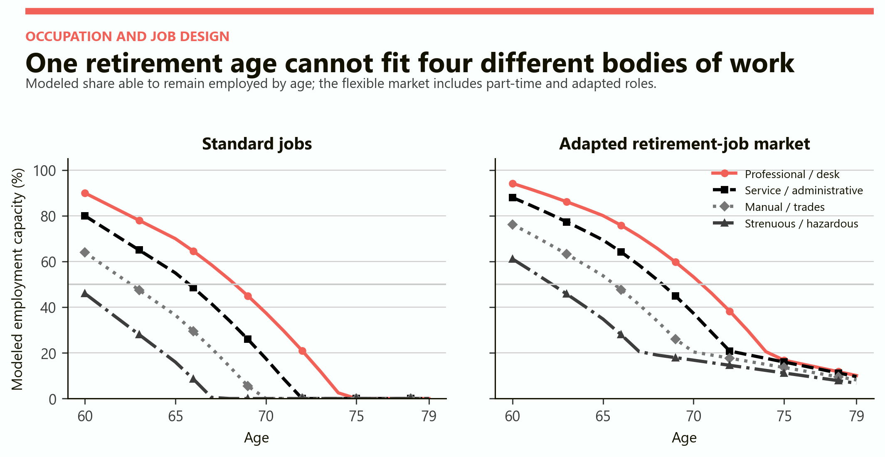

# Does Raising the Retirement Age Actually Work?
## Pension arithmetic, job competition and the limits of a single retirement age

# Part I: The finding

Raising the retirement age can improve a public balance sheet without solving the labour-market problem that made reform necessary. In this model, later retirement reduces old-age grant exposure, adds tax-paying years and improves private pensions. Those gains are real. But the policy works socially only when older people can actually find suitable work and when retaining them does not become a substitute for creating entry-level jobs.

> Later retirement is a financing tool, not a youth-employment strategy. It succeeds when added working lives are healthy, productive and accommodated. It fails when a new legal age simply creates older unemployment before pension eligibility.

The average scenario follows a one-million-person cohort. Compared with retirement at 60, retirement at 65 produces a cumulative modeled public gain of R213 billion. Age 70 produces R369 billion. Age 75 produces R448 billion. The last five-year increase therefore adds only R79 billion, about half the gain produced by moving from 65 to 70.

The same average scenario produces 0.50 million lost youth job-years at age 65, 0.79 million at age 70 and 0.85 million at age 75. These are not forecasts. They are the result of assuming that each additional older-worker job displaces 0.15 of a youth job after demand, skill and job-creation effects are allowed for.

| Retirement age | Full-career private pension | Average public gain | Youth job-years | Disability claim-years |
|---|---:|---:|---:|---:|
| 60 | R17,223/month | Baseline | Baseline | Baseline |
| 65 | R23,309/month | R213bn | -0.50m | 0.27m |
| 70 | R31,727/month | R369bn | -0.79m | 0.81m |
| 75 | R43,839/month | R448bn | -0.85m | 1.61m |

The strongest conclusion is therefore conditional. Age 65 looks fiscally robust in all three modeled labour-market cases. Age 70 produces a larger gain but needs much better job matching and disability protection. Age 75 still improves the modeled budget, yet the incremental gain is smaller while the number of people unable to work before eligibility rises sharply.

# Part II: What does "work" mean?

A retirement-age reform can pass one test while failing another. Five tests matter.

First is private adequacy: does the worker retire with a larger fund and a shorter period to finance? Second is the public ledger: do delayed benefits and additional taxes exceed disability, health and youth-related costs? Third is employment: are older people actually working, or merely waiting longer for support? Fourth is youth access: does the reform change hiring, wages and promotion ladders for younger workers? Fifth is output: does the economy produce more, or merely reshuffle a fixed payroll?

| Test | A genuine success | A misleading success |
|---|---|---|
| Private pension | More contributions and fewer retirement years | Fund access is delayed while employment disappears |
| Public finance | Taxes rise and benefit pressure falls | Savings come mainly from unsupported households |
| Older employment | Suitable jobs persist with age | The legal age rises but employers still exit older staff |
| Youth opportunity | Demand and mentoring expand entry routes | A stagnant payroll shifts risk toward new entrants |
| Productivity | Experience and adapted work add output | Poor job fit lowers output and raises injury or absence |

This distinction is especially important in South Africa. The [Labour Relations Act](https://www.labour.gov.za/DocumentCenter/Acts/Labour%20Relations/Labour%20Relations%20Act.pdf) refers to the normal or agreed retirement age for a particular capacity; it does not supply one universal economy-wide number. The [Older Persons Grant](https://www.dsd.gov.za/index.php/21-latest-news/680-sassa-confirms-2026-2027-social-grant-payment-schedule-and-increases) begins at 60 under current rules and is R2,400 a month from April 2026. Changing employment practice, pension-fund rules and grant eligibility would therefore be related but distinct reforms.

This study treats age 60 as the common comparison point. Ages 65, 70 and 75 are policy experiments, not descriptions of current law or recommendations for every occupation.

# Part III: The model

The model contains two linked exercises. The first follows a continuously employed private saver earning R30,000 a month at age 25. Real wages grow by 1.5 percent, 15 percent is contributed to retirement and the account earns a smooth 3 percent real return. Each pension is designed to last through age 100.

The second exercise follows one million people from age 60 until the chosen retirement age. It uses a broader average salary of R22,000 a month at 60, adjusted by occupation. Sixty percent are treated as potentially eligible for the modeled old-age benefit. This is close to the current scale suggested by 4.2 million old-age grant recipients and 6.6 million people aged 60 or older, but it is still a rounded analytical input rather than an eligibility forecast. [National Treasury](https://www.treasury.gov.za/documents/National%20Budget/2026/ene/FullENE.pdf) reports about 4.2 million old-age grant beneficiaries, while [Statistics South Africa](https://www.statssa.gov.za/?p=19307) reports 6.6 million people aged 60 or older in 2025.

| Occupation group | Cohort share | Wage weight | Capacity at 60 | Disability propensity |
|---|---:|---:|---:|---:|
| Professional and desk | 35% | 130% | 90% | Low |
| Service and administrative | 30% | 90% | 80% | Moderate |
| Manual and trades | 25% | 78% | 64% | High |
| Strenuous and hazardous | 10% | 88% | 46% | Very high |

Capacity means the modeled share able to remain in standard employment. It falls with age and falls faster in physical occupations. It combines health, employer demand and job fit; it is not a clinical estimate.

Three labour-market cases surround the result. The best case combines expanding demand, adapted jobs, 95 percent older-worker productivity and a small youth complementarity. The average case uses standard jobs, 85 percent productivity and 0.15 net youth displacement per older job. The worst case assumes weak retention, 70 percent productivity and 0.55 youth displacement per older job.

# Part IV: The private pension arithmetic

For someone who remains employed, the arithmetic of later retirement is powerful. The fund receives more contributions, existing assets compound for longer and the same balance finances fewer retirement years.

*Figure 1. The coral line assumes continuous formal employment. The black line allows for the model's average occupation-specific employment retention after 60. Values are private retirement assets and modeled constant monthly income through age 100.*

The continuous worker's fund rises from R4.84 million at 60 to R6.11 million at 65, R7.61 million at 70 and R9.40 million at 75. Monthly pension income rises even faster: R17,223, R23,309, R31,727 and R43,839 respectively.

The mixed-occupation path is lower because not everyone remains employed long enough to contribute. It reaches R5.81 million at 65, R6.83 million at 70 and R7.94 million at 75. The associated monthly pensions are about R22,159, R28,452 and R37,029.

This is the strongest case for later retirement, but it is also the easiest to overstate. Compounding continues even when a person is not working. A larger balance at 70 can therefore coexist with five years of weak earnings, forced asset preservation or dependence on family before access. The private fund measures retirement income, not wellbeing during the bridge.

# Part V: A legal age does not create a job

The policy changes the date at which retirement is expected or public support begins. It does not compel an employer to retain a worker, create a vacancy suited to an older applicant or restore health lost in a physical occupation.

In the average case, delaying retirement to 65 creates 3.32 million older-worker job-years across the one-million-person cohort. Extending to 70 produces 5.24 million. Extending to 75 produces only 5.68 million. Most of the additional employment occurs in the first decade; the final five years add just 0.44 million job-years because modeled retention has already fallen sharply.

| Policy | Older-worker job-years | Average older employment | Unsupported bridge-years |
|---|---:|---:|---:|
| Retire at 65 | 3.32m | 664,000 per year | 0.74m |
| Retire at 70 | 5.24m | 524,000 per year | 2.05m |
| Retire at 75 | 5.68m | 379,000 per year | 3.99m |

An unsupported bridge-year is a modeled year in which a potentially grant-eligible person is neither employed nor receiving the disability benefit. It is a welfare warning, not a prediction of destitution: households may have savings, partners, informal income or other support that the model does not track.

This is where a blunt age increase can become regressive. A professional who can work remotely may gain five contribution years. A manual worker whose job ends at 62 may instead wait three more years for retirement support. The public accounts improve in both cases, but the household experience is opposite.

# Part VI: The public-finance result

Every modeled case produces a positive cumulative public balance relative to retirement at 60. That result is driven by two large mechanisms: the old-age benefit is paid for fewer years, and people who remain employed continue paying tax.

*Figure 2. Cumulative public balance for one million people. The calculation adds delayed old-age benefits and older-worker taxes, then subtracts disability support, work-related health costs, lost youth taxes and modeled youth bridge support.*

| Retirement age | Expansion and adapted jobs | Mixed labour market | Stagnation and close competition |
|---|---:|---:|---:|
| 65 | R252bn | R213bn | R153bn |
| 70 | R452bn | R369bn | R267bn |
| 75 | R575bn | R448bn | R329bn |

The table should not be read as a forecast saving available for a budget speech. It cumulates as many as 15 years across one million people, uses a rounded benefit-eligible share, holds policy constant and does not discount future flows. It also assumes that the eligibility age for the modeled old-age benefit moves with the retirement age.

The important pattern is marginal. In the average case, the first five-year delay produces R213 billion. The next five years add R156 billion. The final five add R79 billion. Fiscal gains continue, but the curve bends because fewer older people are employed and disability substitution grows.

# Part VII: Where the fiscal gain comes from

The age-70 average result contains R172.8 billion of old-age grant savings and R249.2 billion of additional older-worker taxes. Against this sit R32.8 billion of modeled disability and related health costs, R13.8 billion of youth tax and support effects, and R6.5 billion of work-health costs. The net is R369.0 billion.

*Figure 3. Positive bars show delayed grant spending and additional older-worker tax. Negative bars show disability, youth and work-health costs. The diamond is the net public balance.*

At age 75, older-worker tax revenue reaches R276.0 billion, barely above the age-70 result. Grant savings continue rising mechanically to R259.2 billion, while disability and related health costs double from R32.8 billion to R65.5 billion. The age-75 budget case is therefore less about productive work and more about postponing benefit eligibility.

That distinction changes the ethical reading. A reform financed by healthy employment expands both output and revenue. A reform financed by withholding support from people who cannot work improves a narrow ledger while shifting cost to households. Both appear as fiscal gains unless the bridge years are shown explicitly.

The model also excludes consumption taxes paid by retirees, employer pension costs, public-sector pension rules, long-term care, debt interest and the administrative cost of occupational assessments. Including them could move the amounts in either direction.

# Part VIII: Do older workers occupy young people's jobs?

There is no fixed national inventory of jobs. Older and younger workers often have different skills, occupy different rungs of a production chain and spend income that supports demand elsewhere. Releasing an older worker does not guarantee that an employer hires a younger replacement.

The [International Labour Organization](https://www.ilo.org/resource/article/young-and-older-workers-two-sides-same-coin) notes that early-retirement policies have not generally generated jobs for younger workers and that younger workers cannot easily substitute for experienced older workers. An [ILO-hosted study across 20 OECD countries](https://researchrepository.ilo.org/esploro/outputs/journalArticle/The-relationship-between-youth-employment-and/995219572002676) finds youth and older employment positively correlated overall. That evidence rejects a simple one-for-one replacement story, but it is not a South African causal estimate and does not prove that displacement is always zero.

*Figure 4. Youth effects are deliberately scenario-dependent. Positive values mean more youth job-years or higher wages. Negative values mean displacement after demand, skill and mentoring effects.*

In the expansion case, older work is complementary: retirement at 70 adds 0.32 million youth job-years and the modeled average youth wage rises 0.26 percent. In the average case, age 70 removes 0.79 million youth job-years and trims the modeled wage by 0.63 percent. In the worst case, it removes 2.16 million job-years and lowers the wage by 1.74 percent.

The purpose is not to select one coefficient as truth. It is to show that a retirement-age result cannot be complete without an assumption about vacancies, output demand, task overlap and wage adjustment.

# Part IX: General equilibrium changes the answer

A payroll is not the economy. Retained older workers produce goods and services, pay tax, spend wages and may train younger colleagues. Firms may expand because experienced workers preserve capacity. Alternatively, weak demand may leave employment fixed, so longer tenure slows hiring and promotion.

The model turns these channels into three transparent cases. In the best case, adapted older work produces output and creates a small net youth complement. In the average case, some youth employment is displaced but older output dominates. In the worst case, job overlap is high, older employment is weaker and productivity is lower.

| Scenario | Net output at age 70 | Net output at age 75 | Youth effect at 75 |
|---|---:|---:|---:|
| Expansion and adapted jobs | R1.82tn | R2.17tn | +0.37m job-years |
| Mixed labour market | R1.22tn | R1.36tn | -0.85m job-years |
| Stagnation and close competition | R0.54tn | R0.60tn | -2.34m job-years |

These output totals are cumulative and undiscounted. They value employed older workers at 95, 85 or 70 percent of their wage-linked output benchmark and value a gained or lost youth job at 90 percent of the assumed youth wage. They omit capital adjustment, prices, sectoral bottlenecks and international trade.

The economic lesson is narrower than the numbers. Later retirement is easiest when labour demand can expand. It is politically hardest when government asks two excluded groups to compete over a stagnant set of jobs. In that case, pension reform and job creation cannot be treated as substitutes.

# Part X: Healthspan and occupation

Chronological age is a poor measure of work capacity on its own. The [World Health Organization's African regional factsheet](https://files.aho.afro.who.int/afahobckpcontainer/production/files/Healthy-Life-Expectancy_Regional_Factsheet.pdf) reports that South Africans aged 60 had 13.9 additional healthy years on average in 2019. That national average does not mean every person can work to about 74. Health differs by sex, income, disability, lifetime exposure and occupation.

*Figure 5. The left panel shows modeled retention in standard jobs. The right panel adds part-time, remote, advisory, seasonal and physically adapted roles. These are scenario paths, not measured probabilities.*

In standard jobs, at least half of the professional group remains employable through 68, service workers through 65 and manual workers through 62. The strenuous group begins below the 50 percent threshold at 60. Adapted work extends the modeled threshold to 70, 68, 65 and 62 respectively.

| Occupation | Standard-work threshold | Adapted-work threshold | Plausible policy treatment |
|---|---:|---:|---|
| Professional and desk | 68 | 70 | Later default with flexible exit |
| Service and administrative | 65 | 68 | Later age plus part-time conversion |
| Manual and trades | 62 | 65 | Earlier access or role redesign |
| Strenuous and hazardous | Below 60 | 62 | Health-certified earlier retirement |

# Part XI: A separate retirement-job market

An older-worker market should not mean a lower-paid holding pen. Its economic purpose is to convert experience and remaining capacity into work that standard full-time roles do not accommodate.

The modeled market includes part-time work, remote work, advisory roles, training, quality control, seasonal schedules and task redesign. It converts only a fraction of people outside standard employment and counts converted work at 62 percent of a full-time equivalent. This prevents the model from treating every flexible job as a full additional worker.

Under retirement at 70, the expansion and adapted-job case produces 6.38 million older-worker job-years, compared with 5.24 million in the standard average case. It also produces a R452 billion public gain rather than R369 billion and creates 0.32 million youth job-years instead of displacing 0.79 million. Most of that difference comes from assumptions about demand and complementarity, not flexibility alone.

A credible market therefore needs safeguards:

1. Pension and grant rules must permit partial retirement without punishing small earnings.

2. Older contracts should preserve labour protections and portable saving rather than relabel standard jobs as precarious gigs.

3. Training and mentoring should be attached to younger entry routes, so experienced employment expands the ladder instead of blocking it.

4. Employers should redesign tasks before assuming a worker is either fully capable or fully retired.

5. Disability assessment must remain an entitlement process, not a fiscal gate designed to deny the bridge.

# Part XII: The policy answer

Raising the retirement age works best as the last step in a package, not the first. The sequence should begin with jobs and health, then change the age.

| Policy component | Why it is needed | Failure it prevents |
|---|---|---|
| Announce changes far ahead | Gives households and funds time to adapt | Sudden losses for near-retirees |
| Use occupation bands | Aligns work expectations with physical exposure | Regressive treatment of manual workers |
| Allow partial pension and partial work | Makes gradual retirement possible | All-or-nothing exit decisions |
| Build adapted retirement jobs | Turns legal availability into actual employment | Older unemployment before eligibility |
| Protect disability access | Supports people whose healthspan is shorter | Hidden hardship and household cost shifting |
| Pair reform with youth hiring | Creates entry positions and mentoring routes | Intergenerational political conflict |
| Review outcomes at 65 and 70 | Tests real retention, health and displacement | Automatic drift to 75 without evidence |

The model suggests a practical interpretation. Moving from 60 to 65 has a strong fiscal case even under pessimistic labour assumptions, provided the bridge is protected. Moving from 65 to 70 can work when occupation and job design are explicit. Moving from 70 to 75 should face a much higher evidence threshold because employment gains flatten and disability or unsupported bridge years rise.

> The right retirement age is not simply the oldest age that improves the budget. It is the latest age at which enough people can obtain suitable work without transferring excessive risk to unhealthy workers or excluded young entrants.

South Africa's current labour market makes that constraint unusually important. [Statistics South Africa's Q2 2026 release](https://www.statssa.gov.za/?p=19804) reports youth unemployment of 47.4 percent. A separate [Stats SA report on marginalised groups](https://www.statssa.gov.za/publications/03-19-05/03-19-052022.pdf) reports labour-force participation of only 10.6 percent among older persons in 2022. Neither statistic determines the future, but together they warn against believing that a later retirement age creates its own labour demand.

# Notes: Scope, limitations and sources

This is an armchair scenario model, not actuarial advice, a forecast or a causal estimate. All money values are constant 2026 rand and cumulative fiscal and output totals are undiscounted. Results are scaled to one million people. Retirement ages are policy experiments. The model does not reproduce public-service pension rules, retirement-fund contracts, the legal SASSA means test or the full tax system.

The private benchmark starts work at 20, earns R30,000 a month at 25, saves 15 percent, receives 1.5 percent real wage growth and earns a smooth 3 percent real return. The policy cohort begins at age 60 with a R22,000 monthly average wage before occupation weights. Older tax contribution is 16 percent, youth wage is R12,000 a month, youth tax contribution is 8 percent and the youth employment base is 5.6 million. Sixty percent are modeled as potentially old-age-benefit eligible. The cash benefit is R2,400 a month.

Disability claims arise from the modeled non-employed population below the new retirement age. Each claim-year costs the benefit plus a R12,000 health allowance. Unsupported bridge-years are not monetized. Work-health costs vary by occupation. Youth effects are imposed scenario assumptions: a 0.05 youth-job gain per older job in the best case, 0.15 displacement in the average case and 0.55 displacement in the worst case. Wage effects are simple proportional responses.

The current South African context comes from [Statistics South Africa's Q2 2026 labour release](https://www.statssa.gov.za/?p=19804), its [2026 note on the older population](https://www.statssa.gov.za/?p=19307), the [Marginalised Groups Indicator Report](https://www.statssa.gov.za/publications/03-19-05/03-19-052022.pdf), [National Treasury's 2026 Estimates of National Expenditure](https://www.treasury.gov.za/documents/National%20Budget/2026/ene/FullENE.pdf), the [Department of Social Development's 2026 grant notice](https://www.dsd.gov.za/index.php/21-latest-news/680-sassa-confirms-2026-2027-social-grant-payment-schedule-and-increases), the [Labour Relations Act](https://www.labour.gov.za/DocumentCenter/Acts/Labour%20Relations/Labour%20Relations%20Act.pdf), the [WHO healthy-life-expectancy factsheet](https://files.aho.afro.who.int/afahobckpcontainer/production/files/Healthy-Life-Expectancy_Regional_Factsheet.pdf) and the two ILO sources cited in Part VIII.
