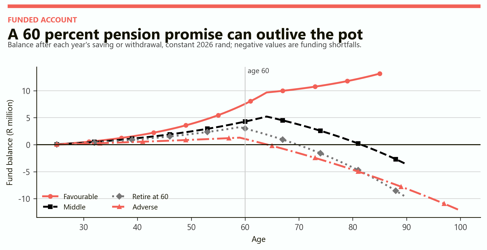
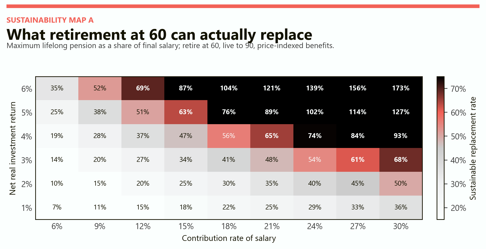
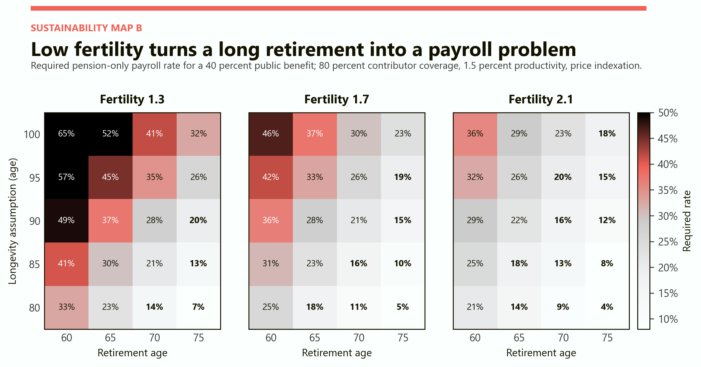
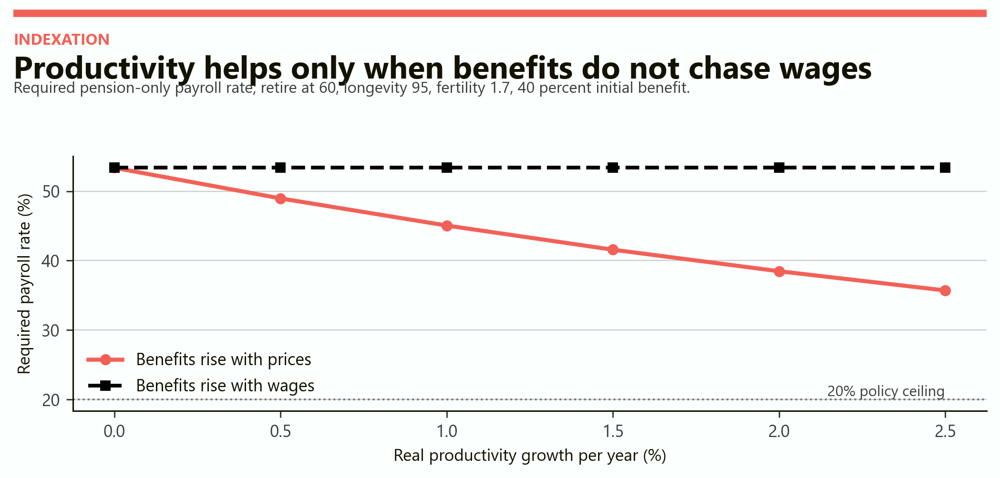
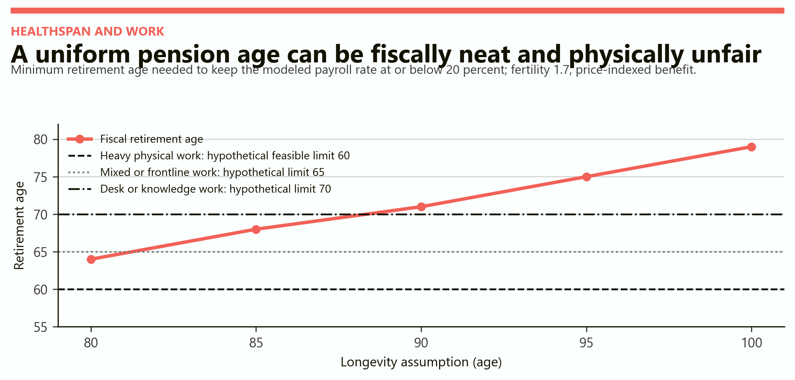

# When Retirement Becomes Impossible
## A readable model of the point at which retirement at 60 stops adding up

# Part I: The finding

Retirement does not become impossible on one date. It becomes impossible in three different ways. A household pension pot can run out before the retiree does. A public system can require a tax rate that workers and employers will not sustain. And a formally balanced system can demand a retirement age that many bodies and occupations cannot reach.

> In this model, retirement at 60 is not broken by longevity alone. It breaks when a long retirement is paired with thin contributions, weak returns, low fertility, incomplete contributor coverage, generous replacement, or wage-linked promises. The dangerous feature is the combination.

The model reaches four headline findings.

1. For a worker beginning at 25 on R30,000 a month, contributing 12 percent and earning a 3 percent net real return, a pension equal to 60 percent of final salary is exhausted around age 70 if retirement begins at 60 and life lasts to 90.

2. Under the same age-60 and age-90 assumptions, a 12 percent contribution with a 3 percent real return supports only about 27 percent of final salary for life. A 60 percent target requires roughly a 21 percent contribution at a 4 percent return, a 15 percent contribution at a 5 percent return, or a later retirement age.

3. In the population model, a short-retirement case needs an 18 percent pension-only payroll rate. The ageing-squeeze case needs 42 percent. The century-life stress case needs 65 percent. These are modeled rates for one pension promise, not estimates of South Africa's current tax system.

4. With fertility at 1.7, 80 percent contributor coverage, a 40 percent public benefit and price indexation, keeping the modeled payroll rate at or below 20 percent requires retirement near 71 if longevity reaches 90, 75 if it reaches 95, and 79 if it reaches 100.

| Model test | Favourable zone | Pressure zone | Failure signal |
|---|---|---|---|
| Individual funded account | Pot remains positive through assumed lifetime | Pot survives, but with a narrow margin | Pot is depleted before death |
| Public pension | Required rate is at or below 20% of covered payroll | Required rate is 20% to 30% | Required rate is above 30% |
| Social feasibility | Retirement age remains within plausible work capacity | Work capacity differs sharply by occupation | Fiscal age exceeds feasible working age |

The 20 percent line is a transparent policy ceiling chosen for comparison. It is not a universal law. A country may accept more, especially if the benefit replaces other spending, or less, especially where payroll taxes already finance health, unemployment and other programmes.

# Part II: Two retirement machines

The word "pension" hides two distinct machines.

In a funded system, today's worker saves into assets. Sustainability depends on years of contribution, contribution rate, investment returns, fees, retirement age, benefit size and years of withdrawal. Fertility does not directly refill an individual's account. The danger is that optimistic return assumptions or a long withdrawal period make the account look richer than it is.

In a pay-as-you-go system, today's workers finance today's retirees. Sustainability depends on the number of contributors, the number of beneficiaries, wages, productivity, coverage, benefit rules and the retirement age. Investment returns matter less directly; demography and the taxable wage base matter more.

Most real systems are hybrids. South Africa combines private funded retirement arrangements with tax-financed, means-tested old-age support. The two models below are therefore lenses, not a literal replica of one institution.

## What the model holds still

| Item | Funded account | Public system |
|---|---|---|
| Starting age | 25 | Working life begins at 20 |
| Starting salary | R30,000 per month | Wages normalized to one unit |
| Money | Constant 2026 rand | Real wage-relative values |
| Employment | Continuous | 80% of working-age people contribute |
| Retirement | Scenario varies from 60 to 75 | Scenario varies from 60 to 75 |
| Longevity | Person lives to the scenario age | Rectangular survival to the scenario age |
| Benefit | 60% of final salary in path scenarios | 40% of the wage at retirement |
| Indexation | Prices, except adverse case follows wages | Prices or wages, depending on test |
| Fertility | Not relevant to own pot | 1.3, 1.7 or 2.1 births per woman |
| Migration | Excluded | Excluded |

The public model ages a synthetic population for 260 years so that each fertility and longevity combination settles into its own age structure. Everyone survives to the chosen endpoint and then dies. That deliberately stark survival rule makes the longevity stress easy to read, but it is not a demographic forecast.

# Part III: The R30,000 worker

The representative saver begins at age 25 with no retirement assets and a gross salary of R30,000 a month. Salary rises with productivity. Contributions are paid each year, the account earns a net real return, and retirement withdrawals target 60 percent of final salary. Amounts are after inflation but before personal income tax. Because every rand flow scales with salary, the percentage results also apply at other salary levels.

The four paths are not probabilities. "Middle" means middle assumptions, not a statistical average. The favourable case assumes 18 percent contributions, a 5 percent real return, retirement at 65 and death at 85. The middle case uses 15 percent, 3 percent, age 65 and age 90. The age-60 case uses 12 percent, 3 percent and age 90. The adverse case uses 8 percent, 1 percent, age 60 and age 100, with the pension rising alongside its modest wage growth.

*Figure 1. The favourable balance keeps growing because its return remains high relative to withdrawals; it is a scenario, not a guarantee. The other paths cross zero; values below zero are funding shortfalls, not literal bank debt.*

| Scenario | Retire | Live to | Contribution | Real return | Pot at retirement | First-year pension | Depletion |
|---|---|---|---|---|---|---|---|
| Favourable | 65 | 85 | 18% | 5% | R9.68m | R386,000 | None by 85 |
| Middle assumptions | 65 | 90 | 15% | 3% | R5.21m | R386,000 | Age 82 |
| Retire at 60 | 60 | 90 | 12% | 3% | R3.25m | R358,000 | Age 70 |
| Adverse | 60 | 100 | 8% | 1% | R1.30m | R256,000 | Age 65 |

# Part IV: The funded sustainability map

The first map asks a precise question: if work ends at 60 and life ends at 90, what share of final salary can the account pay every year without running out? Salary grows by 1.5 percent in real terms and the pension keeps pace with prices.

*Figure 2. Each cell is the maximum price-indexed replacement rate supported through age 90. Values above 100 percent are mathematically possible under very high saving and return assumptions; they are not policy recommendations.*

The map exposes the trade. At a 3 percent real return, a 12 percent contribution supports about 27 percent replacement. Reaching roughly 60 percent requires a contribution near 27 percent. At a 4 percent return, the same target sits between 18 and 21 percent contributions. At a 5 percent return, 15 percent contributions clear the target.

This makes return assumptions politically seductive. Raising the assumed return can make a benefit promise appear funded without asking anyone to save more or retire later. But contributions are chosen; returns are not. A prudent design should survive a lower-return band and should test bad early-retirement sequences, not merely a smooth average.

## What moving retirement from 60 actually does

A later retirement age adds contribution and compounding years while removing withdrawal years. That double action is why it is fiscally powerful and socially contentious. The age-60 and middle cases use the same 3 percent return and 60 percent benefit; retiring five years later and contributing three percentage points more makes the pot last 17 years longer. That gain exists only if work is available and health permits it.

# Part V: The population machine

The public model asks a different question: how large must a pension-only payroll charge be to finance a 40 percent benefit for every modeled retiree?

Each year, people aged 20 up to the retirement age form the potential worker pool. Eighty percent are treated as contributors. People from the retirement age up to the longevity endpoint receive the benefit. Births emerge from the fertility assumption, migration is zero, and wages rise with productivity. The model then compares the total benefit bill with covered payroll.

The central demographic quantity is the retiree dependency ratio: retirees for each worker. Its inverse is workers per retiree. If benefits rise with wages, a 20 percent payroll ceiling, 80 percent coverage and a 40 percent benefit can support at most 0.4 retirees per worker. That means at least 2.5 workers per retiree. Price indexation permits a somewhat higher headcount ratio because older pensions become smaller relative to current wages.

## The scenario set

| Scenario | Retirement | Longevity | Fertility | Workers per retiree | Required payroll rate |
|---|---|---|---|---|---|
| Short retirement | 65 | 85 | 2.1 | 2.37 | 18% |
| Ageing squeeze | 60 | 95 | 1.7 | 0.94 | 42% |
| Century life | 60 | 100 | 1.3 | 0.57 | 65% |
| Reformed century life | 70 | 100 | 1.3 | 0.96 | 41% |

The reformed century-life case is important. Moving retirement from 60 to 70 cuts the required rate by roughly 23 percentage points, but does not return the system to the 20 percent zone. Retirement age is powerful, not magical. Very low fertility and very long life can overwhelm a single reform.

# Part VI: The public sustainability map

The main map varies retirement age, longevity and fertility simultaneously. Productivity is 1.5 percent, benefits keep pace with prices, coverage is 80 percent, and the first-year public benefit replaces 40 percent of the wage at retirement.

*Figure 3. Bold cells are at or below the illustrative 20 percent payroll ceiling. Darker cells require a larger pension-only payroll rate. The grid is a long-run synthetic population, not a calendar-year forecast.*

At fertility 2.1, longevity 85 and retirement at 65, the required rate is 18 percent. At fertility 1.7, the same ages require 23 percent. At fertility 1.3, they require 30 percent. Fertility matters slowly but powerfully because it changes the future base of workers.

Longevity matters immediately once it expands years in retirement. With fertility at 1.7 and retirement fixed at 60, moving the longevity endpoint from 80 to 100 raises the required rate from 25 percent to 46 percent. Holding longevity at 95, moving retirement from 60 to 75 lowers it from 42 percent to 19 percent.

No row or column should be treated as destiny. A country can change contributor coverage, migration, employment, benefit size, retirement behavior and tax sources. The map's purpose is to reveal what a promise requires, not to claim that one variable causes the whole outcome.

# Part VII: Productivity and the indexation trap

Productivity raises wages and the taxable payroll. Whether it rescues the pension system depends on what happens to benefits.

If pensions rise with prices, new wages pull ahead of older pensions in real wage terms. In the ageing-squeeze case, increasing productivity from zero to 2.5 percent lowers the required payroll rate from 53 percent to 36 percent. If pensions rise with wages, the benefit promise grows as fast as the tax base and the required rate remains near 53 percent.

*Figure 4. Price indexation preserves modeled purchasing power while allowing pensions to fall behind wages. Wage indexation preserves retirees' relative living standard but gives up productivity as a fiscal escape route.*

This is not a free saving. Price indexation can leave the oldest pensioners far behind the working population's living standard. Wage indexation protects relative income but transmits wage growth into the benefit bill. A hybrid rule can split the difference, but it cannot erase it.

## The quiet benefit cut

Indexation is often less visible than an explicit benefit cut. That makes it politically useful and distributively dangerous. A system can look stable on aggregate while very old recipients experience a steadily widening relative-income gap. The correct indexation rule therefore depends on whether the policy goal is minimum purchasing power, income replacement, poverty prevention, or parity with workers.

# Part VIII: When the fiscal age outruns the body

A single national retirement age assumes that extra years of life are also extra years of employability. They are not necessarily the same thing.

The figure overlays the fiscal retirement age needed to stay within the 20 percent payroll ceiling with three hypothetical occupational limits: 60 for heavy physical work, 65 for mixed or frontline work and 70 for desk or knowledge work. These are modeling boundaries, not empirical claims about every worker.

*Figure 5. Under fertility 1.7 and price indexation, the fiscal age rises from 64 at longevity 80 to 79 at longevity 100. A uniform increase can cross plausible work-capacity limits long before it balances the system.*

At longevity 90, the fiscal answer is about 71. That may be attainable for some knowledge workers and unrealistic for a miner, nurse, cleaner, driver or construction worker. At longevity 100, the model asks for 79. By that point the pension system is trying to solve a demographic problem by assuming an enormous expansion of healthy, employable years.

A more defensible design would separate chronological age from pension eligibility in at least four ways.

- Earlier access for objectively hazardous or physically demanding occupations.

- Partial pensions that allow reduced hours rather than an abrupt exit.

- Disability and healthspan bridges for people unable to reach the general age.

- Later normal retirement for occupations with longer feasible careers, paired with rules that prevent age discrimination in hiring.

These distinctions reduce the fiscal gain from a uniform age increase, so they must be paired with contributions, benefit design, coverage or other revenue. Fairness has a price, but pretending work capacity is uniform merely hides the price in unemployment, disability and household hardship.

# Part IX: What breaks first

Retirement at 60 is financially impossible when the chosen package cannot satisfy all three constraints at once: the assets last, the public financing remains politically tolerable, and the retirement age remains physically and economically reachable.

| Lever | What improves | What it cannot guarantee |
|---|---|---|
| Higher contributions | Builds funded assets and expands payroll revenue | Employment, take-home pay or political consent |
| Higher retirement age | Adds contribution years and removes benefit years | Healthspan, job availability or occupational fairness |
| Lower replacement rate | Directly shrinks withdrawals and public cost | Adequate living standards |
| Price indexation | Lets productivity enlarge the tax base faster than old benefits | Relative parity between old and young |
| Higher coverage | Spreads financing across more workers | More jobs or higher wages by itself |
| Higher productivity | Raises wages, contributions and tax capacity | Relief when benefits are fully wage-indexed |
| Higher investment returns | Compounds funded savings | Predictability, low sequence risk or low fees |
| Higher fertility or migration | Enlarges the future worker base | Near-term relief or automatic employment |

## A useful order of diagnosis

1. Test adequacy first. A balanced system that prevents retirement poverty only by paying an inadequate benefit has not solved the social problem.

2. Test funded survival across a return band, not a single heroic number. In the age-60 map, the difference between 3 and 5 percent real returns changes a 12 percent contribution from 27 to 51 percent sustainable replacement.

3. Test public finance under lower fertility and incomplete coverage. A country can have many working-age adults and still have too few formal contributors.

4. Test occupational feasibility. If the fiscal retirement age exceeds realistic work capacity, the apparent saving will reappear in disability, unemployment, health or household budgets.

5. Make the trade explicit. If the promise is unchanged, a gap must become a higher tax, a later age, lower indexation, a lower benefit, new contributors, public debt, or some combination.

# Part X: Reading the model in South Africa

South Africa is younger than the century-life stress cases, but it already shows why headcounts alone are not enough. [Statistics South Africa's 2025 population estimate](https://www.statssa.gov.za/publications/P0302/P03022025.pdf) puts the population at 63.10 million, with 26.2 percent younger than 15 and 10.5 percent aged 60 or older. Estimated life expectancy at birth is 64.0 for men and 69.6 for women. Those figures do not mean that everyone who reaches 60 dies near those ages; conditional survival at 60 is higher.

The public old-age programme is also not the wage-replacement pension in the map. The [South African Social Security Agency](https://services.sassa.gov.za/portal/r/sassa/sassa/faq) describes the Older Persons Grant as available from age 60 and subject to a means test. The [2026 Budget Review](https://www.treasury.gov.za/documents/national%20budget/2026/review/FullBR.pdf) reports an average old-age grant of R2,400 per month in 2026/27, 4.267 million beneficiaries and R121.792 billion of expenditure. Private retirement funds cover a different part of the system.

The model's relevance is therefore structural. South Africa can experience contributor scarcity before it experiences extreme old-age population shares. High unemployment, informality and interrupted careers reduce both private pension accumulation and the effective tax base. That mechanism belongs in the next study on youth unemployment as a delayed pension crisis; this first model intentionally holds employment simpler so the retirement mechanics remain visible.

Fertility 2.1 is used as a replacement benchmark in the map. The [United Nations World Population Prospects 2024 release](https://www.un.org/sustainabledevelopment/blog/2024/07/press-release-wpp2024/) notes that replacement in a population without migration is about 2.1 births per woman and that more than half of countries are already below that level. Fertility moves slowly, so it is a poor short-term budget lever even when it changes the long-run map.

# Part XI: The policy frontier

There is no single retirement age that is simultaneously correct for every demographic future, funding model and occupation. The sustainable policy is a bundle.

## Favourable bundle

Retirement near 65, high and continuous contributions, strong net real returns, moderate longevity, broad contributor coverage and price-indexed minimum benefits can keep both accounts and public finance inside plausible ranges. The risk is complacency: favorable returns and uninterrupted careers are not underwritten facts.

## Middle bundle

Retirement near 65, 15 percent saving, 3 percent real returns, fertility near 1.7 and life to 90 can still leave the funded account depleted and the public system above a 20 percent ceiling. This is the important result. The middle is not automatically safe.

## Adverse bundle

Retirement at 60, weak saving, low returns, very long life, low fertility and wage-linked benefits create failure in both machines. The funded account empties quickly; the public system needs a payroll rate that would collide with other taxes, employment incentives and political consent.

## A robust response

The least fragile package spreads adjustment across time and groups: automatic but gradual retirement-age changes; higher default saving; lower fees; broad contribution coverage; a poverty-preventing public floor; partial retirement; occupation-sensitive early access; and indexation that protects purchasing power without promising full wage parity forever. Each element does less damage when it does not have to carry the whole correction.

> Retirement at 60 becomes impossible when society promises more years of adequate non-work income than its assets, contributors and feasible working lives can jointly finance. The honest answer is not one magic age. It is a transparent allocation of longer life between work, saving, tax and benefit years.

# Notes: Model limits and sources

This is an armchair scenario model, not actuarial advice, an investment projection or an official fiscal forecast. It uses deterministic annual returns, continuous employment, no fees beyond the assumed net return, no tax on investment, no sequence-of-returns volatility, no household pooling, no bequests, no medical or long-term-care costs, no migration and no behavioral response to tax or retirement-age changes.

The population model uses a stylized stable age structure and rectangular survival. Actual mortality is distributed across ages, fertility changes over time, migrants arrive at different ages, employment varies by sex and age, and pension rules interact with other taxes and transfers. The occupational age limits are explicitly hypothetical. Results should be read as conditional comparisons: if these assumptions held, this is the direction and approximate scale of the pressure.

Model calculations and figures: GreyScienx scenario model, September 2026. Public context: [Statistics South Africa, Mid-year population estimates 2025](https://www.statssa.gov.za/publications/P0302/P03022025.pdf); [National Treasury, Budget Review 2026](https://www.treasury.gov.za/documents/national%20budget/2026/review/FullBR.pdf); [SASSA, Older Persons Grant eligibility](https://services.sassa.gov.za/portal/r/sassa/sassa/faq); and [United Nations, World Population Prospects 2024 release](https://www.un.org/sustainabledevelopment/blog/2024/07/press-release-wpp2024/).
