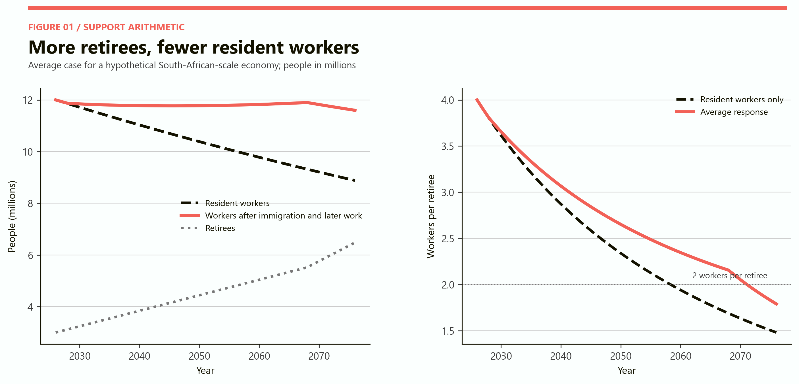
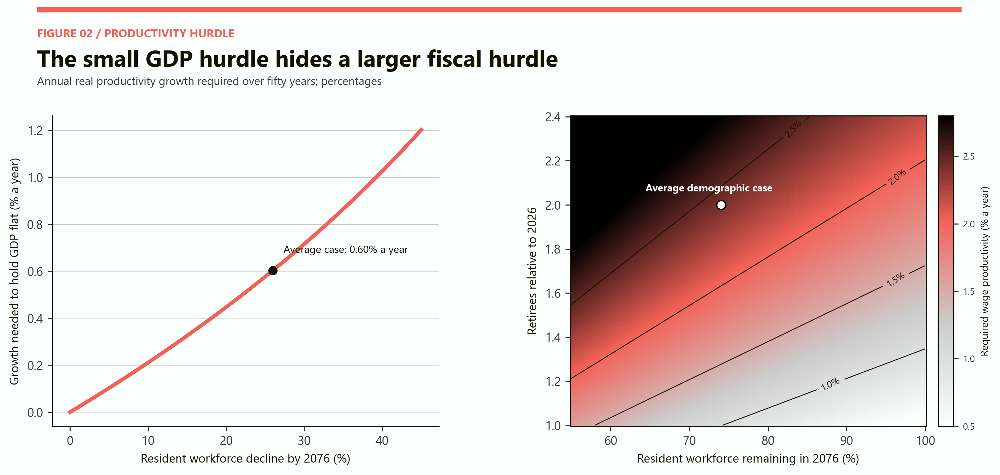
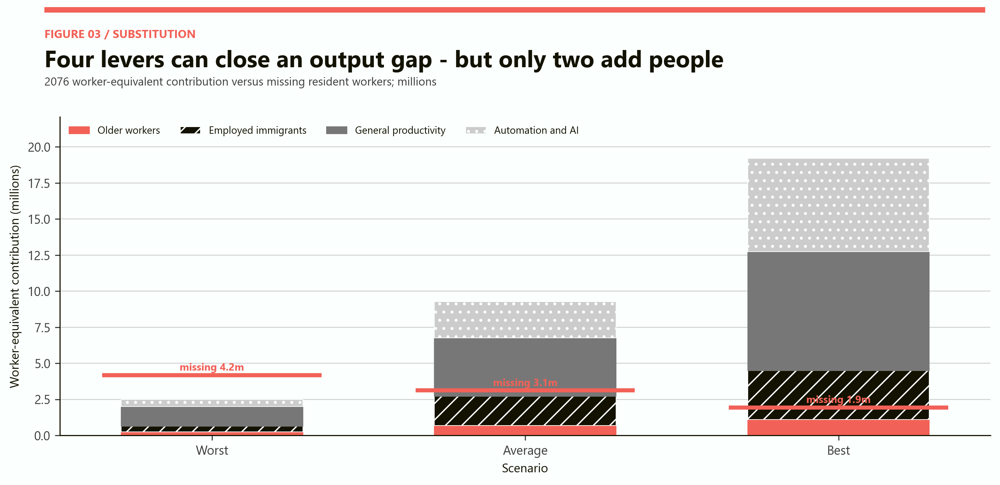
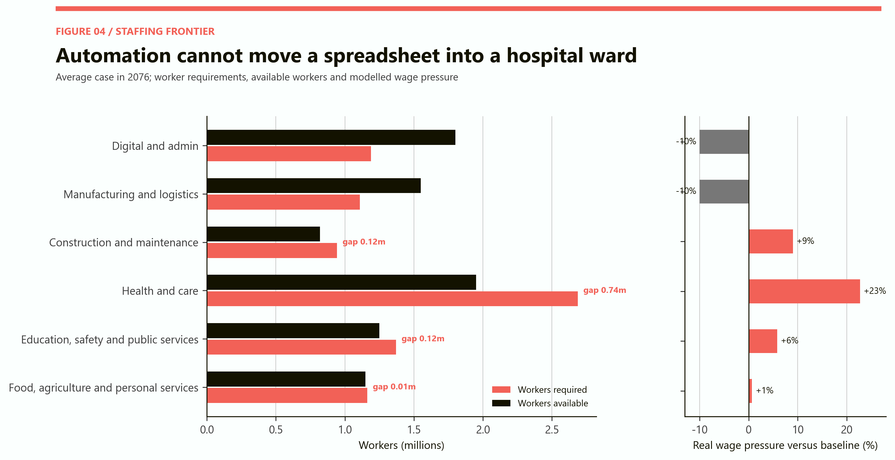
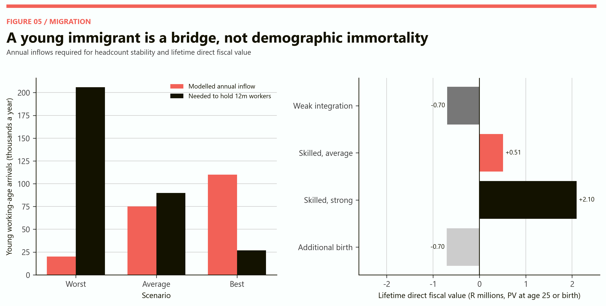
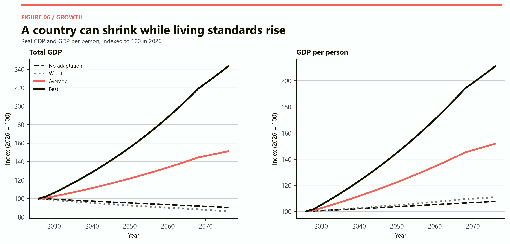

# The Scarce-Worker Economy
## Can automation and immigration support an ageing society with fewer workers?

# Part I: The finding

The scarce-worker economy is not a world without unemployment. It is a world in which the people available for work no longer match the jobs that must be done.

A country can have unemployed graduates and too few nurses; displaced clerks and too few electricians; underused young people in one region and an impossible shortage of carers in another. The demographic problem is therefore not simply a missing number of workers. It is a missing combination of skills, health, location, working conditions and human presence.

The model follows a hypothetical South-African-scale economy from 2026 to 2076. It begins with 12 million full-year-equivalent workers, 3 million retirees and a population of 22 million. In the average case, the resident workforce falls to 8.88 million while the number of native retirees rises to 6 million. Later working lives add 700,000 workers and a continuing inflow of 75,000 young immigrants a year supplies 2.02 million employed residents by 2076. The total workforce ends at 11.60 million, but earlier immigrant cohorts have also begun to retire.

Productivity does the remaining economic work. General improvement of 0.6 percent a year and automation-related improvement of 0.3 percent a year raise output per worker by about 57 percent over fifty years. Real GDP reaches an index of 151, even though worker headcount ends slightly below its starting level. GDP per person also reaches 152 because the total population is almost flat after immigration.

This is the optimistic half of the result. Output capacity is not staffing capacity. The average case has enough worker-equivalent production in aggregate, yet it still ends with a modelled shortage of 738,000 health and care workers, 123,000 construction and maintenance workers and 121,000 workers in education, safety and public services. Digital and administrative work has a surplus. A spreadsheet worker displaced by AI cannot become an intensive-care nurse merely because both count as one employee.

Immigration is powerful but not permanent. In the average case, roughly 90,000 young arrivals a year would be needed to hold the contributor headcount at 12 million in 2076. The model admits only 75,000. Those arrivals age too: by 2076, 480,000 members of the immigrant stream are already retirees. A one-off immigration wave buys time. A stable contributor base requires recurring inflows, successful integration or enough productivity to accept a smaller headcount.

The fiscal result is similarly conditional. The modelled age-related contribution burden begins near 8.3 percent of covered wages. It reaches 17.0 percent in the average case, 28.4 percent in the worst case and 10.9 percent in the best case. Automation can finance part of the burden only if the income it creates enters the tax base. Machines do not pay payroll contributions by themselves.

> Automation can replace tasks. Immigration and longer working lives can replace people. None of them automatically puts the right person beside the right patient at three in the morning.

# Part II: Scarcity after mass unemployment

South Africa makes the thought experiment unusually important because labour scarcity can sound absurd in a country with severe unemployment. The contradiction disappears once unemployment is separated into people, occupations, places and institutions.

The [Statistics South Africa Quarterly Labour Force Survey for the first quarter of 2026](https://www.statssa.gov.za/publications/P0211/P02111stQuarter2026.pdf) records a labour market with persistent high unemployment. That does not guarantee an unlimited supply of every kind of labour. A vacancy for a registered nurse in a remote hospital cannot necessarily be filled by an unemployed worker in Gauteng. A vacant engineering post can coexist with unemployed graduates when training quality, experience, transport, pay or hiring systems do not align.

Ageing sharpens this mismatch. Demand shifts toward labour-intensive care while the supply of physically able, appropriately trained workers narrows. At the same time, AI reduces demand for some entry-level cognitive tasks. The result can be simultaneous shortage and displacement.

This is why the model uses full-year-equivalent workers rather than everyone of working age. A person counts according to actual labour supplied, not merely their birthday. Part-time work, unemployment, informal contribution gaps, disability and early retirement reduce the contributor base. Later retirement raises it only if older people can find suitable work and remain healthy enough to do it.

The scarce-worker question is therefore different from the simple population question. The relevant number is not how many adults exist. It is how many effective hours of the required kinds of work can be delivered, and how much taxable value those hours create.

# Part III: The support arithmetic

The average demographic path removes 3.12 million resident workers by 2076. It simultaneously adds 3 million native retirees. Immigration and later working lives nearly restore worker headcount, but they do not restore the original support ratio.

*Figure 1. The average response combines 75,000 young immigrants a year with a gradual rise to 700,000 additional older workers. Migrants enter work after a two-year integration lag and retire at 67. The late decline in the coral line occurs as early migrant cohorts begin retiring.*

The system begins with four workers per retiree. With resident workers alone, it falls below two around the late 2050s and reaches about 1.48 by 2076. The average response keeps the ratio higher for longer, but still ends at 1.79 because total retirees include 480,000 immigrants who have themselves reached retirement.

The ratio is not destiny. A worker in 2076 can be far more productive than a worker in 2026. Retirees can have private savings. Taxes can fall on consumption, property and profits rather than wages alone. Healthier older people can provide family care and paid work. Yet the ratio remains useful because many obligations are personal and recurrent. Someone must deliver meals, maintain buildings, process claims and provide medical care.

The central policy error is to treat the worker count and the output count as interchangeable. Productivity can keep GDP growing. It cannot guarantee that contribution revenue grows at the same rate, and it cannot guarantee enough staff in low-productivity services.

# Part IV: How much productivity is enough?

The easy productivity target is smaller than it first appears. If the resident workforce is 26 percent smaller after fifty years, output per worker needs to grow by only about 0.60 percent a year to keep total GDP unchanged. Compounding does most of the work.

The fiscal target is much harder. If retirees double, the resident workforce falls to 74 percent of its original size and real age-related cost per retiree rises by 0.4 percent a year, wage productivity must grow by about 2.4 percent a year to preserve the original burden per worker without immigration, later retirement or benefit reform.

*Figure 2. The left panel asks only what holds GDP flat. The right asks what preserves the starting ratio between age-related spending and covered wages. The fiscal hurdle rises with both workforce loss and retiree growth.*

That difference explains why a shrinking country can report respectable GDP per person while its pension and health budgets deteriorate. GDP includes capital income, imputed activity and sectors that do not employ many people. Public ageing costs arrive in cash and staff time. If productivity gains accrue mainly to capital owners, the wage tax base may lag even while GDP rises.

In the average case, total labour productivity rises by 0.9 percent a year, but only 65 percent of that improvement is assumed to pass through to covered wages. Immigration and later work reduce the remaining fiscal gap. The model still requires an age-related contribution rate of 17.0 percent by 2076, roughly double the starting rate.

The policy conclusion is not that productivity fails. It is that the government must decide what part of productivity is taxable, what part reaches wages and what part lowers the number of workers needed in essential services.

# Part V: The AI-augmented worker

AI is most valuable in an ageing economy when it makes scarce workers more capable rather than merely making some workers redundant.

A nurse can use ambient documentation to spend less time typing. A doctor can use decision support to triage cases. A municipal engineer can inspect more assets with sensors and image recognition. A teacher can prepare material and feedback faster. A small business owner can automate bookkeeping. In each case, technology removes a task while preserving the occupation.

The [IMF's work on generative AI and employment](https://www.imf.org/-/media/Files/Publications/SDN/2024/English/SDNEA2024001.ashx) estimates that almost 40 percent of global employment is exposed to AI, with higher exposure in advanced economies. Exposure is not the same as elimination. Some exposed jobs are complemented; others face lower labour demand. The economic result depends on which effect dominates and who captures the gain.

The model assigns the largest 2076 productivity multipliers to digital administration and manufacturing-logistics. Health and care receive the smallest multiplier because many tasks require physical handling, trust, observation and human responsibility. Technology makes the carer more productive, but does not remove the need for a person in the room.

AI also changes the ideal unit of policy. Governments usually count jobs. A scarce-worker government should count tasks. It should ask which tasks can be automated safely, which require professional judgement, which can be shifted to patients or families, and which should never be removed merely because the software can mimic them.

The best use of AI in a shortage economy is often invisible: fewer forms, fewer repeated tests, better scheduling, earlier maintenance and less travel. These gains release labour without creating a dramatic robot workplace.

# Part VI: Automation caused by scarcity

Labour scarcity changes the price of automation. A machine that was uneconomic when wages were low can become attractive when vacancies remain open, overtime rises and service failures become costly.

This creates an endogenous response. Scarcity raises wages and vacancy costs. Higher costs encourage firms to redesign processes, standardise products and invest in equipment. The investment raises output per worker and reduces the number of vacancies. In sectors with repeatable tasks, the cycle can be stabilising.

The direction is not guaranteed. Firms may respond to scarcity by producing less, moving abroad, importing the final product or lowering service quality. Small employers may be unable to finance capital even when automation would pay over time. Public procurement may preserve labour-intensive processes because budgets separate capital from payroll.

The [World Bank's study of migration and automation in Malaysia](https://www.worldbank.org/en/country/malaysia/publication/migration-automation-and-the-malaysian-labor-market) reaches a useful mixed conclusion. Migrant workers fill important labour gaps, automation changes the composition of demand, and an ageing economy is likely to need both. It specifically notes that care-sector jobs created by ageing are not easily automated.

The model therefore does not assume that every missing worker mechanically produces a robot. Automation productivity ranges from 0.1 percent a year in the worst case to 0.5 percent in the best. Adoption depends on finance, infrastructure, management quality, skills and whether the task is technically substitutable.

# Part VII: Does demographic decline solve technological unemployment?

At the aggregate level, demographic decline can absorb some technological displacement. If the resident workforce would otherwise lose 3.1 million workers, automation that removes two million worker-equivalents of routine effort need not create mass unemployment. It may fill part of a demographic vacancy.

But the timing and composition matter. Automation can arrive before the workforce has shrunk. It can remove entry-level jobs while shortages occur in senior or licensed occupations. It can affect the wrong region. It can reduce demand for precisely the first jobs through which young people acquire experience.

*Figure 3. The coral line is the resident-worker shortfall relative to 12 million. Stacked bars show actual older and immigrant workers plus output-equivalent gains from general productivity and automation. Productivity equivalents are not people, contributors or available carers.*

In the average case, later work and immigration add 2.72 million actual workers in 2076. General productivity adds output equivalent to about 4.04 million current workers; automation and AI add a further 2.53 million on top of that general improvement. Aggregate capacity therefore exceeds the missing resident headcount.

This does not make transition painless. Administrative workers can still lose wages while carers gain bargaining power. The country may have sufficient total output and an acute shortage of human contact. The right question is not whether technology creates or destroys jobs in total. It is whether the people released from declining tasks can reach the growing tasks before their skills and incomes deteriorate.

# Part VIII: Wages and bargaining power

Workers gain bargaining power when an employer cannot easily substitute another worker, a machine, an imported service or lower output. Ageing increases that power unevenly.

The model produces downward pressure in digital administration and manufacturing-logistics because productivity grows faster than sector demand. It produces upward pressure of about 23 percent in health and care, 9 percent in construction-maintenance and 6 percent in education, safety and public services. These are directional wage pressures, not forecasts.

Higher wages are part of the solution. They attract entrants, discourage early exit and force employers to improve scheduling, tools and management. Suppressing wages in a shortage occupation conceals scarcity rather than removing it.

Yet wages cannot create a trained nurse instantly. Long training pipelines make the short-run labour supply steep. Very high pay can also pull workers from rural areas, public hospitals or poorer countries into better-funded employers, worsening the shortage elsewhere. The national wage gain becomes a regional or international redistribution of scarcity.

Bargaining power also depends on institutions. A fragmented care workforce may remain weak despite shortage because workers are migrants, women, informal contractors or tied to a single employer. Scarcity improves the outside option only when workers can change jobs, enforce standards and carry credentials across employers.

An ageing economy should expect a reversal in status. Jobs once treated as low-productivity cost centres may become the binding constraint on the whole economy. Pay, housing and working conditions in those occupations become infrastructure.

# Part IX: The occupations that fail first

An occupation becomes impossible to staff when the offered package cannot attract enough qualified people to the required place and schedule. The failure does not need to reach zero employment. A hospital can be operational on paper and unsafe in practice.

The vulnerable occupations share at least one of five characteristics.

1. Work must be performed face to face.
2. Qualification takes years and is capacity constrained.
3. Demand is continuous, including nights and weekends.
4. The job is located where housing, transport or amenities are weak.
5. The social value is high but the buyer has limited ability to pay.

Health and long-term care satisfy all five. So do some forms of teaching, public safety, electrical maintenance, water operations, construction trades and agricultural work. A country can import manufactured goods, cloud software and financial services. It cannot import a bath for an elderly person without importing the carer or moving the patient.

*Figure 4. Required workers reflect sector demand divided by modelled sector productivity. Available workers reflect training and occupational mobility. Aggregate labour is sufficient, but health and care remain short by 738,000 workers.*

The result also reveals why a simple retraining slogan is inadequate. Retraining must overcome aptitude, licensing, time, geography, status and pay. Some displaced workers will make the move. Many will not. The model allows large administrative surpluses and care shortages to coexist because that is economically plausible.

# Part X: Health and care are the hard boundary

Care is where the scarce-worker economy stops being an abstract productivity problem.

The [World Health Organization](https://www.who.int/health-topics/health-workforce) now estimates a global health-worker shortfall of about 11 million by 2030, concentrated in low- and lower-middle-income countries. Ageing rich and middle-income countries will compete for workers from precisely the regions where shortages are already most serious.

Automation can reduce paperwork, optimise routing, monitor patients and support diagnosis. Robotics can assist lifting, mobility and logistics. None of these eliminates the need for responsibility, touch, persuasion and observation. A system with excellent software and no nurse remains a failed system.

The model raises care demand by 75 percent by 2076 and allows a 25 percent productivity gain. That still requires 2.69 million care workers, compared with 1.95 million available under the average labour allocation. The 738,000 gap is the largest sectoral shortage.

There are only five ways to close it: train more people, retain them longer, recruit abroad, substitute family care or ration care. The fifth option often arrives disguised as waiting lists, shorter visits, stricter eligibility and exhausted relatives.

Family care is not free. It withdraws time from paid work, usually from women, and can reduce the very tax base intended to finance ageing. Importing carers can reproduce the same burden in sending countries when their own young workers leave. A defensible policy must raise productivity and labour supply without pretending that unpaid or foreign labour has no opportunity cost.

# Part XI: Recruiting workers aged 65 to 80

Later work is the only labour-supply policy that can activate experience already inside the country. It is also sharply constrained by health, occupation and employer behaviour.

Across OECD countries, the [employment rate in 2024 averaged 56.5 percent at ages 60 to 64 but only 26.4 percent at 65 to 69](https://www.oecd.org/en/publications/pensions-at-a-glance-2025_e40274c1-en/full-report/employment-rates-of-older-workers-and-gender-gaps_cb8a2f7b.html). That fall is not merely a pension rule. It reflects health, care duties, skills, discrimination and the physical design of work.

The average model adds 700,000 full-year-equivalent older workers by 2076. Reaching that number requires more than raising a statutory retirement age. It assumes flexible hours, partial pensions, ergonomic technology, mid-career retraining, anti-discrimination enforcement and jobs that can be performed safely.

The 65-80 labour market will probably become a distinct market. It will favour advisory work, mentoring, remote service, quality assurance, light logistics, community care and seasonal employment. It will be less suitable for heavy construction, shift-intensive emergency work and occupations with cumulative exposure to injury.

Employers will also have to redesign promotion. A seventy-year career cannot use seniority as a permanent ladder. Older professionals may move into lower-intensity roles without accepting that the move represents failure. Pension and tax systems must allow gradual retirement rather than forcing a binary choice between full work and no work.

Later work helps, but it cannot be the residual solution after poor health policy. The capacity to work at 70 is built through safer jobs and better health from age 30.

# Part XII: How much immigration stabilises the contributor base?

The required flow depends on three numbers that political debate often ignores: employment, retention and the number of working years remaining after arrival.

The model admits immigrants at age 25, allows a two-year integration lag and retires them at 67. In the average case, 84 percent are employed and 80 percent remain. With those assumptions, about 90,000 arrivals a year are needed to hold the total workforce at 12 million in 2076 after allowing 700,000 additional older workers. The assumed flow is 75,000, so headcount ends 400,000 below the starting level.

The worst case requires about 206,000 arrivals a year because resident-worker decline is faster, migrant employment is weaker and retention is lower. The best case needs only 27,000 to hold the line because resident decline is modest and later work is stronger. Its actual inflow exceeds that threshold and expands the workforce.

*Figure 5. The left panel separates the chosen inflow from the inflow required for headcount stability. The right values direct taxes and public spending over a lifetime. These are model outputs, not estimates for any real migrant or child.*

The arithmetic makes integration policy a demographic policy. Raising migrant employment from 68 to 84 percent can replace tens of thousands of additional annual visas. Recognising qualifications, permitting job mobility, teaching language, providing housing and preventing exploitation raise the fiscal value of people who are already present.

Recruitment without integration is an expensive revolving door. A country may issue enough permits and still fail to build a contributor base if skilled entrants cannot work in their field or leave after a few years.

# Part XIII: Immigration solves, postpones and redistributes ageing

Immigration solves a short-run timing problem because a 25-year-old can contribute almost immediately. It postpones a long-run age-structure problem because that person eventually retires. It redistributes a global workforce problem because the sending country loses a young adult.

The [OECD's analysis of structural labour shortages](https://www.oecd.org/en/publications/oecd-economic-outlook-volume-2024-issue-2_d8814e8b-en/full-report/understanding-labour-shortages-the-structural-forces-at-play_321e116a.html) concludes that immigration is unlikely to offset ageing fully, but can materially ease shortages in the short and medium term when skills are matched and integration works. The older [United Nations replacement-migration study](https://www.un.org/en/development/desa/population/publications/pdf/ageing/replacement-es.pdf) reaches the harder endpoint: flows large enough to preserve support ratios indefinitely can become extraordinarily high.

The model shows the same mechanism. Continuous average-case immigration creates 2.02 million workers in 2076, but also 480,000 retirees from the earliest cohorts. If inflows stop, the migrant workforce begins to contract roughly four decades later. If they continue, the age structure is younger but the absolute population may grow.

Immigration therefore cannot be judged by the false choice of "works" or "does not work." It can be excellent bridge finance for a demographic transition. It is not a perpetual-motion machine.

The stable strategy combines immigration with productivity, later work and domestic training. That combination reduces the number of immigrants required, increases their chance of successful placement and prevents employers from using migration to avoid improving bad jobs.

# Part XIV: Countries competing for young immigrants

As more countries age, the market power of young skilled migrants rises. A visa becomes only one part of a recruitment package.

Workers compare wages, safety, public services, housing, professional recognition, family rights, permanent residence and whether they will belong. A country that offers a nominally high salary but unreliable licensing, hostile administration and no route for a spouse may lose to a lower-paying but more predictable destination.

Competition will be strongest for occupations with portable credentials: medicine, nursing, engineering, software, research and skilled trades. It will also expand into care work, where rich countries can pay far more than sending countries.

This turns brain drain into youth drain. The sending country does not merely lose a qualification. It loses a taxpayer, a potential parent, a household-former and a future leader. If the most mobile members of a small cohort leave, domestic ageing accelerates.

Ethical recruitment codes, training partnerships and compensation can reduce harm but cannot remove the underlying competition. A destination country can finance additional nursing colleges in a source country, recognise qualifications transparently and avoid recruiting from critically understaffed regions. The alternative is a demographic bidding war in which the poorest health systems train workers for the richest.

Immigration incentives will also become expensive. Signing bonuses, housing, tax concessions and rapid residency may be fiscally rational when the alternative is an unstaffed hospital. They should be compared with the lifetime value of a successfully integrated worker, not with the administrative cost of a visa.

# Part XV: The fiscal value of a skilled 25-year-old immigrant

The fiscal value of an immigrant is not an intrinsic property of the person. It is the result of age, employment, earnings, tax design, public services, retention and eventual retirement.

The model follows a 25-year-old to age 90 and discounts future cash flows at 3 percent. The weak-integration case begins on R260,000 a year, has 68 percent employment, 70 percent retention and R180,000 of initial integration cost. It produces a lifetime direct fiscal value of about negative R0.70 million.

The skilled average case begins on R420,000, has 84 percent employment, 80 percent retention and R150,000 of integration cost. It produces positive fiscal value of about R0.51 million. The strong case, with higher earnings, employment and retention, reaches about R2.10 million.

These values include direct taxes, ordinary public services and later retirement cost. They exclude business formation, innovation, consumption spillovers, remittances, children, congestion and distributional effects. The purpose is not to rank human beings by price. It is to show that integration can change the public balance by millions of rand per person.

The [OECD's cross-country fiscal analysis](https://www.oecd.org/en/publications/international-migration-outlook-2021_29f23e9d-en/full-report/component-8.html) similarly finds that age, education and employment are central. Prime-aged immigrants are in the lifecycle phase with the most favourable direct fiscal contribution, while employment gaps explain much of the difference between immigrant and native-born contributions.

Selection can improve fiscal outcomes, but it does not eliminate the obligation to integrate. A brilliant engineer whose qualification is not recognised may contribute less than a moderately skilled worker who enters stable employment immediately.

# Part XVI: Birth subsidies versus immigration incentives

An additional birth and a young immigrant both expand the future workforce, but on radically different clocks.

The immigrant can work after an integration period. The child requires two decades of health, education and family support before entering the tax base. The model's stylised additional birth has a direct lifetime fiscal value near negative R0.70 million after a R250,000 fertility incentive and ordinary childhood public costs. That value excludes the child's private welfare and descendants, so it must not be read as the social value of a life.

For a government facing a staffing crisis in the next ten years, immigration is the only one of the two that can change labour supply in time. For a country planning its age structure over a century, fertility has a different advantage: children are embedded in the future population and may create later generations.

The policies are complements across time. Immigration is a bridge across the next labour-force trough. Family policy influences the width of the bridge needed after 2050. Domestic education determines whether either group becomes productive.

The comparison also exposes a hidden transfer. When a 25-year-old trained abroad migrates, the destination receives education it did not finance. The source country bears the cost and loses the return. A fair migration system should share training costs or expand the source country's training capacity.

Governments should avoid paying for categories rather than outcomes. A birth subsidy that mostly rewards births that would have occurred anyway has a high cost per additional worker. An immigration incentive that attracts people who cannot enter suitable employment has the same problem in another form.

# Part XVII: GDP growth versus GDP per capita

Population decline changes the meaning of national success. Total GDP measures the size of the economic and tax base. GDP per person is closer to average material capacity. They can move in opposite directions.

*Figure 6. The no-adaptation path uses the average resident demographic decline with only 0.4 percent annual productivity growth. The other paths combine their declared demographic, migration, older-worker and productivity assumptions.*

In the worst case, total GDP falls to 86 while GDP per person rises to 111. A smaller population shares a smaller economy, but output falls more slowly than headcount. This is not necessarily a fiscal success. Debt, defence, networks and pensions depend partly on aggregate resources, not only average income.

In the average case, GDP and GDP per person both reach about 151. Immigration roughly stabilises population while productivity raises output. In the best case, GDP reaches 243 and GDP per person 211. That path assumes strong productivity, high migrant employment and retention, and much greater older-worker participation. It is a frontier, not a prediction.

A shrinking country should not chase total GDP growth at any price. Nor should it celebrate GDP per person while hospitals and municipalities lose capacity. The useful dashboard includes both measures, the contributor base, essential-service staffing, median income, public balance and distribution.

# Part XVIII: Best, average and worst cases

The three scenarios are coherent packages. Individual assumptions should not be mixed casually because they interact.

| Scenario | Workforce and migration | Productivity | 2076 outcome |
|---|---|---|---|
| Best | Resident workforce falls 16%; 110,000 young immigrants a year; 1.10m additional older workers | 1.4% a year, including 0.5% from automation | 14.58m workers, 2.37 workers per retiree, GDP index 243, age burden 10.9% |
| Average | Resident workforce falls 26%; 75,000 immigrants a year; 0.70m additional older workers | 0.9% a year, including 0.3% from automation | 11.60m workers, 1.79 per retiree, GDP index 151, age burden 17.0% |
| Worst | Resident workforce falls 35%; 20,000 immigrants a year; 0.25m additional older workers | 0.4% a year, including 0.1% from automation | 8.46m workers, 1.26 per retiree, GDP index 86, age burden 28.4% |

The worst case is not simply low immigration. It combines weak institutions: poor integration, slow investment, ill health, low retention and a fast resident decline. Each failure makes the other levers less effective.

The best case is not simply high immigration. The inflow works because employment and retention are high; productivity works because firms can invest; older work expands because jobs are redesigned; and the public system taxes enough of the new value to finance ageing.

The average case is the most instructive. It succeeds in producing aggregate growth but does not restore the initial support ratio or solve care staffing. This is the likely political danger: headline success can conceal the binding physical bottleneck.

# Part XIX: A practical scarce-worker strategy

The robust policy is a portfolio because every single lever has a boundary.

## 1. Automate the queue before the occupation

Remove forms, scheduling failures, duplicate inspections and routine documentation. Preserve professional judgement and human contact. Public agencies should measure hours released, not software purchased.

## 2. Treat training pipelines as infrastructure

Fund nursing, trades, engineering and care qualifications against projected retirements. Expand supervisors and clinical placements, not only classroom seats. A training target without placement capacity is fictional.

## 3. Price shortage work honestly

Allow wages and conditions to reveal scarcity. Use housing, transport and rural allowances where location is the constraint. Do not solve a shortage through compulsory overtime.

## 4. Build an older-worker labour market

Combine partial pensions, flexible hours, assistive technology, mid-career learning and anti-discrimination rules. Match work intensity to health rather than imposing one retirement age on every occupation.

## 5. Recruit for systems, not vacancies

Link skilled visas to qualification recognition, family settlement, housing and job mobility. Publish retention and field-of-work outcomes. Finance training partnerships and avoid predatory recruitment from critical shortages. A destination cannot build its welfare state by hollowing out another's.

## 6. Tax the productivity dividend

If automation raises profits while reducing payroll, an ageing system cannot rely only on payroll contributions. Broaden the base toward consumption, capital income, economic rents and property while protecting investment and low-income households.

## 7. Protect entry-level ladders

Require firms and the public sector to preserve routes through which young people learn. Apprenticeships, supervised practice and AI-assisted junior roles prevent the automation of the first rung.

## 8. Make care a central economic sector

Count unpaid care, waiting and vacancies. Publish human headcount separately from automation worker-equivalents.

# Part XX: Model assumptions and reading guide

The model is a transparent thought experiment, not a forecast of South Africa, Gauteng or any other jurisdiction. It uses South African rand and a South-African-scale starting economy to make magnitudes readable.

| Input | Average case | Why it matters |
|---|---:|---|
| Horizon | 2026-2076 | Long enough for immigrants to retire and productivity to compound |
| Starting workers / retirees | 12m / 3m | Initial support ratio of 4.0 |
| Starting population | 22m | Scale denominator, not an actual province |
| Resident worker change | -0.6% a year | Produces 8.88m resident workers in 2076 |
| Native retirees in 2076 | 6m | Doubles the starting retiree count |
| Productivity growth | 0.9% a year | 0.6% general plus 0.3% automation-related |
| Young immigrants | 75,000 a year at age 25 | Enter work after two years; 84% employed; 80% retained |
| Retirement age | 67 | Applied to resident and immigrant cohorts |
| Additional older workers | 700,000 by 2076 | Full-year-equivalent contribution |
| Age-related cost | R100,000 per retiree in 2026 | Grows 0.4% a year in real terms |
| Fiscal discount rate | 3% real | Used for migrant and birth lifetime values |

Sector results use declared demand, productivity, training and mobility assumptions. The age-related contribution rate is modelled retirement support divided by covered wages, not a recommended tax rate. Fiscal values omit wider spillovers and human welfare. Worker-equivalents express output capacity; they cannot staff a shift, vote, consume or pay a payroll contribution.

## Sources used

- [Stats SA, QLFS Q1 2026](https://www.statssa.gov.za/publications/P0211/P02111stQuarter2026.pdf); [Mid-year estimates 2025](https://www.statssa.gov.za/?PPN=P0302&SCH=74263&page_id=1854)
- [Stats SA, age structure and dependency](https://www.statssa.gov.za/?p=19711)
- [IMF, Gen-AI and work](https://www.imf.org/-/media/Files/Publications/SDN/2024/English/SDNEA2024001.ashx); [ILO, Employment and Social Trends 2026](https://www.ilo.org/publications/flagship-reports/employment-and-social-trends-2026)
- [ILO, productive working lives](https://www.ilo.org/publications/extending-productive-working-life-older-workers-role-human-resource); [OECD, older-worker employment](https://www.oecd.org/en/publications/pensions-at-a-glance-2025_e40274c1-en/full-report/employment-rates-of-older-workers-and-gender-gaps_cb8a2f7b.html)
- [OECD, labour shortages](https://www.oecd.org/en/publications/oecd-economic-outlook-volume-2024-issue-2_d8814e8b-en/full-report/understanding-labour-shortages-the-structural-forces-at-play_321e116a.html); [immigration fiscal impact](https://www.oecd.org/en/publications/international-migration-outlook-2021_29f23e9d-en/full-report/component-8.html)
- [WHO, health workforce](https://www.who.int/health-topics/health-workforce); [World Bank, migration and automation](https://www.worldbank.org/en/country/malaysia/publication/migration-automation-and-the-malaysian-labor-market)
- [World Bank, long-term growth](https://www.worldbank.org/en/research/publication/long-term-growth-prospects); [UN, replacement migration](https://www.un.org/en/development/desa/population/publications/pdf/ageing/replacement-es.pdf)
