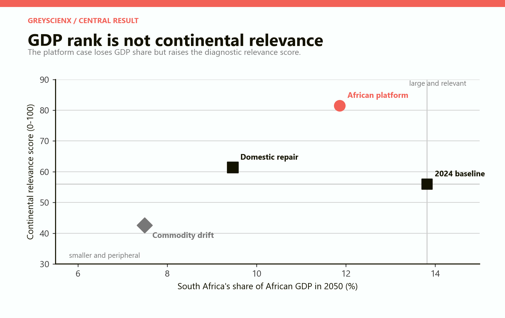
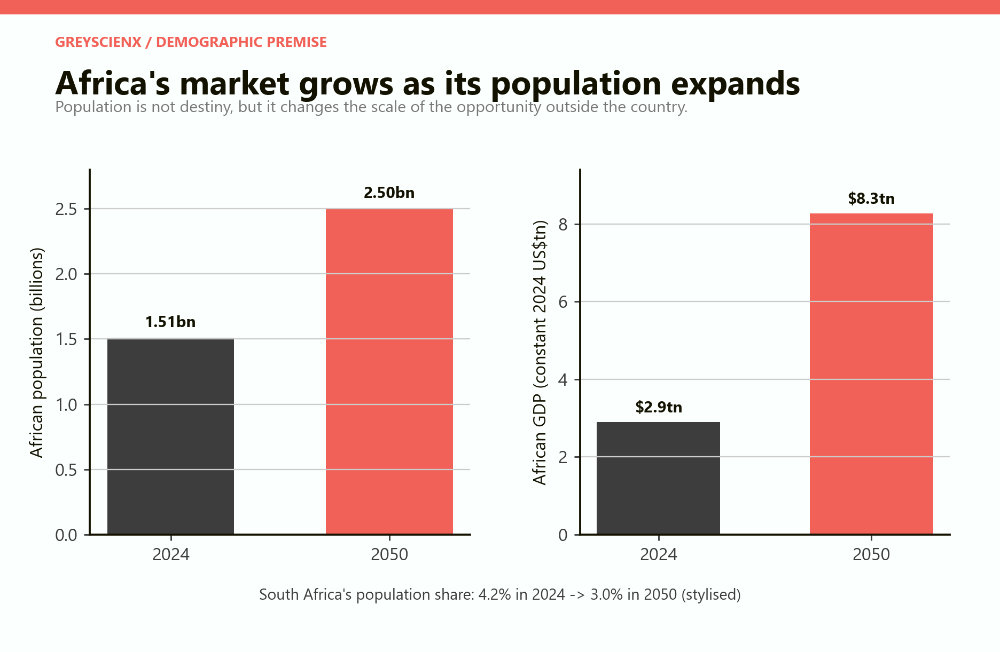
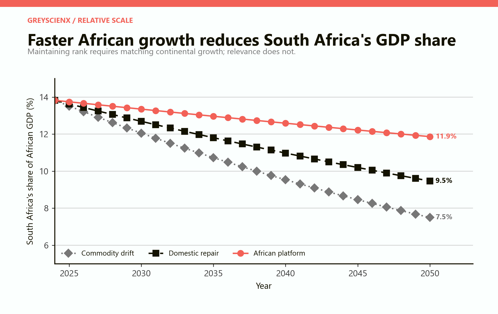
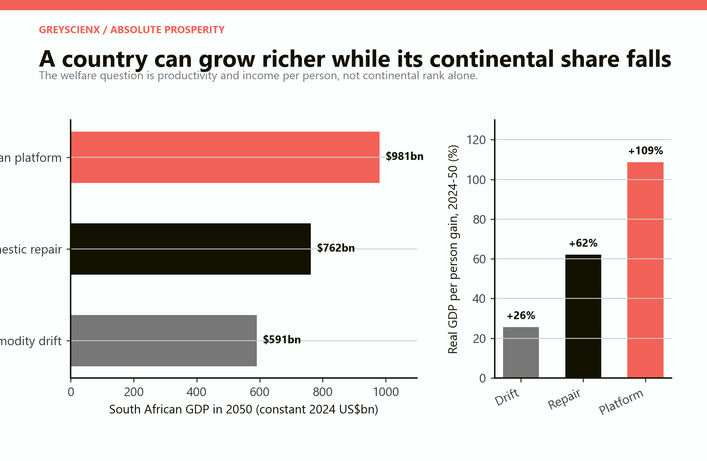
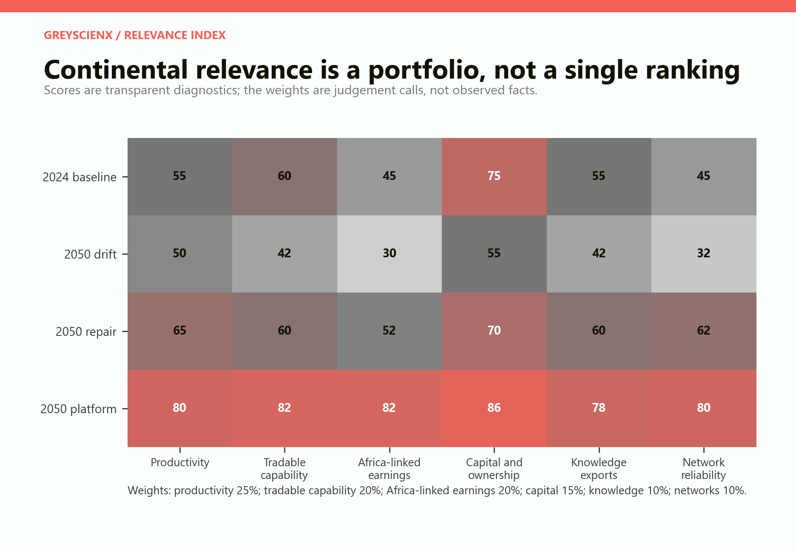
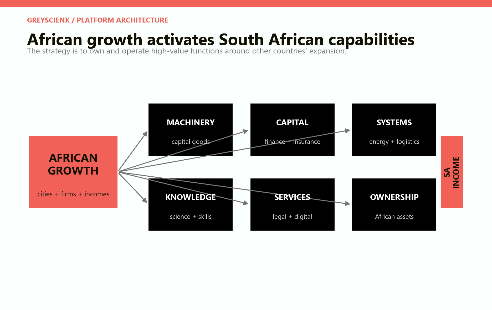
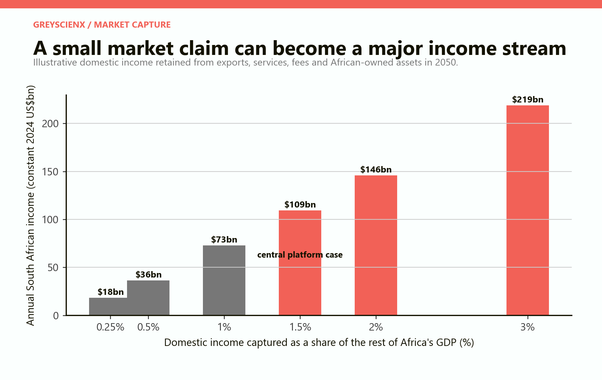
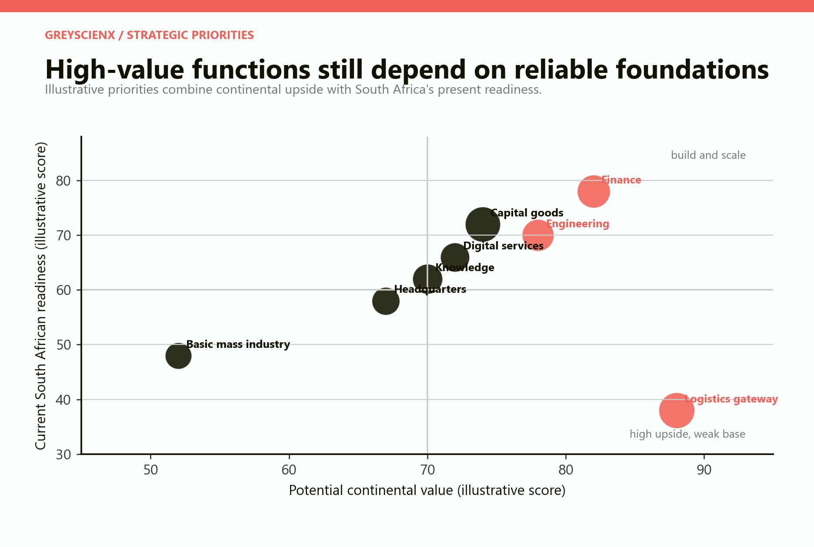
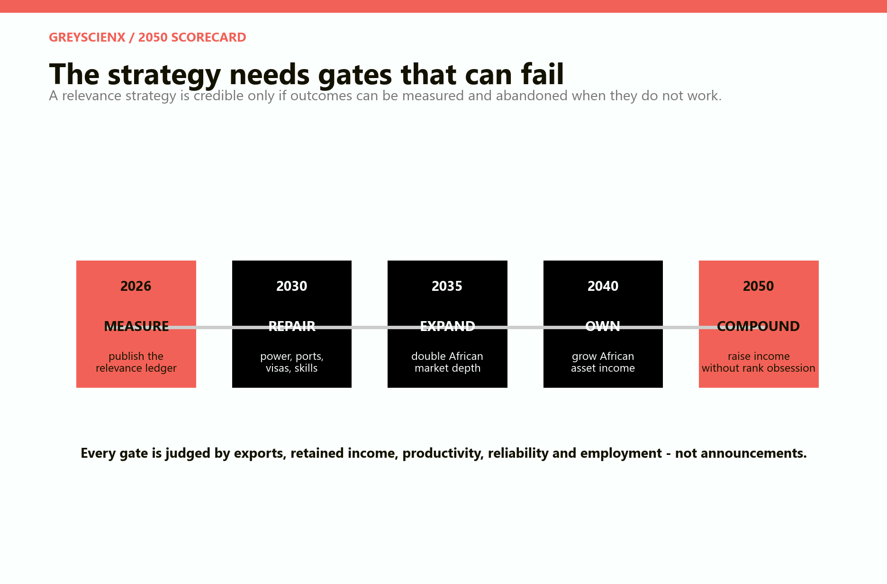
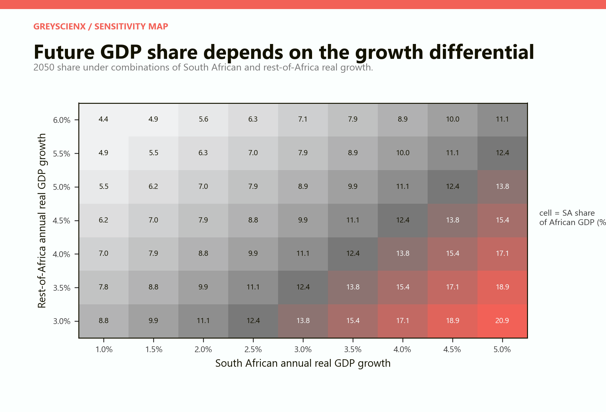

# South Africa in a Richer Africa

## What should the country optimise if its neighbours grow faster and its share of continental GDP falls?

# PART I: The answer

## Stop defending a ranking; build the infrastructure layer of African growth

South Africa does not need to remain Africa's largest economy to become richer, more productive or more strategically important. It needs African growth to create South African income. That can happen through exports, engineering contracts, financial intermediation, intellectual property, headquarters services and ownership of productive assets across the continent.

The distinction matters because economic rank is partly demographic. In 2024 South Africa contained about 4.2 per cent of Africa's population but produced roughly 13.8 per cent of the continent's measured GDP in current US dollars. If the rest of Africa grows faster from a lower base, South Africa's share will fall even when South Africans become substantially richer.

The wrong response is to treat every new Nigerian factory, Kenyan bank, Egyptian technology firm or Ethiopian industrial park as evidence of South African decline. Those economies are customers, competitors, investment destinations and future sources of technology at the same time. The strategic question is whether their expansion activates high-value activity in South Africa or bypasses it.

*Figure 1. The diagnostic score separates six capabilities from GDP size. The African-platform scenario produces the highest relevance even though South Africa's modelled GDP share remains below its 2024 level.*

The central scenario is deliberately conditional. It assumes the rest of Africa sustains 4.2 per cent annual real growth from 2024 to 2050 while South Africa raises its own growth to 3.5 per cent. South African GDP more than doubles in real terms to about US$981 billion, real GDP per person rises by roughly 109 per cent and the country's share of African GDP falls from 13.8 to 11.9 per cent.

That is not national failure. It is a richer country inside a much richer continent.

The model's African-platform strategy adds a second result. If income retained by South African workers, firms and investors from the rest of Africa reaches 1.5 per cent of that larger continental economy, the annual flow is about US$109 billion in 2050. This is not added mechanically to GDP because exports and domestic service activity are already counted there. It is a separate measure of how exposed South African incomes are to African growth.

> **Central conclusion.** South Africa should optimise productivity, tradable sophistication, Africa-linked earnings, capital intermediation, knowledge exports and network reliability. Continental GDP rank is useful context, but a poor national objective. The durable strategy is to become the machinery, capital, systems, knowledge, services and ownership layer behind African growth.

## Seven findings

**First, relative decline can coexist with absolute success.** In the platform scenario, South Africa's continental GDP share falls by two percentage points while its real economy grows by roughly 145 per cent. Rank and welfare are not interchangeable.

**Second, matching African growth is arithmetically demanding.** If the rest of Africa grows by 4.2 per cent a year, South Africa must grow by almost the same rate merely to hold its present share. Regaining an old peak share would require still faster sustained growth. A title cannot substitute for a productivity strategy.

**Third, Africa is already a quality market for South African industry.** The World Bank finds that African markets are a major source of demand for South African manufactured goods. UN Trade and Development reports that 61 per cent of intra-African exports are processed or semi-processed goods. Regional trade is not only a commodity story.

**Fourth, South Africa starts with real platform assets.** It has a diversified production base, a deep financial system, continent-scale companies, engineering capability, universities, science councils and Africa's largest exchange by market capitalisation. These are advantages, not guarantees.

**Fifth, domestic reliability is foreign policy.** An unreliable port, electricity grid, railway, water system or visa office is not merely an internal inconvenience. It tells African firms that a South African base cannot reliably serve them.

**Sixth, ownership can matter as much as exports.** A product consumed in Lagos does not need to be made in Gauteng for South Africans to earn income from it. A South African-owned insurer, laboratory, data platform or equipment-finance company operating locally can return profits, knowledge and demand for domestic professional services.

**Seventh, the strategy must be measured by retained value.** Gross exports can contain imported components; headquarters can be brass plates; outward investment can destroy capital; and infrastructure contracts can import all high-value work. The scorecard must ask how much income, skill, tax, intellectual property and employment remain connected to South Africa.

# PART II: The continental premise

## A larger Africa is a conditional opportunity, not an automatic dividend

The premise of this series is not that African convergence is inevitable. It is that South African strategy should be robust to the possibility that Africa becomes much larger, more urban and more integrated.

World Bank Open Data records about 1.51 billion people across 54 African states in 2024. The series uses a rounded 2.5 billion people in 2050, consistent with the broad direction of the United Nations' latest population projections. The model also uses a 2024 African GDP base of about US$2.90 trillion, assembled from reported country data; Eritrea and South Sudan lack 2024 GDP observations in that sum. [United Nations, World Population Prospects 2024](https://population.un.org/wpp/); [World Bank Open Data](https://data.worldbank.org/).

*Figure 2. Population is the series premise; the 2050 GDP value is a scenario generated by sustained real growth, not an official forecast. South Africa's population path is stylised.*

The African Development Bank estimated continental real growth of 4.4 per cent in 2025 and projected 4.2 per cent in 2026 and 4.4 per cent in 2027. The paper holds 4.2 per cent for the rest of Africa through 2050 only to expose the long-run arithmetic. No institution can forecast a continent's growth precisely over twenty-six years. [African Development Bank, African Economic Outlook 2026](https://www.afdb.org/sites/default/files/documents/publications/afdb26-04_aeo_complete_english_0525.pdf).

Integration is equally conditional. UN Trade and Development estimates that intra-African trade was only 16 per cent of Africa's total trade in 2022. Infrastructure gaps make trade costs about 50 per cent higher than the global average, while non-tariff restrictions are estimated to constrain trade more than tariffs. AfCFTA creates legal opportunity; customs practice, transport, standards, payments and commercial trust determine whether firms can use it. [UN Trade and Development, Economic Development in Africa Report 2024](https://unctad.org/system/files/official-document/aldcafrica2024_en.pdf).

The World Bank's continent-wide AfCFTA model is better read as a policy counterfactual than a forecast. Deep implementation, including investment and competition provisions, raises modelled real income by 9 per cent relative to the 2035 baseline, intra-African exports by more than 109 per cent and manufacturing exports to African partners by 134 per cent. Those gains require implementation, not signatures. [World Bank, Making the Most of the African Continental Free Trade Area](https://documents1.worldbank.org/curated/en/099305006222230294/pdf/P1722320bf22cd02c09f2b0b3b320afc4a7.pdf).

Three different futures therefore sit behind the phrase “richer Africa”:

- **Scale without integration:** populations and cities grow, but fragmented markets keep production inefficient.
- **Integration without transformation:** tariffs fall, yet imported final goods capture most new demand.
- **Productive convergence:** incomes, firms, infrastructure and cross-border value chains deepen together.

South Africa benefits most from the third. Its strategy should nevertheless avoid requiring perfection. Machinery, finance, insurance, engineering and local subsidiaries can create value even while integration remains incomplete.

# PART III: The tyranny of rank

## “Largest economy” is a volatile and incomplete description

In 2024 World Bank data placed South Africa's GDP at about US$401 billion, Egypt at US$389 billion, Nigeria at US$252 billion, Ethiopia at US$150 billion and Kenya at US$120 billion. Nigeria's measured dollar GDP had been US$487 billion only a year earlier. Much of that swing reflected prices and exchange rates, not the sudden disappearance of half a country's productive capacity. [World Bank indicator, GDP in current US dollars](https://api.worldbank.org/v2/country/ZAF;NGA;EGY;ETH;KEN/indicator/NY.GDP.MKTP.CD?date=2023:2024&format=json&per_page=100).

| 2024 indicator | South Africa | Africa total | South African share |
|---|---:|---:|---:|
| Population | 64.0m | 1.512bn | 4.2% |
| GDP, current US$ | US$401bn | US$2.902tn | 13.8% |
| GDP, purchasing-power parity | US$0.99tn | US$10.85tn | 9.1% |

The totals use the same list of 54 African states. The current-dollar GDP total has 52 observations; the purchasing-power total also has 52. Current-dollar ranking matters for debt service, imports and global purchasing power. Purchasing-power GDP is more informative about domestic volume. Neither says who owns productive assets, which country provides the machinery, where a bond is arranged or where the engineers are paid.

A rank objective creates four distortions.

**It rewards population over prosperity.** A country can become larger because it contains more people while income per person remains low. Citizens cannot consume a national ranking.

**It encourages currency theatre.** Exchange controls or an overvalued exchange rate may temporarily inflate dollar GDP while weakening exports and investment.

**It favours low-value scale.** Another million tonnes of unprocessed output can raise GDP but create less durable capability than a smaller engineering, software or financial-services sector.

**It treats customers as threats.** If the rest of Africa becomes richer, South Africa's share falls mechanically. A rank target therefore interprets the very convergence that expands South African markets as a strategic loss.

The useful question is not whether Nigeria or Egypt passes South Africa in a league table. It is whether South African productivity rises and whether firms based or owned in South Africa capture valuable positions in expanding African systems.

# PART IV: The 2050 scale arithmetic

## The growth differential determines share; strategy determines what the share means

The model begins with the 2024 GDP values above and grows South Africa and the rest of Africa separately. All values are constant 2024 US dollars. The scenarios are deterministic and contain no recessions, commodity cycles, exchange-rate changes or conflicts.

| Scenario | SA real growth | Rest-of-Africa growth | SA GDP in 2050 | SA share in 2050 |
|---|---:|---:|---:|---:|
| Commodity drift | 1.5% | 4.2% | US$591bn | 7.5% |
| Domestic repair | 2.5% | 4.2% | US$762bn | 9.5% |
| African platform | 3.5% | 4.2% | US$981bn | 11.9% |

*Figure 3. The declining lines do not show recession. Every scenario has positive South African real growth; the rest of Africa simply grows faster.*

The central platform case nearly reaches a trillion-dollar real economy by 2050 and still loses relative share. To preserve its 2024 share of 13.8 per cent when the rest grows at 4.2 per cent, South Africa needs sustained growth of about 4.2 per cent as well. This is far above its recent record: the World Bank estimates that South Africa grew only 0.7 per cent a year over the past decade, leaving real income per person below its 2007 level. [World Bank, South Africa overview](https://www.worldbank.org/ext/en/country/southafrica).

The arithmetic suggests a hierarchy of objectives:

1. Raise productivity and real income per person.
2. Expand employment and domestic capability.
3. Increase income earned from continental growth.
4. Observe continental GDP share as a consequence.

Reversing that order risks policies that protect measured scale while reducing competitiveness. Import restrictions can make domestic activity appear larger while raising the cost of exports. State-directed mergers can create national champions without productive capability. Currency management can alter the dollar ranking without producing a single extra machine or patent.

The best defence against relative decline is faster productivity growth. It is also the best policy if rank disappears entirely.

# PART V: Absolute prosperity

## A smaller slice of a much larger economy can support higher living standards

South African population rises from 64 million to a stylised 75 million in every scenario. This makes the per-person result easy to read. Commodity drift produces a 26 per cent real GDP-per-person gain by 2050. Domestic repair produces 62 per cent. The African-platform case produces roughly 109 per cent.

*Figure 4. Population is held to the same stylised path in all three cases. GDP per person is a broad production measure, not household disposable income or a distributional forecast.*

The platform case outpaces average continental GDP per person despite losing GDP share. The reason is that South Africa begins much richer than the continental average and grows only modestly more slowly than the rest. Continental convergence narrows the gap without making South Africans poorer.

Distribution still matters. A platform economy dominated by a few financial firms and highly paid professionals could raise GDP while leaving mass unemployment intact. The strategy therefore needs two employment channels:

- **Direct high-productivity work:** engineers, technicians, researchers, financiers, programmers, designers and managers.
- **Scaled supplier work:** components, maintenance, business-process services, construction, logistics, food processing and tradable small firms.

South Africa's present labour market makes this non-negotiable. The World Bank reports unemployment above 30 per cent in 2025 and describes the economy as diversified but dual: globally capable firms coexist with exclusion from productive work. Continental strategy cannot be a substitute for domestic inclusion. It has to create routes into the high-value system.

This is why education quality, apprenticeships, urban transport, electricity, broadband and competition policy belong in a paper about continental relevance. They determine who can participate in the export platform and how widely its gains are distributed.

# PART VI: A continental relevance ledger

## Measure the functions that convert African growth into South African capability and income

The paper proposes a diagnostic **Continental Relevance Score** with six dimensions. It is not an official statistic and should never be published without its components. The weights are explicit so they can be challenged.

| Dimension | Weight | Observable indicators |
|---|---:|---|
| Productivity | 25% | real GDP per worker; median real wages; firm productivity |
| Tradable capability | 20% | complex exports; capital-goods sales; domestic value added |
| Africa-linked earnings | 20% | goods, services, fees and profit income from African markets |
| Capital and ownership | 15% | African capital raised; assets owned; investment income retained |
| Knowledge exports | 10% | students, patents, licences, research and professional-service exports |
| Network reliability | 10% | electricity uptime; port dwell time; freight reliability; digital and visa performance |

*Figure 5. The scores translate each narrative scenario into an auditable structure. Their purpose is comparison, not false precision.*

The 2024 baseline scores relatively well in finance and tradable capability but poorly in Africa-linked earnings and network reliability. The drift case erodes every advantage as firms reroute through more reliable hubs. Domestic repair improves the foundations but captures only part of the continental opportunity. The platform case combines reliable domestic systems with deliberate cross-border expansion.

A public ledger should report both levels and concentration. Ten billion rand of African service revenue earned by one company is more fragile than the same revenue earned by hundreds of firms. A stock exchange can be large because of legacy dual listings while attracting few new African issuers. A university can enrol international students while failing to retain talent or create research partnerships.

The ledger therefore needs four questions for every indicator:

- How large is the flow?
- How much value is retained in South Africa?
- How many firms, workers and regions participate?
- Does the capability survive if one company or market fails?

This is a better national dashboard than a single GDP rank because it can reveal progress before aggregate growth accelerates and deterioration while headline GDP still looks respectable.

# PART VII: The platform functions

## South Africa should specialise in what becomes more valuable as Africa becomes richer

The platform thesis is not that South Africa should manufacture everything consumed on the continent. Countries with lower wages, larger workforces or closer access to particular markets will win many labour-intensive industries. South Africa should concentrate on functions with accumulated capability, scale economies, trust requirements and strong service tails.

*Figure 6. African demand becomes South African income through six overlapping functions. Papers 2-9 of the series examine these channels separately.*

**Machinery.** Mining equipment, pumps, transformers, agricultural machinery, food-processing lines, buses, rail equipment, laboratory systems and industrial controls create repeat demand for installation, spares, finance and maintenance. The objective is not a once-off shipment but a long equipment relationship.

**Capital.** Banks, exchanges, pension funds, insurers, reinsurers and development-finance institutions can price risk and pool savings for infrastructure and firms. Johannesburg does not need to be the largest consumer market to remain a capital centre.

**Systems.** Electricity, water, transport, telecommunications and urban infrastructure require engineering, procurement, software and lifecycle maintenance. Selling an operating system for a city or grid carries more retained value than selling a commodity input.

**Knowledge.** Universities, science councils, hospitals, laboratories, professional bodies and technical colleges can export education, research, certification and specialist care. Knowledge infrastructure is an export industry when foreign students, patients, firms and governments pay for it.

**Services.** Law, accounting, consulting, marketing, cybersecurity, payments, data hosting and treasury services become more valuable as African firms grow more complex. Some can be delivered from South Africa; others require distributed teams and local partnerships.

**Ownership.** South African firms can earn dividends and reinvested profits from subsidiaries that produce locally across Africa. This avoids the fiction that every African customer must be supplied from a South African factory.

These functions reinforce one another. Equipment finance helps sell machinery. Engineering projects create software and maintenance work. A Johannesburg listing supports acquisitions. University partnerships supply technicians. The portfolio is more durable than a bet on one “national champion.”

# PART VIII: A small share of a large market

## Continental capture matters more than continental dominance

The rest of Africa grows from about US$2.50 trillion in 2024 to roughly US$7.29 trillion in the platform scenario. The paper asks what happens if a small portion of the income generated in that economy accrues to South African labour and capital.

*Figure 7. The capture rate is retained domestic income as a share of the rest of Africa's GDP, not gross South African sales or market dominance. The market size follows the platform scenario.*

A 0.5 per cent claim is worth roughly US$36 billion a year in 2050. A 1.5 per cent claim is about US$109 billion. Three per cent is roughly US$219 billion. These are scenario values, not forecasts, and they span different economic forms:

- wages and profits embedded in goods exported from South Africa;
- engineering, legal, financial, software and research services;
- fees for arranging, insuring and managing African capital;
- dividends and retained earnings from African subsidiaries; and
- royalties, licences and intellectual-property income.

Gross revenue is the wrong numerator. A South African intermediary can book a billion-dollar project while importing nearly all equipment and expertise. Conversely, a locally owned African subsidiary can generate modest recorded service exports but pay dividends, procure South African technology and support a regional management team.

The national accounts do not place all these flows in GDP. Cross-border property income belongs in gross national income; retained foreign earnings, valuation gains and reinvestment require careful treatment. The proposed Africa-linked earnings account should therefore sit beside GDP, not be added to it casually.

The model's 1.5 per cent central rate is demanding but not a claim to dominance. It says that South Africa captures one and a half cents of retained income for every dollar produced outside the country. In a continent approaching US$7.3 trillion in constant purchasing scale, small percentages are large industries.

# PART IX: The starting balance sheet

## South Africa has uncommon assets and unusually severe self-inflicted constraints

The platform strategy is plausible because South Africa does not start from zero.

The JSE reported R24.18 trillion in listed market capitalisation in 2025 and described itself as Africa's largest exchange and the world's eighteenth largest. South African Reserve Bank data placed residents' foreign assets at R9.98 trillion in the second quarter of 2025. Those figures are not measures of African intermediation or ownership, but they show a domestic financial base capable of operating internationally. [JSE, Integrated Annual Report 2025](https://group.jse.co.za/sites/ir.jse.co.za/files/media/documents/1-jse-ltd-integrated-annual-report-2025-30032026-published/1%20-%20JSE%20Ltd%20%E2%80%93%20Integrated%20Annual%20Report%202025%20%E2%80%93%2030032026%20-%20As%20published.pdf); [South African Reserve Bank, Quarterly Bulletin December 2025](https://www.sarb.co.za/content/dam/sarb/publications/quarterly-bulletins/quarterly-bulletin-publications/2025/december/01Full%20Quarterly%20Bulletin.pdf).

WIPO ranked South Africa 61st of 139 economies in its 2025 Global Innovation Index and second in sub-Saharan Africa. Its measured strengths included market capitalisation, logistics, global brand value and university engagement. Its weaknesses included tertiary enrolment, science and engineering graduates, operational stability and gross capital formation. [WIPO, South Africa - Global Innovation Index 2025](https://www.wipo.int/gii-ranking/en/south-africa/section/strengths-weaknesses?dir=ASC&sort=rank).

Official R&D data tell a similar story. Gross domestic expenditure on research and development was 0.62 per cent of GDP in 2023/24. Research institutions exist, but the national research effort is too small for a country aspiring to supply technology and knowledge to a continent. [Department of Science, Technology and Innovation, R&D Survey 2023/24](https://www.dsi.gov.za/index.php/documents/r-d-reports/280-rd-statistical-report-2023-24/file).

*Figure 8. The positions are strategic judgements, not measured rankings. Logistics carries high upside but low current readiness because its failure can disable every other function.*

The largest contradiction is logistics. The World Bank estimates that rail and port failures reduced South African exports by around 20 per cent during the 2023 freight crisis. A gateway strategy is impossible if shippers treat the gateway as the risk. Electricity improvement since 2024 shows that operational reform can change the constraint, but water, municipal services, freight and skills remain binding. [World Bank, Infrastructure Modernization for South Africa](https://www.worldbank.org/en/news/factsheet/2025/06/09/infrastructure-modernization-for-afe-south-africa-development-policy-loan).

AfCFTA utilisation is another warning. South Africa began preferential trade in January 2024. DTIC reports approximately R820 million of exports under preferences from January 2024 to March 2025, including mining equipment, appliances, food, apparel, plastics and electrical machinery. The product mix is encouraging; the scale is still small. [DTIC, Annual Report 2024/25](https://www.thedtic.gov.za/wp-content/uploads/ANNUAL-REPORT_2025.pdf).

The starting balance sheet is therefore neither triumphalist nor hopeless. South Africa owns valuable institutions that are being discounted by unreliable public systems and weak human-capital formation.

# PART X: Strategy without slogans

## Build in sequence: measure, repair, expand, own and compound

The platform strategy should be a sequence of gates rather than a catalogue of subsidies.

*Figure 9. Dates are decision points, not promised outcomes. Programmes that fail the measured gates should be redesigned or closed.*

**Measure, 2026-27.** Publish the continental relevance ledger. Identify African revenue, services, ownership income, capital raised, domestic value added, network performance and firm concentration. The absence of data is itself a strategic weakness.

**Repair, 2026-30.** Stabilise electricity, freight, ports, water and digital identity; simplify business visas and work permits; improve customs interoperability; and remove domestic barriers that make exporters uncompetitive. These reforms benefit the country even if African convergence disappoints.

**Expand, 2028-35.** Use AfCFTA preferences, standards agreements, export credit, equipment leasing, trade finance and local partnerships to move beyond the familiar southern African market. The World Bank estimates that full AfCFTA implementation could raise South African income by 3.8 per cent relative to the 2035 baseline, with trade facilitation and non-tariff reform contributing most of the gain. [World Bank, Unlocking South Africa's Potential](https://documents1.worldbank.org/curated/en/099072324033025851/pdf/P17557919d7ae80f6190fd1849b70964ea9.pdf).

**Own, 2030-40.** Encourage firms and pension capital to hold productive African assets under transparent risk limits. Develop Johannesburg listings, rand and local-currency instruments, political-risk insurance and co-investment structures. Ownership should be commercial and reciprocal, not a state-directed acquisition campaign.

**Compound, 2040-50.** Reinvest earnings into technology, supplier development and new African markets. The strategy succeeds when capabilities survive the original contract and firms sell repeatedly without permanent subsidy.

Public support needs five disciplines:

- assistance is tied to additional exports, investment or capability;
- domestic value added and training are measured rather than assumed;
- support expires unless milestones are met;
- competition remains open to new and smaller firms; and
- political risk is priced, disclosed and shared with private capital.

This is not a plan to centralise African commerce in Johannesburg. A richer continent will have several powerful hubs: Lagos, Nairobi, Cairo, Casablanca, Kigali, Mauritius, Accra, Addis Ababa and others. South Africa should win functions through capability and trust, not presume historical entitlement.

# PART XI: Failure modes

## The platform can be bypassed, hollowed out or captured

The strategy fails if domestic costs rise faster than African demand. A continental market does not compensate for unreliable rail, slow ports, policy uncertainty, weak schooling or a shrinking engineering base. Firms can serve Africa from Dubai, Europe, China, India, Morocco, Kenya or inside the destination market.

*Figure 10. GDP share is most sensitive to the gap between South African and rest-of-Africa growth. The map is arithmetic, not a probability assessment.*

There are seven principal risks.

**The bypass risk.** Trade corridors and headquarters develop elsewhere because South African systems are expensive or unreliable.

**The hollow-platform risk.** South Africa books contracts but imports the machinery, software, capital and specialist labour, retaining little domestic income.

**The concentration risk.** A few incumbents dominate continental expansion, weakening innovation and turning industrial policy into protection.

**The political-risk illusion.** Public finance underprices currency, expropriation, conflict and regulatory risks in order to announce large African projects. Losses then return to the South African budget.

**The extraction risk.** South African firms behave as external extractors, provoking local resistance and missing opportunities to build suppliers, skills and shared ownership.

**The brain-drain risk.** Regional headquarters attract senior talent while schools, universities and technical colleges fail to expand the domestic pipeline.

**The retaliation risk.** A strategy described as South African domination invites protection. The economically durable model raises local production and capability in partner countries while South Africa earns from complementary functions.

The response is not retreat. It is local partnership, transparent taxation, competition, reciprocal market access, professional risk pricing and a clear distinction between commercial investment and diplomacy.

# PART XII: Verdict

## Become more valuable as everyone else becomes richer

South Africa's future relevance will not be secured by defending a league-table position. Population and catch-up growth make a declining continental GDP share plausible even under a successful domestic reform programme. Trying to reverse that arithmetic can produce defensive policies that leave the country poorer.

The better objective is functional centrality. South Africa should become unusually good at the activities that African urbanisation and industrialisation require repeatedly: machinery, engineering, finance, insurance, logistics systems, energy technology, research, education, corporate services and cross-border ownership.

The platform case demonstrates the distinction. South Africa grows at 3.5 per cent a year, more than doubles real income per person, approaches a US$1 trillion real economy and earns a modelled US$109 billion a year from its connection to the rest of Africa. Its share of African GDP nevertheless falls to 11.9 per cent.

That is the future the country should be willing to choose over stagnation with a flattering rank.

The strategy is also falsifiable. By 2030, network reliability, export participation and African revenue should be rising. By 2035, more firms should sell complex goods and services outside southern Africa. By 2040, ownership and financial income should be diversified across countries and sectors. If these outcomes do not appear, “African platform” has become a slogan.

The remaining papers test each function separately: the factory for African urbanisation, capital goods, Johannesburg finance, logistics, electricity systems, headquarters, knowledge exports, multinational ownership and the combined 2050 portfolio. Paper 1 supplies their common standard.

South Africa remains relevant when another African country's success creates South African capability and income without requiring that country's economy to remain small. The strongest version of the thesis is therefore simple: South Africa can become richer by helping the rest of Africa catch up, even while its share of African GDP falls.

---

# Model assumptions and interpretation

All GDP figures are constant 2024 US dollars. The model runs from 2024 to 2050 and is a transparent arithmetic exercise, not an official forecast, macroeconomic model or investment recommendation.

The base uses World Bank data for 54 African states. GDP observations were available for 52; Eritrea and South Sudan were missing. Population observations covered all 54. South Africa's current-dollar GDP share was 13.8 per cent and its purchasing-power share 9.1 per cent; exchange rates can change the former sharply.

The rest of Africa grows by 4.2 per cent annually in every case, anchored to a near-term African Development Bank estimate but held constant only to illustrate a conditional future. South African growth is 1.5, 2.5 or 3.5 per cent. African population rises from 1.512 billion to a rounded 2.5 billion; South Africa rises from 64 million to a stylised 75 million. These are not demographic forecasts produced by this paper.

Africa-linked income is value retained by South African labour and capital from the rest of Africa. It includes domestic value added in exports, services, fees, licences and investment income. It is not added mechanically to GDP because some components are already counted there and others belong in national income. Relevance scores are explicit diagnostic judgements, not official estimates.

The model excludes recessions, wars, commodity cycles, climate shocks, exchange-rate changes, technological discontinuities, distributional feedback, fiscal constraints and probability distributions. It shows what assumptions imply, not what will occur.

## Sources

- United Nations. [World Population Prospects 2024](https://population.un.org/wpp/).
- World Bank. [Open Data](https://data.worldbank.org/).
- African Development Bank. [African Economic Outlook 2026](https://www.afdb.org/sites/default/files/documents/publications/afdb26-04_aeo_complete_english_0525.pdf).
- World Bank. [Making the Most of the AfCFTA](https://documents1.worldbank.org/curated/en/099305006222230294/pdf/P1722320bf22cd02c09f2b0b3b320afc4a7.pdf).
- UN Trade and Development. [Economic Development in Africa 2024](https://unctad.org/system/files/official-document/aldcafrica2024_en.pdf).
- World Bank. [Leveraging Trade for Inclusive Growth](https://documents1.worldbank.org/curated/en/099072324033025851/pdf/P17557919d7ae80f6190fd1849b70964ea9.pdf).
- World Bank. [South Africa overview](https://www.worldbank.org/ext/en/country/southafrica).
- World Bank. [Infrastructure Modernization](https://www.worldbank.org/en/news/factsheet/2025/06/09/infrastructure-modernization-for-afe-south-africa-development-policy-loan).
- DTIC. [Annual Report 2024/25](https://www.thedtic.gov.za/wp-content/uploads/ANNUAL-REPORT_2025.pdf).
- JSE. [Integrated Annual Report 2025](https://group.jse.co.za/sites/ir.jse.co.za/files/media/documents/1-jse-ltd-integrated-annual-report-2025-30032026-published/1%20-%20JSE%20Ltd%20%E2%80%93%20Integrated%20Annual%20Report%202025%20%E2%80%93%2030032026%20-%20As%20published.pdf).
- SARB. [Quarterly Bulletin, December 2025](https://www.sarb.co.za/content/dam/sarb/publications/quarterly-bulletins/quarterly-bulletin-publications/2025/december/01Full%20Quarterly%20Bulletin.pdf).
- WIPO. [South Africa - Global Innovation Index 2025](https://www.wipo.int/gii-ranking/en/south-africa/section/economy-profile).
- DSI. [R&D Survey 2023/24](https://www.dsi.gov.za/index.php/documents/r-d-reports/280-rd-statistical-report-2023-24/file).
