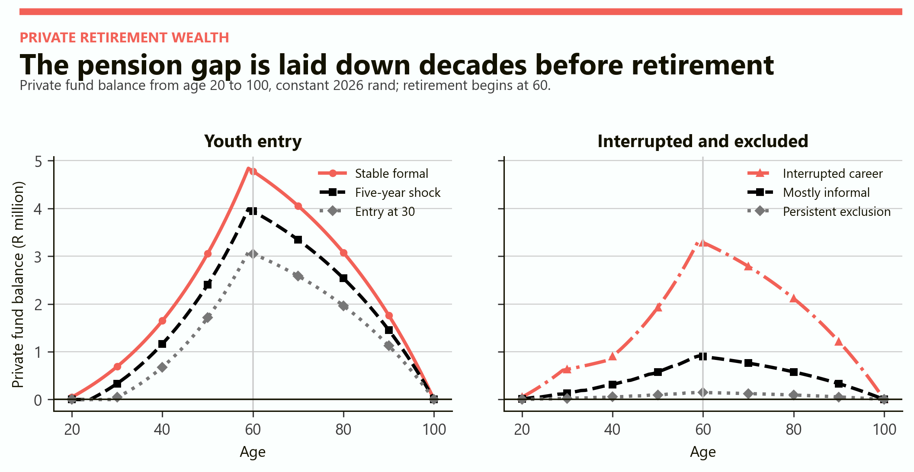
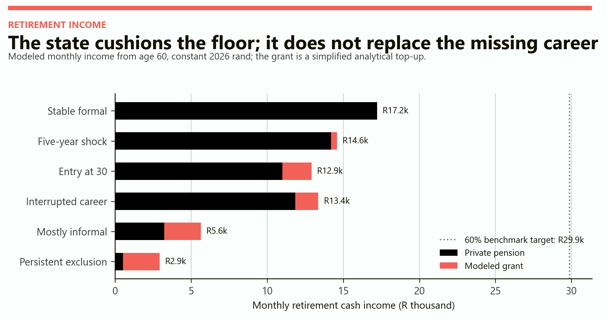
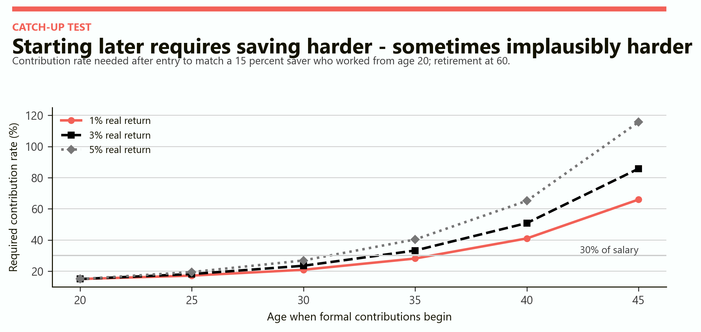
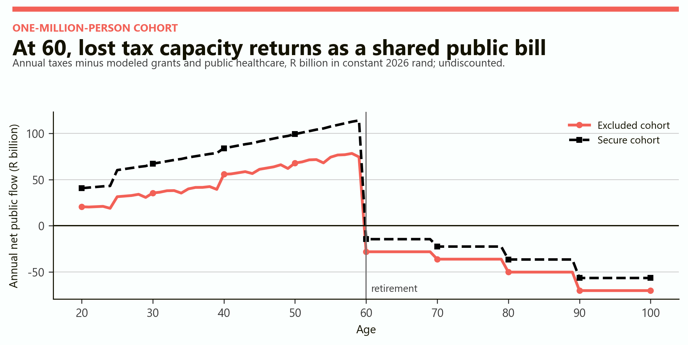
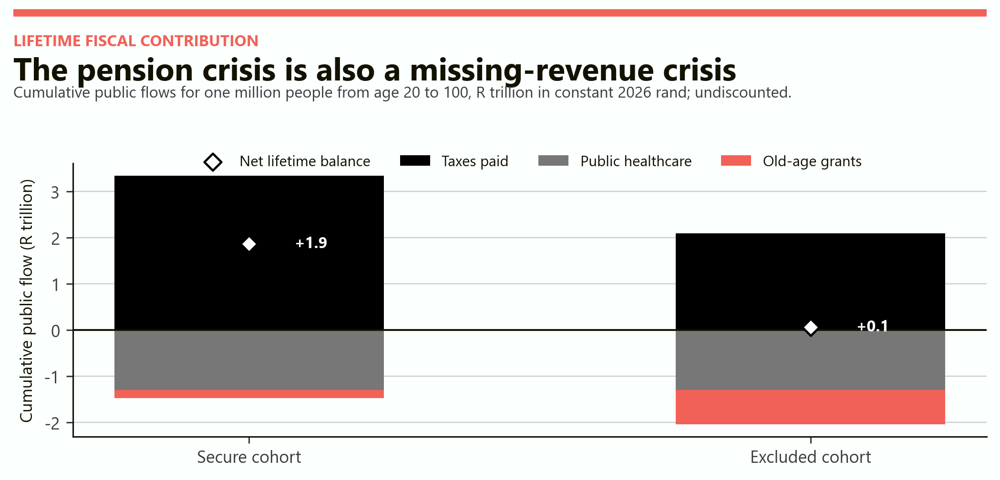

# Today's Unemployment Is Tomorrow's Pension Crisis
## A lifetime cohort model from age 20 to 100

# Part I: The finding

Youth unemployment does not disappear when a young person ages out of the youth category. It can return four decades later in three forms: a smaller private pension, heavier reliance on public transfers, and a state that collected less lifetime revenue from the same generation.

> The pension crisis begins when contribution years are lost, not when the first grant is paid. Retirement merely reveals a deficit that was accumulated quietly across the working life.

This model follows six representative lives from age 20 to 100. Each starts with the same age-specific earning opportunity, anchored to R30,000 a month at age 25. What changes is access to work, formality, wage scarring, retirement saving and effective tax contribution.

The central result is a ladder, not a binary. A five-year youth shock leaves R3.99 million at age 60. Entry at 30 leaves R3.09 million. A mostly informal career leaves R0.91 million. Persistent exclusion leaves R0.15 million. All amounts are constant 2026 rand.

| Finding | Modeled result | Meaning |
|---|---|---|
| Stable formal career | R4.84m private wealth at 60 | Early contributions receive decades of compounding |
| Five-year youth shock | R3.99m at 60 | Temporary unemployment remains costly but partly recoverable |
| Entry only at 30 | R3.09m at 60 | Ten lost years remove contributions, wage and compounding |
| Mostly informal career | R0.91m at 60 | Work without adequate pension coverage is not retirement security |
| Persistent exclusion | R0.15m at 60 | The modeled grant becomes 82% of retirement cash income |
| One million excluded lives | R1.80tn weaker lifetime fiscal balance | The future gap is mostly missing revenue plus higher grants |

The figures are conditional scenarios, not forecasts. The point is to expose how unemployment travels through time and which assumptions determine the scale.

# Part II: How unemployment compounds

A missed year of work has several effects at once.

First, the worker loses that year's wage. Second, no retirement contribution enters the fund. Third, the missing contribution never earns compound returns. Fourth, later wages may start below the age-matched benchmark. Fifth, lower earnings reduce taxes during the working years. Finally, an inadequate private pension increases the probability that old-age support becomes essential.

Temporary and persistent unemployment therefore differ by more than duration. A short shock followed by stable formal work leaves time for catch-up. Persistent exclusion repeats the loss and often shifts work into lower-paid or uncovered forms. The same number of unemployed years can also have different effects depending on timing: a year lost at 22 removes more compounding than a year lost at 52.

## The delayed balance sheet

| Age | Private effect | Public effect |
|---|---|---|
| 20-29 | Missing wages and first contributions | Lower taxes; immediate hardship may rise |
| 30-49 | Smaller base continues compounding | Tax gap widens if employment remains weak |
| 50-59 | Less time remains for repair | Policy begins to inherit a visible retirement short gap |
| 60-79 | Lower private pension becomes income inadequacy | Old-age grants and healthcare become more important |
| 80-100 | Assets must last through advanced age | Health costs rise while the cohort pays little labour tax |

The forty-year delay can fool policy. A labour-market failure at 20 does not appear in the pension budget at 20. It first appears as missing private assets and missing taxable earnings. The transfer bill arrives later, after the causal event has faded from political memory.

# Part III: The six representative lives

The benchmark worker enters formal work at 20. Potential salary grows by 1.5 percent a year in real terms and equals R30,000 a month at 25. Formal workers save 15 percent and pay an illustrative 20 percent effective tax share. Private retirement assets earn a smooth 3 percent net real return. Retirement begins at 60 and the private account is converted into a price-indexed income designed to last through age 100.

| Profile | Work history | Saving and tax treatment |
|---|---|---|
| Stable formal | Formal work from 20 to 59 | Saves 15%; tax share 20% |
| Five-year shock | Unemployed 20-24; wage scar closes by 35 | Saves 15% after entry; tax share 20% |
| Entry at 30 | Unemployed 20-29; 20% wage scar closes by 50 | Saves 15% after entry; tax share 20% |
| Interrupted career | Formal 20-29; unemployed 30-39; scar after return | Saves 15% while working; tax share 20% |
| Mostly informal | Works four years in five at 70% of benchmark wage | Saves 5%; effective tax share 5% |
| Persistent exclusion | Works one year in four at 60% of benchmark wage | Saves 3%; effective tax share 3% |

The tax shares combine a simple allowance for direct and indirect revenue; they are not statutory tax rates. Informal work is not treated as tax-free or valueless. It is modeled as lower-paid work with weaker saving coverage and a smaller effective tax contribution.

## Public support assumptions

The cash transfer is a simplified analytical top-up, not the legal SASSA means test. The maximum is R2,400 a month. It is paid in full when private pension income is below R10,000 a month and phases to zero at R15,000. The model also assigns the same public-health cost to every profile: R3,000 a year before 60, then R10,000 in the sixties, R18,000 in the seventies, R32,000 in the eighties and R52,000 from 90 to 100.

Holding healthcare costs equal is deliberate. It prevents the model from claiming that unemployment automatically causes ill health. The fiscal difference comes from lower tax capacity and greater cash-transfer exposure, while ageing creates a common healthcare bill for both secure and excluded cohorts.

# Part IV: Private wealth from 20 to 100

The balance paths show the mechanism directly. Assets build until 60 and then decline as the account pays a constant real pension through age 100.

*Figure 1. The same retirement age produces radically different asset peaks. Every path reaches approximately zero at 100 because each pension is calibrated to consume its own available wealth across retirement.*

The stable worker reaches R4.84 million. A five-year shock removes R0.85 million, or 18 percent. Entry at 30 removes R1.75 million, or 36 percent. The interrupted worker has the same 30 employment years as the age-30 entrant but finishes with R0.24 million more because contributions made in the twenties compound through the career gap.

Informality creates a different problem. The mostly informal profile works 32 years, more than either the delayed entrant or interrupted worker, yet reaches only R0.91 million. Years worked are not enough; earnings, coverage and the contribution rate decide how much of that work becomes retirement wealth.

Persistent exclusion produces the sharpest result. Ten scattered work years and a 3 percent saving rate leave R148,000 at 60. The account can provide only about R528 a month if it must last to 100.

# Part V: Temporary is not persistent

The five-year shock is damaging, but it is not equivalent to permanent exclusion. Once the worker enters formal employment, the wage scar closes over ten years and regular contributions resume. The worker still retires with about 82 percent of the stable worker's assets.

The delayed entrant begins only five years later than the temporary-shock profile, but the consequences are larger. The starting wage is further below the age-matched benchmark, fewer contributions are made, and more early compounding is lost. Retirement wealth falls to 64 percent of the stable profile.

The mostly informal worker has frequent employment but remains outside strong pension coverage. Retirement wealth is 19 percent of the stable profile. Persistent exclusion ends with 3 percent. These ratios show why an unemployment rate alone is not a pension forecast. Duration, timing, wages, sector and contribution coverage all matter.

| Profile | Employment years | Wealth at 60 | Share of stable wealth | Private pension per month |
|---|---|---|---|---|
| Stable formal | 40 | R4.84m | 100% | R17,223 |
| Five-year shock | 35 | R3.99m | 82% | R14,203 |
| Entry at 30 | 30 | R3.09m | 64% | R10,993 |
| Interrupted career | 30 | R3.33m | 69% | R11,843 |
| Mostly informal | 32 | R0.91m | 19% | R3,238 |
| Persistent exclusion | 10 | R0.15m | 3% | R528 |

The model gives temporary unemployment a real recovery path. It does not assume that every early shock becomes lifelong damage. Its warning is narrower: recovery requires sufficiently early, stable and covered work afterward.

# Part VI: Retirement income and public dependence

The private pension is calibrated to last 41 retirement years. That makes the income deliberately conservative. Even the stable profile receives R17,223 a month, only 58 percent of the model's R29,900 retirement target. This links Study II back to Study I: a long retirement makes income adequacy difficult even for a continuous saver.

*Figure 2. Black is private pension income and coral is the simplified grant. The dotted line is 60 percent of the full benchmark wage at retirement. Public support cushions low income but cannot reconstruct the missing pension.*

The five-year shock triggers only a small modeled top-up. Entry at 30 receives R1,923 a month; the interrupted career receives R1,515. Mostly informal and persistently excluded retirees receive the maximum R2,400.

Grant dependence should be read as a share of retirement cash income, not as a claim about dignity or deservingness. The modeled grant supplies 43 percent of cash income for the mostly informal profile and 82 percent for persistent exclusion. Yet their total monthly incomes remain only R5,638 and R2,928. Greater dependence does not mean the grant is generous; it means private income is extremely small.

# Part VII: Can delayed entry be recovered?

Yes, but the required saving rate rises quickly. The catch-up test asks what contribution rate a late entrant needs to reach the same age-60 wealth as a worker who saved 15 percent from age 20. Late entrants begin below the age-matched wage and gradually catch up.

*Figure 3. At a 3 percent real return, entry at 30 requires saving about 24 percent of salary, entry at 35 about 33 percent, entry at 40 about 51 percent and entry at 45 about 86 percent.*

The counterintuitive feature is that higher investment returns make relative catch-up harder. At a 5 percent return, the age-45 entrant would need to save more than the entire salary. The reason is not that returns hurt late savers. The uninterrupted saver receives the high return for many more years, so the target pulls away faster.

| Formal entry age | Required saving at 1% return | At 3% return | At 5% return |
|---|---|---|---|
| 20 | 15% | 15% | 15% |
| 25 | 17% | 18% | 19% |
| 30 | 21% | 24% | 27% |
| 35 | 28% | 33% | 40% |
| 40 | 41% | 51% | 65% |
| 45 | 66% | 86% | 116% |

# Part VIII: When the cohort reaches 60

To model an entire generation, the six profiles are combined into two hypothetical cohorts of one million people.

The secure cohort is 60 percent stable formal, 25 percent temporary shock, 8 percent delayed entry, 5 percent interrupted and 2 percent mostly informal. The excluded cohort is 15 percent stable, 15 percent temporary, 20 percent delayed, 15 percent interrupted, 25 percent mostly informal and 10 percent persistently excluded.

*Figure 4. Positive values are modeled tax revenue net of public healthcare. At 60, labour taxes stop while public healthcare and old-age grants continue. The excluded cohort enters retirement with both a weaker prior tax base and a larger annual transfer bill.*

Immediately before retirement, the secure cohort contributes about R114 billion a year net of the common healthcare allowance. The excluded cohort contributes about R74 billion. At 60, the flows reverse to costs of roughly R14 billion and R28 billion respectively.

The age-60 drop is not a sudden creation of dependency. It is an accounting reveal. The excluded cohort already paid less tax and accumulated less private wealth for forty years. Retirement changes which side of the public ledger displays the gap.

The stepwise cost after 60 comes from the assumed public-health bands. It is not a forecast of an epidemic or a claim that every older person uses the same services. It simply makes the age-related financing burden visible.

# Part IX: Lifetime fiscal contribution

The lifetime comparison adds each cohort's real annual flows without discounting them. It includes labour-period taxes, the stylized old-age grant and modeled public healthcare from 20 to 100. It excludes education, child grants, unemployment support, pensions paid from private funds, consumption taxes in retirement, debt interest and every other public service.

*Figure 5. For one million people, the secure cohort pays R3.34 trillion in modeled lifetime taxes and produces a R1.87 trillion net balance after healthcare and grants. The excluded cohort pays R2.10 trillion and produces only R0.06 trillion.*

The R1.80 trillion gap between cohorts has two parts. About R1.25 trillion is missing lifetime tax revenue. About R0.56 trillion is additional old-age grant spending. Public healthcare is R1.29 trillion in both cases by construction.

This decomposition changes the policy question. The future fiscal problem is not mainly that an unemployed young person will claim a grant at 60. It is that the state loses decades of contributions before paying the later grant and healthcare bill. The absent revenue is larger than the incremental grant cost.

## What "fiscal contribution" means here

A positive modeled balance is not a claim that a person has paid for every public service they receive, nor that people with negative balances are burdens. It is a narrow accounting device for comparing labour-market histories under one set of assumptions. Public finance exists to pool risk across lives; the question is whether the pool has enough contributors.

# Part X: Grants and healthcare

An old-age grant and public healthcare play different economic roles. The grant supports consumption and prevents deeper poverty. Healthcare responds to age-related need and can protect both wellbeing and household finances. Cutting either can improve a fiscal table while worsening the social outcome the pension system exists to protect.

The model gives healthcare the same age path for every person, so the excluded cohort's larger cost is entirely grant-driven. In reality, unemployment could affect health, private insurance coverage and service use in either direction. Those channels require evidence and are left outside this first-pass model.

For the excluded cohort, 85 percent of members receive at least some modeled grant, compared with 40 percent in the secure cohort. The secure figure is not zero because delayed and interrupted workers can still fall inside the phased top-up. Average grant exposure is R373 a month per cohort member in the secure case and R1,509 in the excluded case.

| One-million-person cohort | Average wealth at 60 | Average private pension | Modeled grant exposure | Lifetime grant cost |
|---|---|---|---|---|
| Secure | R4.33m | R15,421/month | 40% receive something | R0.18tn |
| Excluded | R2.68m | R9,551/month | 85% receive something | R0.74tn |

The model is intentionally generous to later reform: all eligible people reach the grant, the grant keeps its real value, and private accounts earn a stable real return. Administrative failure, contribution leakage and investment volatility would enlarge the downside.

# Part XI: Reading the model in South Africa

The question is not hypothetical in origin. [Statistics South Africa's Q2 2026 release](https://www.statssa.gov.za/?p=19804) reports that 5.0 million people aged 15-34 were unemployed and 5.6 million were employed, producing a youth unemployment rate of 47.4 percent. The national unemployment rate was 33.6 percent.

Persistence is especially important. The [full Q2 2026 Quarterly Labour Force Survey](https://www.statssa.gov.za/publications/P0211/P02112ndQuarter2026.pdf) reports that 6.604 million of 8.481 million unemployed people had been unemployed for at least a year. That is 77.9 percent of the unemployed. These are current labour-market observations, not inputs copied directly into the hypothetical cohort shares.

The future state already has large age-related systems to finance. [National Treasury's 2026 Budget Highlights](https://www.treasury.gov.za/documents/National%20Budget/2026/2026%20Budget%20Highlights.pdf) records R121.8 billion for the old-age grant and R310.4 billion for health in 2026/27. Those totals anchor the scale of the policy issue; the healthcare path and cohort costs in this report remain model assumptions.

[SASSA describes the Older Persons Grant](https://services.sassa.gov.za/portal/r/sassa/sassa/faq) as beginning at 60 and being means-tested. This report does not reproduce the legal means-test schedule, household-income rules, marital thresholds or future grant policy. Its phased top-up is an analytical device that turns private pension inadequacy into a comparable public exposure.

The model also does not infer that today's 15-34-year-olds will remain unemployed in the same proportions until retirement. It asks what happens if different employment histories persist. That distinction matters: a current unemployment rate is a warning about exposure, not a destiny for each individual.

# Part XII: What can still change the path

The best pension reform for an unemployed 22-year-old is not a retirement product. It is earlier access to stable, productive and covered work. Once that is achieved, pension design determines how effectively the new earnings become retirement security.

| Intervention | Immediate channel | Forty-year channel |
|---|---|---|
| Faster first-job entry | Restores wages and experience | Restores early contributions and compounding |
| Wage progression after entry | Reduces the scar | Raises pension wealth and lifetime tax capacity |
| Portable low-fee retirement saving | Covers job changes and short contracts | Converts fragmented work into durable assets |
| Informal-worker contribution channels | Makes small, irregular saving practical | Reduces total exclusion from funded retirement |
| Matching contributions for late entrants | Shares an impossible catch-up burden | Raises private income and reduces future grants |
| Contribution credits for unemployment spells | Protects the pension record | Socializes part of the labour-market shock |
| Higher employment at older ages | Adds earning and saving years | Shortens retirement, if health and jobs permit |
| A credible public floor | Prevents destitution | Makes the residual fiscal promise explicit |

## The sequencing rule

1. Separate temporary unemployment from persistent exclusion. They require different interventions and create different retirement outcomes.

2. Restore employment before demanding extraordinary saving. A zero wage cannot support a higher contribution rate.

3. Protect the first contribution years. They have the longest time to compound and are hardest to replace later.

4. Cover informal and interrupted work. A long working life without portable saving can still end in pension poverty.

5. Measure the fiscal loss as missing taxes plus future transfers. Looking only at grant spending understates the public consequence.

> Today's unemployment becomes tomorrow's pension crisis when a temporary labour-market statistic hardens into a permanent contribution history. The crisis is preventable early, expensive to repair late, and most visible only when the cohort retires together.

# Notes: Scope, limitations and sources

This is an armchair scenario model, not actuarial advice, a microsimulation or an official forecast. Results are in constant 2026 rand. The individual paths use deterministic wages and returns, retirement at 60, survival to 100 and no fees beyond the assumed net return. They exclude taxes on pension income, bequests, household pooling, disability, mortality before 100, unemployment benefits, education spending, housing, long-term care and behavioral responses.

The grant is a modeled phased top-up capped at R2,400 a month; it is not the current legal SASSA means test. Public-health costs are hypothetical age bands and are held equal across employment profiles. Lifetime fiscal totals are undiscounted, so they add real rand paid in different years without converting them to an age-20 present value. The cohort mixes are illustrative and do not estimate the future biographies of today's youth.

Model calculations and figures: GreyScienx cohort model, September 2026. Public context: [Statistics South Africa, QLFS Q2 2026 media release](https://www.statssa.gov.za/?p=19804); [Statistics South Africa, Quarterly Labour Force Survey Q2 2026](https://www.statssa.gov.za/publications/P0211/P02112ndQuarter2026.pdf); [National Treasury, 2026 Budget Highlights](https://www.treasury.gov.za/documents/National%20Budget/2026/2026%20Budget%20Highlights.pdf); and [SASSA, Older Persons Grant eligibility](https://services.sassa.gov.za/portal/r/sassa/sassa/faq).
